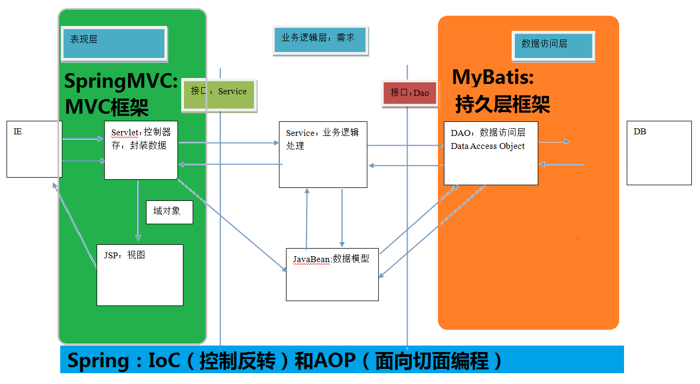

# Mybatis 框架

### 一、框架介绍

#### 1. 什么是框架

&emsp;&emsp;框架（Framework）是整个或部分系统的**可重用设计**，表现为一组抽象构件及构件实例间交互的方法；另一种定义认为，框架是可被应用开发者定制的应用骨架。前者是从应用方面而后者是从目的方面给出的定义。

&emsp;&emsp;简而言之，框架其实就是某种应用的半成品，就是一组组件，供你选用完成你自己的系统。而且，框架一般是成熟的，不断升级的软件。不同的框架解决的是不同的问题。

&emsp;&emsp;**框架优势**：封装了很多细节，使开发者可以使用极简的方式实现功能，大大提高开发效率。

&emsp;&emsp;框架一般处在**低层应用平台**（如 J2EE）和**高层业务逻辑**之间的**中间层**。

#### 2. 分层开发下的常见框架

常见的 JavaEE 开发框架：

&emsp;1）解决数据的持久化问题的框架：MyBatis、Hibernate（使用较少）、Spring Data。

&emsp;2）解决 WEB 层问题的 MVC 框架：Spring MVC、Struts2。

&emsp;3）解决技术整合问题的框架：Spring 框架。


#### 3. 三层架构

&emsp;**表现层**：用于展示数据

&emsp;**业务层**：处理业务需求

&emsp;**持久层**：与数据库交换



### 二、JDBC 操作数据库问题分析

#### 2.1 持久化技术的解决方案

&emsp;JDBC 技术（规范）：Connection、PreparedStatement、ResultSet。

&emsp;Spring 的 JdbcTemplate（工具类）：Spring 中对 jdbc 的简单封装。

&emsp;Apache 的 DBUtils（工具类）：其与 Spring 的 JdbcTemplate 很类似，也是对 jdbc 的简单封装。封装不是很细致，使用时仍需要处理很多事情。

#### 2.2 jdbc 程序的回顾

使用 jdbc 的原始方法（未经封装）实现了查询数据库表记录的操作。

```java
public static void main(String[] args) {
	Connection connection = null;
	PreparedStatement preparedStatement = null;
	ResultSet resultSet = null;
	try {
	        //加载数据库驱动
		Class.forName("com.mysql.jdbc.Driver");
		//通过驱动管理类获取数据库链接
		connection = DriverManager.getConnection("jdbc:mysql://localhost:3306/mybatis?characterEncoding=utf-8","root", "root");
		//定义 sql 语句 ?表示占位符
		String sql = "select * from user where username = ?";
		//获取预处理 statement
		preparedStatement = connection.prepareStatement(sql);
		//设置参数，第一个参数为 sql 语句中参数的序号（从 1 开始），第二个参数为设置的参数值
		preparedStatement.setString(1, "王五");
		//向数据库发出 sql 执行查询，查询出结果集
		resultSet = preparedStatement.executeQuery();
		//遍历查询结果集
		while(resultSet.next()){
			System.out.println(resultSet.getString("id")+" "+resultSet.getString("username"));
		}
	} catch (Exception e) {
		e.printStackTrace();
	}finally{
		//释放资源
		if(resultSet!=null){ //要先释放结果集资源！
			try {
				resultSet.close();
			} catch (SQLException e) {
				e.printStackTrace();
			}
		}
		if(preparedStatement!=null){
			try {
				preparedStatement.close();
			} catch (SQLException e) {
				e.printStackTrace();
			}
		}
		if(connection!=null){
			try {
				connection.close();
			} catch (SQLException e) {
			// TODO Auto-generated catch block
				e.printStackTrace();
			}
		}
	}
}
```

#### 2.3 jdbc 问题分析

&emsp;1、数据库链接创建、释放频繁造成系统资源浪费从而影响系统性能，如果使用数据库链接池可解决此问题。

&emsp;2、Sql 语句在代码中硬编码，造成代码不易维护，实际应用 sql 变化的可能较大， sql 变动需要改变 java 代码。

&emsp;3、使用 preparedStatement 向占有位符号传参数**存在硬编码**，因为 sql 语句的 where 条件不一定，可能多也可能少，修改 sql 还要修改代码，系统不易维护。

&emsp;4、对结果集解析**存在硬编码**（查询列名）， sql 变化导致解析代码变化，系统不易维护，如果能将数据库记录封装成 pojo 对象解析比较方便。


### 三、MyBatis 框架概述


&emsp;&emsp;mybatis 是一个优秀的**基于 java 的持久层框架**，它内部封装了 jdbc，使开发者只需要关注 sql 语句本身，而不需要花费精力去处理**加载驱动、创建连接、创建 statement 等**繁杂的过程。

&emsp;&emsp;mybatis 通过 **xml 或注解**的方式将要执行的各种 statement 配置起来，并**通过 java 对象和 statement 中sql 的动态参数进行映射**生成最终执行的 sql 语句，最后由 **mybatis 框架执行** sql 并将结果映射为 java 对象并返回。

&emsp;&emsp;采用 ORM 思想解决了**实体和数据库映射**的问题，对 jdbc 进行了封装，屏蔽了 jdbc api 底层访问细节，使开发者不用与 jdbc api 打交道，就可以完成对数据库的持久化操作。

&emsp;&emsp;Object Relational Mapping对象关系映射。把数据库表与实体类及实体类的属性对应起来，可以通过操作实体类实现操作数据库表。实体类中的属性和数据库表的字段名称保持一致。


