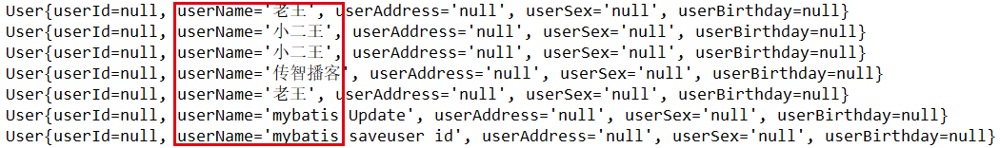

# 第六节 Mybatis 的参数深入

## 6.1 Mybatis 的参数

### 6.1.1 parameterType 配置参数

SQL 语句传参，使用标签的 parameterType 属性来设定。该属性的取值可以
是**基本类型，引用类型（例如:String 类型）**，还可以是**实体类类型（POJO 类）**，同时也可以使用**实体类的包装类**。

**注意事项：**

1. 基本类型和 String 可以直接写类型名称，也可以使用【包名.类名】的方式，例如：`java.lang.String`。

2. 实体类类型，目前只能使用**全限定类名**。究其原因，是 Mybaits 在加载时已经把常用的数据类型注册了别名，从而在使用时可以不写包名，而实体类并没有注册别名，所以必须写全限定类名。


### 6.1.2 传递 pojo 对象

Mybatis 使用 ognl 表达式解析对象字段的值，#{}或者${}括号中的值为 pojo 属性名称。

**OGNL 表达式**，即 Object Graphic Navigation Language，它通过对象的取值方法来获取数据。在写法上把 get 省略了。比如：获取用户的名称

* 类中的写法：`user.getUsername();`

* OGNL 表达式写法：`user.username`

那么 Mybatis 中为什么能直接写 `username`，而不用 `user.` ？：

&emsp;因为在 parameterType 中已经提供了属性所属的类，所以此时不需要写对象名。


### 6.1.3 传递 pojo 包装对象

开发中通过 pojo 传递查询条件，查询条件是**综合的查询条件**，不仅包括用户查询条件还包括其它的查询条件（比如将用户购买商品信息也作为查询条件），这时可以使用**包装对象**传递输入参数。

Pojo 类中包含 pojo。

**功能**：根据用户名查询用户信息，查询条件放到 QueryVo 的 user 属性中。

1）在 IUserDao 中，添加方法。

```java
//根据queryVo中的条件查询用户
List<User> findUserByVo(QueryVo vo);
```

2）在 domain 文件夹下，创建 `QueryVo`类。

```java
package com.itheima.domain;

public class QueryVo {
    private User user;

    public User getUser() {
        return user;
    }

    public void setUser(User user) {
        this.user = user;
    }
}
```

3）在映射配置文件 IUserDao.xml 中添加映射。

```xml
<!--根据queryVo中的条件查询用户-->
<select id="findUserByVo" parameterType="com.itheima.domain.QueryVo" resultType="com.itheima.domain.User">
    SELECT * FROM USER WHERE username LIKE #{user.username};
</select>
```

4）在测试类中添加新的测试方法

```java
//根据使用QueryVo中作为查询条件
@Test
public void testFindByVo() {
    QueryVo vo = new QueryVo();
    User user = new User();
    user.setUsername("%王%");
    vo.setUser(user);
    //5. 根据queryVo中的条件查询用户
    List<User> users = userDao.findUserByVo(vo);
    for(User t : users){
        System.out.println(t);
    }
}
```

## 6.2 Mybatis 输出结果封装

### 6.2.1 resultType 配置结果类型

resultType 属性可以指定**结果集的类型**，它支持**基本类型**和**实体类类型**。和 parameterType 一样，如果注册过类型别名的，可以直接使用别名。没有注册过的必须使用全限定类名。实体类中的**属性名称**必须和查询语句中的**列名**保持一致，否则无法实现封装。

#### ① 基本类型示例

【Dao 接口】

```java
int findTotal();
```

【映射配置】

```xml
<!-- 查询总记录条数 -->
<select id="findTotal" resultType="int">
    select count(id) from user;
</select>
```

#### ② 实体类类型示例

【Dao 接口】

```java
List<User> findAll();
```

【映射配置】

```xml
<!-- 配置查询所有操作 -->
<select id="findAll" resultType="com.itheima.domain.User">
    select * from user
</select>
```


#### ③ 特殊情况示例

修改 User实体类中的属性名，使其实体类属性和数据库表的列名不一致，代码如下：

```java
public class User implements Serializable {

    private Integer userId;
    private String userName;
    private String userAddress;
    private String userSex;
    private Date userBirthday;
    
    //省略 getter & setter 与 toString 方法
}
```

Dao 接口与映射配置文件不变

```java
List<User> findAll();

<select id="findAll" resultType="com.itheima.domain.User">
    SELECT * FROM USER;
</select>
```

此时运行测试函数，输出



由于 MySQL 在 windows 系统中不区分大小写，所以 userName 可以与数据库中的列名 username 匹配，而其他不能匹配的属性值为 null。

解决办法有两个：

1）修改映射配置，使用别名查询。

优点：效率高。
缺点：相关的每一处 sql 语句都需要修改。

```xml
<!-- 查询所有 -->
<select id="findAll" resultType="com.itheima.domain.User">
    SELECT id as userId,username as userName,birthday as userBirthday, sex as userSex,address as userAddress  FROM USER;
</select>
```

2）


### 6.2.2


### 6.2.3 


## 6.3 resultMap 结果类型


1）在 IUserDao 中，添加方法。

2）在映射配置文件 IUserDao.xml 中添加映射。


3）在测试类中添加新的测试方法


