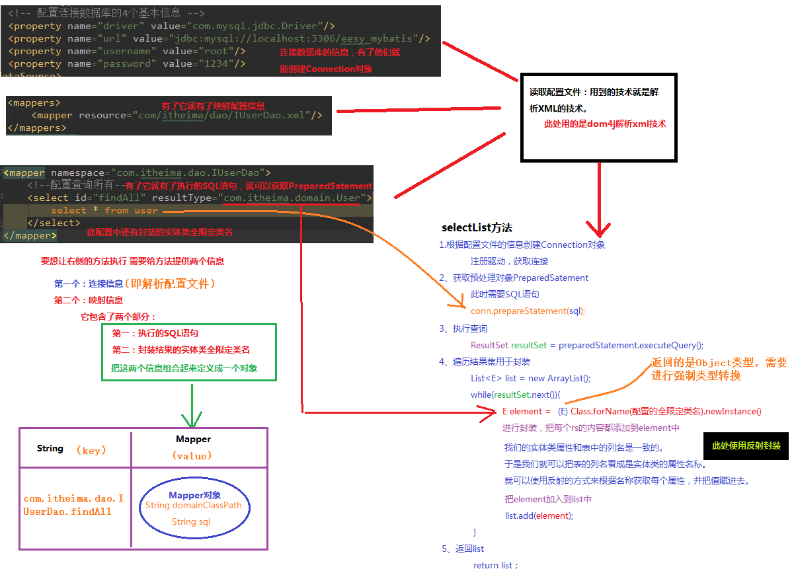
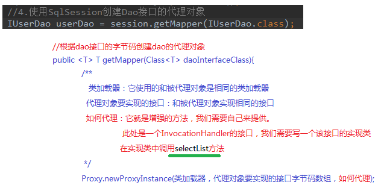

# 第三节 Mybatis入门案例中的设计模式分析

## 3.1 Mybatis 主函数分析


## 3.2 Mybatis 执行查询所有(findAll)分析





## 3.3 Mybatis 创建代理对象的分析




## 3.4 自定义 Mybatis 框架

自定义 Mybatis 的分析：

* Mybatis 在使用代理 dao 的方式实现增删改查时，只做了两件事：

   * 第一：创建代理对象

   * 第二：在代理对象中调用selectList

自定义 Mybatis 通过入门案例看到类：

* `class Resources`

* `class SqlSessionFactoryBuilder`

* `interface SqlSessionFactory`

* `interface SqlSession`


### 实现

基于入门案例修改，去掉 `pom.xml` 文件中有关 mybatis 的坐标（即 dependency 项），并删除配置文件中的相关约束。

1）在 main->java->com->itheima 下创建类 `mybatis.io.Resources`。

```java
package com.itheima.mybatis.io;

import java.io.InputStream;

// 使用类加载器读取配置文件的类
public class Resources {
    public static InputStream getResourceAsStream(String filePath){
         return Resources.class.getClassLoader().getResourceAsStream(filePath);
    }
}
```

在主函数文件中导入包 `import com.itheima.mybatis.io.Resources;`

2）在 mybatis 文件夹下，创建类 `sqlsession.SqlSessionFactoryBuilder`。在 sqlsession 文件夹下，创建接口 `SqlSessionFactory`、`SqlSession`。

```java
// SqlSessionFactoryBuilder.java
package com.itheima.mybatis.sqlsession;

import java.io.InputStream;

// 用于创建一个SqlSessionFactory对象
public class SqlSessionFactoryBuilder {
    // 根据参数的字节输入流来构建一个SqlSessionFactory工厂
    public SqlSessionFactory build(InputStream config){
        return null; //后续需要补充代码
    }
}
```

```java
// SqlSessionFactory.java
package com.itheima.mybatis.sqlsession;

public interface SqlSessionFactory {
    SqlSession openSession();
}
```
 
```java
// SqlSession.java

package com.itheima.mybatis.sqlsession;

// 自定义Mybatis中和数据库交互的核心类
// 它里面可以创建dao接口的代理对象
public interface SqlSession {
    // 根据参数创建一个代理对象
    // daoInterfaceClass：dao的接口字节码
    <T> T getMapper(Class<T> daoInterfaceClass);

    //释放资源
    void close();
}                 
```                                                   

3）解析 XML 的工具类介绍

① 在 mybatis 下创建 utils 包，创建文件 `XMLConfigBuilder`。导入 dom4j 坐标，为使用 xpath 需要导入 jaxen 坐标。

```xml
<!-- 导入 dom4j 坐标 -->

<dependency>
    <groupId>dom4j</groupId>
    <artifactId>dom4j</artifactId>
    <version>1.1</version>
</dependency>

<!-- 导入 jaxen 坐标 -->

<dependency>
    <groupId>jaxen</groupId>
    <artifactId>jaxen</artifactId>
    <version>1.1.6</version>
</dependency>
```


```java
// XMLConfigBuilder.java
package com.itheima.mybatis.utils;

import com.itheima.mybatis.cfg.Mapper;
import com.itheima.mybatis.io.Resources;
import com.itheima.mybatis.cfg.Configuration;
import org.dom4j.Attribute;
import org.dom4j.Document;
import org.dom4j.Element;
import org.dom4j.io.SAXReader;

import java.io.IOException;
import java.io.InputStream;
import java.util.HashMap;
import java.util.List;
import java.util.Map;

/**
 *  用于解析配置文件
 */
public class XMLConfigBuilder {

    /**
     * 解析主配置文件，把里面的内容填充到DefaultSqlSession所需要的地方
     * 使用的技术：
     *      dom4j+xpath
     */
    public static Configuration loadConfiguration(InputStream config){
        try{
            //定义封装连接信息的配置对象（mybatis的配置对象）
            Configuration cfg = new Configuration();

            //1.获取SAXReader对象
            SAXReader reader = new SAXReader();
            //2.根据字节输入流获取Document对象
            Document document = reader.read(config);
            //3.获取根节点
            Element root = document.getRootElement();
            //4.使用xpath中选择指定节点的方式，获取所有property节点
            List<Element> propertyElements = root.selectNodes("//property");
            //5.遍历节点
            for(Element propertyElement : propertyElements){
                //判断节点是连接数据库的哪部分信息
                //取出name属性的值
                String name = propertyElement.attributeValue("name");
                if("driver".equals(name)){
                    //表示驱动
                    //获取property标签value属性的值
                    String driver = propertyElement.attributeValue("value");
                    cfg.setDriver(driver);
                }
                if("url".equals(name)){
                    //表示连接字符串
                    //获取property标签value属性的值
                    String url = propertyElement.attributeValue("value");
                    cfg.setUrl(url);
                }
                if("username".equals(name)){
                    //表示用户名
                    //获取property标签value属性的值
                    String username = propertyElement.attributeValue("value");
                    cfg.setUsername(username);
                }
                if("password".equals(name)){
                    //表示密码
                    //获取property标签value属性的值
                    String password = propertyElement.attributeValue("value");
                    cfg.setPassword(password);
                }
            }
            //取出mappers中的所有mapper标签，判断他们使用了resource还是class属性
            List<Element> mapperElements = root.selectNodes("//mappers/mapper");
            //遍历集合
            for(Element mapperElement : mapperElements){
                //判断mapperElement使用的是哪个属性
                Attribute attribute = mapperElement.attribute("resource");
                if(attribute != null){
                    System.out.println("使用的是XML");
                    //表示有resource属性，用的是XML
                    //取出属性的值
                    String mapperPath = attribute.getValue();//获取属性的值"com/itheima/dao/IUserDao.xml"
                    //把映射配置文件的内容获取出来，封装成一个map
                    Map<String,Mapper> mappers = loadMapperConfiguration(mapperPath);
                    //给configuration中的mappers赋值
                    cfg.setMappers(mappers);
                }else{
//                    System.out.println("使用的是注解");
//                    //表示没有resource属性，用的是注解
//                    //获取class属性的值
//                    String daoClassPath = mapperElement.attributeValue("class");
//                    //根据daoClassPath获取封装的必要信息
//                    Map<String,Mapper> mappers = loadMapperAnnotation(daoClassPath);
//                    //给configuration中的mappers赋值
//                    cfg.setMappers(mappers);
                }
            }
            //返回Configuration
            return cfg;
        }catch(Exception e){
            throw new RuntimeException(e);
        }finally{
            try {
                config.close();
            }catch(Exception e){
                e.printStackTrace();
            }
        }

    }

    /**
     * 根据传入的参数，解析XML，并且封装到Map中
     * @param mapperPath    映射配置文件的位置
     * @return  map中包含了获取的唯一标识（key是由dao的全限定类名和方法名组成）
     *          以及执行所需的必要信息（value是一个Mapper对象，里面存放的是执行的SQL语句和要封装的实体类全限定类名）
     */
    private static Map<String,Mapper> loadMapperConfiguration(String mapperPath)throws IOException {
        InputStream in = null;
        try{
            //定义返回值对象
            Map<String,Mapper> mappers = new HashMap<String,Mapper>();
            //1.根据路径获取字节输入流
            in = Resources.getResourceAsStream(mapperPath);
            //2.根据字节输入流获取Document对象
            SAXReader reader = new SAXReader();
            Document document = reader.read(in);
            //3.获取根节点
            Element root = document.getRootElement();
            //4.获取根节点的namespace属性取值
            String namespace = root.attributeValue("namespace");//是组成map中key的部分
            //5.获取所有的select节点
            List<Element> selectElements = root.selectNodes("//select");
            //6.遍历select节点集合
            for(Element selectElement : selectElements){
                //取出id属性的值      组成map中key的部分
                String id = selectElement.attributeValue("id");
                //取出resultType属性的值  组成map中value的部分
                String resultType = selectElement.attributeValue("resultType");
                //取出文本内容            组成map中value的部分
                String queryString = selectElement.getText();
                //创建Key
                String key = namespace+"."+id;
                //创建Value
                Mapper mapper = new Mapper();
                mapper.setQueryString(queryString);
                mapper.setResultType(resultType);
                //把key和value存入mappers中
                mappers.put(key,mapper);
            }
            return mappers;
        }catch(Exception e){
            throw new RuntimeException(e);
        }finally{
            in.close();
        }
    }

    /**
     * 根据传入的参数，得到dao中所有被select注解标注的方法。
     * 根据方法名称和类名，以及方法上注解value属性的值，组成Mapper的必要信息
     * @param daoClassPath
     * @return
     */
    /*private static Map<String,Mapper> loadMapperAnnotation(String daoClassPath)throws Exception{
        //定义返回值对象
        Map<String,Mapper> mappers = new HashMap<String, Mapper>();

        //1.得到dao接口的字节码对象
        Class daoClass = Class.forName(daoClassPath);
        //2.得到dao接口中的方法数组
        Method[] methods = daoClass.getMethods();
        //3.遍历Method数组
        for(Method method : methods){
            //取出每一个方法，判断是否有select注解
            boolean isAnnotated = method.isAnnotationPresent(Select.class);
            if(isAnnotated){
                //创建Mapper对象
                Mapper mapper = new Mapper();
                //取出注解的value属性值
                Select selectAnno = method.getAnnotation(Select.class);
                String queryString = selectAnno.value();
                mapper.setQueryString(queryString);
                //获取当前方法的返回值，还要求必须带有泛型信息
                Type type = method.getGenericReturnType();//List<User>
                //判断type是不是参数化的类型
                if(type instanceof ParameterizedType){
                    //强转
                    ParameterizedType ptype = (ParameterizedType)type;
                    //得到参数化类型中的实际类型参数
                    Type[] types = ptype.getActualTypeArguments();
                    //取出第一个
                    Class domainClass = (Class)types[0];
                    //获取domainClass的类名
                    String resultType = domainClass.getName();
                    //给Mapper赋值
                    mapper.setResultType(resultType);
                }
                //组装key的信息
                //获取方法的名称
                String methodName = method.getName();
                String className = method.getDeclaringClass().getName();
                String key = className+"."+methodName;
                //给map赋值
                mappers.put(key,mapper);
            }
        }
        return mappers;
    }
    */
}

```

② 在 mybatis 下创建类 `cfg.Configuration`。

```java
package com.itheima.mybatis.cfg;

import java.util.HashMap;
import java.util.Map;

// 自定义mybatis的配置类
public class Configuration {
    private String driver;
    private String url;
    private String username;
    private String password;
    // 要有 new，否则后续putAll会产生空指针异常
    private Map<String, Mapper> mappers = new HashMap<String,Mapper>();

    public Map<String, Mapper> getMappers() {
        return mappers;
    }

    public void setMappers(Map<String, Mapper> mappers) {
        this.mappers.putAll(mappers);
    }

    public String getDriver() {
        return driver;
    }

    public void setDriver(String driver) {
        this.driver = driver;
    }

    public String getUrl() {
        return url;
    }

    public void setUrl(String url) {
        this.url = url;
    }

    public String getUsername() {
        return username;
    }

    public void setUsername(String username) {
        this.username = username;
    }

    public String getPassword() {
        return password;
    }

    public void setPassword(String password) {
        this.password = password;
    }
}

```


③ 在 cfg文件夹下，定义 `Mapper` 类。

Mapper 应该包含：执行的 SQL 语句与封装结果的实体类全限定类名。

```java
package com.itheima.mybatis.cfg;

//用于封装执行的SQL语句和结果类型的全限定类名
public class Mapper {
    private String queryString; //SQL
    private String resultType;  //实体类的全限定类名

    public String getQueryString() {
        return queryString;
    }

    public void setQueryString(String queryString) {
        this.queryString = queryString;
    }

    public String getResultType() {
        return resultType;
    }

    public void setResultType(String resultType) {
        this.resultType = resultType;
    }
}
```


④ 在 sqlsession 文件夹下，创建类 `defaults.DefaultSqlSessionFactory`。

```java
package com.itheima.mybatis.sqlsession.defaults;

import com.itheima.mybatis.cfg.Configuration;
import com.itheima.mybatis.sqlsession.SqlSession;
import com.itheima.mybatis.sqlsession.SqlSessionFactory;

//SqlSessionFactory接口的实现类
public class DefaultSqlSessionFactory implements SqlSessionFactory{

    private Configuration cfg;
    public DefaultSqlSessionFactory(Configuration cfg){
        this.cfg = cfg;
    }
    // 用于创建一个新的操作数据库对象
    public SqlSession openSession() {
        return new DefaultSqlSession(cfg);
    }
}

```

⑤ 在 sqlsession->defaults 文件夹下，创建类 `DefaultSqlSession`。

```java
package com.itheima.mybatis.sqlsession.defaults;

import com.itheima.mybatis.cfg.Configuration;
import com.itheima.mybatis.sqlsession.SqlSession;
import com.itheima.mybatis.sqlsession.proxy.MapperProxy;
import com.itheima.mybatis.utils.DataSourceUtil;

import java.lang.reflect.Proxy;
import java.sql.Connection;

//SqlSession接口的实现类
public class DefaultSqlSession implements SqlSession {
    private Configuration cfg;
    private Connection connection;

    public DefaultSqlSession(Configuration cfg){
        this.cfg = cfg;
        connection = DataSourceUtil.getConnection(cfg);
    }
    // 用于创建代理对象
    public <T> T getMapper(Class<T> daoInterfaceClass) {
        return (T) Proxy.newProxyInstance(daoInterfaceClass.getClassLoader(), new Class[]{daoInterfaceClass}, new MapperProxy(cfg.getMappers(),connection));

    }

    // 用于释放资源
    public void close() {
        if(connection!=null){
            try{
                connection.close();
            }catch(Exception e){
                e.printStackTrace();
            }
        }
    }
}
```

⑥ 在 sqlsession 文件夹下，创建类 `proxy.MapperProxy`

```java
package com.itheima.mybatis.sqlsession.proxy;

import com.itheima.mybatis.cfg.Mapper;
import com.itheima.mybatis.utils.Executor;

import java.lang.reflect.InvocationHandler;
import java.lang.reflect.Method;
import java.sql.Connection;
import java.util.Map;

public class MapperProxy implements InvocationHandler{
    // key是全限定类名+方法名
    private Map<String, Mapper> mappers;
    private Connection conn;

    public MapperProxy(Map<String, Mapper> mappers, Connection conn){
        this.mappers = mappers;
        this.conn = conn;
    }

    //用于对方法进行增强，此处增强就是调用selectList方法
    public Object invoke(Object proxy, Method method, Object[] args) throws Throwable {

        //1. 获取方法名
        String methodName = method.getName();
        //2. 获取方法所在类的名称
        String className = method.getDeclaringClass().getName();
        //3. 组合key
        String key = className+ "."+methodName;
        //4. 获取mappers中的Mapper对象
        Mapper mapper = mappers.get(key);
        //5. 判断是否有 mapper
        if(mapper == null){
            throw new IllegalArgumentException("传入的参数有误");
        }
        //6.调用工具类执行查询所有
        return new Executor().selectList(mapper, conn);
    }
}
```


⑦ 在 utils 文件夹下，创建类 `Executor`

```java
package com.itheima.mybatis.utils;

import com.itheima.mybatis.cfg.Mapper;

import java.beans.PropertyDescriptor;
import java.lang.reflect.Method;
import java.sql.Connection;
import java.sql.PreparedStatement;
import java.sql.ResultSet;
import java.sql.ResultSetMetaData;
import java.util.ArrayList;
import java.util.List;

/**
 * 负责执行SQL语句，并且封装结果集
 */
public class Executor {

    public <E> List<E> selectList(Mapper mapper, Connection conn) {
        PreparedStatement pstm = null;
        ResultSet rs = null;
        try {
            //1.取出mapper中的数据
            String queryString = mapper.getQueryString();//select * from user
            String resultType = mapper.getResultType();//com.itheima.domain.User
            Class domainClass = Class.forName(resultType);
            //2.获取PreparedStatement对象
            pstm = conn.prepareStatement(queryString);
            //3.执行SQL语句，获取结果集
            rs = pstm.executeQuery();
            //4.封装结果集
            List<E> list = new ArrayList<E>();//定义返回值
            while(rs.next()) {
                //实例化要封装的实体类对象
                E obj = (E)domainClass.newInstance();

                //取出结果集的元信息：ResultSetMetaData
                ResultSetMetaData rsmd = rs.getMetaData();
                //取出总列数
                int columnCount = rsmd.getColumnCount();
                //遍历总列数
                for (int i = 1; i <= columnCount; i++) {
                    //获取每列的名称，列名的序号是从1开始的
                    String columnName = rsmd.getColumnName(i);
                    //根据得到列名，获取每列的值
                    Object columnValue = rs.getObject(columnName);
                    //给obj赋值：使用Java内省机制（借助PropertyDescriptor实现属性的封装）
                    PropertyDescriptor pd = new PropertyDescriptor(columnName,domainClass);//要求：实体类的属性和数据库表的列名保持一种
                    //获取它的写入方法
                    Method writeMethod = pd.getWriteMethod();
                    //把获取的列的值，给对象赋值
                    writeMethod.invoke(obj,columnValue);
                }
                //把赋好值的对象加入到集合中
                list.add(obj);
            }
            return list;
        } catch (Exception e) {
            throw new RuntimeException(e);
        } finally {
            release(pstm,rs);
        }
    }

    private void release(PreparedStatement pstm,ResultSet rs){
        if(rs != null){
            try {
                rs.close();
            }catch(Exception e){
                e.printStackTrace();
            }
        }

        if(pstm != null){
            try {
                pstm.close();
            }catch(Exception e){
                e.printStackTrace();
            }
        }
    }
}
```

⑧ 在 utils 文件夹下，创建类 `DataSourceUtil`

```java
package com.itheima.mybatis.utils;

import com.itheima.mybatis.cfg.Configuration;

import java.sql.Connection;
import java.sql.DriverManager;

// 用于创建工具源的数据类
public class DataSourceUtil {
    //用于获取一个连接
    public static Connection getConnection(Configuration cfg){
        try{
            Class.forName(cfg.getDriver());
            return DriverManager.getConnection(cfg.getUrl(),cfg.getUsername(),cfg.getPassword());
        }catch(Exception e){
            throw new RuntimeException(e);
        }
    }
}
```

### 3.5 自定义Mybatis的编码-实现基于注解配置的查询所有

1）修改 SqlMapConfig.xml 中的 mapper，将 resource 改为 class。

```xml
<mappers>
    <mapper class="com.itheima.dao.IUserDao" />
</mappers>
```

2）在 IUserDao 接口，写 


