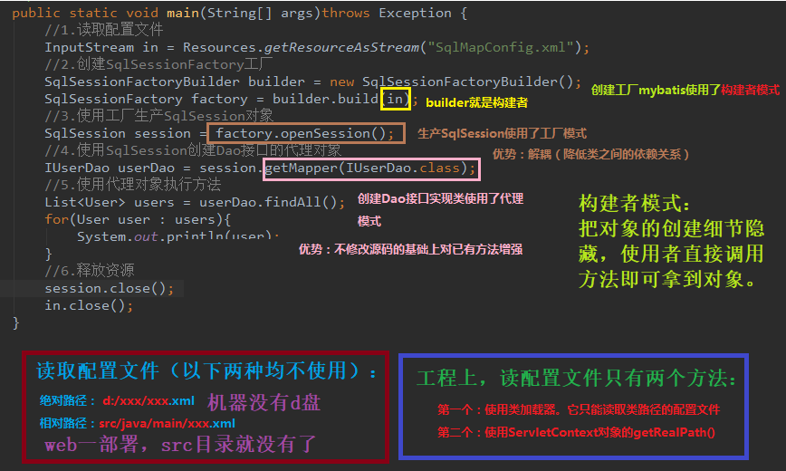

# 第三节 Mybatis入门案例中的设计模式分析

## 3.1 Mybatis 主函数分析




## 3.2 Mybatis 执行查询所有(findAll)分析


## 3.3 Mybatis 创建代理对象的分析


## 3.4 自定义 Mybatis 框架

自定义 Mybatis 的分析：

* Mybatis 在使用代理 dao 的方式实现增删改查时，只做了两件事：

   * 第一：创建代理对象

   * 第二：在代理对象中调用selectList

自定义 Mybatis 通过入门案例看到类：

* `class Resources`

* `class SqlSessionFactoryBuilder`

* `interface SqlSessionFactory`

* `interface SqlSession`


### 实现

基于入门案例修改，去掉 `pom.xml` 文件中有关 mybatis 的坐标（即 dependency 项），并删除配置文件中的相关约束。

1）在 main->java->com->itheima 下创建类 `mybatis.io.Resources`。

```java
package com.itheima.mybatis.io;

import java.io.InputStream;

// 使用类加载器读取配置文件的类
public class Resources {
    public static InputStream getResourceAsStream(String filePath){
         return Resources.class.getClassLoader().getResourceAsStream(filePath);
    }
}
```

在主函数文件中导入包 `import com.itheima.mybatis.io.Resources;`

2）在 mybatis 文件夹下，创建类 `sqlsession.SqlSessionFactoryBuilder`。在 sqlsession 文件夹下，创建接口 `SqlSessionFactory`、`SqlSession`。

```java
// SqlSessionFactoryBuilder.java
package com.itheima.mybatis.sqlsession;

import java.io.InputStream;

// 用于创建一个SqlSessionFactory对象
public class SqlSessionFactoryBuilder {
    // 根据参数的字节输入流来构建一个SqlSessionFactory工厂
    public SqlSessionFactory build(InputStream config){
        return null; //后续需要补充代码
    }
}
```

```java
// SqlSessionFactory.java
package com.itheima.mybatis.sqlsession;

public interface SqlSessionFactory {
    SqlSession openSession();
}
```
 
```java
// SqlSession.java

package com.itheima.mybatis.sqlsession;

// 自定义Mybatis中和数据库交互的核心类
// 它里面可以创建dao接口的代理对象
public interface SqlSession {
    // 根据参数创建一个代理对象
    // daoInterfaceClass：dao的接口字节码
    <T> T getMapper(Class<T> daoInterfaceClass);

    //释放资源
    void close();
}                 
```                                                   

3）解析 XML 的工具类介绍


