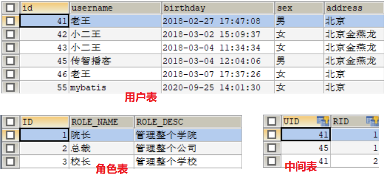

## 第十一节 Mybatis 多表查询

表之间的关系有几种：一对多、多对一、一对一、多对多。

### 10.1 一对一查询操作

需求：
* 一个用户可以有多个账户
* 一个账户只能属于一个用户（多个账户也可以属于同一个用户）

步骤：
1、建立两张表：用户表，账户表
* 让用户表和账户表之间具备一对多的关系：需要使用外键在账户表中添加。

2、建立两个实体类：用户实体类和账户实体类
* 让用户和账户的实体类能体现出来一对多的关系。

3、建立两个配置文件
* 用户的配置文件
* 账户的配置文件

4、实现配置：
* 当查询用户时，可以同时得到用户下所包含的账户信息。
* 当查询账户时，可以同时得到账户的所属用户信息。

账户表准备：

```sql
DROP TABLE IF EXISTS `account`;

CREATE TABLE `account` (
  `ID` INT(11) NOT NULL COMMENT '编号',
  `UID` INT(11) DEFAULT NULL COMMENT '用户编号',
  `MONEY` DOUBLE DEFAULT NULL COMMENT '金额',
  PRIMARY KEY  (`ID`),
  KEY `FK_Reference_8` (`UID`),
  CONSTRAINT `FK_Reference_8` FOREIGN KEY (`UID`) REFERENCES `user` (`id`)
) ENGINE=INNODB DEFAULT CHARSET=utf8;

INSERT  INTO `account`(`ID`,`UID`,`MONEY`) VALUES (1,46,1000),(2,45,1000),(3,46,2000);
```

建立 Account.java 实体类文件，IAccountDao.java 接口文件（生命方法），以及配置文件 IAccountDao.xml，以及测试文件 MybatisTest.java。


**查询 Account 表，并显示对应的用户名以及地址信息（在User表中）**。

1 建立 AccountUser.java 

```java
package com.itheima.domain;

public class AccountUser extends Account {
    private String username;
    private String address;

    public String getUsername() {
        return username;
    }

    public void setUsername(String username) {
        this.username = username;
    }

    public String getAddress() {
        return address;
    }

    public void setAddress(String address) {
        this.address = address;
    }

    @Override
    public String toString() {
        return super.toString() + "          AccountUser{" +
                "username='" + username + '\'' +
                ", address='" + address + '\'' +
                '}';
    }
}
```

2 在 IAccountDao.java 中添加方法：

```java
List<AccountUser> findAllAccount();
```

3 在 IAccountDao.xml 文件中添加配置：

```xml
<select id="findAllAccount" resultType="accountuser">
    SELECT a.*,u.username,u.address FROM account a, user u where u.id = a.uid;
</select>
```

4 在 AccountTest 中，添加测试方法：

```java
@Test
public void testFindAccountUser() {

    //5. 执行查询所有方法
    List<AccountUser> aus = accountDao.findAllAccount();
    for(Account au : aus){
        System.out.println(au);
    }

}
```

上述建立子类方法并不常用。

常用的方法：让用户和账户的实体类能体现出来**一对一**的关系

1 在 Account 类中，添加 User 私有变量。

```java
public class Account implements Serializable {
    private Integer id;
    private Integer uid;
    private Double money;

    private User user; //新增
    
    getter and setter方法
```

2 在 IAccountDao.xml 文件中添加 resultMap 配置：

```xml
<mapper namespace="com.itheima.dao.IAccountDao">

    <resultMap id="accountUserMap" type="account">
        <id property="id" column="aid"></id>
        <result property="uid" column="uid"></result>
        <result property="money" column="money"></result>
        <!--一对一的关系映射：配置user的内容-->
        <association property="user" column="uid" javaType="user">
            <id property="id" column="id"></id>
            <result property="username" column="username"></result>
            <result property="address" column="address"></result>
            <result property="sex" column="sex"></result>
            <result property="birthday" column="birthday"></result>
        </association>
    </resultMap>
    <!-- 查询所有 SELECT *  FROM USER;-->
    <select id="findAll" resultMap="accountUserMap">
        SELECT a.*,u.username,u.address FROM account a, user u where u.id = a.uid;
    </select>
```

3 测试

```java
@Test
public void testFindAll() {

    //5. 执行查询所有方法
    List<Account> accounts = accountDao.findAll();
    for(Account account : accounts){
        System.out.println("---------每个 Account 信息---------");
        System.out.println(account);
        System.out.println(account.getUser());
    }

}
```

### 10.2 user 的一对多查询操作

1 在 User.java 中添加 List<Account> 变量

```java
public class User implements Serializable {

    private Integer id;
    private String username;
    private String address;
    private String sex;
    private Date birthday;

    //一对多关系映射：主表实体应该包含从表实体的集合引用。
    private List<Account> accounts;
    
    getter and setter 方法... ...
```

2 在 IUserDao.xml 中添加配置：

```xml
<mapper namespace="com.itheima.dao.IUserDao">

    <!--定义User的resultMap-->
    <resultMap id="userAccountMap" type="user">
        <id property="id" column="id"></id>
        <result property="username" column="username"></result>
        <result property="address" column="address"></result>
        <result property="sex" column="sex"></result>
        <result property="birthday" column="birthday"></result>
        <!--配置user对象中account集合的映射-->
        <collection property="accounts" ofType="account">
            <id property="id" column="aid"></id>
            <result property="uid" column="uid"></result>
            <result property="money" column="money"></result>
        </collection>
        
    </resultMap>
    <!-- 查询所有 SELECT *  FROM USER;-->
    <select id="findAll" resultMap="userAccountMap">
        SELECT * FROM user u LEFT OUTER JOIN account a ON u.id = a.uid;
    </select>
    
</mapper>
```

3 测试

```java
@Test
public void testFindAll() {
    List<User> users = userDao.findAll();
    for(User user : users){
        System.out.println("---------每个用户的信息---------");
        System.out.println(user);
        System.out.println(user.getAccounts());
    }
}
```

### 10.3 Mybatis 多对多查询操作

示例：用户和角色
* 一个用户可以有多个角色
* 一个角色可以赋予多个用户
步骤：
1、建立两张表：用户表，角色表
* 让用户表和角色表具有多对多的关系。需要使用[中间表]，中间表中包含各自的主键，在中间表中是外键。

2、建立两个实体类：用户实体类和角色实体类
* 让用户和角色的实体类能体现出来[多对多]的关系
* 【各自包含对方一个集合引用】

3、建立两个配置文件
* 用户的配置文件
* 角色的配置文件

4、实现配置：
* 当查询用户时，可以同时得到用户所包含的角色信息
* 当查询角色时，可以同时得到角色的所赋予的用户信息

创建角色表与中间表（用户表之前创建过）

```sql
DROP TABLE IF EXISTS `role`;

CREATE TABLE `role` (
  `ID` int(11) NOT NULL COMMENT '编号',
  `ROLE_NAME` varchar(30) default NULL COMMENT '角色名称',
  `ROLE_DESC` varchar(60) default NULL COMMENT '角色描述',
  PRIMARY KEY  (`ID`)
) ENGINE=InnoDB DEFAULT CHARSET=utf8;

insert  into `role`(`ID`,`ROLE_NAME`,`ROLE_DESC`) values (1,'院长','管理整个学院'),(2,'总裁','管理整个公司'),(3,'校长','管理整个学校');

DROP TABLE IF EXISTS `user_role`;

CREATE TABLE `user_role` (
  `UID` int(11) NOT NULL COMMENT '用户编号',
  `RID` int(11) NOT NULL COMMENT '角色编号',
  PRIMARY KEY  (`UID`,`RID`),
  KEY `FK_Reference_10` (`RID`),
  CONSTRAINT `FK_Reference_10` FOREIGN KEY (`RID`) REFERENCES `role` (`ID`),
  CONSTRAINT `FK_Reference_9` FOREIGN KEY (`UID`) REFERENCES `user` (`id`)
) ENGINE=InnoDB DEFAULT CHARSET=utf8;

insert  into `user_role`(`UID`,`RID`) values (41,1),(45,1),(41,2);
```



1 创建 Role.java 实体类

```java
public class Role implements Serializable {
    //注意 变量名与数据库的名字不一致
    private Integer roleId;
    private String roleName;
    private String roleDesc;
    //多对多关系映射：一个角色可以赋予多个用户
    private List<User> users;
    
    getter and setter... toString...
}
```

2 创建 IRoleDao.java 接口

```java
public interface IRoleDao {
    List<Role> findAll();
}
```

3 创建配置文件 IRoleDao.xml

```xml
<?xml version="1.0" encoding="UTF-8"?>
<!DOCTYPE mapper
        PUBLIC "-//mybatis.org//DTD Mapper 3.0//EN"
        "http://mybatis.org/dtd/mybatis-3-mapper.dtd">

<mapper namespace="com.itheima.dao.IRoleDao">

    <!--定义User的resultMap-->
    <resultMap id="roleMap" type="role">
        <id property="roleId" column="id"></id>
        <result property="roleName" column="role_name"></result>
        <result property="roleDesc" column="role_desc"></result>

    </resultMap>
    <!-- 查询所有 SELECT *  FROM USER;-->
    <select id="findAll" resultMap="roleMap">
        SELECT * FROM role;
    </select>

</mapper>
```

4 测试

```java
@Test
public void testFindAll() {
    List<Role> roles = roleDao.findAll();
    for(Role role : roles){
        System.out.println("---------每个用户的信息---------");
        System.out.println(role);
    }
}
```

上述操作实现了 Role 表一对多查询查询

5 为 User.java 添加：

```java
public class User implements Serializable {

    private Integer id;
    private String username;
    private String address;
    private String sex;
    private Date birthday;

    //多对多关系映射：一个用户可以对应多个角色
    private List<Role> roles;
}
```

6 创建配置文件 IUserDao.xml

```xml
<mapper namespace="com.itheima.dao.IUserDao">

    <!--定义User的resultMap-->
    <resultMap id="userMap" type="user">
        <id property="id" column="id"></id>
        <result property="username" column="username"></result>
        <result property="address" column="address"></result>
        <result property="sex" column="sex"></result>
        <result property="birthday" column="birthday"></result>
        <collection property="roles" ofType="role">
            <id property="roleId" column="rid"></id>
            <result property="roleName" column="role_name"></result>
            <result property="roleDesc" column="role_desc"></result>
        </collection>
        
    </resultMap>
    <!-- 查询所有 SELECT *  FROM USER;-->
    <select id="findAll" resultMap="userMap">
        SELECT u.*,r.id as rid,r.role_name,r.role_desc FROM user u
         LEFT OUTER JOIN user_role ur ON u.id = ur.uid
         LEFT OUTER JOIN role r ON r.id = ur.rid;
    </select>

</mapper>
```


