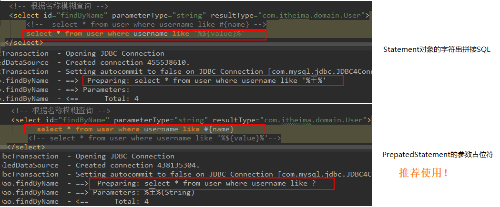

# 第五节 基于代理 Dao 实现 CRUD 操作


## 5.1 CRUD-保存操作

1）在 IUserDao 中，添加方法。

```java
void saveUser(User user);
```

2）在映射配置文件 IUserDao.xml 中添加映射。

```xml
<!-- 保存用户 parameterType告知函数接收参数类型-->
<!-- 实体类中，使用右键生成getter&setter，则获取值时，可直接使用实体类中定义的变量名-->
<!-- 如果实体类是自己实现的，则取值时写入get方法后的名字 -->
<insert id="saveUser" parameterType="com.itheima.domain.User">
    INSERT into user(username, address, sex, birthday) VALUES(#{username},#{address},#{sex},#{birthday});
</insert>
```

3）在测试类中添加新的测试方法

```java
package com.itheima.test;

import com.itheima.dao.IUserDao;
import com.itheima.domain.User;
import org.apache.ibatis.io.Resources;
import org.apache.ibatis.session.SqlSession;
import org.apache.ibatis.session.SqlSessionFactory;
import org.apache.ibatis.session.SqlSessionFactoryBuilder;
import org.junit.After;
import org.junit.Before;
import org.junit.Test;

import java.io.InputStream;
import java.util.Date;
import java.util.List;

public class MybatisTest {

    private InputStream in;
    private SqlSession session;
    private IUserDao userDao;

    @Before //该注解用于在测试方法执行之前执行
    public void init() throws Exception{
        //1. 读取配置文件，生成字节输入流
        in = Resources.getResourceAsStream("SqlMapConfig.xml");
        //2. 获取SqlSessionFactory对象
        SqlSessionFactory factory = new SqlSessionFactoryBuilder().build(in);
        //3. 获取SqlSession对象
        session = factory.openSession();
        //4. 获取dao的代理对象
        userDao = session.getMapper(IUserDao.class);
    }

    @After //该方法用于在测试方法执行之后执行
    public void destroy() throws Exception{
        //6. 提交事务(如果不提交，运行结束后会回滚，最终没有实现保存功能)
        session.commit();
        //7. 释放资源
        session.close();
        in.close();
    }

    @Test
    public void testFindAll() {

        //5. 执行查询所有方法
        List<User> users = userDao.findAll();
        for(User user : users){
            System.out.println(user);
        }
    }

    //测试报错操作
    @Test
    public void testSave() {
        User user = new User();
        user.setUsername("mybatis saveuser");
        user.setAddress("北京顺义区");
        user.setSex("男");
        user.setBirthday(new Date());

        //5. 执行保存方法
        userDao.saveUser(user);
    }
}
```


## 5.2 CRUD-修改和删除操作

### 5.2.1 修改操作

1）在 IUserDao 中，添加方法。

```java
void updateUser(User user);
```

2）在映射配置文件 IUserDao.xml 中添加映射。

```xml
<!--更新用户-->
<update id="updateUser" parameterType="com.itheima.domain.User">
    UPDATE USER SET username=#{username}, address=#{address}, sex=#{sex}, birthday=#{birthday} WHERE id=#{id};
</update>
```

3）在测试类中添加新的测试方法


```java
//测试更新操作
@Test
public void testUpdate() {
    User user = new User();
    user.setId(49);
    user.setUsername("mybatis Update");
    user.setAddress("北京顺义区");
    user.setSex("女");
    user.setBirthday(new Date());

    //5. 执行保存方法
    userDao.updateUser(user);
}
```

### 5.2.2 删除操作

功能：根据 id 删除用户

1）在 IUserDao 中，添加方法。

```java
void deleteUser(Integer userId);
```

2）在映射配置文件 IUserDao.xml 中添加映射。

```xml
<!--根据id删除用户-->
<!--parameterType为基本类型时，如int，其取值可以写为：Integer、INT、INTEGER、java.lang.Integer-->
<delete id="deleteUser" parameterType="Integer">
    <!--#{id}，由于只有一个参数，该括号内的文字只是一个占位符，可以取任意的名字-->
    DELETE FROM USER WHERE id=#{uid};
</delete>
```

3）在测试类中添加新的测试方法

```java
//测试删除操作
@Test
public void testDelete() {
    //5. 执行删除方法
    userDao.deleteUser(48);
}
```

## 5.3 CRUD-查询操作

### 5.3.1 查询一个操作

功能：据 id 查询用户

1）在 IUserDao 中，添加方法。

```java
User findById(Integer userId);
```

2）在映射配置文件 IUserDao.xml 中添加映射。

```xml
<!--据id查询用户-->
<select id="findById" parameterType="Integer" resultType="com.itheima.domain.User">
    SELECT * FROM USER WHERE id=#{uid};
</select>
```

3）在测试类中添加新的测试方法

```java
//测试查询一个操作
@Test
public void testFindOne() {
    //5. 执行查询一个方法
    User user = userDao.findById(49);
    System.out.println(user);
}
```

### 5.3.2 模糊查询操作

功能：根据名称模糊查询用户信息。

#### 实现一

1）在 IUserDao 中，添加方法。

```java
List<User> findByName(String username);
```

2）在映射配置文件 IUserDao.xml 中添加映射。

```xml
<!--根据名称模糊查询用户信息-->
<select id="findByName" parameterType="String" resultType="com.itheima.domain.User">
    SELECT * FROM USER WHERE username LIKE #{name};
</select>
```

3）在测试类中添加新的测试方法

```java
//测试模糊查询操作
@Test
public void testFindByName() {
    //5. 执行查询一个方法
    List<User> users = userDao.findByName("%王%");
    for(User user:users){
        System.out.println(user);
    }
}
```

#### 实现二 （不常用，了解）

1）在 IUserDao 中，添加方法（同实现一一致）。

```java
List<User> findByName(String username);
```

2）在映射配置文件 IUserDao.xml 中添加映射。

```xml
<!--根据名称模糊查询用户信息-->
<select id="findByName" parameterType="String" resultType="com.itheima.domain.User">
    SELECT * FROM USER WHERE username LIKE '%${value}%';
</select>
```

* 注：`'%${value}%'`中的 value 名字不可以修改。

3）在测试类中添加新的测试方法

```java
//测试模糊查询操作
@Test
public void testFindByName2() {
    //5. 执行查询一个方法
    List<User> users = userDao.findByName("王");
    for(User user:users){
        System.out.println(user);
    }
}
```
#### 两种实现的区别




### 5.3.3 查询返回一行一列

功能：查询总用户数。

1）在 IUserDao 中，添加方法。

```java
int findTotal();
```

2）在映射配置文件 IUserDao.xml 中添加映射。

```xml
<!--查询总用户数-->
<select id="findTotal" resultType="int">
    SELECT COUNT(id) FROM USER;
</select>
```

3）在测试类中添加新的测试方法

```java
//测试查询总记录条数操作
@Test
public void testfindTotal() {
    //5. 执行查询总记录条数方法
    int i = userDao.findTotal();
    System.out.println("总记录条数："+i);
}
```


## 5.4 CURD 操作分析

和占位符分析


## 5.5 保存操作的细节-获取保存数据的id


1）在 IUserDao 中，添加方法。

```java

```

2）在映射配置文件 IUserDao.xml 中添加映射。

```xml

```

3）在测试类中添加新的测试方法

```java

```


