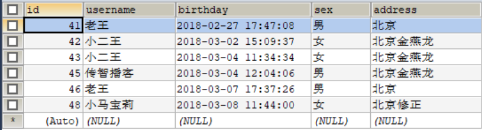
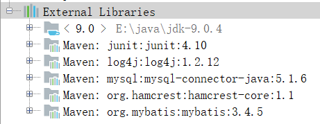

# 第一节 Mybatis 框架快速入门

## 1. 安装前准备


创建数据库要操作的表

```sql
CREATE DATABASE eesy_mybatis;
USE eesy_mybatis;

DROP TABLE IF EXISTS `user`;

CREATE TABLE `user` (
  `id` INT(11) NOT NULL AUTO_INCREMENT,
  `username` VARCHAR(32) NOT NULL COMMENT '用户名称',
  `birthday` DATETIME DEFAULT NULL COMMENT '生日',
  `sex` CHAR(1) DEFAULT NULL COMMENT '性别',
  `address` VARCHAR(256) DEFAULT NULL COMMENT '地址',
  PRIMARY KEY  (`id`)
) ENGINE=INNODB DEFAULT CHARSET=utf8;

INSERT  INTO `user`(`id`,`username`,`birthday`,`sex`,`address`) VALUES (41,'老王','2018-02-27 17:47:08','男','北京'),
(42,'小二王','2018-03-02 15:09:37','女','北京金燕龙'),
(43,'小二王','2018-03-04 11:34:34','女','北京金燕龙'),
(45,'传智播客','2018-03-04 12:04:06','男','北京金燕龙'),
(46,'老王','2018-03-07 17:37:26','男','北京'),
(48,'小马宝莉','2018-03-08 11:44:00','女','北京修正');

SELECT * FROM USER;
```



## 2. Mybatis 环境搭建

① 创建工程，选择 Maven，点击 Next，填写 GroupId 为 `com.itheima`，ArtifactId 为 `day01_eesy_01mybatis`，点击 Next、Finish。


② 配置 Maven 项目中的 pom.xml 文件

1）配置打包方式
`<packaging>jar</packaging>`

2）如果使用 Maven 来构建项目，则需将下面的依赖代码置于 pom.xml 文件中

```html
<dependency>
    <groupId>org.mybatis</groupId>
    <artifactId>mybatis</artifactId>
    <version>x.x.x</version>
</dependency>
```

3）项目还需要使用数据库、日志、单元测试。

```html
<dependencies>
    <dependency>
        <groupId>org.mybatis</groupId>
        <artifactId>mybatis</artifactId>
        <version>3.4.5</version>
    </dependency>
    <dependency>
        <groupId>mysql</groupId>
        <artifactId>mysql-connector-java</artifactId>
        <version>5.1.6</version>
    </dependency>
    <dependency>
        <groupId>log4j</groupId>
        <artifactId>log4j</artifactId>
        <version>1.2.12</version>
    </dependency>
    <dependency>
        <groupId>junit</groupId>
        <artifactId>junit</artifactId>
        <version>4.10</version>
    </dependency>
</dependencies>
```


③ 


④ 


⑤ 


⑥ 


## 2. Mybatis 环境搭建