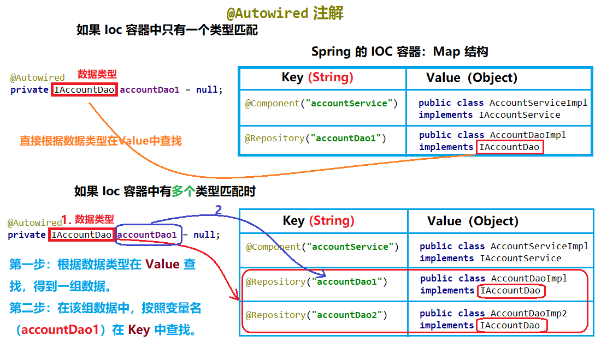

## 第三节 Spring 基于注解的 IOC 以及 IoC 的案例

### 3.1 Spring 中 ioc 的常用注解

基于注解的 IoC 配置与 xml 配置要实现的功能是一样的，都是要降低程序间的耦合。只是配置的形式不一样。 

#### 3.1.1 准备

```xml
//为 pom.xml 添加坐标
<packaging>jar</packaging>
<dependencies>
    <dependency>
        <groupId>org.springframework</groupId>
        <artifactId>spring-context</artifactId>
        <version>5.0.2.RELEASE</version>
    </dependency>
</dependencies>

//在 bean.xml 文件中，为 beans 标签添加 context 名称空间和约束中。
<?xml version="1.0" encoding="UTF-8"?>
<beans xmlns="http://www.springframework.org/schema/beans"
       xmlns:xsi="http://www.w3.org/2001/XMLSchema-instance"
       xmlns:context="http://www.springframework.org/schema/context"
       xsi:schemaLocation="http://www.springframework.org/schema/beans
        http://www.springframework.org/schema/beans/spring-beans.xsd
        http://www.springframework.org/schema/context
        http://www.springframework.org/schema/context/spring-context.xsd">

    <!--告知spring在创建容器时要扫描的包，配置所需要的标签不是在beans的约束中，而是一个名称为
    context名称空间和约束中-->
    <context:component-scan base-package="com.itheima"></context:component-scan>
</beans>
```

#### 3.1.2 文件内容

```md
文件结构
java.com.itheima
|___dao
| |___impl
| | |___AccountDaoIpml.java   
| |___IAccountDao.java 
|
|___service
| |___impl
| | |___AccountServiceIpml.java   
| |___IAccountService.java 
|
|___ui
  |___Client
```
其中 AccountServiceImpl 实现如下：
```java
public class AccountServiceImpl implements IAccountService {
    private IAccountDao accountDao;
    public AccountServiceImpl(){
        System.out.println("对象创建了！");
    }
    public void  saveAccount(){
        accountDao.saveAccount();
    }
}
```


#### 3.1.3 注解配置

```
曾经 XML 的配置：
<bean id="accountService" class="com.itheima.service.impl.AccountServiceImpl" scope=""  init-method="" destroy-method="">
    <property name=""  value="" / ref=""></property>
</bean>
```

##### 1）用于创建对象的 Component 注解

作用：与 XML 配置文件中编写一个 `<bean>` 标签实现的功能是一样的。

* Component:
  * 作用：用于把当前类对象存入 Spring 容器中
  * 属性：value，用于指定 bean 的 id。当不写时，它的默认值是当前类名，且首字母改小写。
* Controller：一般用在表现层
* Service：一般用在业务层
* Repository：一般用在持久层
* 以上三个注解他们的作用和属性与 Component 是一模一样的（可以互相通用）。他们三个是 Spring 框架为使用者提供明确的三层使用的注解。

1 为程序添加注解
```java
// AccountServiceImpl 类
@Component
public class AccountServiceImpl implements IAccountService {
    private IAccountDao accountDao;
    public AccountServiceImpl(){
        System.out.println("对象创建了！");
    }
    public void  saveAccount(){
        accountDao.saveAccount();
    }
}
// AccountDaoImpl 类
@Repository("accountDao")
public class AccountDaoImpl implements IAccountDao {
    public void saveAccount(){
        System.out.println("保存了账户");
    }
}
```

2 调用（bean.xml已经配置过）
```java
public class Client {
    public static void main(String[] args) {
        //1.获取核心容器对象
        ApplicationContext ac = new ClassPathXmlApplicationContext("bean.xml");
        //2.根据id获取Bean对象
        IAccountService as  = (IAccountService)ac.getBean("accountServiceImpl"); //类名首字母小写！
        System.out.println(as);
        //as.saveAccount();

        IAccountDao aDAO  = (IAccountDao)ac.getBean("accountDao");
        System.out.println(aDAO);
    }
}
```

##### 2）用于注入数据的注解

用于注入数据的注解作用：与 xml 配置文件中的 bean 标签中写一个 `<property>` 标签的作用是一样的。
* Autowired:
 * 作用：自动按照类型注入。
   * 只要容器中有唯一的一个 bean 对象类型和要注入的变量类型匹配，就可以注入成功。
   * 如果 ioc 容器中没有任何 bean 的类型和要注入的变量类型匹配，则报错。
   * 如果 Ioc 容器中有多个类型匹配时：匹配关系如下图。
 * 出现位置：可以是变量上，也可以是方法上
 * 细节：在使用注解注入时，set 方法不是必须的。
```java
 @Component
public class AccountServiceImpl implements IAccountService {
    @Autowired //作用于变量
    private IAccountDao accountDao;

    public AccountServiceImpl(){
        System.out.println("对象创建了！");
    }
    public void  saveAccount(){
        accountDao.saveAccount();
    }
}
```
 
 

 
* Qualifier:
 * 作用：在按照**类型注入**的基础之上再按照**名称注入**。它**在给类成员注入时不能单独使用**。但是在**给方法参数注入时可以**。
 * 属性：value，用于指定注入 bean 的 id。
 ```java
 @Autowired
 @Qualifier("accountDao1")
 private IAccountDao accountDao = null;
 ```
 
* Resource
 * 作用：直接按照 bean 的 id 注入，可以独立使用。
 * 属性：name，用于指定 bean 的 id。
 ```java
 @Resource(name="accountDao2")
 private IAccountDao accountDao = null;
 ```
 上述代码会报空指针异常：`javax.annotation.Resource` 是 JDK1.6 才支持的，jdk1.8 以上没有 javax.annotation。
 导入依赖
 ```xml
 <dependency>
    <groupId>javax.annotation</groupId>
    <artifactId>javax.annotation-api</artifactId>
    <version>1.3.2</version>
 </dependency>
 ```

> 以上三个注入都只能注入其他 bean 类型的数据，而基本类型和 String 类型无法使用上述注解实现。
> 另外，集合类型的注入只能通过 XML 来实现。

* Value
 * 作用：用于注入基本类型和 String 类型的数据
 * 属性：value，用于指定数据的值。它可以使用 Spring 中 SpEL (也就是 Spring 的 el 表达式）
 * SpEL 的写法：`${表达式}`

##### 3）用于改变作用范围的注解

* Scope
 * 作用：用于指定 bean 的作用范围，与 bean 标签中使用 scope 属性实现的功能是一样的。
 * 属性：value，指定范围的取值。常用取值：singleton prototype

```java
@Component("accountService")
@Scope("singleton")
public class AccountServiceImpl implements IAccountService{...}
```

##### 4）与生命周期相关的注解（了解）

作用：与 bean 标签中使用 init-method 和 destroy-method 的作用是一样的。
* PreDestroy：用于指定销毁方法。
* PostConstruct：用于指定初始化方法。

```java
@PostConstruct
public void  init(){
    System.out.println("初始化方法执行了");
}

@PreDestroy
public void  destroy(){
    System.out.println("销毁方法执行了");
}
```

### 3.2 XMLIOC 的案例

#### 3.2.1 准备案例的必须代码

1 导入坐标
```java
<packaging>jar</packaging>

<dependencies>
    <dependency>
        <groupId>org.springframework</groupId>
        <artifactId>spring-context</artifactId>
        <version>5.0.2.RELEASE</version>
    </dependency>
    <dependency>
        <groupId>org.springframework</groupId>
        <artifactId>spring-test</artifactId>
        <version>5.0.2.RELEASE</version>
    </dependency>
    <dependency>
        <groupId>commons-dbutils</groupId>
        <artifactId>commons-dbutils</artifactId>
        <version>1.4</version>
    </dependency>

    <dependency>
        <groupId>mysql</groupId>
        <artifactId>mysql-connector-java</artifactId>
        <version>5.1.6</version>
    </dependency>

    <dependency>
        <groupId>c3p0</groupId>
        <artifactId>c3p0</artifactId>
        <version>0.9.1.2</version>
    </dependency>

    <dependency>
        <groupId>junit</groupId>
        <artifactId>junit</artifactId>
        <version>4.12</version>
    </dependency>
</dependencies>
```

2. 创建数据库及表

```sql
create database eesy;
create table account(
	id int primary key auto_increment,
	name varchar(40),
	money float
)character set utf8 collate utf8_general_ci;

insert into account(name,money) values('aaa',1000);
insert into account(name,money) values('bbb',1000);
insert into account(name,money) values('ccc',1000);
```

3. 文件结构及内容


```java

//1) 账户的持久层接口
public interface IAccountDao {
    //查询所有
    List<Account> findAllAccount();

    //查询一个
    Account findAccountById(Integer accountId);

    //保存
    void saveAccount(Account account);

    //更新
    void updateAccount(Account account);

    //删除
    void deleteAccount(Integer acccountId);
}

//2) 账户的持久层实现类
public class AccountDaoImpl implements IAccountDao {

    private QueryRunner runner;

    public void setRunner(QueryRunner runner) {
        this.runner = runner;
    }

    public List<Account> findAllAccount() {
        try{
            return runner.query("select * from account",new BeanListHandler<Account>(Account.class));
        }catch (Exception e) {
            throw new RuntimeException(e);
        }
    }

    public Account findAccountById(Integer accountId) {
        try{
            return runner.query("select * from account where id = ? ",new BeanHandler<Account>(Account.class),accountId);
        }catch (Exception e) {
            throw new RuntimeException(e);
        }
    }

    public void saveAccount(Account account) {
        try{
            runner.update("insert into account(name,money) values(?,?)",account.getName(),account.getMoney());
        }catch (Exception e) {
            throw new RuntimeException(e);
        }
    }

    public void updateAccount(Account account) {
        try{
            runner.update("update account set name=?,money=? where id=?",account.getName(),account.getMoney(),account.getId());
        }catch (Exception e) {
            throw new RuntimeException(e);
        }
    }

    public void deleteAccount(Integer accountId) {
        try{
            runner.update("delete from account where id=?",accountId);
        }catch (Exception e) {
            throw new RuntimeException(e);
        }
    }
}

//3) 账户的业务层接口
public interface IAccountService {
    //查询所有
    List<Account> findAllAccount();

    //查询一个
    Account findAccountById(Integer accountId);

    //保存
    void saveAccount(Account account);

    //更新
    void updateAccount(Account account);

    //删除
    void deleteAccount(Integer acccountId);
}

//4) 账户的业务层实现类
public class AccountServiceImpl implements IAccountService{

    //业务层是要调用持久层的
    private IAccountDao accountDao;

    public void setAccountDao(IAccountDao accountDao) {
        this.accountDao = accountDao;
    }

    public List<Account> findAllAccount() {
        return accountDao.findAllAccount();
    }

    public Account findAccountById(Integer accountId) {
        return accountDao.findAccountById(accountId);
    }

    public void saveAccount(Account account) {
        accountDao.saveAccount(account);
    }

    public void updateAccount(Account account) {
        accountDao.updateAccount(account);
    }

    public void deleteAccount(Integer acccountId) {
        accountDao.deleteAccount(acccountId);
    }
}

//5) 数据库中账户对应的实体类
public class Account implements Serializable {

    private Integer id;
    private String name;
    private Float money;

    public Integer getId() {
        return id;
    }

    public void setId(Integer id) {
        this.id = id;
    }

    public String getName() {
        return name;
    }

    public void setName(String name) {
        this.name = name;
    }

    public Float getMoney() {
        return money;
    }

    public void setMoney(Float money) {
        this.money = money;
    }

    @Override
    public String toString() {
        return "Account{" +
                "id=" + id +
                ", name='" + name + '\'' +
                ", money=" + money +
                '}';
    }
}
```

#### 3.2.2 编写 Spring 的 Ioc 配置

在 src->main->resources 下创建 bean.xml 文件。
```xml
<?xml version="1.0" encoding="UTF-8"?>
<beans xmlns="http://www.springframework.org/schema/beans"
       xmlns:xsi="http://www.w3.org/2001/XMLSchema-instance"
       xsi:schemaLocation="http://www.springframework.org/schema/beans
        http://www.springframework.org/schema/beans/spring-beans.xsd">
    <!-- 配置Service -->
    <bean id="accountService" class="com.itheima.service.impl.AccountServiceImpl">
        <!-- 注入dao -->
        <property name="accountDao" ref="accountDao"></property>
    </bean>

    <!--配置Dao对象-->
    <bean id="accountDao" class="com.itheima.dao.impl.AccountDaoImpl">
        <!-- 注入QueryRunner -->
        <property name="runner" ref="runner"></property>
    </bean>

    <!--配置QueryRunner-->
    <bean id="runner" class="org.apache.commons.dbutils.QueryRunner" scope="prototype">
        <!--注入数据源-->
        <constructor-arg name="ds" ref="dataSource"></constructor-arg>
    </bean>

    <!-- 配置数据源 -->
    <bean id="dataSource" class="com.mchange.v2.c3p0.ComboPooledDataSource">
        <!--连接数据库的必备信息-->
        <property name="driverClass" value="com.mysql.jdbc.Driver"></property>
        <property name="jdbcUrl" value="jdbc:mysql://localhost:3306/eesy"></property>
        <property name="user" value="root"></property>
        <property name="password" value="mysql"></property>
    </bean>
</beans>
```

#### 3.2.3 测试基于 XML 的 IOC 案例

在 test->java 下创建 `com.itheima.test.AccountServiceTest` 测试类

```java
//使用 Junit 单元测试：测试我们的配置
public class AccountServiceTest {

    @Test
    public void testFindAll() {
        //1. 获取容器
        ApplicationContext ac = new ClassPathXmlApplicationContext("bean.xml");
        //2. 获取业务层对象
        IAccountService as = ac.getBean("accountService",IAccountService.class);
        //3. 执行方法
        List<Account> accounts = as.findAllAccount();
        for(Account account : accounts){
            System.out.println(account);
        }
    }

    @Test
    public void testFindOne() {
        //1. 获取容器
        ApplicationContext ac = new ClassPathXmlApplicationContext("bean.xml");
        //2. 获取业务层对象
        IAccountService as = ac.getBean("accountService",IAccountService.class);
        //3. 执行方法
        Account account = as.findAccountById(2);
        System.out.println(account);
    }

    @Test
    public void testSave() {
        //1. 获取容器
        ApplicationContext ac = new ClassPathXmlApplicationContext("bean.xml");
        //2. 获取业务层对象
        IAccountService as = ac.getBean("accountService",IAccountService.class);
        //3. 执行方法
        Account account = new Account();
        account.setName("test");
        account.setMoney(12345f);
        as.saveAccount(account);
    }

    @Test
    public void testUpdate() {
        //1. 获取容器
        ApplicationContext ac = new ClassPathXmlApplicationContext("bean.xml");
        //2. 获取业务层对象
        IAccountService as = ac.getBean("accountService",IAccountService.class);
        //3. 执行方法
        Account account = as.findAccountById(4);
        account.setMoney(23456f);
        as.updateAccount(account);
    }

    @Test
    public void testDelete() {
        //1. 获取容器
        ApplicationContext ac = new ClassPathXmlApplicationContext("bean.xml");
        //2. 获取业务层对象
        IAccountService as = ac.getBean("accountService",IAccountService.class);
        //3. 执行方法
        as.deleteAccount(4);
    }
}
```

#### 3.2.4 要点注意


#### 3.2.5 注解IOC案例-把自己编写的类使用注解配置

1 修改 `bean.xml` 文件：添加 context 约束，并删除 Service 与 Dao 相关的配置。
```xml
<?xml version="1.0" encoding="UTF-8"?>
<beans xmlns="http://www.springframework.org/schema/beans"
       xmlns:xsi="http://www.w3.org/2001/XMLSchema-instance"
       xmlns:context="http://www.springframework.org/schema/context"
       xsi:schemaLocation="http://www.springframework.org/schema/beans
        http://www.springframework.org/schema/beans/spring-beans.xsd
        http://www.springframework.org/schema/context
        http://www.springframework.org/schema/context/spring-context.xsd">

    <!-- 告知spring在创建容器时要扫描的包 -->
    <context:component-scan base-package="com.itheima"></context:component-scan>
    <!--配置QueryRunner-->
    <bean id="runner" class="org.apache.commons.dbutils.QueryRunner" scope="prototype">
        <!--注入数据源-->
        <constructor-arg name="ds" ref="dataSource"></constructor-arg>
    </bean>

    <!-- 配置数据源 -->
    <bean id="dataSource" class="com.mchange.v2.c3p0.ComboPooledDataSource">
        <!--连接数据库的必备信息-->
        <property name="driverClass" value="com.mysql.jdbc.Driver"></property>
        <property name="jdbcUrl" value="jdbc:mysql://localhost:3306/eesy"></property>
        <property name="user" value="root"></property>
        <property name="password" value="mysql"></property>
    </bean>
</beans>
```

2 在 AccountDaoImpl 与 AccountDaoImpl 中添加注解

```java
@Service("accountService")
public class AccountServiceImpl implements IAccountService{
    //业务层是要调用持久层的
    @Autowired //只有一个变量，不会发生类型冲突，可以使用该注解
    private IAccountDao accountDao; //删除改变量的 setter 方法
    ...
}

@Repository("accountDao")
public class AccountDaoImpl implements IAccountDao {
    @Autowired
    private QueryRunner runner; //删除改变量的 setter 方法
    ...
}
``` 

### 3.3 Spring 的新注解


