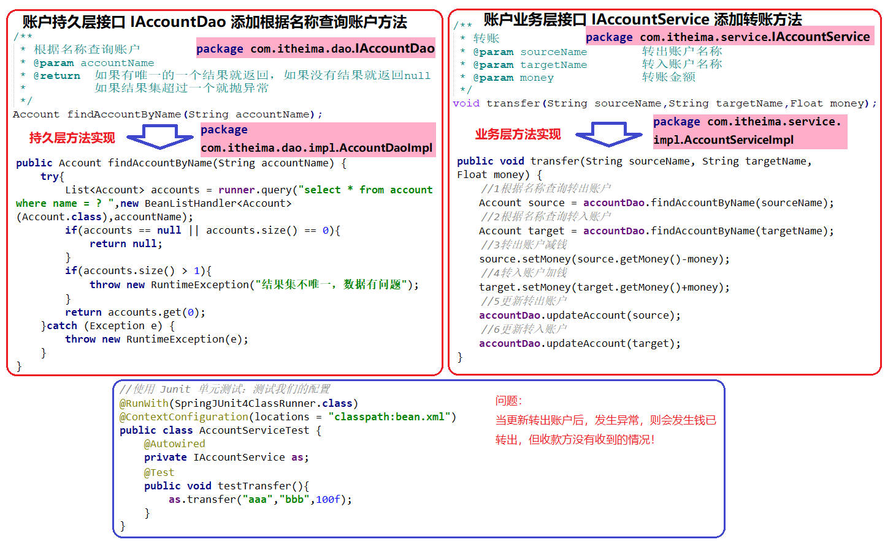
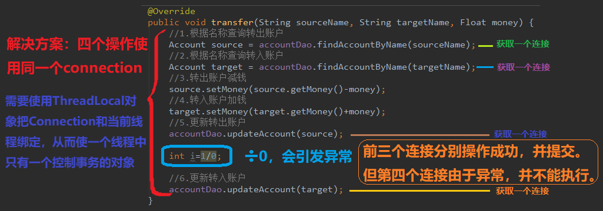

## 第四节 

### 3.1 完善 account 案例

#### 3.1.1 案例中添加转账方法

基于 xml 案例代码，见本章第二节。




#### 3.1.2 分析事务的问题



#### 3.1.3 编写连接的工具类 ConnectionUtils

之前的例子，事务控制是在持久层，而实际上事务控制应该在业务层！

在 src->main->java->com->itheima 下创建 `utils.ConnectionUtils` 类，该类是一个连接的工具类，它用于从数据源中获取一个连接，并且实现和线程的绑定。

```java

/**
 * 连接的工具类，它用于从数据源中获取一个连接，并且实现和线程的绑定
 */
public class ConnectionUtils {

    private ThreadLocal<Connection> tl = new ThreadLocal<Connection>();

    private DataSource dataSource;

    public void setDataSource(DataSource dataSource) {
        this.dataSource = dataSource;
    }

    /**
     * 获取当前线程上的连接
     * @return
     */
    public Connection getThreadConnection() {
        try{
            //1.先从ThreadLocal上获取
            Connection conn = tl.get();
            //2.判断当前线程上是否有连接
            if (conn == null) {
                //3.从数据源中获取一个连接，并且存入ThreadLocal中
                conn = dataSource.getConnection();
                tl.set(conn);
            }
            //4.返回当前线程上的连接
            return conn;
        }catch (Exception e){
            throw new RuntimeException(e);
        }
    }

    /**
     * 把连接和线程解绑
     */
    public void removeConnection(){
        tl.remove();
    }
}
```  

#### 3.1.4 编写事务管理工具类

在 src->main->java->com->itheima->utils 下创建 TransactionManager 类，是事务管理相关的工具类，它包含了：开启事务、提交事务、回滚事务和释放连接。

```java
package com.itheima.utils;

/**
 * 和事务管理相关的工具类，它包含了，开启事务，提交事务，回滚事务和释放连接
 */
public class TransactionManager {

    private ConnectionUtils connectionUtils;
    public void setConnectionUtils(ConnectionUtils connectionUtils) {
        this.connectionUtils = connectionUtils;
    }

    /**
     * 开启事务
     */
    public  void beginTransaction(){
        try {
            connectionUtils.getThreadConnection().setAutoCommit(false);
        }catch (Exception e){
            e.printStackTrace();
        }
    }

    /**
     * 提交事务
     */
    public  void commit(){
        try {
            connectionUtils.getThreadConnection().commit();
        }catch (Exception e){
            e.printStackTrace();
        }
    }

    /**
     * 回滚事务
     */
    public  void rollback(){
        try {
            connectionUtils.getThreadConnection().rollback();
        }catch (Exception e){
            e.printStackTrace();
        }
    }

    /**
     * 释放连接
     */
    public  void release(){
        try {
            connectionUtils.getThreadConnection().close();//还回连接池中
            connectionUtils.removeConnection();
        }catch (Exception e){
            e.printStackTrace();
        }
    }
}
```

 
#### 3.1.5 编写业务层和持久层事务控制代码并配置 Spring 的 ioc 

1 Dao 中在执行方法的同时，在 bean.xml 中给 QueryRunner 注入connection 后，就会从连接中取一个。不希望从连接中取，不再注入 connection。

即将下列代码

```xml
<!--配置QueryRunner-->
<bean id="runner" class="org.apache.commons.dbutils.QueryRunner" scope="prototype">
    <!--注入数据源-->
    <constructor-arg name="ds" ref="dataSource"></constructor-arg>
</bean>
```

修改为
      
```xml
<!--配置QueryRunner-->
<bean id="runner" class="org.apache.commons.dbutils.QueryRunner" scope="prototype"></bean>
```   
   
2 账户的业务层实现类  

```java
package com.itheima.service.impl;

import com.itheima.dao.IAccountDao;
import com.itheima.domain.Account;
import com.itheima.service.IAccountService;
import com.itheima.utils.TransactionManager;

import java.util.List;

/**
 * 账户的业务层实现类
 *
 * 事务控制应该都是在业务层
 */
public class AccountServiceImpl implements IAccountService{

    private IAccountDao accountDao;
    private TransactionManager txManager;

    public void setTxManager(TransactionManager txManager) {
        this.txManager = txManager;
    }

    public void setAccountDao(IAccountDao accountDao) {
        this.accountDao = accountDao;
    }

    public List<Account> findAllAccount() {
        try {
            //1.开启事务
            txManager.beginTransaction();
            //2.执行操作
            List<Account> accounts = accountDao.findAllAccount();
            //3.提交事务
            txManager.commit();
            //4.返回结果
            return accounts;
        }catch (Exception e){
            //5.回滚操作
            txManager.rollback();
            throw new RuntimeException(e);
        }finally {
            //6.释放连接
            txManager.release();
        }

    }

    public Account findAccountById(Integer accountId) {
        try {
            //1.开启事务
            txManager.beginTransaction();
            //2.执行操作
            Account account = accountDao.findAccountById(accountId);
            //3.提交事务
            txManager.commit();
            //4.返回结果
            return account;
        }catch (Exception e){
            //5.回滚操作
            txManager.rollback();
            throw new RuntimeException(e);
        }finally {
            //6.释放连接
            txManager.release();
        }
    }

    public void saveAccount(Account account) {
        try {
            //1.开启事务
            txManager.beginTransaction();
            //2.执行操作
            accountDao.saveAccount(account);
            //3.提交事务
            txManager.commit();
        }catch (Exception e){
            //4.回滚操作
            txManager.rollback();
        }finally {
            //5.释放连接
            txManager.release();
        }

    }

    public void updateAccount(Account account) {
        try {
            //1.开启事务
            txManager.beginTransaction();
            //2.执行操作
            accountDao.updateAccount(account);
            //3.提交事务
            txManager.commit();
        }catch (Exception e){
            //4.回滚操作
            txManager.rollback();
        }finally {
            //5.释放连接
            txManager.release();
        }

    }

    public void deleteAccount(Integer acccountId) {
        try {
            //1.开启事务
            txManager.beginTransaction();
            //2.执行操作
            accountDao.deleteAccount(acccountId);
            //3.提交事务
            txManager.commit();
        }catch (Exception e){
            //4.回滚操作
            txManager.rollback();
        }finally {
            //5.释放连接
            txManager.release();
        }

    }

    public void transfer(String sourceName, String targetName, Float money) {
        try {
            //1.开启事务
            txManager.beginTransaction();
            //2.执行操作

            //2.1根据名称查询转出账户
            Account source = accountDao.findAccountByName(sourceName);
            //2.2根据名称查询转入账户
            Account target = accountDao.findAccountByName(targetName);
            //2.3转出账户减钱
            source.setMoney(source.getMoney()-money);
            //2.4转入账户加钱
            target.setMoney(target.getMoney()+money);
            //2.5更新转出账户
            accountDao.updateAccount(source);

            //int i=1/0;

            //2.6更新转入账户
            accountDao.updateAccount(target);
            //3.提交事务
            txManager.commit();

        }catch (Exception e){
            //4.回滚操作
            txManager.rollback();
            e.printStackTrace();
        }finally {
            //5.释放连接
            txManager.release();
        }
    }
}
```

3 账户的持久层实现类

```java
package com.itheima.dao.impl;

import com.itheima.dao.IAccountDao;
import com.itheima.domain.Account;
import org.apache.commons.dbutils.QueryRunner;
import org.apache.commons.dbutils.handlers.BeanHandler;
import org.apache.commons.dbutils.handlers.BeanListHandler;

import com.itheima.utils.ConnectionUtils;

import java.util.List;

public class AccountDaoImpl implements IAccountDao {

    private QueryRunner runner;
    private ConnectionUtils connectionUtils;

    public void setRunner(QueryRunner runner) {
        this.runner = runner;
    }
    public void setConnectionUtils(ConnectionUtils connectionUtils) {
        this.connectionUtils = connectionUtils;
    }

    public List<Account> findAllAccount() {
        try{
            return runner.query(connectionUtils.getThreadConnection(),"select * from account",new BeanListHandler<Account>(Account.class));
        }catch (Exception e) {
            throw new RuntimeException(e);
        }
    }

    public Account findAccountById(Integer accountId) {
        try{
            return runner.query(connectionUtils.getThreadConnection(),"select * from account where id = ? ",new BeanHandler<Account>(Account.class),accountId);
        }catch (Exception e) {
            throw new RuntimeException(e);
        }
    }

    public void saveAccount(Account account) {
        try{
            runner.update(connectionUtils.getThreadConnection(),"insert into account(name,money) values(?,?)",account.getName(),account.getMoney());
        }catch (Exception e) {
            throw new RuntimeException(e);
        }
    }

    public void updateAccount(Account account) {
        try{
            runner.update(connectionUtils.getThreadConnection(),"update account set name=?,money=? where id=?",account.getName(),account.getMoney(),account.getId());
        }catch (Exception e) {
            throw new RuntimeException(e);
        }
    }

    public void deleteAccount(Integer accountId) {
        try{
            runner.update(connectionUtils.getThreadConnection(),"delete from account where id=?",accountId);
        }catch (Exception e) {
            throw new RuntimeException(e);
        }
    }

    public Account findAccountByName(String accountName) {
        try{
            List<Account> accounts = runner.query(connectionUtils.getThreadConnection(),"select * from account where name = ? ",new BeanListHandler<Account>(Account.class),accountName);
            if(accounts == null || accounts.size() == 0){
                return null;
            }
            if(accounts.size() > 1){
                throw new RuntimeException("结果集不唯一，数据有问题");
            }
            return accounts.get(0);
        }catch (Exception e) {
            throw new RuntimeException(e);
        }
    }
}
```

4 为新建的依赖注入，在 bean.xml 中添加：

```xml
<?xml version="1.0" encoding="UTF-8"?>
<beans xmlns="http://www.springframework.org/schema/beans"
       xmlns:xsi="http://www.w3.org/2001/XMLSchema-instance"
       xsi:schemaLocation="http://www.springframework.org/schema/beans
        http://www.springframework.org/schema/beans/spring-beans.xsd">
    <!-- 配置Service -->
    <bean id="accountService" class="com.itheima.service.impl.AccountServiceImpl">
        <!-- 注入dao -->
        <property name="accountDao" ref="accountDao"></property>
        <!-- 注入事务管理器 -->
        <property name="txManager" ref="txManager"></property>
    </bean>

    <!--配置Dao对象-->
    <bean id="accountDao" class="com.itheima.dao.impl.AccountDaoImpl">
        <!-- 注入QueryRunner -->
        <property name="runner" ref="runner"></property>
        <!-- 注入ConnectionUtils -->
        <property name="connectionUtils" ref="connectionUtils"></property>
    </bean>

    <!--配置QueryRunner-->
    <bean id="runner" class="org.apache.commons.dbutils.QueryRunner" scope="prototype"></bean>

    <!-- 配置数据源 -->
    <bean id="dataSource" class="com.mchange.v2.c3p0.ComboPooledDataSource">
        <!--连接数据库的必备信息-->
        <property name="driverClass" value="com.mysql.jdbc.Driver"></property>
        <property name="jdbcUrl" value="jdbc:mysql://localhost:3306/eesy"></property>
        <property name="user" value="root"></property>
        <property name="password" value="mysql"></property>
    </bean>

    <!-- 配置Connection的工具类 ConnectionUtils -->
    <bean id="connectionUtils" class="com.itheima.utils.ConnectionUtils">
        <!-- 注入数据源-->
        <property name="dataSource" ref="dataSource"></property>
    </bean>

    <!-- 配置事务管理器-->
    <bean id="txManager" class="com.itheima.utils.TransactionManager">
        <!-- 注入ConnectionUtils -->
        <property name="connectionUtils" ref="connectionUtils"></property>
    </bean>

</beans>
``` 
 
#### 3.1.6 测试转账  

```java
//使用 Junit 单元测试：测试我们的配置
@RunWith(SpringJUnit4ClassRunner.class)
@ContextConfiguration(locations = "classpath:bean.xml")
public class AccountServiceTest {
    @Autowired
    private IAccountService as;

    @Test
    public void testTransfer(){
        as.transfer("aaa","bbb",100f);
    }
}
```

#### 3.1.7 分析案例中的问题  

程序耦合，如当修改 TransactionManager 类中的 beginTransaction 方法名字时，业务层实现类 AccountServiceImpl 多处调用 beginTransaction 处都需要修改。当项目很大，有几十条语句时，修改非常麻烦。 

### 3.2 动态代理


