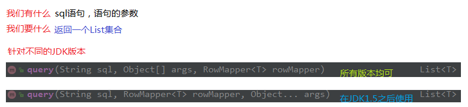
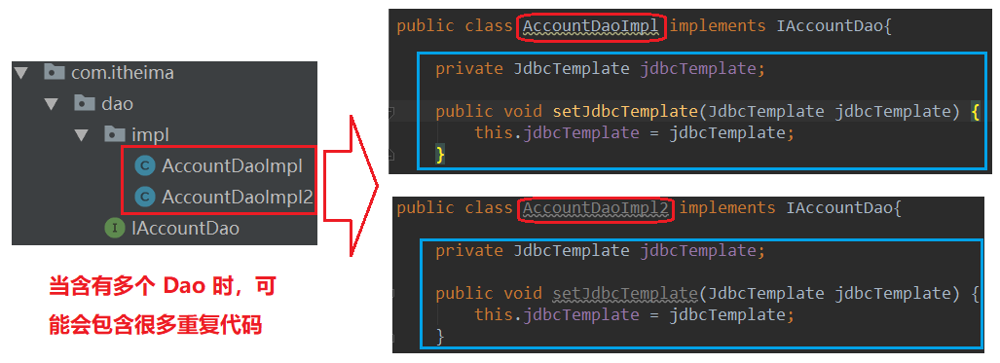

## 第六节 Spring 中的 JdbcTemplate

### 6.1 JdbcTemplate 概述 

它是 Spring 框架中提供的一个对象，是对原始 Jdbc API 对象的简单封装。 

Spring 框架提供了很多的操作模板类：
* 操作关系型数据的：`JdbcTemplate`与`HibernateTemplate`
* 操作 nosql 数据库的：`RedisTemplate`
* 操作消息队列的：`JmsTemplate`

相关 jar 包：
* `spring-jdbc-5.0.2.RELEASE.jar` 
*  `spring-tx-5.0.2.RELEASE.jar`（它是和事务相关的）。 

### 6.2 JdbcTemplate 对象的创建

参考它的源码，来一探究竟：

```java
public JdbcTemplate() {
}
public JdbcTemplate(DataSource dataSource) {
	setDataSource(dataSource);
	afterPropertiesSet();
}
public JdbcTemplate(DataSource dataSource, boolean lazyInit) {
	setDataSource(dataSource);
	setLazyInit(lazyInit);
	afterPropertiesSet();
}
```

除了默认构造函数之外，都需要提供一个数据源。既然有 set 方法，依据之前学过的依赖注入，可以在配置文件中配置这些对象。

### 6.3 Spring 中配置数据源

#### 6.3.1 环境搭建（导入对应坐标）

```xml
<packaging>jar</packaging>

<dependencies>
    <dependency>
        <groupId>org.springframework</groupId>
        <artifactId>spring-context</artifactId>
        <version>5.0.2.RELEASE</version>
    </dependency>

    <dependency>
        <groupId>org.springframework</groupId>
        <artifactId>spring-jdbc</artifactId>
        <version>5.0.2.RELEASE</version>
    </dependency>

    <dependency>
        <groupId>org.springframework</groupId>
        <artifactId>spring-tx</artifactId>
        <version>5.0.2.RELEASE</version>
    </dependency>

    <dependency>
        <groupId>mysql</groupId>
        <artifactId>mysql-connector-java</artifactId>
        <version>5.1.6</version>
    </dependency>
</dependencies>
```

#### 6.3.2 创建数据表及实体类

1 在数据库中创建表：


```sql
创建数据库：
create database eesy;
use eesy;
创建表：
create table account(
id int primary key auto_increment,
name varchar(40),
money float
)character set utf8 collate utf8_general_ci;
```

2 在 src->main->java 下创建 `com.itheima.domain.Account`

```java
package com.itheima.domain;

import java.io.Serializable;
/**
 * 账户的实体类
 */
public class Account implements Serializable {

    private Integer id;
    private String name;
    private Float money;

    public Integer getId() {
        return id;
    }

    public void setId(Integer id) {
        this.id = id;
    }

    public String getName() {
        return name;
    }

    public void setName(String name) {
        this.name = name;
    }

    public Float getMoney() {
        return money;
    }

    public void setMoney(Float money) {
        this.money = money;
    }

    @Override
    public String toString() {
        return "Account{" +
                "id=" + id +
                ", name='" + name + '\'' +
                ", money=" + money +
                '}';
    }
}
```

#### 6.3.3 JdbcTemplate 的最基本用法

在 src->main->java 下创建 `com.itheima.jdbctemplate` 包，并创建 `JdbcTemplateDemo1` 类：

```java
package com.itheima.jdbctemplate;

import org.springframework.jdbc.core.JdbcTemplate;
import org.springframework.jdbc.datasource.DriverManagerDataSource;

/**
 * JdbcTemplate的最基本用法
 */
public class JdbcTemplateDemo1 {

    public static void main(String[] args) {
        //准备数据源：spring的内置数据源
        DriverManagerDataSource ds = new DriverManagerDataSource();
        ds.setDriverClassName("com.mysql.jdbc.Driver");
        ds.setUrl("jdbc:mysql://localhost:3306/eesy");
        ds.setUsername("root");
        ds.setPassword("mysql");

        //1.创建JdbcTemplate对象
        JdbcTemplate jt = new JdbcTemplate();
        //给jt设置数据源
        jt.setDataSource(ds);
        //2.执行操作
        jt.execute("insert into account(name,money)values('ccc',1000)");
    }
}
```

缺点：配置信息在代码中写死了。

#### 6.3.4 JdbcTemplate 在 Spring 的 ioc 中使用

1 在src->main->resources 下创建 `bean.xml` 文件

```xml
<?xml version="1.0" encoding="UTF-8"?>
<beans xmlns="http://www.springframework.org/schema/beans"
       xmlns:xsi="http://www.w3.org/2001/XMLSchema-instance"
       xsi:schemaLocation="http://www.springframework.org/schema/beans
        http://www.springframework.org/schema/beans/spring-beans.xsd">

    <!--配置JdbcTemplate-->
    <bean id="jdbcTemplate" class="org.springframework.jdbc.core.JdbcTemplate">
        <property name="dataSource" ref="dataSource"></property>
    </bean>

    <!-- 配置数据源-->
    <bean id="dataSource" class="org.springframework.jdbc.datasource.DriverManagerDataSource">
        <property name="driverClassName" value="com.mysql.jdbc.Driver"></property>
        <property name="url" value="jdbc:mysql://localhost:3306/eesy"></property>
        <property name="username" value="root"></property>
        <property name="password" value="mysql"></property>
    </bean>
    
</beans>
```

2 在 src->main->java->com->itheima->jdbctemplate 下创建类 `JdbcTemplateDemo2`

```java
package com.itheima.jdbctemplate;

import org.springframework.context.ApplicationContext;
import org.springframework.context.support.ClassPathXmlApplicationContext;
import org.springframework.jdbc.core.JdbcTemplate;

/**
 * JdbcTemplate的最基本用法
 */
public class JdbcTemplateDemo2 {

    public static void main(String[] args) {
        //1.获取容器
        ApplicationContext ac = new ClassPathXmlApplicationContext("bean.xml");
        //2.获取对象
        JdbcTemplate jt = ac.getBean("jdbcTemplate",JdbcTemplate.class);
        //3.执行操作
        jt.execute("insert into account(name,money)values('ddd',2222)");
    }
}
```

### 6.4 JdbcTemplate 的 CRUD 操作

在 src->main->java->com->itheima->jdbctemplate 下创建类 `JdbcTemplateDemo3`

1 保存操作

```java
package com.itheima.jdbctemplate;

import com.itheima.domain.Account;
import org.springframework.context.ApplicationContext;
import org.springframework.context.support.ClassPathXmlApplicationContext;
import org.springframework.jdbc.core.JdbcTemplate;
import org.springframework.jdbc.core.RowMapper;

import java.sql.ResultSet;
import java.sql.SQLException;

/**
 * JdbcTemplate的CRUD操作
 */
public class JdbcTemplateDemo3 {

    public static void main(String[] args) {
        //1.获取容器
        ApplicationContext ac = new ClassPathXmlApplicationContext("bean.xml");
        //2.获取对象
        JdbcTemplate jt = ac.getBean("jdbcTemplate",JdbcTemplate.class);
        //3.执行操作
        //保存
        jt.update("insert into account(name,money)values(?,?)","eee",3333f);
    }
}
```

2 更新操作

```java
jt.update("update account set name=?,money=? where id=?","test",4567,6);
```

3 删除操作

```java
jt.update("delete from account where id=?",6);
```

4 查询所有


```java
List<Account> accounts = jt.query("select * from account where money > ?",new BeanPropertyRowMapper<Account>(Account.class),1000f);
```

5 查询一个（利用查询所有实现）

```java
List<Account> accounts = jt.query("select * from account where id = ?",new BeanPropertyRowMapper<Account>(Account.class),1);
System.out.println(accounts.isEmpty()?"没有内容":accounts.get(0));
```

6 查询返回一行一列（使用聚合函数，但不加 group by 子句）

```java
Long count = jt.queryForObject("select count(*) from account where money > ?",Long.class,1000f);
System.out.println(count);
```

### 6.5 JdbcTemplate 在 Dao 中的使用

实际开发不会使用 6.4节 方式，是基于 Dao 开发

1 在 src->main->java->com->itheima 创建 `dao.IAccountDao` 接口

```java
package com.itheima.dao;

import com.itheima.domain.Account;

/**
 * 账户的持久层接口
 */
public interface IAccountDao {

    /**
     * 根据Id查询账户
     * @param accountId
     * @return
     */
    Account findAccountById(Integer accountId);

    /**
     * 根据名称查询账户
     * @param accountName
     * @return
     */
    Account findAccountByName(String accountName);

    /**
     * 更新账户
     * @param account
     */
    void updateAccount(Account account);
}
```

2  在 src->main->java->com->itheima->dao 下创建 `impl.AccountDaoImpl`

```java
package com.itheima.dao.impl;


import com.itheima.dao.IAccountDao;
import com.itheima.domain.Account;
import org.springframework.jdbc.core.BeanPropertyRowMapper;
import org.springframework.jdbc.core.JdbcTemplate;

import java.util.List;

public class AccountDaoImpl implements IAccountDao{

    private JdbcTemplate jdbcTemplate;

    public void setJdbcTemplate(JdbcTemplate jdbcTemplate) {
        this.jdbcTemplate = jdbcTemplate;
    }

    public Account findAccountById(Integer accountId) {
        List<Account> accounts= jdbcTemplate.query("select * from account where id = ?",new BeanPropertyRowMapper<Account>(Account.class),accountId);
        return accounts.isEmpty()? null: accounts.get(0);
    }

    public Account findAccountByName(String accountName) {
        List<Account> accounts = jdbcTemplate.query("select * from account where name = ?",new BeanPropertyRowMapper<Account>(Account.class),accountName);
        if(accounts.isEmpty()){
            return null;
        }
        if(accounts.size()>1){
            throw new RuntimeException("结果集不唯一");
        }
        return accounts.get(0);
    }

    public void updateAccount(Account account) {
        jdbcTemplate.update("update account set name=?,money=? where id=?",account.getName(),account.getMoney(),account.getId());
    }
}
```

3 在 `bean.xml` 中配置

```xml
<?xml version="1.0" encoding="UTF-8"?>
<beans xmlns="http://www.springframework.org/schema/beans"
       xmlns:xsi="http://www.w3.org/2001/XMLSchema-instance"
       xsi:schemaLocation="http://www.springframework.org/schema/beans
        http://www.springframework.org/schema/beans/spring-beans.xsd">

    <!-- 配置账户的持久层-->
    <bean id="accountDao" class="com.itheima.dao.impl.AccountDaoImpl">
        <property name="jdbcTemplate" ref="jdbcTemplate"></property>
    </bean>

    <!--配置JdbcTemplate-->
    <bean id="jdbcTemplate" class="org.springframework.jdbc.core.JdbcTemplate">
        <property name="dataSource" ref="dataSource"></property>
    </bean>

    <!-- 配置数据源-->
    <bean id="dataSource" class="org.springframework.jdbc.datasource.DriverManagerDataSource">
        <property name="driverClassName" value="com.mysql.jdbc.Driver"></property>
        <property name="url" value="jdbc:mysql://localhost:3306/eesy"></property>
        <property name="username" value="root"></property>
        <property name="password" value="mysql"></property>
    </bean>

</beans>
```

4 测试并使用

```java
package com.itheima.jdbctemplate;

import com.itheima.dao.IAccountDao;
import com.itheima.domain.Account;
import org.springframework.context.ApplicationContext;
import org.springframework.context.support.ClassPathXmlApplicationContext;
import org.springframework.jdbc.core.JdbcTemplate;

/**
 * JdbcTemplate的 Dao 使用
 */
public class JdbcTemplateDemo4 {

    public static void main(String[] args) {
        //1.获取容器
        ApplicationContext ac = new ClassPathXmlApplicationContext("bean.xml");
        //2.获取对象
        IAccountDao accountDao = ac.getBean("accountDao",IAccountDao.class);
        //3.执行操作
        Account account = accountDao.findAccountById(1);
        System.out.println(account);

        account.setMoney(30000f);
        accountDao.updateAccount(account);
    }
}
```

### 6.6 JdbcDaoSupport 的使用

问题描述：



解决：


JdbcDaoSupport的使用以及Dao的两种编写方式