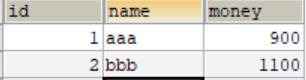

## 第六节 Spring 中的 JdbcTemplate

### 6.1 JdbcTemplate 概述 

它是 Spring 框架中提供的一个对象，是对原始 Jdbc API 对象的简单封装。 

Spring 框架提供了很多的操作模板类：
* 操作关系型数据的：`JdbcTemplate`与`HibernateTemplate`
* 操作 nosql 数据库的：`RedisTemplate`
* 操作消息队列的：`JmsTemplate`

相关 jar 包：
* `spring-jdbc-5.0.2.RELEASE.jar` 
*  `spring-tx-5.0.2.RELEASE.jar`（它是和事务相关的）。 

### 6.2 JdbcTemplate 对象的创建

参考它的源码，来一探究竟：

```java
public JdbcTemplate() {
}
public JdbcTemplate(DataSource dataSource) {
	setDataSource(dataSource);
	afterPropertiesSet();
}
public JdbcTemplate(DataSource dataSource, boolean lazyInit) {
	setDataSource(dataSource);
	setLazyInit(lazyInit);
	afterPropertiesSet();
}
```

除了默认构造函数之外，都需要提供一个数据源。既然有 set 方法，依据之前学过的依赖注入，可以在配置文件中配置这些对象。

### 6.3 Spring 中配置数据源

#### 6.3.1 环境搭建（导入对应坐标）

```xml
<packaging>jar</packaging>

<dependencies>
    <dependency>
        <groupId>org.springframework</groupId>
        <artifactId>spring-context</artifactId>
        <version>5.0.2.RELEASE</version>
    </dependency>

    <dependency>
        <groupId>org.springframework</groupId>
        <artifactId>spring-jdbc</artifactId>
        <version>5.0.2.RELEASE</version>
    </dependency>

    <dependency>
        <groupId>org.springframework</groupId>
        <artifactId>spring-tx</artifactId>
        <version>5.0.2.RELEASE</version>
    </dependency>

    <dependency>
        <groupId>mysql</groupId>
        <artifactId>mysql-connector-java</artifactId>
        <version>5.1.6</version>
    </dependency>
</dependencies>
```

#### 6.3.2 

在数据库中创建表：




