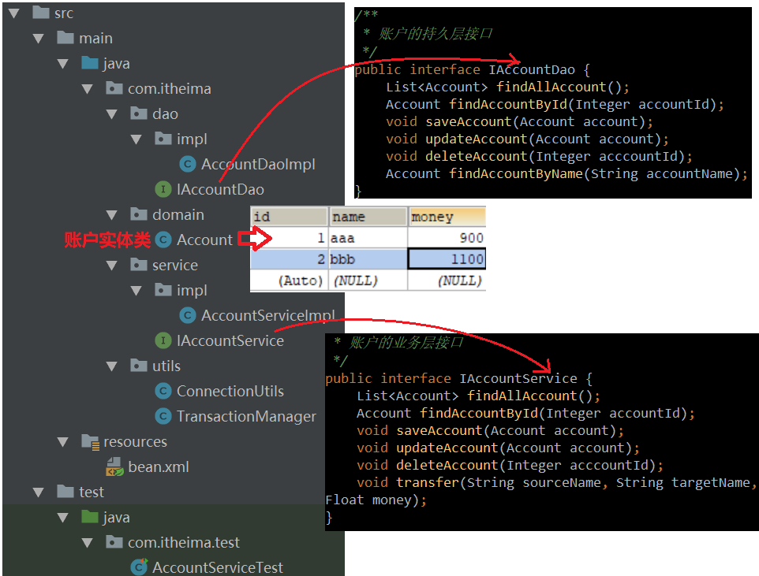

## 第七节 基于 XML 的 AOP 实现事务控制

### 7.1 工程代码

1 添加坐标

```xml
<packaging>jar</packaging>

<dependencies>
    <dependency>
        <groupId>org.springframework</groupId>
        <artifactId>spring-context</artifactId>
        <version>5.0.2.RELEASE</version>
    </dependency>
    <dependency>
        <groupId>org.springframework</groupId>
        <artifactId>spring-test</artifactId>
        <version>5.0.2.RELEASE</version>
    </dependency>
    <dependency>
        <groupId>commons-dbutils</groupId>
        <artifactId>commons-dbutils</artifactId>
        <version>1.4</version>
    </dependency>

    <dependency>
        <groupId>mysql</groupId>
        <artifactId>mysql-connector-java</artifactId>
        <version>5.1.6</version>
    </dependency>

    <dependency>
        <groupId>c3p0</groupId>
        <artifactId>c3p0</artifactId>
        <version>0.9.1.2</version>
    </dependency>

    <dependency>
        <groupId>junit</groupId>
        <artifactId>junit</artifactId>
        <version>4.12</version>
    </dependency>
    <dependency>
        <groupId>org.aspectj</groupId>
        <artifactId>aspectjweaver</artifactId>
        <version>1.8.7</version>
    </dependency>
    <dependency>
        <groupId>org.springframework</groupId>
        <artifactId>spring-tx</artifactId>
        <version>5.0.2.RELEASE</version>
    </dependency>
</dependencies>
```

2 其他相关代码




