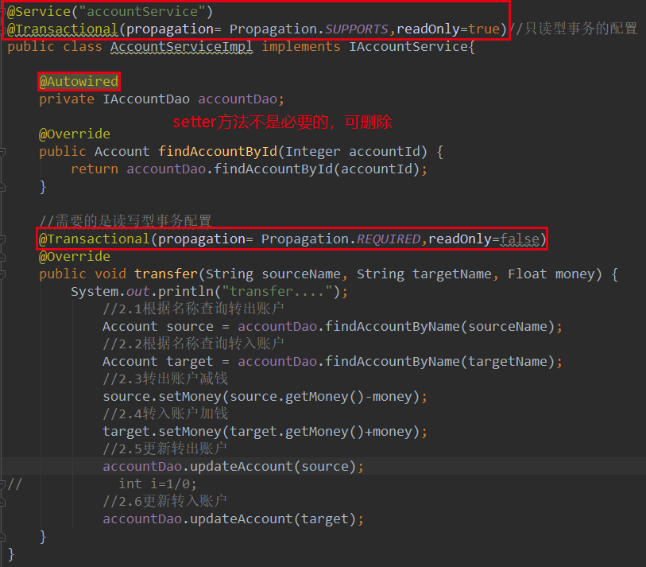
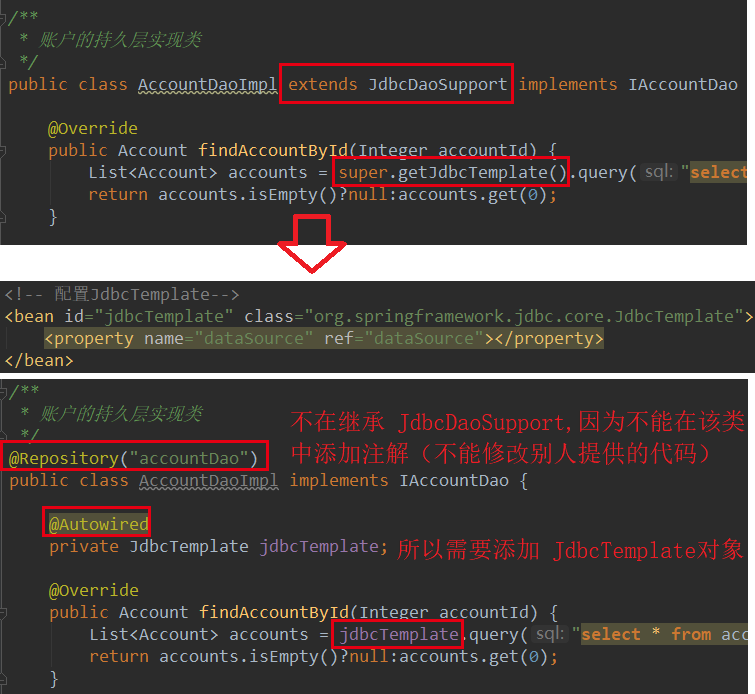

## 第八节 Spring 中的事务控制

Spring 事务控制要明确

* 第一：JavaEE 体系进行分层开发，**事务处理位于业务层**， Spring 提供了分层设计业务层的事务处理解决方案。
* 第二：Spring 框架提供了一组事务控制的接口。这组接口是在 `spring-tx-5.0.2.RELEASE.jar` 中。
* 第三：Spring 的事务控制都是基于 AOP 的，它既可以使用编程的方式实现，也可以使用配置的方式实现。 学习的**重点是使用配置**的方式实现。

### 8.1 Spring 中事务控制的 API 介绍

#### 8.1.1 PlatformTransactionManager

此接口是 Spring 的事务管理器，它里面提供了常用的操作事务的方法：

*  获取事务状态信息：`TransactionStatus getTransaction(TransactionDefinition definition)` 
* 提交事务：`void commit(TransactionStatus status)`	
* 回滚事务：`void rollback(TransactionStatus status)`

在开发中都是使用它的实现类 ，**真正管理事务的对象**：

* `org.springframework.jdbc.datasource.DataSourceTransactionManager` 使用 Spring JDBC 或 iBatis 进行持久化数据时使用。
* `org.springframework.orm.hibernate5.HibernateTransactionManager` 使用 Hibernate 版本进行持久化数据使用。

#### 8.1.2 TransactionDefinition

是事务的定义信息对象：

* 获取事务对象名称：`String getName()`
* 获取事务隔离级：`int getIsolationLevel()`
* 获取事务传播行为：`int getPropagationBehavior()`
*  获取事务超时时间：`int getTimeout()`
* 获取事务是否只读：`boolean isReadOnly()`

读写型事务：增加、删除、修改开启事务。

只读型事务：执行查询时，也会开启事务。

##### 8.1.2.1 事务的隔离级别

事务的隔离级别反映事务提交并发访问时的处理态度：

* `ISOLATION_DEFAULT` 默认级别，归属下列某一种。
* `ISOLATION_READ_UNCOMMITTED` 可以读取未提交数据。
* `ISOLATION_READ_COMMITTED` 只能读取已经提交的数据，解决脏读问题（Oracle 默认级别）
* `ISOLATION_REPEATABLE_READ` 可重复读，是否读取其他事务提交修改后得数据，解决不可重复读问题（MySQL 默认级别）
* `ISOLATION_SERIALIZABLE` 是否读取其他事务提交添加后的数据，解决幻影读问题。

##### 8.1.2.2 事务的传播行为

* `REQUIRED`：如果当前没有事务，就新建一个事务，如果已经存在一个事务中，加入到这个事务中。一般的选择（默认值）。
* `SUPPORTS`：支持当前事务，如果当前没有事务，就以非事务方式执行（没有事务）。
* `MANDATORY`：使用当前的事务，如果当前没有事务，就抛出异常。
* `REQUERS_NEW`：新建事务，如果当前在事务中，把当前事务挂起。
* `NOT_SUPPORTED`：以非事务方式执行操作，如果当前存在事务，就把当前事务挂起。
* `NEVER`：以非事务方式运行，如果当前存在事务，抛出异常。
* `NESTED`：如果当前存在事务，则在嵌套事务内执行。如果当前没有事务，则执行 REQUIRED 类似的操作。

##### 8.1.2.3  超时时间

默认值是 -1，没有超时限制。如果有，以秒为单位进行设置。

##### 8.1.2.4 是否是只读事务

建议查询时设置为只读。

#### 8.1.3 TransactionStatus

此接口提供的是事务具体的运行状态，描述某个时间点上事务对象的状态信息，方法如下：

* 刷新事务：`void flush()`
* 获取是否存在存储点：`boolean hasSavepoint()`
* 获取事务是否完成：`boolean isCompleted()`
* 获取事务是否为新的事务：`boolean isNewTransaction()`
* 获取事务是否回滚：`boolean isRollbackOnly()` 
* 设置事务回滚：`void setRollbackOnly()`

### 8.2 Spring 事务控制的代码准备

#### 8.2.1  导入坐标

```xml
<packaging>jar</packaging>

<dependencies>
    <dependency>
        <groupId>org.springframework</groupId>
        <artifactId>spring-context</artifactId>
        <version>5.0.2.RELEASE</version>
    </dependency>

    <dependency>
        <groupId>org.springframework</groupId>
        <artifactId>spring-jdbc</artifactId>
        <version>5.0.2.RELEASE</version>
    </dependency>

    <dependency>
        <groupId>org.springframework</groupId>
        <artifactId>spring-tx</artifactId>
        <version>5.0.2.RELEASE</version>
    </dependency>

    <!--Spring 整合 Junit-->
    <dependency>
        <groupId>org.springframework</groupId>
        <artifactId>spring-test</artifactId>
        <version>5.0.2.RELEASE</version>
    </dependency>

    <dependency>
        <groupId>mysql</groupId>
        <artifactId>mysql-connector-java</artifactId>
        <version>5.1.6</version>
    </dependency>

    <!--使用 AOP-->
    <dependency>
        <groupId>org.aspectj</groupId>
        <artifactId>aspectjweaver</artifactId>
        <version>1.8.7</version>
    </dependency>

    <dependency>
        <groupId>junit</groupId>
        <artifactId>junit</artifactId>
        <version>4.12</version>
    </dependency>
</dependencies>
```

#### 8.2.2 

```java
//1. 账户的实体类
package com.itheima.domain;
import java.io.Serializable;

public class Account implements Serializable {
    private Integer id;
    private String name;
    private Float money;
    ... getter and setter 方法 ...
}

//2. 账户的持久层接口
package com.itheima.dao;
import com.itheima.domain.Account;

public interface IAccountDao {
    Account findAccountById(Integer accountId);
    Account findAccountByName(String accountName);
    void updateAccount(Account account);
}

//3. 账户的持久层实现类
package com.itheima.dao.impl;
import com.itheima.dao.IAccountDao;
import com.itheima.domain.Account;
import org.springframework.jdbc.core.BeanPropertyRowMapper;
import org.springframework.jdbc.core.support.JdbcDaoSupport;
import java.util.List;

public class AccountDaoImpl extends JdbcDaoSupport implements IAccountDao {
    @Override
    public Account findAccountById(Integer accountId) {
        List<Account> accounts = super.getJdbcTemplate().query("select * from account where id = ?",new BeanPropertyRowMapper<Account>(Account.class),accountId);
        return accounts.isEmpty()?null:accounts.get(0);
    }
    
    @Override
    public Account findAccountByName(String accountName) {
        List<Account> accounts = super.getJdbcTemplate().query("select * from account where name = ?",new BeanPropertyRowMapper<Account>(Account.class),accountName);
        if(accounts.isEmpty()){
            return null;
        }
        if(accounts.size()>1){
            throw new RuntimeException("结果集不唯一");
        }
        return accounts.get(0);
    }

    @Override
    public void updateAccount(Account account) {
        super.getJdbcTemplate().update("update account set name=?,money=? where id=?",account.getName(),account.getMoney(),account.getId());
    }
}

// 4. 账户的业务层接口
package com.itheima.service;
import com.itheima.domain.Account;

public interface IAccountService {
    Account findAccountById(Integer accountId);
    void transfer(String sourceName,String targetName,Float money);
}

//5. 账户的业务层实现类
package com.itheima.service.impl;
import com.itheima.dao.IAccountDao;
import com.itheima.domain.Account;
import com.itheima.service.IAccountService;

public class AccountServiceImpl implements IAccountService{
    private IAccountDao accountDao;
    public void setAccountDao(IAccountDao accountDao) {
        this.accountDao = accountDao;
    }

    @Override
    public Account findAccountById(Integer accountId) {
        return accountDao.findAccountById(accountId);
    }

    @Override
    public void transfer(String sourceName, String targetName, Float money) {
        System.out.println("transfer....");
            //2.1根据名称查询转出账户
            Account source = accountDao.findAccountByName(sourceName);
            //2.2根据名称查询转入账户
            Account target = accountDao.findAccountByName(targetName);
            //2.3转出账户减钱
            source.setMoney(source.getMoney()-money);
            //2.4转入账户加钱
            target.setMoney(target.getMoney()+money);
            //2.5更新转出账户
            accountDao.updateAccount(source);

            int i=1/0;

            //2.6更新转入账户
            accountDao.updateAccount(target);
    }
}
```

#### 8.2.3 创建 Spring 的配置文件 bean.xml 并导入约束 

```xml
<?xml version="1.0" encoding="UTF-8"?>
<beans xmlns="http://www.springframework.org/schema/beans"
       xmlns:xsi="http://www.w3.org/2001/XMLSchema-instance"
       xsi:schemaLocation="http://www.springframework.org/schema/beans
        http://www.springframework.org/schema/beans/spring-beans.xsd">

    <!-- 配置业务层-->
    <bean id="accountService" class="com.itheima.service.impl.AccountServiceImpl">
        <property name="accountDao" ref="accountDao"></property>
    </bean>

    <!-- 配置账户的持久层-->
    <bean id="accountDao" class="com.itheima.dao.impl.AccountDaoImpl">
        <property name="dataSource" ref="dataSource"></property>
    </bean>

    <!-- 配置数据源-->
    <bean id="dataSource" class="org.springframework.jdbc.datasource.DriverManagerDataSource">
        <property name="driverClassName" value="com.mysql.jdbc.Driver"></property>
        <property name="url" value="jdbc:mysql://localhost:3306/eesy"></property>
        <property name="username" value="root"></property>
        <property name="password" value="mysql"></property>
    </bean>
</beans>
```

此时代码中并没有添加事务控制！！

#### 8.2.4 测试

```java
package com.itheima.test;

import com.itheima.service.IAccountService;
import org.junit.Test;
import org.junit.runner.RunWith;
import org.springframework.beans.factory.annotation.Autowired;
import org.springframework.test.context.ContextConfiguration;
import org.springframework.test.context.junit4.SpringJUnit4ClassRunner;

/**
 * 使用Junit单元测试：测试我们的配置
 */
@RunWith(SpringJUnit4ClassRunner.class)
@ContextConfiguration(locations = "classpath:bean.xml")
public class AccountServiceTest {

    @Autowired
    private IAccountService as;

    @Test
    public void testTransfer(){
        as.transfer("aaa","bbb",100f);
    }
}
```

发生 `java.lang.ArithmeticException: / by zero` 异常，付款方已付款，但收款方没有收到钱，钱消失了。


### 8.3 Spring 基于 XML 的声明式事务控制🍓

#### 8.3.1 Spring 中基于 XML 的声明式事务控制配置步骤
1、配置事务管理器。

2、配置事务的通知（tx:advice 标签）
* 此时需要导入事务的约束 tx 名称空间和约束，同时也需要 aop 的名称空间和约束。
* 属性：
  * `id`：给事务通知起一个唯一标识
  * `transaction-manager`：给事务通知提供一个事务管理器引用

3、配置 AOP 中的通用切入点表达式。

4、建立事务通知和切入点表达式的对应关系。

5、配置事务的属性：在事务的通知 tx:advice 标签的内部配置。

#### 8.3.2 配置事务的属性

* `isolation`：用于指定**事务的隔离级别**。默认值是 DEFAULT，表示使用数据库的默认隔离级别。
* `propagation`：用于指定事务的传播行为。默认值是 REQUIRED，表示一定会有事务，增删改的选择。查询方法可以选择 SUPPORTS。
* `read-only`：用于指定事务是否只读。只有查询方法才能设置为 true。默认值是 false，表示读写。
* `timeout`：用于指定事务的超时时间，默认值是-1，表示永不超时。如果指定了数值，以秒为单位。
* `rollback-for`：用于指定一个异常，**当产生该异常时，事务回滚**，产生其他异常时，事务**不回滚**。没有默认值。不设置表示任何异常都回滚。
* `no-rollback-for`：用于指定一个异常，**当产生该异常时，事务不回滚**，产生其他异常时事务**回滚**。没有默认值。不设置表示任何异常都回滚。

#### 8.3.3 配置


```xml
<?xml version="1.0" encoding="UTF-8"?>
<beans xmlns="http://www.springframework.org/schema/beans"
       xmlns:xsi="http://www.w3.org/2001/XMLSchema-instance"
       xmlns:aop="http://www.springframework.org/schema/aop"
       xmlns:tx="http://www.springframework.org/schema/tx"
       xsi:schemaLocation="
        http://www.springframework.org/schema/beans
        http://www.springframework.org/schema/beans/spring-beans.xsd
        http://www.springframework.org/schema/tx
        http://www.springframework.org/schema/tx/spring-tx.xsd
        http://www.springframework.org/schema/aop
        http://www.springframework.org/schema/aop/spring-aop.xsd">

    <!-- 配置业务层-->
    <bean id="accountService" class="com.itheima.service.impl.AccountServiceImpl">
        <property name="accountDao" ref="accountDao"></property>
    </bean>

    <!-- 配置账户的持久层-->
    <bean id="accountDao" class="com.itheima.dao.impl.AccountDaoImpl">
        <property name="dataSource" ref="dataSource"></property>
    </bean>

    <!-- 配置数据源-->
    <bean id="dataSource" class="org.springframework.jdbc.datasource.DriverManagerDataSource">
        <property name="driverClassName" value="com.mysql.jdbc.Driver"></property>
        <property name="url" value="jdbc:mysql://localhost:3306/eesy"></property>
        <property name="username" value="root"></property>
        <property name="password" value="mysql"></property>
    </bean>

    <!-- 配置事务管理器 -->
    <bean id="transactionManager" class="org.springframework.jdbc.datasource.DataSourceTransactionManager">
        <property name="dataSource" ref="dataSource"></property>
    </bean>

    <!-- 配置事务的通知-->
    <tx:advice id="txAdvice" transaction-manager="transactionManager">
        <!-- 配置事务的属性 -->
        <tx:attributes>
            <tx:method name="*" propagation="REQUIRED" read-only="false"/>
            <tx:method name="find*" propagation="SUPPORTS" read-only="true"></tx:method>
        </tx:attributes>
    </tx:advice>

    <!-- 配置aop-->
    <aop:config>
        <!-- 配置切入点表达式-->
        <aop:pointcut id="pt1" expression="execution(* com.itheima.service.impl.*.*(..))"></aop:pointcut>
        <!--建立切入点表达式和事务通知的对应关系 -->
        <aop:advisor advice-ref="txAdvice" pointcut-ref="pt1"></aop:advisor>
    </aop:config>
</beans>
```

### 8.4 Spring 基于注解的声明式事务控制 

基于上述代码修改

#### 8.4.1 配置 bean.xml

1、 在配置文件中添加 context 名称空间及对应约束

2、配置 Spring 创建容器时要扫描的包

3、配置 Spring 提供的 JdbcTemplate

4、开启 Spring 对注解事务的支持

```xml
<?xml version="1.0" encoding="UTF-8"?>
<beans xmlns="http://www.springframework.org/schema/beans"
       xmlns:xsi="http://www.w3.org/2001/XMLSchema-instance"
       xmlns:aop="http://www.springframework.org/schema/aop"
       xmlns:tx="http://www.springframework.org/schema/tx"
       xmlns:context="http://www.springframework.org/schema/context"
       xsi:schemaLocation="
        http://www.springframework.org/schema/beans
        http://www.springframework.org/schema/beans/spring-beans.xsd
        http://www.springframework.org/schema/tx
        http://www.springframework.org/schema/tx/spring-tx.xsd
        http://www.springframework.org/schema/aop
        http://www.springframework.org/schema/aop/spring-aop.xsd
        http://www.springframework.org/schema/context
        http://www.springframework.org/schema/context/spring-context.xsd">

    <!-- 配置spring创建容器时要扫描的包-->
    <context:component-scan base-package="com.itheima"></context:component-scan>

    <!-- 配置JdbcTemplate-->
    <bean id="jdbcTemplate" class="org.springframework.jdbc.core.JdbcTemplate">
        <property name="dataSource" ref="dataSource"></property>
    </bean>

    <!-- 配置数据源-->
    <bean id="dataSource" class="org.springframework.jdbc.datasource.DriverManagerDataSource">
        <property name="driverClassName" value="com.mysql.jdbc.Driver"></property>
        <property name="url" value="jdbc:mysql://localhost:3306/eesy"></property>
        <property name="username" value="root"></property>
        <property name="password" value="mysql"></property>
    </bean>

    <!-- spring中基于注解 的声明式事务控制配置步骤
        1、配置事务管理器
        2、开启spring对注解事务的支持
        3、在需要事务支持的地方使用@Transactional注解
     -->
    <!-- 配置事务管理器 -->
    <bean id="transactionManager" class="org.springframework.jdbc.datasource.DataSourceTransactionManager">
        <property name="dataSource" ref="dataSource"></property>
    </bean>
    
    <!-- 开启spring对注解事务的支持-->
    <tx:annotation-driven transaction-manager="transactionManager"></tx:annotation-driven>

</beans>
```

#### 8.4.2 账户的业务层实现类



**问题**：当业务层有多个查询操作、多个修改操作时，要为每个操作（方法）配置不同的 `@Transactional` 注解。因此，一般大工程中使用 XML 方法配置。

#### 8.4.3 账户的持久层实现类

```java
package com.itheima.dao.impl;

import com.itheima.dao.IAccountDao;
import com.itheima.domain.Account;
import org.springframework.beans.factory.annotation.Autowired;
import org.springframework.jdbc.core.BeanPropertyRowMapper;
import org.springframework.jdbc.core.JdbcTemplate;
import org.springframework.stereotype.Repository;

import java.util.List;

/**
 * 账户的持久层实现类
 */
@Repository("accountDao")
public class AccountDaoImpl implements IAccountDao {

    @Autowired
    private JdbcTemplate jdbcTemplate;

    @Override
    public Account findAccountById(Integer accountId) {
        List<Account> accounts = jdbcTemplate.query("select * from account where id = ?",new BeanPropertyRowMapper<Account>(Account.class),accountId);
        return accounts.isEmpty()?null:accounts.get(0);
    }

    @Override
    public Account findAccountByName(String accountName) {
        List<Account> accounts = jdbcTemplate.query("select * from account where name = ?",new BeanPropertyRowMapper<Account>(Account.class),accountName);
        if(accounts.isEmpty()){
            return null;
        }
        if(accounts.size()>1){
            throw new RuntimeException("结果集不唯一");
        }
        return accounts.get(0);
    }

    @Override
    public void updateAccount(Account account) {
        jdbcTemplate.update("update account set name=?,money=? where id=?",account.getName(),account.getMoney(),account.getId());
    }
}
```



### 8.5 Spring 基于纯注解的声明式事务控制

基于上述代码修改。

#### 8.5.1 


#### 8.5.2 


#### 8.5.3 


### 8.6 Spring 编程式事务控制


### 8.7 Spring5 新特性的介绍