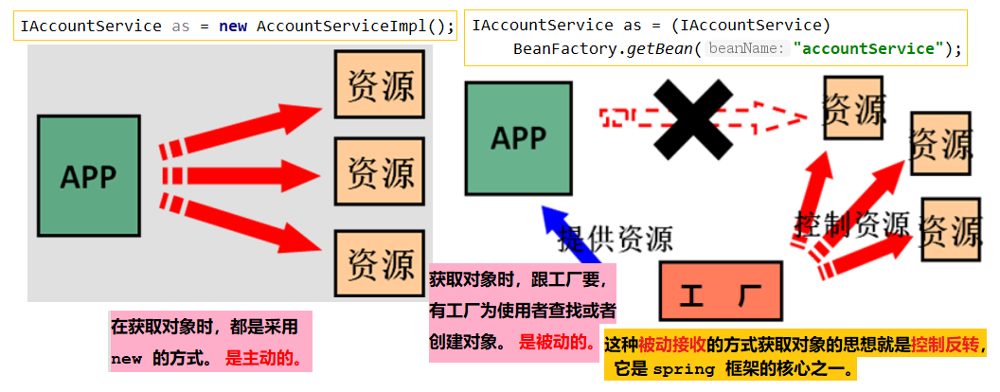

## 第二节 使用 spring 的 IOC 解决程序耦合

### 2.1 IoC 的概念和作用



**控制反转**（Inversion of Control，缩写为IoC），是面向对象编程中的一种设计原则，可以用来减低计算机代码之间的耦合度。其中最常见的方式叫做**依赖注入**（Dependency Injection，简称DI），还有一种方式叫**依赖查找**（Dependency Lookup）。通过控制反转，对象在被创建的时候，由一个调控系统内所有对象的外界实体将其所依赖的对象的引用传递给它。也可以说，依赖被注入到对象中。

### 2.2 使用 spring 的 IOC 解决程序耦合

1. 创建 Maven 工程，添加 Spring 坐标:
```xml
<packaging>jar</packaging>

<dependencies>
    <dependency>
        <groupId>org.springframework</groupId>
        <artifactId>spring-context</artifactId>
        <version>5.0.2.RELEASE</version>
    </dependency>
</dependencies>
```

2. 在 src->main->resources 下，创建文件 `bean.xml`，添加约束。

```xml
<?xml version="1.0" encoding="UTF-8"?>
<beans xmlns="http://www.springframework.org/schema/beans"
       xmlns:xsi="http://www.w3.org/2001/XMLSchema-instance"
       xsi:schemaLocation="http://www.springframework.org/schema/beans
        http://www.springframework.org/schema/beans/spring-beans.xsd">
</beans>
```


