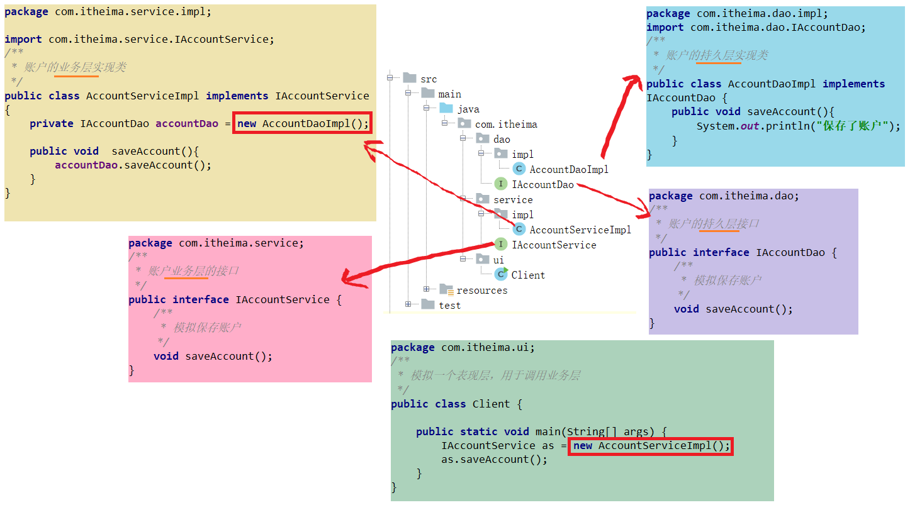

## 第一节 程序耦合

### 1.1 程序耦合

概念：在软件工程中，耦合指的就是就是对象之间的依赖性。对象之间的耦合越高，维护成本越高。因此对象的设计应使类和构件之间的耦合最小。软件设计中通常用**耦合度和内聚度**作为衡量模块独立程度的标准。**划分模块的一个准则就是高内聚低耦合。**


分类：

（1）**内容耦合**。当一个模块直接修改或操作另一个模块的数据时，或一个模块不通过正常入口而转入另一个模块时，这样的耦合被称为内容耦合。内容耦合是最高程度的耦合，应该避免使用之。

（2）**公共耦合**。两个或两个以上的模块共同引用一个全局数据项，这种耦合被称为公共耦合。在具有大量公共耦合的结构中，确定究竟是哪个模块给全局变量赋了一个特定的值是十分困难的。

（3）**外部耦合**。一组模块都访问同一全局简单变量而不是同一全局数据结构，而且不是通过参数表传递该全局变量的信息，则称之为外部耦合。

（4）**控制耦合**。一个模块通过接口向另一个模块传递一个控制信号，接受信号的模块根据信号值而进行适当的动作，这种耦合被称为控制耦合。

（5）**标记耦合**。若一个模块 A 通过接口向两个模块 B 和 C 传递一个公共参数，那么称模块 B 和 C 之间存在一个标记耦合。

（6）**数据耦合**。模块之间通过参数来传递数据，那么被称为数据耦合。数据耦合是最低的一种耦合形式，系统中一般都存在这种类型的耦合，因为为了完成一些有意义的功能，往往需要将某些模块的输出数据作为另一些模块的输入数据。

（7）**非直接耦合**。两个模块之间没有直接关系，它们之间的联系完全是通过主模块的控制和调用来实现的。


**总结**：耦合是影响软件复杂程度和设计质量的一个重要因素，在设计上应采用以下原则：**如果模块间必须存在耦合，就尽量使用数据耦合，少用控制耦合，限制公共耦合的范围，尽量避免使用内容耦合**。


**简单的说**：耦合，即程序间的依赖关系，包括**类之间的依赖**与**方法间的依赖**。解耦，即降低程序间的依赖关系。实际开发中，应该做到【编译期不依赖，运行时才依赖】。

**解耦的思路：**
* 第一步：使用反射来创建对象，而避免使用new关键字。
* 第二步：通过读取配置文件来获取要创建的对象全限定类名

#### JDBC 注册驱动解耦

【问题】 JDBC 操作，注册驱动时，为什么不使用 DriverManager 的 register 方法，而是采用 Class.forName 的方式。

```java
public class JdbcDemo1 {
    public static void main(String[] args) throws  Exception{
        //1.注册驱动
        //DriverManager.registerDriver(new com.mysql.jdbc.Driver());
        Class.forName("com.mysql.jdbc.Driver");

        //2.获取连接
        Connection conn = DriverManager.getConnection("jdbc:mysql://localhost:3306/eesy","root","mysql");
        //3.获取操作数据库的预处理对象
        PreparedStatement pstm = conn.prepareStatement("select * from account");
        //4.执行SQL，得到结果集
        ResultSet rs = pstm.executeQuery();
        //5.遍历结果集
        while(rs.next()){
            System.out.println(rs.getString("name"));
        }
        //6.释放资源
        rs.close();
        pstm.close();
        conn.close();
    }
}
```

1. 使用 `DriverManager.registerDriver` 注册驱动时，当对应的 mysql jar包不存在，会在编译器报错。应该尽量避免编译器报错。
2. 用 `Class.forName("com.mysql.jdbc.Driver")` 替换 `new com.mysql.jdbc.Driver()`，此时，`"com.mysql.jdbc.Driver"`只是一个字符串，当 jar 包不存在时，会抛出异常（编译可以通过）。
  * 好处：类中不再依赖具体的驱动类，此时就算删除 mysql 的驱动 jar 包，依然可以编译（运行就不要想了，没有驱动不可能运行成功的） 。
  * mysql 驱动的全限定类名字符串是在 java 类中写死的，一旦要改还是要修改源码。（解决：使用配置文件配置。）


### 1.2 工厂模式解耦


【问题如下】



当持久层具体实现类 `AccountDaoImpl.java` 不存在，由于 `new AccountDaoImpl()`，程序报错。表现层的 `new AccountServiceImpl()`也会由于 AccountServiceImpl 类不存在，而编译不通过。

【工厂模式 + 配置文件】

使用一个创建 Bean 对象的工厂，用于创建 service 和 dao 对象的。
 * Bean：在计算机英语中，有可重用组件的含义。
 * JavaBean：用 java 语言编写的可重用组件。javabean >  实体类

（1）需要一个配置文件来配置 service 和 dao。
* 配置的内容：唯一标识  = 全限定类名（key=value)
* 配置文件可以是 xml 也可以是 properties

（2）通过读取配置文件中配置的内容，反射创建对象


1. 在 src->main->resources 文件夹下创建配置文件 `bean.properties`：
```properties
accountService=com.itheima.service.impl.AccountServiceImpl
accountDao=com.itheima.dao.impl.AccountDaoImpl
```

2. 文件 `IAccountDao.java`、 `AccountDaoImpl.java`、 `IAccountService.java` 文件内容不变。

3. src->main->java->com->itheima->factory 下创建 `BeanFactory.java`：
```java
package com.itheima.factory;

import java.io.InputStream;
import java.util.Enumeration;
import java.util.HashMap;
import java.util.Map;
import java.util.Properties;

public class BeanFactory {
    //定义一个Properties对象
    private static Properties props;

    //定义一个Map,用于存放我们要创建的对象。我们把它称之为容器
    private static Map<String,Object> beans;

    //使用静态代码块为Properties对象赋值
    static {
        try {
            //实例化对象
            props = new Properties();
            //获取properties文件的流对象
            InputStream in = BeanFactory.class.getClassLoader().getResourceAsStream("bean.properties");
            props.load(in);
            //实例化容器
            beans = new HashMap<String,Object>();
            //取出配置文件中所有的Key
            Enumeration keys = props.keys();
            //遍历枚举
            while (keys.hasMoreElements()){
                //取出每个Key
                String key = keys.nextElement().toString();
                //根据key获取value
                String beanPath = props.getProperty(key);
                //反射创建对象
                Object value = Class.forName(beanPath).newInstance();
                //把key和value存入容器中
                beans.put(key,value);
            }
        }catch(Exception e){
            throw new ExceptionInInitializerError("初始化properties失败！");
        }
    }

    /**
     * 根据bean的名称获取对象
     */
    public static Object getBean(String beanName){
        return beans.get(beanName);
    }
```

单例模式，将 `Class.forName(beanPath).newInstance()` 放入静态代码块，只会执行一次。如果放入 `getBean` 函数中，则每次调用，都会产生新的对象。

4. 替换 new 语句
```java
public class AccountServiceImpl implements IAccountService {

    //private IAccountDao accountDao = new AccountDaoImpl();
    private IAccountDao accountDao = (IAccountDao)BeanFactory.getBean("accountDao");

    public void  saveAccount(){
        accountDao.saveAccount();
        System.out.println(i);
    }
}
```

```java
public class Client {

    public static void main(String[] args) {
        //IAccountService as = new AccountServiceImpl();
        //as.saveAccount();
        for(int i=0;i<1;i++) {
            IAccountService as = (IAccountService) BeanFactory.getBean("accountService");
            System.out.println("main "+as);
            as.saveAccount();
        }

    }
}
```

