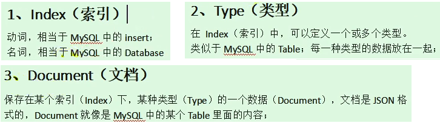

## 第二十三章 全文检索 ElasticSearch

### 什么是 Elasticsearch？

&emsp;&emsp;Elasticsearch 是一个分布式的开源搜索和分析引擎，适用于所有类型的数据，包括文本、数字、地理空间、结构化和非结构化数据。Elasticsearch 在 Apache Lucene 的基础上开发而成，由 Elasticsearch N.V.（即现在的 Elastic）于 2010 年首次发布。Elasticsearch 以其简单的 REST 风格 API、分布式特性、速度和可扩展性而闻名，是 Elastic Stack 的核心组件；Elastic Stack 是适用于数据采集、充实、存储、分析和可视化的一组开源工具。人们通常将 Elastic Stack 称为 ELK Stack（代指 Elasticsearch、Logstash 和 Kibana），目前 Elastic Stack 包括一系列丰富的轻量型数据采集代理，这些代理统称为 Beats，可用来向 Elasticsearch 发送数据。

### Elasticsearch 的用途？

Elasticsearch 在速度和可扩展性方面都表现出色，而且还能够索引多种类型的内容，这意味着其可用于多种用例：

* 应用程序搜索

* 网站搜索

* 企业搜索

* 日志处理和分析

* 基础设施指标和容器监测

* 应用程序性能监测

* 地理空间数据分析和可视化

* 安全分析

* 业务分析

### 相关概念

