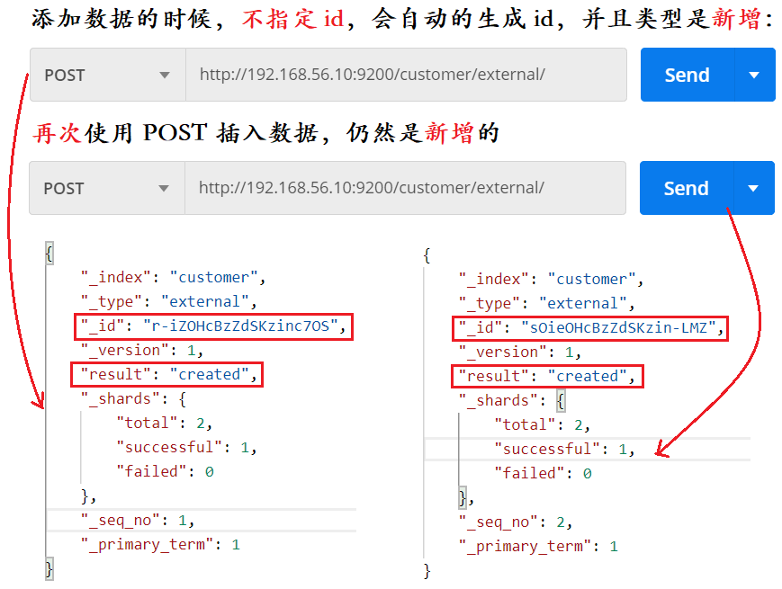

## 第二节 ElasticSearch 入门


### 2.1 `_cat`


1）`/_cat/nodes`：查看所有节点

```
GET
http://192.168.56.10:9200/_cat/nodes

结果
127.0.0.1 15 94 1 0.07 0.03 0.07 dilm * d248687cf2f9
```


2）`/_cat/health`：查看健康状态

```
GET  
http://192.168.56.10:9200/_cat/health

结果
1611560267 07:37:47 elasticsearch green 1 1 3 3 0 0 0 0 - 100.0%
```


3）`/_cat/master`：查看主节点信息

```
GET 
http://192.168.56.10:9200/_cat/master

结果
XDjdbKv-QZKoZDKKNCebqQ 127.0.0.1 127.0.0.1 d248687cf2f9
```


4）`/_cat/indices`：查看索引

```
GET 
http://192.168.56.10:9200/_cat/indices

结果
green open .kibana_task_manager_1   DPlST-F7Q0iwj-px4ryAUw 1 0 2 1 37.9kb 37.9kb
green open .apm-agent-configuration uHYGmwXzSA6qmfYFVkUBZw 1 0 0 0   283b   283b
green open .kibana_1                CSQjGYkfTP2GwuAgfk0-PA 1 0 7 0 31.2kb 31.2kb
```

### 2.2 put & post新增数据

索引一个文档（保存）：保存一个数据，保存在哪个索引的哪个类型下，指定用哪个唯一标识。

PUT 和 POST 都可以保存数据。

* POST 新增，如果不指定 id，会自动生成 id。指定 id 就会修改这个数据，并新增版本号；

* PUT 可以新增也可以修改。PUT **必须指定** id；由于 PUT 需要指定 id，一般用来做修改操作，不指定 id 会报错。


### 2.2.1 PUT

如 `PUT customer/external/1;` 在 customer 索引下的 external 类型下保存 1 号数据为

```json
PUT customer/external/1

请求参数
{
 "name":"John Doe"
}
```


### 2.2.2 POST





### 2.3 get 查询数据 & 乐观锁字段


#### 2.3.1 get 查询数据 

```
GET http://192.168.56.10:9200/customer/external/1
```

查询结果

```json
{
    "_index": "customer",//在哪个索引
    "_type": "external",//在哪个类型
    "_id": "1",//记录id
    "_version": 2,//版本号
    "_seq_no": 3,//并发控制字段，每次更新都会+1，用来做乐观锁
    "_primary_term": 1,//同上，主分片重新分配，如重启，就会变化
    "found": true,
    "_source": {
        "name": "John Doe"
    }
}
```


请求时，通过 `if_seq_no=1&if_primary_term=1`，当序列号匹配的时候，才进行修改，否则不修改。


#### 2.3.2 实例

将 id=1 的数据更新为 name=1，然后再次更新为 name=2，起始`_seq_no=3` 与 `_primary_term=1`。

1）发送 PUT 请求

```
http://192.168.56.10:9200/customer/external/1?if_seq_no=3&if_primary_term=1

请求参数：
{
    "name":1
}
```

返回结果

```json
{
    "_index": "customer",
    "_type": "external",
    "_id": "1",
    "_version": 3,
    "result": "updated",
    "_shards": {
        "total": 2,
        "successful": 1,
        "failed": 0
    },
    "_seq_no": 4,
    "_primary_term": 1
}
```

2）再次发送 PUT 请求

```
http://192.168.56.10:9200/customer/external/1?if_seq_no=3&if_primary_term=1

请求参数：
{
    "name":2
}
```

返回结果

```json
{
    "error": {
        "root_cause": [
            {
                "type": "version_conflict_engine_exception",
                "reason": "[1]: version conflict, required seqNo [3], primary term [1]. current document has seqNo [4] and primary term [1]",
                "index_uuid": "PEVLlW8xQA6ndlKnYZhoTA",
                "shard": "0",
                "index": "customer"
            }
        ],
        "type": "version_conflict_engine_exception",
        "reason": "[1]: version conflict, required seqNo [3], primary term [1]. current document has seqNo [4] and primary term [1]",
        "index_uuid": "PEVLlW8xQA6ndlKnYZhoTA",
        "shard": "0",
        "index": "customer"
    },
    "status": 409
}
```

3）`if_seq_no=4&if_primary_term=1` 才能查询到。


### 2.4 put & post 修改数据


#### 2.4.1 POST 更新文档，带有 `_update`


#### 2.4.2 POST 更新文档，不带 `_update`


#### 2.4.3 PUT 更新文档，不带 `_update`


同 POST 更新文档，不带 `_update` 一样。不检查原数据。

#### 2.4.4 增加属性

上述三种方式都可以，直接在提交参数中添加新增的属性即可。

```json
{
    "name":"John Doe",
    "age": 20
}
```    

### 2.5 删除数据 


```
DELETE http://192.168.56.10:9200/customer/external/1

DELETE http://192.168.56.10:9200/customer
```

> elasticsearch 并没有提供删除类型的操作，只提供了删除索引和文档的操作。

> 没有直接删除类型 `external` 的方法，即 `DELETE http://192.168.56.10:9200/customer/external` 是错误的。


### 2.6 bulk 批量操作

导入样本测试数据

语法格式：

```json
{action:{metadata}}
{request body  }

{action:{metadata}}
{request body  }
```

