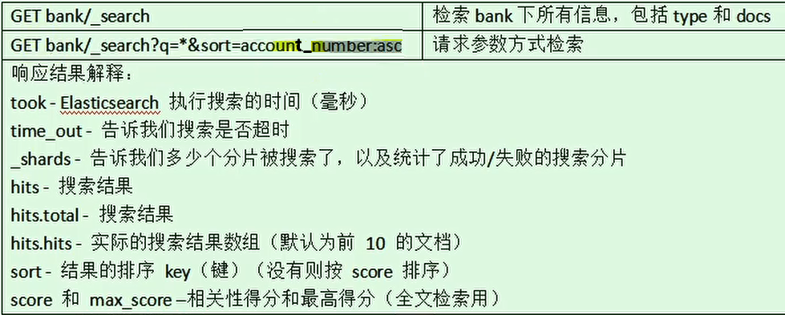

## 第三节 Search Api

### 3.1 参考文档 

&emsp;&emsp;进入 Elasticsearch 官网，点击【文档】，在[Elasticsearch: Store, Search, and Analyze]下点击[Elasticsearch Reference [7.10]]。[参考链接](https://www.elastic.co/guide/en/elasticsearch/reference/current/index.html)

[Start searching](https://www.elastic.co/guide/en/elasticsearch/reference/current/getting-started-search.html)

**ES 支持两种基本方式检索**：

* 通过 REST request uri 发送搜索参数（uri +检索参数）；
* 通过 REST request body 来发送它们（uri+请求体）；


### 3.2 一切检索从 `_search`





```
GET bank/_search?q=*&sort=account_number:asc
```

* 在 `bank` 索引下检索，`q=*` 表示查询所有，`sort=account_number:asc` 表示按照 `account_number` 字段升序排列。

默认返回 10 条数据，类似分页查询，只返回第一页。

#### 3.2.2 uri + 请求体进行检索

```json
GET bank/_search
{
  "query": {
    "match_all": {}
  },
  "sort": [
    {
      "account_number": "asc"
    },
    {
      "balance": "desc"
    }
  ]
}
```

使用 from 和 size 可以指定查询第 20-29 条数据。

```java
GET bank/_search
{
  "query": {
    "match_all": {}
  },
  "sort": [
    {
      "account_number": "asc"
    },
    {
      "balance": "desc"
    }
  ],
  "from": 20,
  "size": 10
}
```


