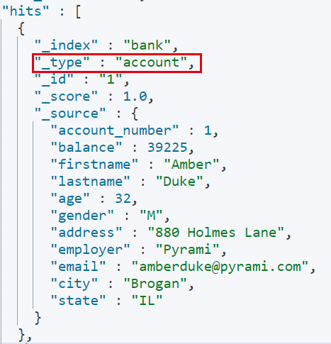

## 第五节 映射

[mapping](https://www.elastic.co/guide/en/elasticsearch/reference/current/mapping.html)

### 5.1 ElasticSearch7 去掉 type 概念

* 关系型数据库中两个数据表示是独立的，即使他们里面有相同名称的列也不影响使用，但 ES 中不是这样的。 Elasticsearch 是基于 Lucene 开发的搜索引擎，而 ES 中不同 type 下名称相同的 filed 最终在 Lucene 中的处理方式是一样的。

  1. 两个不同 type 下的两个 user_name，在 ES 同一个索引下其实被认为是同一个 filed，你必须在两个不同的 type 中定义相同的 filed 映射。否则，不同 type 中的相同字段名称就会在处理中出现冲突的情况，导致 Lucene 处理效率下降。

  2. 去掉 type 就是为了提高 ES 处理数据的效率。

* Elasticsearch 7.x

  * URL 中的 type 参数为可选。比如，索引一个文档不再要求提供文档类型。
  
* Elasticsearch 8.x

  * 不再支持 URL 中的 type 参数。
  
* 解决：将索引从多类型迁移到单类型，每种类型文档一个独立索引


### 5.2 映射

Mapping(映射)：Maping 是用来定义一个文档（document），以及它所包含的属性（field）是如何存储和索引的。

* 哪些字符串属性应该被看做全文本属性（full text fields）；

* 哪些属性包含数字，日期或地理位置；

* 文档中的所有属性是否都嫩被索引（all 配置）；

* 日期的格式；

* 自定义映射规则来执行动态添加属性；

#### 查看 mapping 信息 

```
GET bank/_mapping
```


### 5.3 创建映射

#### 5.3.1 创建索引并指定映射


```json
PUT /my_index
{
  "mappings": {
    "properties": {
      "age": {
        "type": "integer"
      },
      "email": {
        "type": "keyword"
      },
      "name": {
        "type": "text"
      }
    }
  }
}
```

* `keyword`，不会进行全文检索，精确匹配。

* `text`，全文检索。

返回结果:

```json
{
  "acknowledged" : true,
  "shards_acknowledged" : true,
  "index" : "my_index"
}
```

#### 5.3.2 添加新的字段映射

```json
PUT /my_index/_mapping
{
  "properties": {
    "employee-id": {
      "type": "keyword",
      "index": false
    }
  }
}
```

* `"index": false`，表明新增的字段不能被检索，只是一个冗余字段。

#### 5.3.3 更新映射


对于已经存在的字段映射，不能更新(可以添加新的，但不能直接修改旧的)。更新必须创建新的索引，进行数据迁移。


#### 5.3.4 数据迁移

##### 数据迁移格式

先创建 `new_twitter` 的正确映射。然后使用如下方式进行数据迁移：

```json
POST _reindex [固定写法]
{
  "source":{
      "index":"twitter"
   },
  "dest":{
      "index":"new_twitters"
   }
}
```

将旧索引的 type 下的数据进行迁移：

```json
POST _reindex [固定写法]
{
  "source":{
      "index":"twitter",
      "twitter":"twitter"
   },
  "dest":{
      "index":"new_twitters"
   }
}
```


##### 实列

###### 1) `GET /bank/_search`




###### 2) `GET /bank/_mapping`

```json
{
  "bank" : {
    "mappings" : {
      "properties" : {
        "account_number" : {
          "type" : "long"
        },
        "address" : {
          "type" : "text",
          "fields" : {
            "keyword" : {
              "type" : "keyword",
              "ignore_above" : 256
            }
          }
        },
        "age" : {
          "type" : "long"
        },
        "balance" : {
          "type" : "long"
        },
        "city" : {
          "type" : "text",
          "fields" : {
            "keyword" : {
              "type" : "keyword",
              "ignore_above" : 256
            }
          }
        },
        "email" : {
          "type" : "text",
          "fields" : {
            "keyword" : {
              "type" : "keyword",
              "ignore_above" : 256
            }
          }
        },
        "employer" : {
          "type" : "text",
          "fields" : {
            "keyword" : {
              "type" : "keyword",
              "ignore_above" : 256
            }
          }
        },
        "firstname" : {
          "type" : "text",
          "fields" : {
            "keyword" : {
              "type" : "keyword",
              "ignore_above" : 256
            }
          }
        },
        "gender" : {
          "type" : "text",
          "fields" : {
            "keyword" : {
              "type" : "keyword",
              "ignore_above" : 256
            }
          }
        },
        "lastname" : {
          "type" : "text",
          "fields" : {
            "keyword" : {
              "type" : "keyword",
              "ignore_above" : 256
            }
          }
        },
        "state" : {
          "type" : "text",
          "fields" : {
            "keyword" : {
              "type" : "keyword",
              "ignore_above" : 256
            }
          }
        }
      }
    }
  }
}
```


###### 3) `PUT /newbank` 创建映射

* `address` 全文检索，不需要 `keyword`。

* `age` 由 `long` 修改为 `integer`。

* `city` 由 `text` 修改为 `keyword`。

* `email` 由 `text` 修改为 `keyword`。

* `employer` 由 `text` 修改为 `keyword`。

* `firstname` 用来做全文检索，删掉 `keyword`。

* `gender` 由 `text` 修改为 `keyword`。

* `state` 由 `text` 修改为 `keyword`。

```json
PUT /newbank
{
  "mappings": {
    "properties": {
      "account_number": {
        "type": "long"
      },
      "address": {
        "type": "text"
      },
      "age": {
        "type": "integer"
      },
      "balance": {
        "type": "long"
      },
      "city": {
        "type": "keyword"
      },
      "email": {
        "type": "keyword"
      },
      "employer": {
        "type": "keyword"
      },
      "firstname": {
        "type": "text"
      },
      "gender": {
        "type": "keyword"
      },
      "lastname": {
        "type": "text",
        "fields": {
          "keyword": {
            "type": "keyword",
            "ignore_above": 256
          }
        }
      },
      "state": {
        "type": "keyword"
      }
    }
  }
}
```


###### 4) 数据迁移 `POST _reindex`

```json
POST _reindex
{
  "source": {
    "index": "bank",
    "type": "account"
  },
  "dest": {
    "index": "newbank"
  }
}
```


###### 5) `GET /newbank/_search`


