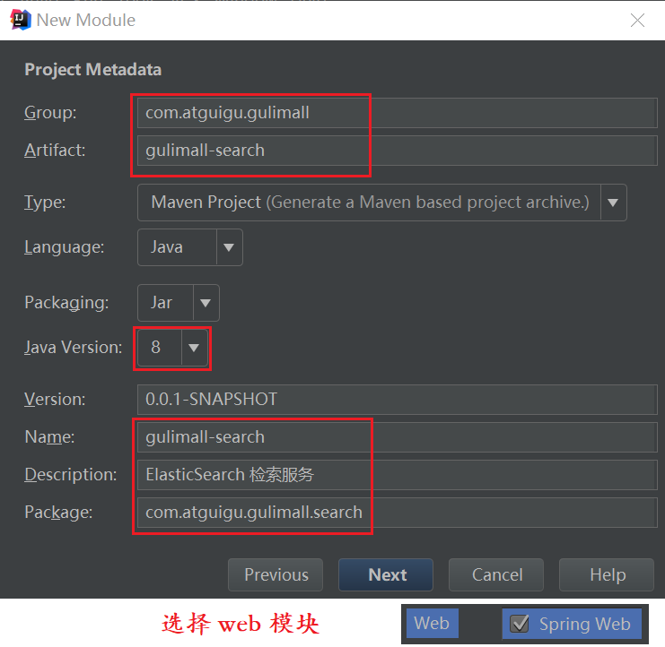
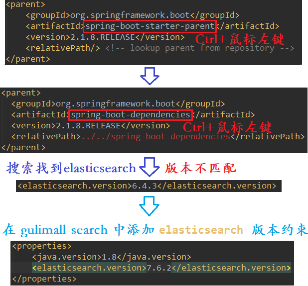

## 第七节 SpringBoot 整合 high-level-client

### 7.1 Elasticsearch-Rest-Client

#### 7.1.1 9300: TCP(不建议使用)

`spring-data-elasticsearch:transport-api.jar;`

不推荐使用，原因如下：

* springboot 版本不同，ransport-api.jar 不同，不能适配 es 版本。

* 7.x 已经不建议使用，8 以后就要废弃。

#### 7.1.2 9200: HTTP

* `jestClient`: 非官方，更新慢；

* `RestTemplate`：模拟 HTTP 请求，ES 很多操作需要自己封装，麻烦；

* `HttpClient`：同上；

* `Elasticsearch-Rest-Client`：官方 RestClient，封装了 ES 操作，API 层次分明，上手简单；

最终选择 `Elasticsearch-Rest-Client`（elasticsearch-rest-high-level-client）； 

https://www.elastic.co/guide/en/elasticsearch/client/java-rest/current/java-rest-high.html

### 7.2 创建 `gulimall-search` 模块

#### 7.2.1 导入依赖



1）在 `gulimall` 中添加 `gulimall-search` 模块

```xml
<module>gulimall-search</module>
```

2）修改 `spring-boot-starter-parent` 版本，与 `gulimall` 项目统一。

```xml
<parent>
	<groupId>org.springframework.boot</groupId>
	<artifactId>spring-boot-starter-parent</artifactId>
	<version>2.1.8.RELEASE</version>
	<relativePath/> <!-- lookup parent from repository -->
</parent>
```

3）在 `gulimall-search` 模块的 `pom` 中引入 `elasticsearch` 坐标

```xml
<dependency>
	<groupId>org.elasticsearch.client</groupId>
	<artifactId>elasticsearch-rest-high-level-client</artifactId>
	<version>7.6.2</version>
</dependency>
```

4）在 `gulimall-search` 模块的 `pom` 中添加 `elasticsearch` 约束。

```xml
<properties>
	<elasticsearch.version>7.6.2</elasticsearch.version>
</properties>
```




#### 7.2.2 配置

`gulimall-search` 中：

1）导入 `gulimall-common` 坐标。

2）在 `resources` 下 `application.properties` 中添加注册中心：

```properties
spring.cloud.nacos.discovery.server-addr=127.0.0.1:8848
spring.application.name=gulimall-search
```


3）在 `com.atguigu.gulimall.search` 下，创建包 `config`，创建配置类 `GulimallElasticSearchConfig`：

```java
package com.atguigu.gulimall.search.config;


import org.apache.http.HttpHost;
import org.elasticsearch.client.RestClient;
import org.elasticsearch.client.RestClientBuilder;
import org.elasticsearch.client.RestHighLevelClient;
import org.springframework.context.annotation.Bean;
import org.springframework.context.annotation.Configuration;

/**
 * 1. 导入依赖
 * 2. 编写配置，给容器中注入一个RestHighLevelClient
 * 3. 参照官方 API
 */

@Configuration
public class GulimallElasticSearchConfig {

    @Bean
    public RestHighLevelClient esRestClient(){
        RestClientBuilder builder = RestClient.builder(new HttpHost("192.168.56.10", 9200, "http"));
        RestHighLevelClient client = new RestHighLevelClient(builder);
        return client;
    }
}
```

4）启动类

```java
package com.atguigu.gulimall.search;

import org.springframework.boot.SpringApplication;
import org.springframework.boot.autoconfigure.SpringBootApplication;
import org.springframework.boot.autoconfigure.jdbc.DataSourceAutoConfiguration;
import org.springframework.cloud.client.discovery.EnableDiscoveryClient;

@EnableDiscoveryClient
@SpringBootApplication(exclude = DataSourceAutoConfiguration.class)
public class GulimallSearchApplication {
	public static void main(String[] args) {
		SpringApplication.run(GulimallSearchApplication.class, args);
	}
}
```


5）测试类测试

```java
package com.atguigu.gulimall.search;


import org.elasticsearch.client.RestHighLevelClient;
import org.junit.Test;
import org.junit.runner.RunWith;
import org.springframework.beans.factory.annotation.Autowired;
import org.springframework.boot.test.context.SpringBootTest;
import org.springframework.test.context.junit4.SpringRunner;

@RunWith(SpringRunner.class)
@SpringBootTest
public class GulimallSearchApplicationTests {

	@Autowired
	private RestHighLevelClient client;
	@Test
	public void contextLoads() {
		System.out.println(client);
	}

}
```

输出：

```
org.elasticsearch.client.RestHighLevelClient@75babb67
```


具体操作参考：https://www.elastic.co/guide/en/elasticsearch/client/java-rest/current/java-rest-high.html


### 7.3 


