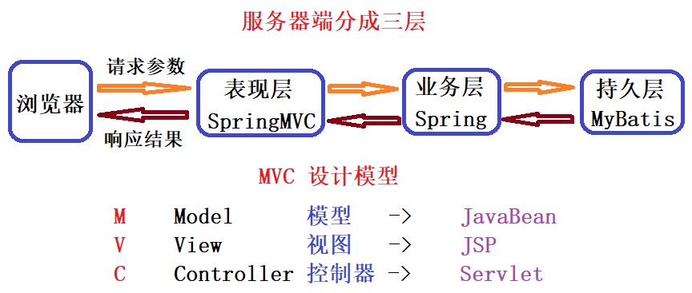

## SpringMVC 框架

### 一、三层架构介绍

&emsp;&emsp;开发架构一般都是基于两种形式，一种是 C/S 架构，也就是客户端/服务器，另一种是 B/S 架构，也就是浏览器服务器。在 JavaEE 开发中，几乎全都是基于 B/S 架构的开发。那么**在 B/S 架构中，系统标准的三层架构包括：表现层、业务层、持久层。**三层架构在实际开发中使用的非常多，所以本章案例都是基于三层架构设计的。

三层架构中，每一层各司其职，每层负责如下：
* 表现层：即 web 层，**负责接收客户端请求，向客户端响应结果**，通常客户端使用 http 协议请求 web 层， web 需要接收 http 请求，完成 http 响应。 
   * 表现层包括**展示层和控制层**：控制层负责接收请求，展示层负责结果的展示。
   * **表现层依赖业务层**，接收到客户端请求一般会调用业务层进行业务处理，并将处理结果响应给客户端。
   * 表现层的设计一般都使用 MVC 模型。（MVC 是表现层的设计模型，和其他层没有关系）
* 业务层：即 service 层，负责业务逻辑处理，开发项目的需求息息相关。
   * web 层依赖业务层，但是业务层不依赖 web 层。
   * 业务层在业务处理时可能会依赖持久层，如果要对数据持久化需要保证事务一致性。（即**事务应该放到业务层来控制**）
* 持久层：即 dao 层，负责数据持久化，包括数据层即数据库和数据访问层，数据库是对数据进行持久化的载体，数据访问层是业务层和持久层交互的接口，业务层需要通过数据访问层将数据持久化到数据库中。通俗的讲，**持久层就是和数据库交互，对数据库表进行曾删改查的**。

### 二、MVC 设计模型

&emsp;MVC 全名是 Model View Controller，是模型(model)－视图(view)－控制器(controller)的缩写，是一种用于设计创建 Web 应用程序表现层的模式。 

MVC 中每个部分各司其职：
* **Model（模型）** ：通常指数据模型，一般情况下用于封装数据。

* **View（视图）** ：通常指  jsp 或者 html，一般用于展示数据。通常视图是依据模型数据创建的。

* **Controller（控制器）** ：是应用程序中处理用户交互的部分，一般用于处理程序逻辑。
   * 它相对于前两个不是很好理解，这里举个例子：要保存一个用户的信息，该用户信息中包含了姓名、性别、年龄等。这时候表单输入要求年龄必须是 1~100 之间的整数。姓名和性别不能为空。并且把数据填充到模型之中。此时除了 js 的校验之外，服务器端也应该有数据准确性的校验，那么校验就是控制器的该做的。
   * 当校验失败后，由控制器负责把错误页面展示给使用者。
   * 如果校验成功，也是控制器负责把数据填充到模型，并且调用业务层实现完整的业务需求。

### 三、SpringMVC 框架

#### 3.1 SpringMVC 是什么

