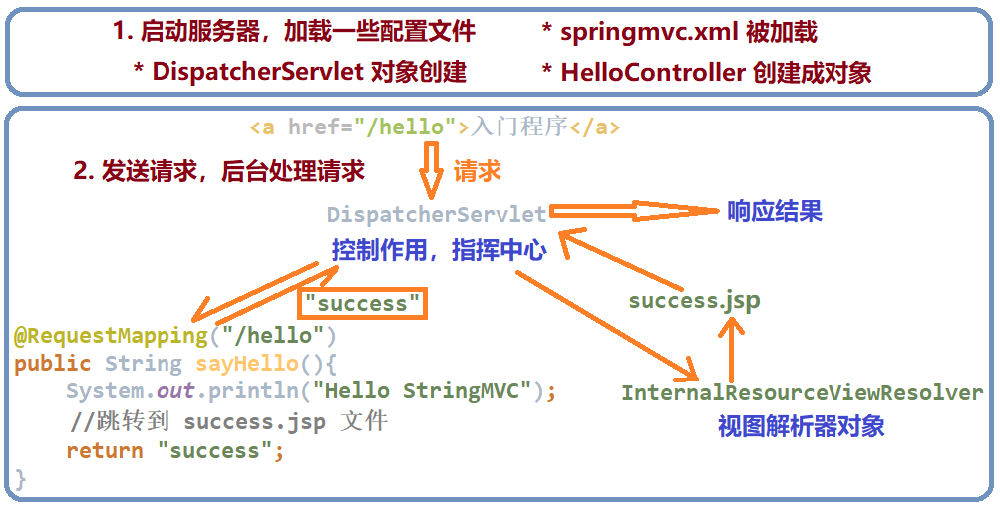
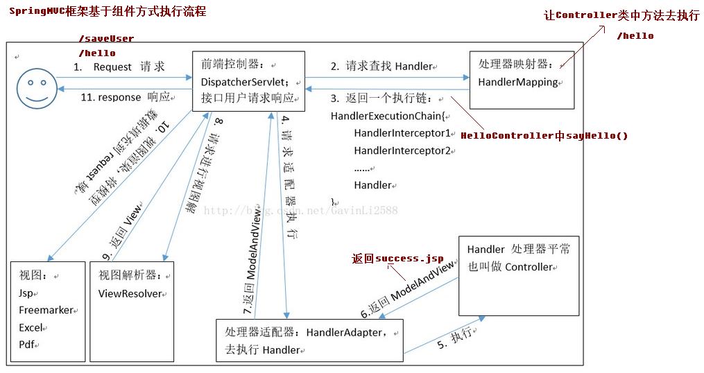

## 第一节 SpringMVC 入门

### 1.1 入门程序

#### 1.1.1 需求分析


#### 1.1.2 搭建开发环境

1 创建新工程，选择 Maven 并勾选 Create from archetype，选择 org.apache.maven.archetypes:maven-archetype-webapp。GroupId 设为 cn.itcast，Artifactld 设为 `springmvc_quick_start`。

* 解决项目创建过慢问题，添加键值对`archetypeCatalog : internal`。

2 在 main 文件夹下创建 java 文件夹，右键选择 Mark Directory as，选择 Sources Root。在 main文件夹下创建 resources 文件夹，右键选择 Mark Directory as，选择 Resources Root。

3 导入需要的坐标，在 pom.xml 中配置。

```xml
<?xml version="1.0" encoding="UTF-8"?>

<project xmlns="http://maven.apache.org/POM/4.0.0" xmlns:xsi="http://www.w3.org/2001/XMLSchema-instance"
  xsi:schemaLocation="http://maven.apache.org/POM/4.0.0 http://maven.apache.org/xsd/maven-4.0.0.xsd">
  <modelVersion>4.0.0</modelVersion>

  <groupId>cn.itcast</groupId>
  <artifactId>springmvc_quick_start</artifactId>
  <version>1.0-SNAPSHOT</version>
  <packaging>war</packaging>

  <name>springmvc_quick_start Maven Webapp</name>
  <!-- FIXME change it to the project's website -->
  <url>http://www.example.com</url>

  <properties>
    <project.build.sourceEncoding>UTF-8</project.build.sourceEncoding>
    <maven.compiler.source>1.8</maven.compiler.source>
    <maven.compiler.target>1.8</maven.compiler.target>
    <!-- 版本锁定 -->
    <spring.version>5.0.2.RELEASE</spring.version>
  </properties>

  <dependencies>
    <dependency>
      <groupId>org.springframework</groupId>
      <artifactId>spring-context</artifactId>
      <version>${spring.version}</version>
    </dependency>

    <dependency>
      <groupId>org.springframework</groupId>
      <artifactId>spring-web</artifactId>
      <version>${spring.version}</version>
    </dependency>

    <dependency>
      <groupId>org.springframework</groupId>
      <artifactId>spring-webmvc</artifactId>
      <version>${spring.version}</version>
    </dependency>

    <dependency>
      <groupId>javax.servlet</groupId>
      <artifactId>servlet-api</artifactId>
      <version>2.5</version>
      <scope>provided</scope>
    </dependency>

    <dependency>
      <groupId>javax.servlet.jsp</groupId>
      <artifactId>jsp-api</artifactId>
      <version>2.0</version>
      <scope>provided</scope>
    </dependency>
  </dependencies>

  <build>
    <finalName>springmvc_quick_start</finalName>
    <pluginManagement><!-- lock down plugins versions to avoid using Maven defaults (may be moved to parent pom) -->
      <plugins>
        <plugin>
          <artifactId>maven-clean-plugin</artifactId>
          <version>3.1.0</version>
        </plugin>
        <!-- see http://maven.apache.org/ref/current/maven-core/default-bindings.html#Plugin_bindings_for_war_packaging -->
        <plugin>
          <artifactId>maven-resources-plugin</artifactId>
          <version>3.0.2</version>
        </plugin>
        <plugin>
          <artifactId>maven-compiler-plugin</artifactId>
          <version>3.8.0</version>
        </plugin>
        <plugin>
          <artifactId>maven-surefire-plugin</artifactId>
          <version>2.22.1</version>
        </plugin>
        <plugin>
          <artifactId>maven-war-plugin</artifactId>
          <version>3.2.2</version>
        </plugin>
        <plugin>
          <artifactId>maven-install-plugin</artifactId>
          <version>2.5.2</version>
        </plugin>
        <plugin>
          <artifactId>maven-deploy-plugin</artifactId>
          <version>2.8.2</version>
        </plugin>
      </plugins>
    </pluginManagement>
  </build>
</project>
```

4 在 web.xml 中**配置前端控制器**（实质就是一个 Servlet）

```xml
<!DOCTYPE web-app PUBLIC
 "-//Sun Microsystems, Inc.//DTD Web Application 2.3//EN"
 "http://java.sun.com/dtd/web-app_2_3.dtd" >

<web-app>
  <display-name>Archetype Created Web Application</display-name>
  <servlet>
    <servlet-name>dispatcherServlet</servlet-name>
    <servlet-class>org.springframework.web.servlet.DispatcherServlet</servlet-class>
  </servlet>
  <servlet-mapping>
    <servlet-name>dispatcherServlet</servlet-name>
    <url-pattern>/</url-pattern>
  </servlet-mapping>
</web-app>
```

5 在 resources 文件夹下创建 XML Configuration File->Spring Config->springmvc 文件

```xml
<?xml version="1.0" encoding="UTF-8"?>
<beans xmlns="http://www.springframework.org/schema/beans"
       xmlns:xsi="http://www.w3.org/2001/XMLSchema-instance"
       xsi:schemaLocation="http://www.springframework.org/schema/beans http://www.springframework.org/schema/beans/spring-beans.xsd">
</beans>
```

6 部署服务器，在 Run/Debug Configurations 页面添加一个 Local Tomcat Server，命名为 springmvc。在 Deployment 选项点击➕，选择 Artifact，选择 springmvc_quick_start:war。

#### 1.1.3 代码编写

1 在 webapp 下创建 index.jsp 文件（主页面）

```jsp
<%@ page contentType="text/html;charset=UTF-8" language="java" %>
<html>
<head>
    <title>Title</title>
</head>
<body>
    <h3>入门程序</h3>
    <a href="/hello">入门程序</a>
</body>
</html>
```

2 在 java 文件夹下创建 cn.itcast.controller.HelloController 类

```java
package cn.itcast.controller;

import org.springframework.stereotype.Controller;
import org.springframework.web.bind.annotation.RequestMapping;

// 控制器类
@Controller
public class HelloController {
    @RequestMapping("/hello")  
    public String sayHello(){
        System.out.println("Hello StringMVC");
        //返回值字符串的名字，是跳转后的文件名
        return "success";  //跳转到 success.jsp 文件
    }
}

/*
@Controller：定义了一个控制器类，使用它标记的类就是一个 SpringMvc Controller 对象，分发处理器会扫描使用该注解的类的方法，并检测该方法是否使用了 @RequestMapping 注解。
* @Controller 只是定义了一个控制器类，而使用 @RequestMapping 注解的方法才是处理请求的处理器。
* @Controller 标记在一个类上还不能真正意义上说它就是 SpringMvc 的控制器，因为这个时候 Spring 还不认识它，需要把这个控制器交给 Spring 来管理。有两种方式可以管理：

<!--基于注解的装配-->

<!--方式一-->
<bean class="com.HelloWorld"/>

<!--方式二-->
<!--路径写到controller的上一层-->
<context:component-scan base-package="com"/>
*/
```


3 在 WEB-INF 中创建 pages文件夹，在 pages文件夹创建 success.jsp 文件

```jsp
<%@ page contentType="text/html;charset=UTF-8" language="java" %>
<html>
<head>
    <title>Title</title>
</head>
<body>
    <h3>入门成功</h3>
</body>
</html>
```

4 更新 springmvc.xml 文件约束

```xml
<?xml version="1.0" encoding="UTF-8"?>
<beans xmlns="http://www.springframework.org/schema/beans"
       xmlns:mvc="http://www.springframework.org/schema/mvc"
       xmlns:context="http://www.springframework.org/schema/context"
       xmlns:xsi="http://www.w3.org/2001/XMLSchema-instance"
       xsi:schemaLocation="
        http://www.springframework.org/schema/beans
        http://www.springframework.org/schema/beans/spring-beans.xsd
        http://www.springframework.org/schema/mvc
        http://www.springframework.org/schema/mvc/spring-mvc.xsd
        http://www.springframework.org/schema/context
        http://www.springframework.org/schema/context/spring-context.xsd">

    <!-- 开启注解扫描 -->
    <context:component-scan base-package="cn.itcast"/>

    <!-- 视图解析器对象 帮助跳转指定页面-->
    <bean id="internalResourceViewResolver" class="org.springframework.web.servlet.view.InternalResourceViewResolver">
        <!-- prefix：文件路径 -->
        <property name="prefix" value="/WEB-INF/pages/"/>
        <!-- suffix：文件后缀名 -->
        <property name="suffix" value=".jsp"/>
    </bean>

    <!-- 开启 SpringMVC 框架注解的支持 -->
    <mvc:annotation-driven/>
</beans>
```

 5 在 web.xml 中加载配置文件

```xml
<!DOCTYPE web-app PUBLIC
 "-//Sun Microsystems, Inc.//DTD Web Application 2.3//EN"
 "http://java.sun.com/dtd/web-app_2_3.dtd" >

<web-app>
  <display-name>Archetype Created Web Application</display-name>
  <servlet>
    <servlet-name>dispatcherServlet</servlet-name>
    <servlet-class>org.springframework.web.servlet.DispatcherServlet</servlet-class>
    <init-param>
      <param-name>contextConfigLocation</param-name>
      <!-- 使用前端控制器加载配置文件 -->
      <param-value>classpath:springmvc.xml</param-value>
    </init-param>
    <load-on-startup>1</load-on-startup>
  </servlet>
  <servlet-mapping>
    <servlet-name>dispatcherServlet</servlet-name>
    <url-pattern>/</url-pattern>
  </servlet-mapping>
</web-app>
```

**load-on-startup 标签作用**：

1. load-on-startup 元素标记容器**是否在启动**的时候就加载这个 servlet (实例化并调用其 init() 方法)。

2. 它的值必须是一个整数，表示 servlet 应该被载入的**顺序**。

3. 当值为 0 或者大于 0 时，表示容器在启动时就加载并初始化这个 servlet。

4. 当值小于 0 或者没有指定时，则表示容器在该 Servlet 第一次被请求时，才会去加载。

5. 正数的值越小，该 Servlet 的优先级就越高，应用启动时就优先加载。**数字代表的是优先级，而非启动延迟时间。**

6. 当值相同的时候，容器就会自己选择优先加载。

#### 1.1.4 流程总结



**执行过程**

1. 服务器启动，应用被加载。读取到 web.xml 中的配置创建 spring 容器并且初始化容器中的对象。

2. 浏览器发送请求，被 DispatherServlet 捕获，该 Servlet 并不处理请求，而是把请求转发出去。转发的路径是根据请求 URL，匹配 @RequestMapping 中的内容。

3. 匹配到了后，执行对应方法。该方法有一个返回值。

4. 根据方法的返回值，借助 InternalResourceViewResolver 找到对应的结果视图。

5. 渲染结果视图，响应浏览器。

**注意**

【web.xml】由于配置了 load-on-startup 标签，当服务器启动时，会立即创建 DispatcherServlet 对象，并加载 springmvc.xml 配置文件。

【springmvc.xml】开启注解扫描，将 HelloController 类变为对象（默认单例）加载进 IOC 容器中。

#### 1.1.5 使用的组件介绍




**DispatcherServlet：前端控制器**

* 用户请求到达前端控制器，它就相当于 mvc 模式中的 c， dispatcherServlet 是整个流程控制的中心，由它调用其它组件处理用户的请求， dispatcherServlet 的存在降低了组件之间的耦合性。

**HandlerMapping：处理器映射器**

* HandlerMapping 负责根据用户请求找到 Handler 即处理器， SpringMVC 提供了不同的映射器实现不同的映射方式，例如：配置文件方式，实现接口方式，注解方式等。

**Handler：处理器** 

* 开发中要编写的具体业务控制器。由 DispatcherServlet 把用户请求转发到 Handler。由 Handler 对具体的用户请求进行处理。 

**HandlAdapter：处理器适配器**

* 通过 HandlerAdapter 对处理器进行执行，这是适配器模式的应用，通过扩展适配器可以对更多类型的处理器进行执行。

**View Resolver：视图解析器**

* View Resolver 负责将处理结果生成 View 视图， View Resolver 首先根据逻辑视图名解析成物理视图名即具体的页面地址，再生成 View 视图对象，最后对 View 进行渲染将处理结果通过页面展示给用户。

**View：视图**

* SpringMVC 框架提供了很多的 View 视图类型的支持，包括： jstlView、freemarkerView、pdfView 等。**最常用的视图就是 jsp**。一般情况下需要通过页面标签或页面模版技术将模型数据通过页面展示给用户，需要由程序员根据业务需求开发具体的页面。

🍒 **`<mvc:annotation-driven>` 说明** 🍒

&emsp;&emsp;在 SpringMVC 的各个组件中，**处理器映射器、处理器适配器、视图解析器**称为 SpringMVC 的**三大组件**。使 用 `<mvc:annotation-driven>` 自 动 加 载 `RequestMappingHandlerMapping`（ 处 理 映 射 器 ） 和 `RequestMappingHandlerAdapter`（ 处 理 适 配 器 ），可 用 在 springmvc.xml 配 置 文 件 中 使 用 `<mvc:annotation-driven>` **替代**注解处理器和适配器的配置。 

`<mvc:annotation-driven>` 相当于如下配置：

```xml
<!-- 上面的标签相当于 如下配置-->
<!-- Begin -->
<!-- HandlerMapping -->
<bean class="org.springframework.web.servlet.mvc.method.annotation.RequestMappingHandlerMapping"></bean>
<bean class="org.springframework.web.servlet.handler.BeanNameUrlHandlerMapping"></bean>

<!-- HandlerAdapter -->
<bean class="org.springframework.web.servlet.mvc.method.annotation.RequestMappingHandlerAdapter"></bean>
<bean class="org.springframework.web.servlet.mvc.HttpRequestHandlerAdapter"></bean>
<bean class="org.springframework.web.servlet.mvc.SimpleControllerHandlerAdapter"></bean>

<!-- HadnlerExceptionResolvers -->
<bean class="org.springframework.web.servlet.mvc.method.annotation.ExceptionHandlerExcept
ionResolver"></bean>
<bean class="org.springframework.web.servlet.mvc.annotation.ResponseStatusExceptionResolv
er"></bean>
<bean class="org.springframework.web.servlet.mvc.support.DefaultHandlerExceptionResolver"
></bean>
<!-- End -->
```

#### 1.1.6 RequestMapping 注解 

**作用**：用于建立请求 URL 和处理请求方法之间的对应关系。 

**源码**：

```java
@Target({ElementType.METHOD, ElementType.TYPE}) //元注解：可作用在方法、作用在类上
@Retention(RetentionPolicy.RUNTIME)
@Documented
@Mapping
public @interface RequestMapping {
    String name() default "";

    @AliasFor("path")
    String[] value() default {};

    @AliasFor("value")
    String[] path() default {};

    RequestMethod[] method() default {};
    String[] params() default {};
    String[] headers() default {};
    String[] consumes() default {};
    String[] produces() default {};
}

/*
@Retention 按生命周期来划分可分为 3 类：
1、RetentionPolicy.SOURCE：注解只保留在源文件，当Java文件编译成class文件的时候，注解被遗弃；
2、RetentionPolicy.CLASS：注解被保留到class文件，但jvm加载class文件时候被遗弃，这是默认的生命周期；
3、RetentionPolicy.RUNTIME：注解不仅被保存到class文件中，jvm加载class文件之后，仍然存在；
这3个生命周期分别对应于：Java源文件(.java文件) ---> .class文件 ---> 内存中的字节码。
*/
```

**出现位置**： 

* 类上：请求 URL 的第一级访问目录。此处不写的话，就相当于应用的根目录。 写的话需要以 `/` 开头。它出现的目的是为了使 URL 可以按照模块化管理: 

```
账户模块：
/account/add
/account/update
/account/delete

订单模块：
/order/add
/order/update
/order/delete

/account 与 /order 就是把 RequsetMappding 写在类上，使 URL 更加精细。
```

* 方法上：请求 URL 的第二级访问目录。

**属性**： 

1. `value`：用于指定请求的 URL。 它和 path 属性的作用是一样的。

2. `method`：用于指定请求的方式。取值有：RequestMethod.GET、RequestMethod.POST、RequestMethod.DELETE、RequestMethod.HEAD 等。

3. `params`：用于指定限制请求参数的条件。它支持简单的表达式。 要求请求参数的 key 和 value 必须和配置的一模一样。

    ```html
    params = {"accountName"}，表示 url 请求参数必须有 accountName，例：
    <a href="/testRequestMapping?accountName">RequestMapping 注解</a>
    
    params = {"moeny=100"}，表示请求参数中 money 必须是 100，例：
    <a href="/testRequestMapping?moeny=100">RequestMapping 注解</a>
    ```
    
4. `headers`：用于指定限制请求消息头的条件。

注意：以上四个属性只要出现 2 个或以上时，他们的关系是与的关系。 

#### 1.1 7 配置注意事项

🍒 **在 jsp 中使用第二种方法配置时，不要在访问 URL 前面加 `/`，否则无法找到资源。** 

```html
<!-- 第一种访问方式 -->
<a href="${pageContext.request.contextPath}/account/findAccount">查询账户</a>
<br/>
<!-- 第二种访问方式 -->
<a href="account/findAccount">查询账户</a>
```


