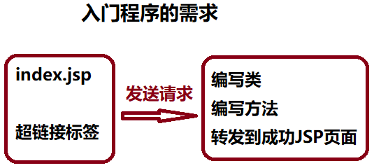

## 第一节 SpringMVC 入门

### 1.1 入门程序

#### 1.1.1 需求分析



#### 1.1.2 搭建开发环境

1 创建新工程，选择 Maven 并勾选 Create from archetype，选择 org.apache.maven.archetypes:maven-archetype-webapp。GroupId 设为 cn.itcast，Artifactld 设为 `springmvc_quick_start`。

* 解决项目创建过慢问题，添加键值对`archetypeCatalog : internal`。

2 在 main 文件夹下创建 java 文件夹，右键选择 Mark Directory as，选择 Sources Root。在 main文件夹下创建 resources 文件夹，右键选择 Mark Directory as，选择 Resources Root。

3 导入需要的坐标，在 pom.xml 中配置。

```xml
<?xml version="1.0" encoding="UTF-8"?>

<project xmlns="http://maven.apache.org/POM/4.0.0" xmlns:xsi="http://www.w3.org/2001/XMLSchema-instance"
  xsi:schemaLocation="http://maven.apache.org/POM/4.0.0 http://maven.apache.org/xsd/maven-4.0.0.xsd">
  <modelVersion>4.0.0</modelVersion>

  <groupId>cn.itcast</groupId>
  <artifactId>springmvc_quick_start</artifactId>
  <version>1.0-SNAPSHOT</version>
  <packaging>war</packaging>

  <name>springmvc_quick_start Maven Webapp</name>
  <!-- FIXME change it to the project's website -->
  <url>http://www.example.com</url>

  <properties>
    <project.build.sourceEncoding>UTF-8</project.build.sourceEncoding>
    <maven.compiler.source>1.8</maven.compiler.source>
    <maven.compiler.target>1.8</maven.compiler.target>
    <!-- 版本锁定 -->
    <spring.version>5.0.2.RELEASE</spring.version>
  </properties>

  <dependencies>
    <dependency>
      <groupId>org.springframework</groupId>
      <artifactId>spring-context</artifactId>
      <version>${spring.version}</version>
    </dependency>

    <dependency>
      <groupId>org.springframework</groupId>
      <artifactId>spring-web</artifactId>
      <version>${spring.version}</version>
    </dependency>

    <dependency>
      <groupId>org.springframework</groupId>
      <artifactId>spring-webmvc</artifactId>
      <version>${spring.version}</version>
    </dependency>

    <dependency>
      <groupId>javax.servlet</groupId>
      <artifactId>servlet-api</artifactId>
      <version>2.5</version>
      <scope>provided</scope>
    </dependency>

    <dependency>
      <groupId>javax.servlet.jsp</groupId>
      <artifactId>jsp-api</artifactId>
      <version>2.0</version>
      <scope>provided</scope>
    </dependency>
  </dependencies>

  <build>
    <finalName>springmvc_quick_start</finalName>
    <pluginManagement><!-- lock down plugins versions to avoid using Maven defaults (may be moved to parent pom) -->
      <plugins>
        <plugin>
          <artifactId>maven-clean-plugin</artifactId>
          <version>3.1.0</version>
        </plugin>
        <!-- see http://maven.apache.org/ref/current/maven-core/default-bindings.html#Plugin_bindings_for_war_packaging -->
        <plugin>
          <artifactId>maven-resources-plugin</artifactId>
          <version>3.0.2</version>
        </plugin>
        <plugin>
          <artifactId>maven-compiler-plugin</artifactId>
          <version>3.8.0</version>
        </plugin>
        <plugin>
          <artifactId>maven-surefire-plugin</artifactId>
          <version>2.22.1</version>
        </plugin>
        <plugin>
          <artifactId>maven-war-plugin</artifactId>
          <version>3.2.2</version>
        </plugin>
        <plugin>
          <artifactId>maven-install-plugin</artifactId>
          <version>2.5.2</version>
        </plugin>
        <plugin>
          <artifactId>maven-deploy-plugin</artifactId>
          <version>2.8.2</version>
        </plugin>
      </plugins>
    </pluginManagement>
  </build>
</project>
```

4 在 web.xml 中**配置前端控制器**（实质就是一个 Servlet）

```xml
<!DOCTYPE web-app PUBLIC
 "-//Sun Microsystems, Inc.//DTD Web Application 2.3//EN"
 "http://java.sun.com/dtd/web-app_2_3.dtd" >

<web-app>
  <display-name>Archetype Created Web Application</display-name>
  <servlet>
    <servlet-name>dispatcherServlet</servlet-name>
    <servlet-class>org.springframework.web.servlet.DispatcherServlet</servlet-class>
  </servlet>
  <servlet-mapping>
    <servlet-name>dispatcherServlet</servlet-name>
    <url-pattern>/</url-pattern>
  </servlet-mapping>
</web-app>
```

5 在 resources 文件夹下创建 XML Configuration File->Spring Config->springmvc 文件

```xml
<?xml version="1.0" encoding="UTF-8"?>
<beans xmlns="http://www.springframework.org/schema/beans"
       xmlns:xsi="http://www.w3.org/2001/XMLSchema-instance"
       xsi:schemaLocation="http://www.springframework.org/schema/beans http://www.springframework.org/schema/beans/spring-beans.xsd">
</beans>
```

6 部署服务器，在 Run/Debug Configurations 页面添加一个 Local Tomcat Server，命名为 springmvc。在 Deployment 选项点击➕，选择 Artifact，选择 springmvc_quick_start:war。

#### 1.1.3 代码编写


#### 1.1.4 流程总结


#### 1.1.5 使用的组件介绍