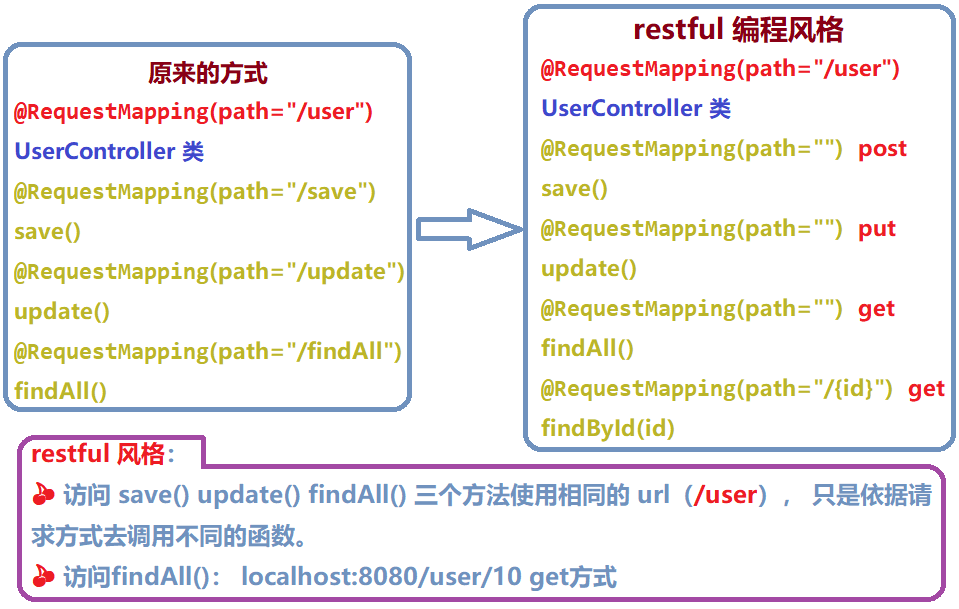

## 第二节 常用注解

#### 2.1 RequestParam 注解

**作用**：把请求中指定名称的参数给控制器中的形参赋值。

**属性**：
* value：请求参数中的名称。
* required：请求参数中是否必须提供此参数。默认值：true。表示必须提供，如果不提供将报错。

**使用示例**：

* **jsp 中示例代码**

```html
<a href="anno/testRequestParam?name=哈哈">RequestParam</a>
```

* **控制器中示例代码**


```java
@Controller
@RequestMapping("/anno")
public class AnnoController {
    @RequestMapping("/testRequestParam")
    public String testRequestParam(@RequestParam(name="name") String username){
        System.out.println("执行了...");
        System.out.println(username);
        return "success";
    }
}
```

**分析**：超链接的 url 中传递的参数名 name 与 Controller 中 testRequestParam 方法的参数名 username 不一致，无法赋值。使用 `@RequestParam` 注解 “ 标明匹配关系 ”。


#### 2.2 RequestBody 注解

**作用**：用于获取请求体内容。直接使用得到是 key=value&key=value... 结构的数据。get 请求方式不适用，因为 get 请求方式没有请求体。

**属性**：required：是否必须有请求体。默认值是 true。当取值为 true 时，get 请求方式会报错。如果取值为 false，get 请求得到是 null。

**使用示例**：

* **jsp 中示例代码**

```html
<form action="anno/testRequestBody" method="post">
    用户姓名：<input type="text" name="username" /><br/>
    用户年龄：<input type="text" name="age" /><br/>
    <input type="submit" value="提交" />
</form>
```

* **控制器中示例代码**


```java
@Controller
@RequestMapping("/anno")
public class AnnoController {
    /**
     * 获取到请求体的内容
     */
    @RequestMapping("/testRequestBody")
    public String testRequestBody(@RequestBody String body){
        System.out.println("执行了...");
        System.out.println(body);
        return "success";
    }
}
```

**分析**：如果不添加 @RequestBody 注解，默认去寻找名为 body 的参数。


#### 2.3 PathVariable 注解

**作用**：用于绑定 url 中的占位符。例如：请求 url 中 `/delete/{id}`，这个 {id} 就是 url 占位符。url 支持占位符是 spring3.0 之后加入的。是 springmvc 支持 rest 风格 URL 的一个重要标志。

**属性**：

* value：用于指定 url 中占位符名称。
* required：是否必须提供占位符。

**使用示例**：

* **jsp 中示例代码**

```html
<a href="anno/testPathVariable/10">testPathVariable</a>
```

* **控制器中示例代码**


```java
@Controller
@RequestMapping("/anno")
public class AnnoController {
    @RequestMapping(value="/testPathVariable/{sid}", method=RequestMethod.GET)
    public String testPathVariable(@PathVariable(name="sid") String id){
        System.out.println("执行了...");
        System.out.println(id);
        return "success";
    }
}
```

**分析**：注意 Url 的输入方式 `/{sid}` 对应着 `/10`，而不是 `sid=10` 方式。

**该注解的作用**：




#### 2.4 HiddentHttpMethodFilter 过滤器(了解)


**作用**：由于浏览器 form 表单只支持 GET 与 POST 请求，而 DELETE、 PUT 等 method 并不支持， Spring3.0 添加了一个过滤器，**可以将浏览器请求改为指定的请求方式，发送给控制器方法**，使得支持 GET、 POST、 PUT 与 DELETE 请求。

**使用方法**：

* 第一步：在 web.xml 中配置该过滤器。

* 第二步：请求方式必须使用 post 请求。

* 第三步：按照要求提供 `_method` 请求参数，该参数的取值就是需要的请求方式。


**使用示例**：

* **jsp 中示例代码**

```html
<!-- 更新 -->
<form action="springmvc/testRestPUT/1" method="post">
    用户名称： <input type="text" name="username"><br/>
    <!-- 定义隐藏域传输要设置的请求方式 -->
    <input type="hidden" name="_method" value="PUT">
    <input type="submit" value="更新">
</form>
```

* **控制器中示例代码**

```java
// put 请求：更新
@RequestMapping(value="/testRestPUT/{id}",method=RequestMethod.PUT)
public String testRestfulURLPUT(@PathVariable("id")Integer id,User user){
    System.out.println("rest put "+id+","+user);
    return "success";
}
```


#### 2.5 RequestHeader 注解


**作用**：用于获取请求消息头。

**属性**：

* `value`：提供消息头名称
* `required`：是否必须有此消息头

**使用示例**：


* **jsp 中示例代码**


* **控制器中示例代码**


**分析**：在实际开发中一般不怎么用。


#### 2.6 CookieValue 注解

**作用**：

**属性**：

**使用示例**：


* **jsp 中示例代码**


* **控制器中示例代码**


**分析**：


#### 2.7 ModelAttribute 注解 

**作用**：

**属性**：

**使用示例**：


* **jsp 中示例代码**


* **控制器中示例代码**


**分析**：


#### 2.8 SessionAttributes 注解

**作用**：

**属性**：

**使用示例**：


* **jsp 中示例代码**


* **控制器中示例代码**


**分析**：


