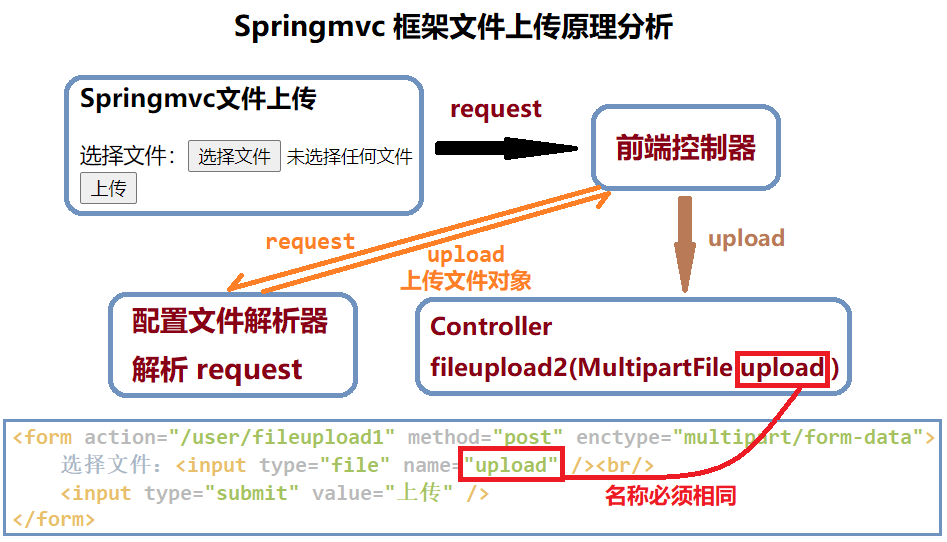

## 第五节 SpringMVC 实现文件上传


#### 5.1 上传原理分析

##### 5.1.1 文件上传的必要前提

1. form 表单的 enctype 取值必须是：`multipart/form-data`
(默认值是：`application/x-www-form-urlencoded`)
   * `enctype`：是表单请求正文的类型。

2. `method` 属性取值必须是 `Post`。

3. 提供一个文件选择域 `<input type=”file” />`


##### 5.1.2 文件上传的原理分析

1. 当 form 表单的 enctype 取值不是默认值后，`request.getParameter()` 将失效。

2. `enctype="application/x-www-form-urlencoded"` 时，form 表单的正文内容是：`key=value&key=value&key=value`。

3. 当 form 表单的 enctype 取值为 `Mutilpart/form-data` 时，请求正文内容就变成：

```markdown
(每一部分都是 MIME 类型描述的正文)
-----------------------------7de1a433602ac (分界符)
Content-Disposition: form-data; name="userName" (协议头)
aaa (协议的正文)
-----------------------------7de1a433602ac
Content-Disposition: form-data; name="file";
filename="C:\Users\zhy\Desktop\fileupload_demofile\b.txt"
Content-Type: text/plain              (协议的类型 - MIME 类型)
                                      (空行)
bbbbbbbbbbbbbbbbbbbbbbbbbbbbbbbb
-----------------------------7de1a433602ac--
```


##### 5.1.3 借助第三方组件实现文件上传

&emsp;&emsp;使用 Commons-fileupload 组件实现文件上传，需要导入该组件相应的支撑 jar 包：**Commons-fileupload 和 commons-io**。commons-io 不属于文件上传组件的开发 jar 文件，但 Commons-fileupload 组件从 1.1 版本开始，它工作时需要 commons-io 包的支持。


#### 5.2 搭建环境


参考第一节 SpringMVC 入门环境搭建

1. 在 pom.xml 导入相关坐标。

2. 在 web.xml 中配置前端控制器以及解决中文乱码的过滤器。

3. 在 src->main 下创建 java 文件夹、resources 文件夹，并将两者设置为对应的 Root 目录。

4. 在 resources 文件夹下创建 springmvc.xml 配置文件，配在配置文件中开启注解扫描、配置视图解析器对象并开启 SpringMVC 框架注解的支持。

5. 在 webapp 文件夹下删除原 index.jsp，然后创建新的 index.jsp 文件。

6. 在 webapp 文件夹下创建目录 pages，并在其下创建 success.jsp 页面。


#### 5.3 传统方式上传代码回顾

【web 页面】

```html
<%@ page contentType="text/html;charset=UTF-8" language="java" %>
<html>
<head>
    <title>Title</title>
</head>
<body>

    <h3>传统文件上传</h3>

    <form action="/user/fileupload1" method="post" enctype="multipart/form-data">
        选择文件：<input type="file" name="upload" /><br/>
        <input type="submit" value="上传" />
    </form>
</body>
</html>
```

【在 pom.xml 中添加坐标】

```xml
<dependency>
  <groupId>commons-fileupload</groupId>
  <artifactId>commons-fileupload</artifactId>
  <version>1.3.1</version>
</dependency>
<dependency>
  <groupId>commons-io</groupId>
  <artifactId>commons-io</artifactId>
  <version>2.4</version>
</dependency>
```

【控制器】

```java
@Controller
@RequestMapping("/user")
public class UserController {
    /**
     * 文件上传
     */
    @RequestMapping("/fileupload1")
    public String fileuoload1(HttpServletRequest request) throws Exception {
        System.out.println("文件上传...");

        // 使用fileupload组件完成文件上传
        // 上传的位置
        String path = request.getSession().getServletContext().getRealPath("/uploads/");
        // 判断，该路径是否存在
        File file = new File(path);
        if(!file.exists()){
            // 创建该文件夹
            file.mkdirs();
        }

        // 解析request对象，获取上传文件项
        DiskFileItemFactory factory = new DiskFileItemFactory();
        ServletFileUpload upload = new ServletFileUpload(factory);
        // 解析request
        List<FileItem> items = upload.parseRequest(request);
        // 遍历
        for(FileItem item:items){
            // 进行判断，当前item对象是否是上传文件项
            if(item.isFormField()){
                // 说明普通表单向
            }else{
                // 说明上传文件项
                // 获取上传文件的名称
                String filename = item.getName();
                // 把文件的名称设置唯一值，uuid
                String uuid = UUID.randomUUID().toString().replace("-", "");
                filename = uuid+"_"+filename;
                // 完成文件上传
                item.write(new File(path,filename));
                // 删除临时文件(当上传文件大小>10Kb，会产生临时文件)
                item.delete();
            }
        }
        return "success";
    }
}
```


#### 5.4 Springmvc 方式上传

##### 5.4.1 Springmvc 方式上传原理分析




##### 5.4.2 代码实现

【web 页面】

```html
<h3>Springmvc文件上传</h3>

<form action="/user/fileupload2" method="post" enctype="multipart/form-data">
    选择文件：<input type="file" name="upload" /><br/>
    <input type="submit" value="上传" />
</form>
```

【在 springmvc.xml 中配置文件解析器】

```xml
<!--配置文件解析器对象-->
<!-- 此处的 id 值是固定的，不能修改，不能起别的名称，否则无法实现请求参数的绑定。-->
<bean id="multipartResolver" class="org.springframework.web.multipart.commons.CommonsMultipartResolver">
    <!--可以设置一些属性，此设置上传文件的最大尺寸为 10MB-->
    <property name="maxUploadSize" value="10485760" />
</bean>
```


【控制器】

```java
package cn.itcast.controller;

import com.sun.jersey.api.client.Client;
import com.sun.jersey.api.client.WebResource;
import org.apache.commons.fileupload.FileItem;
import org.apache.commons.fileupload.disk.DiskFileItemFactory;
import org.apache.commons.fileupload.servlet.ServletFileUpload;
import org.springframework.stereotype.Controller;
import org.springframework.web.bind.annotation.RequestMapping;
import org.springframework.web.multipart.MultipartFile;

import javax.servlet.http.HttpServletRequest;
import java.io.File;
import java.util.List;
import java.util.UUID;

@Controller
@RequestMapping("/user")
public class UserController {

    /**
     * SpringMVC文件上传
     */
    @RequestMapping("/fileupload2")
    public String fileuoload2(HttpServletRequest request, MultipartFile upload) throws Exception {
        System.out.println("springmvc文件上传...");

        // 使用fileupload组件完成文件上传
        // 上传的位置
        String path = request.getSession().getServletContext().getRealPath("/uploads/");
        // 判断，该路径是否存在
        File file = new File(path);
        if(!file.exists()){
            // 创建该文件夹
            file.mkdirs();
        }

        // 说明上传文件项
        // 获取上传文件的名称
        String filename = upload.getOriginalFilename();
        // 把文件的名称设置唯一值，uuid
        String uuid = UUID.randomUUID().toString().replace("-", "");
        filename = uuid+"_"+filename;
        // 完成文件上传
        upload.transferTo(new File(path,filename));

        return "success";
    }
}
```


#### 5.5 Springmvc 跨服务器文件上传


##### 5.5.1 分析与搭建环境

搭建两个 tomcat 服务器，应用服务器(springmvc)与图片服务器(fileupload)，当上传图片请求发给应用服务器时，应用服务器接收到请求，把图片存储到图片服务器。


在实际开发中，会有很多处理不同功能的服务器。例如：
* 应用服务器：负责部署应用
* 数据库服务器：运行数据库
* 缓存和消息服务器：负责处理大并发访问的缓存和消息
* 文件服务器：负责存储用户上传文件的服务器。
(注意：此处说的不是服务器集群）

分服务器处理的目的是让服务器各司其职，从而提高项目的运行效率。

##### 5.5.2 代码实现

【web 页面】

```html
<h3>跨服务器文件上传</h3>

<form action="/user/fileupload3" method="post" enctype="multipart/form-data">
    选择文件：<input type="file" name="upload" /><br/>
    <input type="submit" value="上传" />
</form>
```

【在 pom.xml 中添加负责处理文件上传的项目中拷贝文件上传的必备 jar 包】

```xml
<dependency>
  <groupId>commons-fileupload</groupId>
  <artifactId>commons-fileupload</artifactId>
  <version>1.3.1</version>
</dependency>
<dependency>
  <groupId>commons-io</groupId>
  <artifactId>commons-io</artifactId>
  <version>2.4</version>
</dependency>

<dependency>
  <groupId>com.sun.jersey</groupId>
  <artifactId>jersey-core</artifactId>
  <version>1.18.1</version>
</dependency>
<dependency>
  <groupId>com.sun.jersey</groupId>
  <artifactId>jersey-client</artifactId>
  <version>1.18.1</version>
</dependency>
```


【控制器】

```java
@Controller
@RequestMapping("/user")
public class UserController {

    /**
     * 跨服务器文件上传
     * @return
     */
    @RequestMapping("/fileupload3")
    public String fileuoload3(MultipartFile upload) throws Exception {
        System.out.println("跨服务器文件上传...");

        // 定义上传文件服务器路径
        String path = "http://localhost:9090/uploads/";

        // 说明上传文件项
        // 获取上传文件的名称
        String filename = upload.getOriginalFilename();
        // 把文件的名称设置唯一值，uuid
        String uuid = UUID.randomUUID().toString().replace("-", "");
        filename = uuid+"_"+filename;

        // 创建客户端的对象
        Client client = Client.create();

        // 和图片服务器进行连接
        WebResource webResource = client.resource(path + filename);

        // 上传文件
        webResource.put(upload.getBytes());

        return "success";
    }
}
```

【在 springmvc.xml 中配置文件解析器】

```xml
<!--配置文件解析器对象-->
<!-- 此处的 id 值是固定的，不能修改，不能起别的名称，否则无法实现请求参数的绑定。-->
<bean id="multipartResolver" class="org.springframework.web.multipart.commons.CommonsMultipartResolver">
    <!--可以设置一些属性，此设置上传文件的最大尺寸为 10MB-->
    <property name="maxUploadSize" value="10485760" />
</bean>
```


​                       
