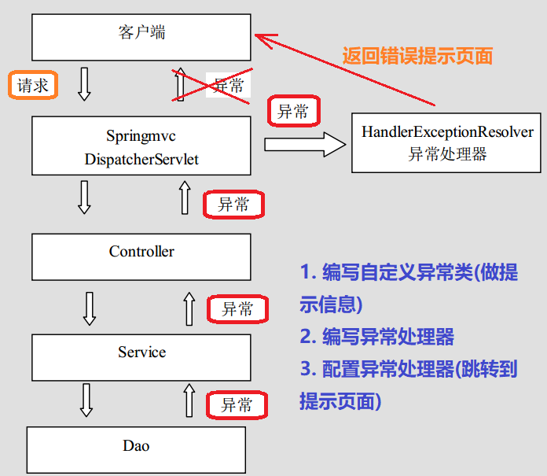

## 第六节 异常处理与拦截器

### 6.1 异常处理

#### 6.1.1 异常处理分析

系统中异常包括两类：预期异常和运行时异常 RuntimeException，前者通过捕获异常从而获取异常信息，后者主要通过规范代码开发、测试通过手段减少运行时异常的发生。

系统的 dao、service、controller 出现异常都通过 throws Exception 向上抛出，最后由 springmvc 前端控制器交由异常处理器进行异常处理，如下图：




#### 6.1.2 搭建环境

参考第一节 SpringMVC 入门环境搭建

1. 在 pom.xml 导入相关坐标。

2. 在 web.xml 中配置前端控制器以及解决中文乱码的过滤器。

3. 在 src->main 下创建 java 文件夹、resources 文件夹，并将两者设置为对应的 Root 目录。

4. 在 resources 文件夹下创建 springmvc.xml 配置文件，配在配置文件中开启注解扫描、配置视图解析器对象并开启 SpringMVC 框架注解的支持。

5. 在 webapp 文件夹下删除原 index.jsp，然后创建新的 index.jsp 文件。

6. 在 webapp 文件夹下创建目录 pages，并在其下创建 success.jsp 页面。

  
#### 6.1.3 程序实现

【web 访问页面】

```html
<a href="user/testException" >异常处理</a>
```

【编写自定义异常类 - 用于提示信息】

* 在 src->java 下创建 cn.itcast.exception 包，并在其下创建 SysException 类，继承于 Exception。

```java
package cn.itcast.exception;

/**
 * 自定义异常类
 */
public class SysException extends Exception{

    // 存储提示信息的
    private String message;

    public String getMessage() {
        return message;
    }

    public void setMessage(String message) {
        this.message = message;
    }

    public SysException(String message) {
        this.message = message;
    }
}
```

【编写异常处理器】

```java
package cn.itcast.exception;

import org.springframework.web.servlet.HandlerExceptionResolver;
import org.springframework.web.servlet.ModelAndView;

import javax.servlet.http.HttpServletRequest;
import javax.servlet.http.HttpServletResponse;

/**
 * 异常处理器
 */
public class SysExceptionResolver implements HandlerExceptionResolver{

    /**
     * 处理异常业务逻辑
     */
    @Override
    public ModelAndView resolveException(HttpServletRequest request, HttpServletResponse response, Object handler, Exception ex) {
        // 获取到异常对象
        SysException e = null;
        if(ex instanceof SysException){
            e = (SysException)ex;
        }else{
            e = new SysException("系统正在维护....");
        }
        // 创建ModelAndView对象
        ModelAndView mv = new ModelAndView();
        mv.addObject("errorMsg",e.getMessage());
        mv.setViewName("error");
        return mv;
    }
}
```

【控制器】

```java
package cn.itcast.controller;

import cn.itcast.exception.SysException;
import org.springframework.stereotype.Controller;
import org.springframework.web.bind.annotation.RequestMapping;

@Controller
@RequestMapping("/user")
public class UserController {
    
    @RequestMapping("/testException")
    public String testException() throws SysException{
        System.out.println("testException执行了...");

        try {
            // 模拟异常
            int a = 10/0;
        } catch (Exception e) {
            // 打印异常信息
            e.printStackTrace();
            // 抛出自定义异常信息
            throw new SysException("查询所有用户出现错误了...");
        }
        return "success";
    }
}
```

【在 springmvc.xml 中配置异常处理器】

```xml
<!--配置异常处理器-->
<bean id="sysExceptionResolver" class="cn.itcast.exception.SysExceptionResolver"/>
```

【跳转 error 页面】

```html
<%@ page contentType="text/html;charset=UTF-8" language="java" isELIgnored="false" %>
<html>
<head>
    <title>Title</title>
</head>
<body>
    ${errorMsg}
</body>
</html>
```
                        
  
### 6.2 拦截器

#### 6.2.1 拦截器之介绍


&emsp;&emsp;Spring MVC 的处理器拦截器类似于 Servlet 开发中的过滤器 Filter，用于对处理器进行预处理和后处理。用户可以自己定义一些拦截器来实现特定的功能。

&emsp;&emsp;拦截器链（Interceptor Chain），就是将拦截器按一定的顺序联结成一条链。在访问被拦截的方法或字段时，拦截器链中的拦截器就会按其之前定义的顺序被调用。

**拦截器与过滤器区别**：

* **过滤器**是 servlet 规范中的一部分，任何 java web 工程都可以使用。
* **拦截器**是 SpringMVC 框架自己的，只有使用了 SpringMVC 框架的工程才能用。

* **过滤器**在 url-pattern 中配置了 `/*` 之后，可以对所有要访问的资源拦截。
* **拦截器**只会拦截访问的控制器方法，如果访问的是 jsp、html、css、image 或者 js 是不会进行拦截的。是 AOP 思想的具体应用。

要想自定义拦截器，要求必须实现 `HandlerInterceptor` 接口。

#### 6.2.2 搭建环境

参考第一节 SpringMVC 入门环境搭建

1. 在 pom.xml 导入相关坐标。

2. 在 web.xml 中配置前端控制器以及解决中文乱码的过滤器。

3. 在 src->main 下创建 java 文件夹、resources 文件夹，并将两者设置为对应的 Root 目录。

4. 在 resources 文件夹下创建 springmvc.xml 配置文件，配在配置文件中开启注解扫描、配置视图解析器对象并开启 SpringMVC 框架注解的支持。

5. 在 webapp 文件夹下删除原 index.jsp，然后创建新的 index.jsp 文件。

6. 在 webapp 文件夹下创建目录 pages，并在其下创建 success.jsp 页面。


#### 6.2.3 


#### 6.2.4  


