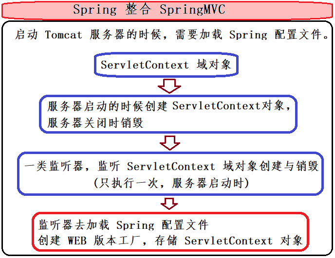

## 第七节 SSM 整合

说明：用 Spring 框架去整合其他框架 (SpringMVC 与 Mybatis)，使用配置文件+注解方式。


### 7.1 搭建环境

#### 7.1.1 创建数据库和表结构

```sql
CREATE DATABASE ssm;
USE ssm;
CREATE TABLE account(
	id INT PRIMARY KEY AUTO_INCREMENT,
	NAME VARCHAR(20),
	money DOUBLE
);
```

#### 7.1.2 创建 Maven 的工程

1. 创建 Maven 工程并添加 “archetypeCatalog:internal”。

2. 在 src->main 下创建 java 文件夹与 resources 文件夹，并右键选择 Mark Directory as，设置相应的根目录。 

3. 在 src->main->java 创建包
   * cn.itcast.domain
   * cn.itcast.dao
   * cn.itcast.service
   * cn.itcast.controller

#### 7.1.3 在 pom.xml 中导入坐标

```xml
<properties>
  <project.build.sourceEncoding>UTF-8</project.build.sourceEncoding>
  <maven.compiler.source>1.8</maven.compiler.source>
  <maven.compiler.target>1.8</maven.compiler.target>
  <spring.version>5.0.2.RELEASE</spring.version>
  <slf4j.version>1.6.6</slf4j.version>
  <log4j.version>1.2.12</log4j.version>
  <mysql.version>5.1.6</mysql.version>
  <mybatis.version>3.4.5</mybatis.version>
</properties>

<dependencies>
  <!-- spring -->
  <dependency>
    <!-- AOP 相关-->
    <groupId>org.aspectj</groupId>
    <artifactId>aspectjweaver</artifactId>
    <version>1.6.8</version>
  </dependency>

  <dependency>
    <groupId>org.springframework</groupId>
    <artifactId>spring-aop</artifactId>
    <version>${spring.version}</version>
  </dependency>

  <dependency>
    <!-- context 容器 -->
    <groupId>org.springframework</groupId>
    <artifactId>spring-context</artifactId>
    <version>${spring.version}</version>
  </dependency>

  <!-- SpringMVC 用到的 jar 包-->
  <dependency>
    <groupId>org.springframework</groupId>
    <artifactId>spring-web</artifactId>
    <version>${spring.version}</version>
  </dependency>

  <dependency>
    <groupId>org.springframework</groupId>
    <artifactId>spring-webmvc</artifactId>
    <version>${spring.version}</version>
  </dependency>
  <!-- SpringMVC 用到的 jar 包  结束-->

  <dependency>
    <!-- 单元测试 -->
    <groupId>org.springframework</groupId>
    <artifactId>spring-test</artifactId>
    <version>${spring.version}</version>
  </dependency>

  <dependency>
    <!-- 事务 -->
    <groupId>org.springframework</groupId>
    <artifactId>spring-tx</artifactId>
    <version>${spring.version}</version>
  </dependency>

  <dependency>
    <!-- jdbc 模板技术 -->
    <groupId>org.springframework</groupId>
    <artifactId>spring-jdbc</artifactId>
    <version>${spring.version}</version>
  </dependency>

  <dependency>
    <!-- 单元测试 -->
    <groupId>junit</groupId>
    <artifactId>junit</artifactId>
    <version>4.12</version>
    <scope>compile</scope>
  </dependency>

  <dependency>
    <!-- mysql 驱动 jar 包 -->
    <groupId>mysql</groupId>
    <artifactId>mysql-connector-java</artifactId>
    <version>${mysql.version}</version>
  </dependency>

  <dependency>
    <groupId>javax.servlet</groupId>
    <artifactId>servlet-api</artifactId>
    <version>2.5</version>
    <scope>provided</scope>
  </dependency>

  <dependency>
    <groupId>javax.servlet.jsp</groupId>
    <artifactId>jsp-api</artifactId>
    <version>2.0</version>
    <scope>provided</scope>
  </dependency>

  <dependency>
    <!-- el + jstl 表达式 -->
    <groupId>jstl</groupId>
    <artifactId>jstl</artifactId>
    <version>1.2</version>
  </dependency>

  <!-- log start -->
  <dependency>
    <groupId>log4j</groupId>
    <artifactId>log4j</artifactId>
    <version>${log4j.version}</version>
  </dependency>

  <dependency>
    <groupId>org.slf4j</groupId>
    <artifactId>slf4j-api</artifactId>
    <version>${slf4j.version}</version>
  </dependency>

  <dependency>
    <groupId>org.slf4j</groupId>
    <artifactId>slf4j-log4j12</artifactId>
    <version>${slf4j.version}</version>
  </dependency>
  <!-- log end -->

  <dependency>
    <groupId>org.mybatis</groupId>
    <artifactId>mybatis</artifactId>
    <version>${mybatis.version}</version>
  </dependency>

  <dependency>
    <!-- Spring 整合 Mybatis -->
    <groupId>org.mybatis</groupId>
    <artifactId>mybatis-spring</artifactId>
    <version>1.3.0</version>
  </dependency>

  <dependency>
    <!-- 连接池 -->
    <groupId>c3p0</groupId>
    <artifactId>c3p0</artifactId>
    <version>0.9.1.2</version>
    <type>jar</type>
    <scope>compile</scope>
  </dependency>
</dependencies>
```


#### 7.1.4 编写实体类

在 domain 中编写 Account 实体类，实现序列化接口

```java
package cn.itcast.domain;

import java.io.Serializable;

public class Account implements Serializable{
    private Integer id;
    private String name;
    private Double money;

    public Integer getId() {
        return id;
    }

    public void setId(Integer id) {
        this.id = id;
    }

    public String getName() {
        return name;
    }

    public void setName(String name) {
        this.name = name;
    }

    public Double getMoney() {
        return money;
    }

    public void setMoney(Double money) {
        this.money = money;
    }

    @Override
    public String toString() {
        return "Account{" +
                "id=" + id +
                ", name='" + name + '\'' +
                ", money=" + money +
                '}';
    }
}
```


#### 7.1.5 编写持久层接口

在 dao 下创建 IAccountDao 接口

```java
package cn.itcast.dao;
import cn.itcast.domain.Account;
import java.util.List;

/**
 * 帐户dao接口
 */
@Repository
public interface IAccountDao {
    // 查询所有账户
    public List<Account> findAll();
    // 保存帐户信息
    public void saveAccount(Account account);
}
```

#### 7.1.6 编写业务层接口及实现类

在 service 下创建 IAccountService 接口

```java
package cn.itcast.service;
import cn.itcast.domain.Account;
import java.util.List;

public interface IAccountService {
    // 查询所有账户
    public List<Account> findAll();
    // 保存帐户信息
    public void saveAccount(Account account);
}
```

在 service 下创建 impl.AccountServiceImpl 类

```java
package cn.itcast.service.impl;

import cn.itcast.domain.Account;
import cn.itcast.service.IAccountService;
import java.util.List;

public class AccountServiceImpl implements IAccountService{

    @Override
    public List<Account> findAll() {
        System.out.println("业务层：查询所有账户...");
        return null;
    }

    @Override
    public void saveAccount(Account account) {
        System.out.println("业务层：保存帐户...");
    }
}
```

#### 7.1.7 Web 层（controller）

在 controller 下创建 AccountController 类

```java
package cn.itcast.controller;

/**
 * 帐户web
 */
public class AccountController {
}
```

### 7.2 整合步骤


#### 7.2.1 保证 Spring 框架在 web 工程中独立运行

##### 7.2.1.1 第一步：编写 Spring 配置文件并导入约束

在 resources 文件夹下创建 applicationContext.xml 文件

```xml
<?xml version="1.0" encoding="UTF-8"?>
<beans xmlns="http://www.springframework.org/schema/beans"
       xmlns:xsi="http://www.w3.org/2001/XMLSchema-instance"
       xmlns:context="http://www.springframework.org/schema/context"
       xmlns:aop="http://www.springframework.org/schema/aop"
       xmlns:tx="http://www.springframework.org/schema/tx"
       xsi:schemaLocation="http://www.springframework.org/schema/beans
	http://www.springframework.org/schema/beans/spring-beans.xsd
	http://www.springframework.org/schema/context
	http://www.springframework.org/schema/context/spring-context.xsd
	http://www.springframework.org/schema/aop
	http://www.springframework.org/schema/aop/spring-aop.xsd
	http://www.springframework.org/schema/tx
	http://www.springframework.org/schema/tx/spring-tx.xsd">

    <!--开启注解的扫描，希望处理service和dao，controller不需要Spring框架去处理-->
    <context:component-scan base-package="cn.itcast" >
        <!--配置哪些注解不扫描-->
        <context:exclude-filter type="annotation" expression="org.springframework.stereotype.Controller" />
    </context:component-scan>

</beans>
```


##### 7.2.1.2 使用注解配置业务层


```java
package cn.itcast.service.impl;

import cn.itcast.domain.Account;
import cn.itcast.service.IAccountService;

import org.springframework.stereotype.Service;

import java.util.List;

@Service("accountService")
public class AccountServiceImpl implements IAccountService{

    @Override
    public List<Account> findAll() {
        System.out.println("业务层：查询所有账户...");
        return null;
    }

    @Override
    public void saveAccount(Account account) {
        System.out.println("业务层：保存帐户...");
    }
}
```


##### 7.2.1.3 第三步：测试 Spring 能否独立运行

```java
package cn.itcast.test;

import cn.itcast.service.IAccountService;
import org.junit.Test;
import org.springframework.context.ApplicationContext;
import org.springframework.context.support.ClassPathXmlApplicationContext;

public class TestSpring {

    @Test
    public void run1(){
        // 加载配置文件
        ApplicationContext ac = new ClassPathXmlApplicationContext("classpath:applicationContext.xml");
        // 获取对象
        IAccountService as = (IAccountService) ac.getBean("accountService");
        // 调用方法
        as.findAll();
    }
}
```


#### 7.2.2 保证 SpringMVC 在 web 工程中独立运行

##### 7.2.2.1 第一步：在 web.xml 中配置核心控制器（DispatcherServlet）

```xml
<!DOCTYPE web-app PUBLIC
 "-//Sun Microsystems, Inc.//DTD Web Application 2.3//EN"
 "http://java.sun.com/dtd/web-app_2_3.dtd" >

<web-app>
  <display-name>Archetype Created Web Application</display-name>

  <!--配置前端控制器-->
  <servlet>
    <servlet-name>dispatcherServlet</servlet-name>
    <servlet-class>org.springframework.web.servlet.DispatcherServlet</servlet-class>
    <!--加载springmvc.xml配置文件-->
    <init-param>
      <param-name>contextConfigLocation</param-name>
      <param-value>classpath:springmvc.xml</param-value>
    </init-param>
    <!--启动服务器，创建该servlet-->
    <load-on-startup>1</load-on-startup>
  </servlet>
  <servlet-mapping>
    <servlet-name>dispatcherServlet</servlet-name>
    <url-pattern>/</url-pattern>
  </servlet-mapping>

  <!--解决中文乱码的过滤器-->
  <filter>
    <filter-name>characterEncodingFilter</filter-name>
    <filter-class>org.springframework.web.filter.CharacterEncodingFilter</filter-class>
    <init-param>
      <param-name>encoding</param-name>
      <param-value>UTF-8</param-value>
    </init-param>
  </filter>
  <filter-mapping>
    <filter-name>characterEncodingFilter</filter-name>
    <url-pattern>/*</url-pattern>
  </filter-mapping>
  
</web-app>
```


##### 7.2.2.2 第二步：编写 SpringMVC 的配置文件

在 resources 文件夹下创建 springmvc.xml 文件

```xml
<?xml version="1.0" encoding="UTF-8"?>
<beans xmlns="http://www.springframework.org/schema/beans"
       xmlns:mvc="http://www.springframework.org/schema/mvc" xmlns:context="http://www.springframework.org/schema/context"
       xmlns:xsi="http://www.w3.org/2001/XMLSchema-instance"
       xsi:schemaLocation="
        http://www.springframework.org/schema/beans
        http://www.springframework.org/schema/beans/spring-beans.xsd
        http://www.springframework.org/schema/mvc
        http://www.springframework.org/schema/mvc/spring-mvc.xsd
        http://www.springframework.org/schema/context
        http://www.springframework.org/schema/context/spring-context.xsd">

    <!--开启注解扫描，只扫描Controller注解-->
    <context:component-scan base-package="cn.itcast">
        <context:include-filter type="annotation" expression="org.springframework.stereotype.Controller" />
    </context:component-scan>

    <!--配置的视图解析器对象-->
    <bean id="internalResourceViewResolver" class="org.springframework.web.servlet.view.InternalResourceViewResolver">
        <property name="prefix" value="/WEB-INF/pages/"/>
        <property name="suffix" value=".jsp"/>
    </bean>

    <!--过滤静态资源-->
    <mvc:resources location="/css/" mapping="/css/**" />
    <mvc:resources location="/images/" mapping="/images/**" />
    <mvc:resources location="/js/" mapping="/js/**" />

    <!--开启SpringMVC注解的支持-->
    <mvc:annotation-driven/>

</beans>
```


##### 7.2.2.3 第三步：编写 Controller 和 jsp 页面

【index.jsp 页面】

```html
<a href="account/findAll">测试查询</a>
```

【控制器】

```java
package cn.itcast.controller;

import org.springframework.stereotype.Controller;
import org.springframework.web.bind.annotation.RequestMapping;
import java.util.List;

/**
 * 帐户web
 */
@Controller
@RequestMapping("/account")
public class AccountController {

    @RequestMapping("/findAll")
    public String findAll(){
        System.out.println("表现层：查询所有账户...");
        return "list";
    }

}
```

【跳转页面 list.jsp】

在 WEB-INF 下创建 pages 文件夹，并在其下创建 list.jsp 

```html
<h3>查询所有账户信息</h3>
```


#### 7.2.3 整合 Spring 和 SpringMVC

##### 7.2.3.1 第一步：在 web.xml 中配置监听器实现启动服务创建容器




```xml
<!--配置Spring的监听器，默认只加载WEB-INF目录下的applicationContext.xml配置文件-->
<listener>
  <listener-class>org.springframework.web.context.ContextLoaderListener</listener-class>
</listener>
<!--设置配置文件的路径-->
<context-param>
  <param-name>contextConfigLocation</param-name>
  <param-value>classpath:applicationContext.xml</param-value>
</context-param>
```


##### 7.2.3.2 在 Controller 中调用 service 的方法 

```java
package cn.itcast.controller;

import cn.itcast.service.IAccountService;
import org.springframework.beans.factory.annotation.Autowired;
import org.springframework.stereotype.Controller;
import org.springframework.web.bind.annotation.RequestMapping;

import java.util.List;

/**
 * 帐户web
 */
@Controller
@RequestMapping("/account")
public class AccountController {

    @Autowired
    private IAccountService accountService;

    @RequestMapping("/findAll")
    public String findAll(){
        System.out.println("表现层：查询所有账户...");
        // 调用 service 的方法
        accountService.findAll();
        return "list";
    }
}
```


#### 7.2.4 保证 MyBatis 框架在 web 工程中独立运行

##### 7.2.4.1 持久层添加注解

```java
package cn.itcast.dao;

import cn.itcast.domain.Account;
import org.apache.ibatis.annotations.Insert;
import org.apache.ibatis.annotations.Select;
import org.springframework.stereotype.Repository;

import java.util.List;

/**
 * 帐户dao接口
 */
@Repository
public interface IAccountDao {

    // 查询所有账户
    @Select("select * from account")
    public List<Account> findAll();

    // 保存帐户信息
    @Insert("insert into account (name,money) values (#{name},#{money})")
    public void saveAccount(Account account);
}
```

##### 7.2.4.2 


##### 7.2.4.3 


##### 7.2.4.4 


#### 7.2.5 整合 Spring 和 MyBatis


#### 7.2.6 测试 SSM 整合结果


··