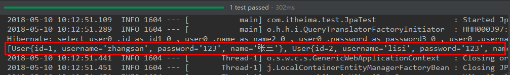

## 第四节 SpringBoot 整合其他技术

### 4.1 SpringBoot 整合 Mybatis

#### 4.1.1 添加 Mybatis 的起步依赖

```xml
<!-- mybatis 起步依赖 -->
<dependency>
    <groupId>org.mybatis.spring.boot</groupId>
    <artifactId>mybatis-spring-boot-starter</artifactId>
    <version>1.1.1</version>
</dependency>
```

#### 4.1.2 添加数据库驱动坐标

```xml
<!-- MySQL连接驱动 -->
<dependency>
    <groupId>mysql</groupId>
    <artifactId>mysql-connector-java</artifactId>
</dependency>
```

#### 4.1.3 添加数据库连接信息

在 application.properties 中添加数据量的连接信息

```properties
# DB Configuration:
spring.datasource.driverClassName=com.mysql.jdbc.Driver
spring.datasource.url=jdbc:mysql://127.0.0.1:3306/test?useUnicode=true&characterEncoding=utf8
spring.datasource.username=root
spring.datasource.password=mysql
```

#### 4.1.4 创建 user 表

在 test 数据库中创建 user 表

```sql
-- ----------------------------
-- Table structure for `user`
-- ----------------------------
DROP TABLE IF EXISTS `user`;
CREATE TABLE `user` (
  `id` int(11) NOT NULL AUTO_INCREMENT,
  `username` varchar(50) DEFAULT NULL,
  `password` varchar(50) DEFAULT NULL,
  `name` varchar(50) DEFAULT NULL,
  PRIMARY KEY (`id`)
) ENGINE=InnoDB AUTO_INCREMENT=10 DEFAULT CHARSET=utf8;

-- ----------------------------
-- Records of user
-- ----------------------------
INSERT INTO `user` VALUES ('1', 'zhangsan', '123', '张三');
INSERT INTO `user` VALUES ('2', 'lisi', '123', '李四');
```

#### 4.1.5 创建实体 Bean

```java
public class User {
    // 主键
    private Long id;
    // 用户名
    private String username;
    // 密码
    private String password;
    // 姓名
    private String name;
  
    //此处省略 getter 和 setter 方法 ...
}
```

#### 4.1.6 编写 Mapper

```java
@Mapper
public interface UserMapper {
	public List<User> queryUserList();
}
```

注意：@Mapper 标记该类是一个 mybatis 的 mapper 接口，可以被spring boot 自动扫描到 spring 上下文中。

#### 4.1.7 配置 Mapper 映射文件

在 src\main\resources\mapper 路径下加入 UserMapper.xml 配置文件"

```xml
<?xml version="1.0" encoding="utf-8" ?>
<!DOCTYPE mapper PUBLIC "-//mybatis.org//DTD Mapper 3.0//EN" "http://mybatis.org/dtd/mybatis-3-mapper.dtd" >
<mapper namespace="com.itheima.mapper.UserMapper">
    <select id="queryUserList" resultType="user">
        select * from user
    </select>
</mapper>
```

#### 4.1.8 在 application.properties 中添加 mybatis 的信息

```properties
# spring 集成 Mybatis 环境
# pojo 别名扫描包（实体类所在包）
mybatis.type-aliases-package=com.itheima.domain
#加载 Mybatis 映射文件
mybatis.mapper-locations=classpath:mapper/*Mapper.xml
```

#### 4.1.9 编写测试 Controller

```java
@Controller
public class MapperController {

    @Autowired
    private UserMapper userMapper;

    @RequestMapping("/queryUser")
    @ResponseBody
    public List<User> queryUser(){
        List<User> users = userMapper.queryUserList();
        return users;
    }

}
```

#### 4.1.10 测试


### 4.2 SpringBoot 整合 Junit

#### 4.2.1 添加 Junit 的起步依赖

```xml
<!-- 测试的起步依赖 -->
<dependency>
    <groupId>org.springframework.boot</groupId>
    <artifactId>spring-boot-starter-test</artifactId>
    <scope>test</scope>
</dependency>
```

#### 4.2.2 编写测试类

```java
package com.itheima.test;

import com.itheima.MySpringBootApplication;
import com.itheima.domain.User;
import com.itheima.mapper.UserMapper;
import org.junit.Test;
import org.junit.runner.RunWith;
import org.springframework.beans.factory.annotation.Autowired;
import org.springframework.boot.test.context.SpringBootTest;
import org.springframework.test.context.junit4.SpringRunner;

import java.util.List;

@RunWith(SpringRunner.class) //固定写法
@SpringBootTest(classes = MySpringBootApplication.class) //启动类(引导类)
public class MapperTest {

    @Autowired
    private UserMapper userMapper;

    @Test
    public void test() {
        List<User> users = userMapper.queryUserList();
        System.out.println(users);
    }
}
```

其中，

* SpringRunner 继承自 SpringJUnit4ClassRunner，使用哪一个 Spring 提供的测试测试引擎都可以。

    ```java
    public final class SpringRunner extends SpringJUnit4ClassRunner 
    ```

* `@SpringBootTest` 的属性指定的是**引导类**的字节码对象。


### 4.3 SpringBoot 整合 Spring Data JPA

#### 4.3.1 添加 Spring Data JPA 的起步依赖

```xml
<!-- springBoot JPA 的起步依赖 -->
<dependency>
    <groupId>org.springframework.boot</groupId>
    <artifactId>spring-boot-starter-data-jpa</artifactId>
</dependency>
```

#### 4.3.2 添加数据库驱动依赖

```xml
<!-- MySQL 连接驱动 -->
<dependency>
    <groupId>mysql</groupId>
    <artifactId>mysql-connector-java</artifactId>
</dependency>
```

#### 4.3.3 在 application.properties 中配置数据库和 jpa 的相关属性

```properties
#DB Configuration:
spring.datasource.driverClassName=com.mysql.jdbc.Driver
spring.datasource.url=jdbc:mysql://127.0.0.1:3306/test?useUnicode=true&characterEncoding=utf8
spring.datasource.username=root
spring.datasource.password=mysql

#JPA Configuration:
spring.jpa.database=MySQL
spring.jpa.show-sql=true
spring.jpa.generate-ddl=true
spring.jpa.hibernate.ddl-auto=update
spring.jpa.hibernate.naming_strategy=org.hibernate.cfg.ImprovedNamingStrategy
```

#### 4.3.4 创建实体类配置实体

```java
@Entity
public class User {
    // 主键
    @Id
    @GeneratedValue(strategy = GenerationType.IDENTITY)
    private Long id;
    // 用户名
    private String username;
    // 密码
    private String password;
    // 姓名
    private String name;
 
    //此处省略setter和getter方法... ...
}
```

#### 4.3.5 编写 UserRepository

```java
//JpaRepository<当前实体范型，实体id类型>
public interface UserRepository extends JpaRepository<User,Long>{
    public List<User> findAll();
}
```

#### 4.3.6 编写测试类

```java
@RunWith(SpringRunner.class)
@SpringBootTest(classes=MySpringBootApplication.class)
public class JpaTest {

    @Autowired
    private UserRepository userRepository;

    @Test
    public void test(){
        List<User> users = userRepository.findAll();
        System.out.println(users);
    }

}
```

#### 4.3.7 控制台打印信息



注意：如果是 jdk9，执行报错如下：


原因：jdk 缺少相应的 jar

解决方案：手动导入对应的 maven 坐标，如下：

```xml
<!-- jdk9 需要导入如下坐标 -->
<dependency>
    <groupId>javax.xml.bind</groupId>
    <artifactId>jaxb-api</artifactId>
    <version>2.3.0</version>
</dependency>
```


### 4.4 SpringBoot 整合 Redis

#### 4.4.1 添加 redis 的起步依赖

```xml
<!-- 配置使用redis启动器 -->
<dependency>
    <groupId>org.springframework.boot</groupId>
    <artifactId>spring-boot-starter-data-redis</artifactId>
</dependency>
```

#### 4.4.2 配置 redis 的连接信息

```properties
#Redis
spring.redis.host=127.0.0.1
spring.redis.port=6379
```

#### 4.4.3 注入 RedisTemplate 测试 redis 操作

```java
@RunWith(SpringRunner.class)
@SpringBootTest(classes = SpringbootJpaApplication.class)
public class RedisTest {

    @Autowired
    private UserRepository userRepository;

    @Autowired
    private RedisTemplate<String, String> redisTemplate;

    @Test
    public void test() throws JsonProcessingException {
        //从redis缓存中获得指定的数据
        String userListData = redisTemplate.boundValueOps("user.findAll").get();
        //如果redis中没有数据的话
        if(null==userListData){
            //查询数据库获得数据
            List<User> all = userRepository.findAll();
            //转换成json格式字符串
            ObjectMapper om = new ObjectMapper();
            userListData = om.writeValueAsString(all);
            //将数据存储到redis中，下次在查询直接从redis中获得数据，不用在查询数据库
            redisTemplate.boundValueOps("user.findAll").set(userListData);
            System.out.println("===============从数据库获得数据===============");
        }else{
            System.out.println("===============从redis缓存中获得数据===============");
        }

        System.out.println(userListData);

    }

}
```

