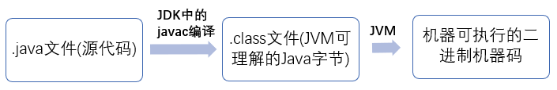
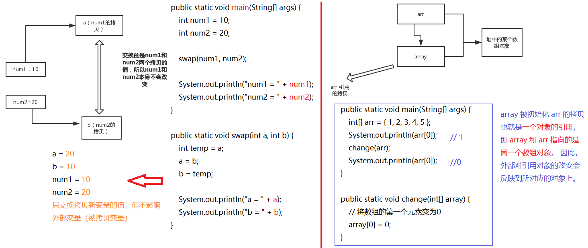
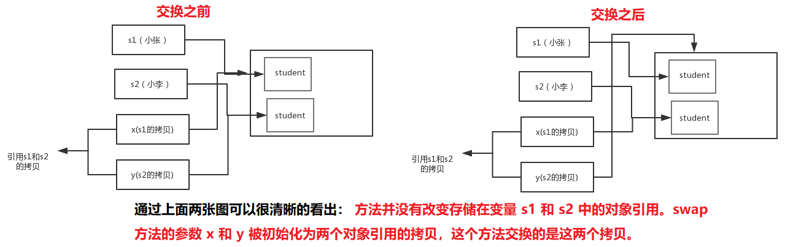
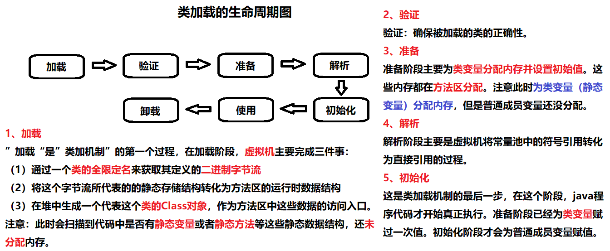

## 第一节 基础

### 1.1 概念与常识

##### 【1】Java 语言特点?

* 面向对象（封装，继承，多态）；
* 平台无关性（ Java 虚拟机实现平台无关性）；
* 支持多线程；
* 支持网络编程并且很方便（ Java 语言诞生本身就是为简化网络编程设计的，因此 Java 语言不仅支持网络编程而且很方便）；
* 编译与解释并存；
* 可靠性、安全性。

##### 【2】为什么说 Java 语言“编译与解释并存”？

高级编程语言按照程序的执行方式分为【编译型和解释型】两种。简单来说，编译型语言是指编译器针对特定的操作系统将源代码**一次性**翻译成可被该平台执行的**机器码**；解释型语言是指解释器对源程序逐行解释成特定平台的**机器码并立即执行**。

Java 语言既具有编译型语言的特征，也具有解释型语言的特征，因为 Java 程序要经过先编译，后解释两个步骤，由 Java 编写的程序需要先经过编译步骤，生成字节码（*.class 文件），这种字节码必须由 Java 解释器来解释执行。因此，可以认为 Java 语言编译与解释并存。

##### 【3】Java 和 C++ 的区别?

1. 都是**面向对象**的语言，都支持**封装、继承和多态**
2. Java 不提供指针来直接访问内存，程序内存更加安全
3. Java 的类是**单继承**的，C++ 支持**多重继承**；虽然 Java 的类不可以多继承，但是**接口可以多继承**。
4. **Java 有自动内存管理垃圾回收机制(GC)**，不需要程序员手动释放无用内存
5. 在 C 语言中，字符串或字符数组最后都会有一个额外的字符'\0'来表示结束。但是，Java 语言中没有结束符这一概念。
  * [原因](https://blog.csdn.net/sszgg2006/article/details/49148189)：Java 里面一切都是对象，是对象的话，字符串肯定就有长度，既然有长度，编译器就可以确定要输出的字符个数，当然也就没有必要去浪费那 1 字节的空间用以标明字符串的结束了。比如，数组对象里有一个属性 length，就是数组的长度，String 类里面有方法 length() 可以确定字符串的长度，因此对于输出函数来说，有直接的大小可以判断字符串的边界，编译器就没必要再去浪费一个空间标识字符串的结束。
  
##### 【4】Java 程序从源代码到运行 

一般有下面 3 步：



4.1 什么是字节码?采用字节码的好处是什么?

1) 在 Java 中，JVM 可以理解的代码就叫做字节码（即扩展名为 .class 的文件），它不面向任何特定的处理器，只面向虚拟机。
2) Java 语言通过字节码的方式，在一定程度上解决了传统解释型语言执行效率低的问题，同时又保留了解释型语言可移植的特点。所以 Java 程序运行时比较高效，而且，由于字节码并不针对一种特定的机器，因此，Java 程序无须重新编译便可在多种不同操作系统的计算机上运行。

4.2 需格外注意[.class->机器码]步骤

&emsp;&emsp;在这一步 JVM 类加载器首先加载字节码文件，然后通过解释器逐行解释执行，这种方式的执行速度会相对比较慢。而且，有些方法和代码块是经常需要被调用的(也就是所谓的热点代码)，所以后面引进了 JIT 编译器。
&emsp;&emsp;JIT 属于运行时编译。当 JIT 编译器完成第一次编译后，其会将字节码对应的机器码保存下来，下次可以直接使用。机器码的运行效率高于 Java 解释器的。这也解释了为什么经常会说 Java 是编译与解释共存的语言。

##### 【5】区分 JVM JDK 和 JRE

* [JVM] Java 虚拟机（JVM）是运行 Java 字节码的虚拟机。JVM 有针对不同系统的特定实现（Windows，Linux，macOS），目的是使用相同的字节码，它们都会给出相同的结果。
* [JDK] JDK 是 Java Development Kit 缩写，它是功能齐全的 Java SDK。它**拥有 JRE 所拥有的一切，还有编译器（javac）和工具（如 javadoc 和 jdb）**。它能够创建和编译程序。
* [JRE] JRE 是 Java 运行时环境。它是运行已编译 Java 程序所需的所有内容的集合，**包括 Java 虚拟机（JVM），Java 类库，java 命令和其他的一些基础构件**。但是，它不能用于创建新程序。

> 如果只是为了运行一下 Java 程序的话，只需要安装 JRE 就可以。如果需要进行一些 Java 编程方面的工作，需要安装 JDK。
> 但是，这不是绝对的。有时，即使不打算在计算机上进行任何 Java 开发，仍然需要安装 JDK。例如，如果要使用 JSP 部署 Web 应用程序，那么从技术上讲，只是在应用程序服务器中运行 Java 程序。那为什么需要 JDK 呢？因为应用程序服务器会将 JSP 转换为 Java servlet，并且需要使用 JDK 来编译 servlet。

##### 【6】什么是 Java 程序的主类?应用程序和小程序的主类有何不同?

1) 主类是 Java 程序执行的入口点。一个程序中可以有多个类，但只能有一个类是主类。
2) 在 Java 应用程序中，这个主类是指包含 main() 方法的类。而在 Java 小程序中，这个主类是一个**继承自系统类 JApplet 或 Applet 的子类**。应用程序的主类不一定要求是 public 类，但**小程序的主类要求必须是 public 类**。

##### 【7】Java 应用程序与小程序之间有哪些差别?

简单说应用程序是从主线程启动(也就是 main() 方法)。applet 小程序没有 main() 方法，主要是嵌在浏览器页面上运行(调用init()或者run()来启动)，嵌入浏览器这点跟 flash 的小游戏类似。

### 1.2 Java 基础语法

#### 1.2.1 语法

##### 【1】字符型常量和字符串常量的区别?

1. 形式上: 字符常量是[单引号]引起的一个字符; 字符串常量是[双引号]引起的0个或若干个字符。
2. 含义上: 字符常量相当于一个整型值( ASCII 值)，可以参加表达式运算; 字符串常量代表一个地址值(该字符串在内存中存放位置)。
3. 占内存大小：字符常量只占 2 个字节; 字符串常量占若干个字节 (注意： char 在 Java 中占两个字节)
  * 字符封装类 Character 有一个成员常量 Character.SIZE 值为 16，单位是 bits。该值除以 8(1byte=8bits) 后就可以得到 2 个字节。
  

  
##### 【2】Java 中的注释：单行注释、多行注释、文档注释。

代码的注释不是越详细越好。实际上好的代码本身就是注释，要尽量规范和美化自己的代码来减少不必要的注释。若编程语言足够有表达力，就不需要注释，尽量通过代码来阐述。

去掉下面复杂的注释，只需要创建一个与注释所言同一事物的函数即可

```java
// check to see if the employee is eligible for full benefits
if ((employee.flags & HOURLY_FLAG) && (employee.age > 65))
```

应替换为

```java
if (employee.isEligibleForFullBenefits())
```

##### 【3】Java 泛型及类型擦除？

🍓🍓🍓 一定要看 [详细解释](https://www.cnblogs.com/wuqinglong/p/9456193.html)

Java 泛型: `List<Object>`、`List<String>` 等
类型擦除：Java的泛型是伪泛型，这是因为Java在编译期间，所有的泛型信息都会被擦掉。Java的泛型基本上都是在编译器这个层次上实现的，在生成的字节码中是不包含泛型中的类型信息的，使用泛型的时候加上类型参数，在编译器编译的时候会去掉，这个过程成为类型擦除。如在代码中定义 List<Object> 和 List<String> 等类型，在编译后都会变成 List，JVM 看到的只是List，而由泛型附加的类型信息对 JVM 是看不到的。类型擦除也是 Java 的泛型与 C++ 模板机制实现方式之间的重要区别。


泛型一般有三种使用方式:泛型类、泛型接口、泛型方法。

1) 泛型类

```java
//此处T可以随便写为任意标识，常见的如T、E、K、V等形式的参数常用于表示泛型
//在实例化泛型类时，必须指定T的具体类型
public class Generic<T>{ 
    private T key;
    public Generic(T key) { 
        this.key = key;
    }
    public T getKey(){ 
        return key;
    }
}
//实例化泛型类
Generic<Integer> genericInteger = new Generic<Integer>(123456);
```

2) 泛型接口

```java
public interface Generator<T> {
    public T method();
}

//实现泛型接口，不指定类型：
class GeneratorImpl<T> implements Generator<T>{
    @Override
    public T method() {
        return null;
    }
}

//实现泛型接口，指定类型：
class GeneratorImpl<T> implements Generator<String>{
    @Override
    public String method() {
        return "hello";
    }
}
```

3) 泛型方法

```java
public static < E > void printArray( E[] inputArray )
{         
     for ( E element : inputArray ){        
        System.out.printf( "%s ", element );
     }
     System.out.println();
}

//使用
Integer[] intArray = { 1, 2, 3 };
String[] stringArray = { "Hello", "World" };
printArray( intArray );
printArray( stringArray );
```

##### 【4】常用的通配符为： T，E，K，V，？

本质上这些个都是通配符，没什么区别，只不过是编码时的一种约定俗成的东西。通常情况下，
* `？` 表示不确定的 java 类型
* `T (type)` 表示具体的一个 java 类型
* `K V (key value)` 分别代表 java 键值中的 Key Value
* `E (element)` 代表 Element

[通配符详解](https://juejin.im/post/6844903917835419661)

##### 【5】== 和 equals 的区别

* `==` : 作用是[判断两个对象的地址是不是相等]。即**判断两个对象是不是同一个对象**。(基本数据类型==比较的是值，**引用数据类型**==比较的是**内存地址**)
  * 因为 Java 只有值传递，所以，对于 == 来说，不管是比较基本数据类型，还是引用数据类型的变量，其本质比较的都是值，只是引用类型变量存的值是对象的地址。
* `equals()` : 作用也是[通过对象地址判断两个对象是否相等]，它不能用于比较基本数据类型的变量。equals()方法存在于 Object 类中，而 Object 类是所有类的直接或间接父类。
  * 情况 1：**类没有覆盖 equals()方法**。则通过 equals()比较该类的两个对象时，等价于通过“==”比较这两个对象。使用的默认是 Object类equals()方法。
  * 情况 2：**类覆盖了 equals()方法**。一般，都覆盖 equals()方法来两个对象的内容相等；若它们的内容相等，则返回 true(即，认为这两个对象相等)。


> 使用默认的“equals()”方法，等价于“==”方法。因此，通常会重写equals()方法：若两个对象的内容相等，则equals()方法返回true；否则，返回fasle。

````java
//Object 类 equals()方法：
//🍓Object 的 equals 方法是比较的对象的内存地址
public boolean equals(Object obj) {
     return (this == obj);
}
```

举个例子：

```java
public class test1 {
    public static void main(String[] args) {
        String a = new String("ab"); // a 为一个引用
        String b = new String("ab"); // b为另一个引用,对象的内容一样
        String aa = "ab"; // 放在常量池中
        String bb = "ab"; // 从常量池中查找
        if (aa == bb) // true
            System.out.println("aa==bb");
        if (a == b) // false，非同一对象
            System.out.println("a==b");
        if (a.equals(b)) // true
            System.out.println("aEQb");
        if (42 == 42.0) { // true
            System.out.println("true");
        }
    }
}
```

说明：
* String 中的 equals 方法是被重写过的，**因为 Object 的 equals 方法是比较的对象的内存地址，而 String 的 equals 方法比较的是对象的值**。
* 当创建 String 类型的对象时，虚拟机会**在常量池中查找**有没有已经存在的值和要创建的值相同的对象，如果有就把它赋给当前引用。如果没有就在常量池中重新创建一个 String 对象。

String 类 equals() 方法：

```java
public boolean equals(Object anObject) {
    if (this == anObject) {
        return true;
    }
    if (anObject instanceof String) {
        String anotherString = (String)anObject;
        int n = value.length;
        if (n == anotherString.value.length) {
            char v1[] = value;
            char v2[] = anotherString.value;
            int i = 0;
            while (n-- != 0) {
                if (v1[i] != v2[i])
                    return false;
                i++;
            }
            return true;
        }
    }
    return false;
}
```

##### 【6】hashCode()与 equals()

面试官可能会问你：“你重写过 hashcode 和 equals 么，为什么重写 equals 时必须重写 hashCode 方法？”

1) hashCode()介绍

1. hashCode() 的作用是获取哈希码，也称为散列码；它实际上是返回一个 int 整数。这个哈希码的作用是确定该对象在哈希表中的索引位置。
2. hashCode() 定义在 JDK 的 Object 类中，这就意味着 Java 中的任何类都包含有 hashCode() 函数。
  * 虽然，每个 Java 类都包含 hashCode() 函数。但是，仅仅当创建并某个“类的散列表”(Java集合中本质是散列表的类，如HashMap，Hashtable，HashSet)时，该类的 hashCode() 才有用(作用是：确定该类的每一个对象在散列表中的位置；其它情况下(例如，创建类的单个对象，或者创建类的对象数组等等)，类的 hashCode() 没有作用。
  * 即，hashCode() 在散列表中才有用，在其它情况下没用。
3. 需要注意的是：Object 的 hashcode 方法是本地方法，也就是用 c 语言或 c++ 实现的，该方法通常用来将对象的 内存地址 转换为整数之后返回。
```java
public native int hashCode();
```

2) 为什么要有 hashCode？

“HashSet 如何检查重复”为例子来说明为什么要有 hashCode？

1. 当把对象加入 HashSet 时，HashSet 会先计算对象的 hashcode 值来判断对象加入的位置，同时也会与其他已经加入的对象的 hashcode 值作比较，如果没有相符的 hashcode，HashSet 会假设对象没有重复出现。
2. 如果发现有相同 hashcode 值的对象，这时会调用 equals() 方法来检查 hashcode 相等的对象是否真的相同。如果两者相同，HashSet 就不会让其加入操作成功。如果不同的话，就会重新散列到其他位置。大大减少了 equals 的次数，相应就大大提高了执行速度。

3) 为什么重写 equals 时必须重写 hashCode 方法？

* 如果两个对象相等，则 hashcode 一定也是相同的。
* 但是，两个对象有相同的 hashcode 值，它们也不一定是相等的。
  * 因为在散列表中，hashCode()相等，即两个键值对的哈希值相等。然而哈希值相等，并不一定能得出键值对相等。补充说一句：“两个不同的键值对，哈希值相等”，这就是哈希冲突。
* 因此，equals 方法被覆盖过，则 hashCode 方法也必须被覆盖。

> hashCode()的默认行为是对堆上的对象(对内存)产生独特值。如果没有重写 hashCode()，则该 class 的两个对象无论如何都不会相等（即使这两个对象指向相同的数据）。

[Java hashCode() 和 equals()的若干问题解答](https://www.cnblogs.com/skywang12345/p/3324958.html)

#### 1.2.2 基本数据类型

Java中有 8 种基本数据类型，分别为：
* 6 种数字类型 ：byte、short、int、long、float、double
* 1 种字符类型：char
* 1 种布尔型：boolean。
  * 对于boolean，官方文档未明确定义，它依赖于 JVM 厂商的具体实现。逻辑上理解是占用 1位，但是实际中会考虑计算机高效存储因素。
  
这八种基本类型都有对应的包装类分别为：Byte、Short、Integer、Long、Float、Double、Character、Boolean

|基本类型|位数|字节|默认值|
| ---- | ---- | ---- | ---- |			
|int	|32	|4	|0      |
|short	|16	|2	|0      |
|long	|64	|8	|0L     |
|byte	|8	|1	|0      |
|char	|16	|2	|'u0000'|
|float	|32	|4	|0f     |
|double	|64	|8	|0d     |
|boolean|	|1	|false  |

##### 自动装箱与拆箱

装箱：将基本类型用它们对应的引用类型包装起来；
拆箱：将包装类型转换为基本数据类型；

装箱过程是通过调用包装器的 `valueOf` 方法实现的，而拆箱过程是通过调用包装器的 `xxxValue` 方法实现的。（xxx代表对应的基本数据类型）。

[深入剖析 Java 中的装箱和拆箱](https://www.cnblogs.com/dolphin0520/p/3780005.html)


面试题 1：谈谈 `Integer i = new Integer(xxx)` 和 `Integer i =xxx;` 这两种方式的区别？
主要有以下这两点区别：
* 第一种方式不会触发自动装箱的过程；而第二种方式会触发；
* 在执行效率和资源占用上的区别。第二种方式的执行效率和资源占用在一般性情况下要优于第一种情况（注意这并不是绝对的）。

🍓 Java 基本类型的包装类的大部分都实现了常量池技术，即 Byte、Short、Integer、Long、Character、Boolean；前面 4 种包装类默认创建了数值[-128，127] 的相应类型的缓存数据，Character创建了数值在[0,127]范围的缓存数据，Boolean 直接返回True Or False。如果超出对应范围仍然会去创建新的对象。两种浮点数类型的包装类 Float、Double 并没有实现常量池技术。


面试题 2：

```java
public class Main {
    public static void main(String[] args) {
         
        Integer a = 1;
        Integer b = 2;
        Integer c = 3;
        Integer d = 3;
        Integer e = 321;
        Integer f = 321;
        Long g = 3L;
        Long h = 2L;
         
        System.out.println(c==d); //true
        System.out.println(e==f); //false
        System.out.println(c==(a+b)); //true 包含了算术运算，因此会触发自动拆箱过程，比较的是数值是否相等
        System.out.println(c.equals(a+b)); //true
        System.out.println(g==(a+b)); //true
        System.out.println(g.equals(a+b)); //false
        System.out.println(g.equals(a+h)); //true
    }
}
```

> 当 "=="运算符的两个操作数都是 包装器类型的引用，则是比较指向的是否是同一个对象，而如果其中有一个操作数是表达式（即包含算术运算）则比较的是数值（即会触发自动拆箱的过程）。
> 对于包装器类型，equals方法并不会进行类型转换。

* c.equals(a+b)会先触发自动拆箱过程，再触发自动装箱过程，也就是说a+b，会先各自调用intValue方法，得到了加法运算后的数值之后，便调用Integer.valueOf方法，再进行equals比较。

#### 1.2.3 方法（函数）

##### 【1】为什么 Java 中只有值传递？

参数传递方式：按值调用(call by value)表示方法接收的是调用者提供的值，而按引用调用（call by reference)表示方法接收的是调用者提供的变量地址。一个方法可以修改传递引用所对应的变量值，而不能修改传递值调用所对应的变量值。

Java 程序设计语言总是采用按值调用。也就是说，方法得到的是所有参数值的一个拷贝，也就是说，方法不能修改传递给它的任何参数变量的内容。



实现一个**改变对象参数状态**的方法并不是一件难事。理由很简单，方法得到的是**对象引用的拷贝**，对象引用及其他的拷贝同时引用同一个对象。

🍓 有些程序员（甚至本书的作者）认为 Java 程序设计语言对对象采用的是引用调用，实际上，这种理解是不对的。由于这种误解具有一定的普遍性，所以下面给出一个反例来详细地阐述一下这个问题。

```java
public class Test {

    public static void main(String[] args) {
        // TODO Auto-generated method stub
        Student s1 = new Student("小张");
        Student s2 = new Student("小李");
        Test.swap(s1, s2);
        System.out.println("s1:" + s1.getName());
        System.out.println("s2:" + s2.getName());
    }

    public static void swap(Student x, Student y) {
        Student temp = x;
        x = y;
        y = temp;
        System.out.println("x:" + x.getName());
        System.out.println("y:" + y.getName());
    }
}

//结果
x:小李
y:小张
s1:小张
s2:小李
```



Java 程序设计语言对对象采用的不是引用调用，实际上，对象引用是【按值传递】的。
* 一个方法不能修改一个基本数据类型的参数（即数值型或布尔型）。
* 一个方法可以改变一个对象参数的状态。
* 一个方法不能让对象参数引用一个新的对象。


##### 【2】重载和重写的区别

* 重载就是同样的一个方法能够根据输入数据的不同，做出不同的处理。发生在同一个类中，方法名必须相同，参数类型不同、个数不同、顺序不同，不考虑方法返回值和访问修饰符。
* 重写就是当子类继承自父类的相同方法，输入数据一样，但要做出有别于父类的响应时，你就要覆盖父类方法。重写发生在运行期，是子类对父类的允许访问的方法的实现过程进行重新编写。
  * 返回值类型、方法名、参数列表必须相同，抛出的异常范围小于等于父类，访问修饰符范围大于等于父类。
  * 如果父类方法访问修饰符为 `private/final/static` 则子类就不能重写该方法，但是被 `static` 修饰的方法能够被再次声明。
  * 构造方法无法被重写
  
|区别点	|重载方法	|重写方法|
|----|----|----|
|发生范围	|同一个类	|子类|
|参数列表	|必须修改	|一定不能修改|
|返回类型	|可修改	|子类方法返回值类型应比父类方法返回值类型更小或相等|
|异常	|可修改	|子类方法声明抛出的异常类应比父类方法声明抛出的异常类更小或相等|
|访问修饰符	|可修改	|一定不能做更严格的限制（可以降低限制）|
|发生阶段	|编译期	|运行期|


方法的重写要遵循“两同两小一大”
* “两同”即方法名相同、形参列表相同；
* “两小”指的是子类方法返回值类型应比父类方法返回值类型更小或相等，子类方法声明抛出的异常类应比父类方法声明抛出的异常类更小或相等；
* “一大”指的是子类方法的访问权限应比父类方法的访问权限更大或相等。

##### 【3】深拷贝 vs 浅拷贝

**浅拷贝**：对基本数据类型进行值传递，对引用数据类型进行引用传递般的拷贝，此为浅拷贝。
**深拷贝**：对基本数据类型进行值传递，对引用数据类型，创建一个新的对象，并复制其内容，此为深拷贝。


### 1.5 Java 面向对象

#### 1.5.1 类和对象

##### 【1】面向对象和面向过程的区别

**面向过程：**面向过程性能比面向对象高。 因为类调用时需要实例化，开销比较大，比较消耗资源，所以当性能是最重要的考量因素的时候，比如单片机、嵌入式开发、Linux/Unix 等一般采用面向过程开发。但是，面向过程没有面向对象易维护、易复用、易扩展。
**面向对象：**面向对象易维护、易复用、易扩展。 因为面向对象有封装、继承、多态性的特性，所以可以设计出低耦合的系统，使系统更加灵活、更加易于维护。但是，面向对象性能比面向过程低。

[面向过程性能比面向对象高？](https://github.com/Snailclimb/JavaGuide/issues/431)

##### 【2】构造器 Constructor 是否可被 override?

Constructor 不能被 override（重写），但是可以 overload（重载），所以可以看到一个类中有多个构造函数的情况。

##### 【3】成员变量与局部变量的区别有哪些？

1. **从语法形式上看**:成员变量是属于类的，而局部变量是在代码块或方法中定义的变量或是方法的参数；成员变量可以被 public、private、static 等修饰符所修饰，而局部变量不能被访问控制修饰符及 static 所修饰；但是，成员变量和局部变量都能被 final 所修饰。
2. **从变量在内存中的存储方式来看**:如果成员变量是使用 static 修饰的，那么这个成员变量是属于类的，如果没有使用 static 修饰，这个成员变量是属于实例的。而**对象存在于堆内存，局部变量则存在于栈内存**。
3. **从变量在内存中的生存时间上看**:成员变量是对象的一部分，它随着对象的创建而存在，而局部变量随着方法的调用而自动消失。
4. **成员变量如果没有被赋初值**:则会自动以类型的默认值而赋值（一种情况例外:被 final 修饰的成员变量也必须显式地赋值），而局部变量则不会自动赋值。


##### 【4】创建一个对象用什么运算符?对象实体与对象引用有何不同?

new 运算符，new 创建对象实例（对象实例在堆内存中），对象引用指向对象实例（对象引用存放在栈内存中）。一个对象引用可以指向 0 个或 1 个对象（一根绳子可以不系气球，也可以系一个气球）;一个对象可以有 n 个引用指向它（可以用 n 条绳子系住一个气球）。

##### 【5】构造方法有哪些特性？

1. 名字与类名相同。
2. 没有返回值，但不能用 void 声明构造函数。
3. 生成类的对象时自动执行，无需调用。

##### 【6】对象的相等与指向他们的引用相等，两者有什么不同?

对象的相等，比的是内存中存放的内容是否相等。而引用相等，比较的是他们指向的内存地址是否相等。

#### 1.5.2 面向对象三大特征

1. 封装：封装是指把一个对象的状态信息（也就是属性）隐藏在对象内部，不允许外部对象直接访问对象的内部信息。但是可以提供一些可以被外界访问的方法来操作属性。
2. 继承：继承是使用已存在的类的定义作为基础建立新类的技术，新类的定义可以增加新的数据或新的功能，也可以用父类的功能，但不能选择性地继承父类。通过使用继承，可以快速地创建新的类，可以提高代码的重用，程序的可维护性，节省大量创建新类的时间 ，提高开发效率。
  * 子类拥有父类对象所有的属性和方法（包括私有属性和私有方法），但是父类中的**私有属性和方法**子类是**无法访问，只是拥有**。
  * 子类可以拥有自己属性和方法，即子类可以对父类进行扩展。（新增属性及方法）
  * 子类可以用自己的方式实现父类的方法。（重写父类方法Override）
3. 多态：表示一个对象具有多种的状态。具体表现为父类的引用指向子类的实例。
  * 对象类型和引用类型之间具有继承（类）/实现（接口）的关系；
  * 对象类型不可变，引用类型可变；
  * 方法具有多态性，属性不具有多态性；
  * 引用类型变量发出的方法调用的到底是哪个类中的方法，必须在程序运行期间才能确定；
  * 多态不能调用“只在子类存在但在父类不存在”的方法；
  * 如果子类重写了父类的方法，真正执行的是子类覆盖的方法，如果子类没有覆盖父类的方法，执行的是父类的方法。


#### 1.5.3 修饰符

##### 【1】静态方法不能调用非静态成员

静态方法是属于类的，在类加载的时候就会分配内存，可以通过类名直接去访问，非静态成员（变量和方法）属于类的对象，所以只有该对象初始化之后才存在，然后通过类的对象去访问。也就是说如果在静态方法中调用非静态成员变量会超前，可能会调用了一个还未初始化的变量。因此编译器会报错。




##### 【2】常见关键字总结: static/final/this/super

###### final 关键字

final关键字，意思是最终的、不可修改的，用来修饰类、方法和变量，具有以下特点：
* final 修饰的类不能被继承，final 类中的所有成员方法都会被隐式的指定为 final 方法；
* final 修饰的方法不能被重写；
* final 修饰的变量是常量，如果是基本数据类型的变量，则其数值一旦在初始化之后便不能更改；如果是引用类型的变量，则在对其初始化之后便不能让其指向另一个对象。

说明：使用 final 方法的原因有两个。第一个原因是把方法锁定，以防任何继承类修改它的含义；第二个原因是效率。在早期的Java实现版本中，会将final方法转为内嵌调用。但是如果方法过于庞大，可能看不到内嵌调用带来的任何性能提升（现在的Java版本已经不需要使用final方法进行这些优化了）。**类中所有的 private 方法都隐式地指定为 final**。

###### static 关键字

**static 关键字主要有以下四种使用场景**：

* **修饰成员变量和成员方法**: 被 static 修饰的成员属于类，不属于单个这个类的某个对象，被类中所有对象共享，可以并且建议通过类名调用。被 static 声明的成员变量属于静态成员变量，静态变量 存放在 **Java 内存区域的方法区**。调用格式：`类名.静态变量名 类名.静态方法名()`
  * **方法区**与 Java 堆一样，是**各个线程共享的内存区域**，它**用于存储已被虚拟机加载的类信息、常量、静态变量、即时编译器编译后的代码等数据**。虽然Java虚拟机规范把方法区描述为堆的一个逻辑部分，但是它却有一个别名叫做 Non-Heap（非堆），目的应该是与 Java 堆区分开来。
  
* **静态代码块**: 静态代码块定义在类中方法外，**静态代码块在非静态代码块之前执行**(静态代码块—>非静态代码块—>构造方法)。 该类不管创建多少对象，**静态代码块只执行一次**。
  * 格式：`static {语句体;}`
  * 一个类中的静态代码块**可以有多个**，位置可以随便放，它不在任何的方法体内，JVM 加载类时会执行这些静态的代码块，如果静态代码块有多个，JVM 将按照它们在类中出现的先后顺序依次执行它们，每个代码块只会被执行一次。
  * 静态代码块对于定义在它之后的静态变量，可以赋值，但是不能访问。
  
* **静态内部类**（static 修饰类的话只能修饰内部类）： 静态内部类与非静态内部类之间存在一个最大的区别: 非静态内部类在编译完成之后会隐含地保存着一个引用，该引用是指向创建它的外围类，但是静态内部类却没有。没有这个引用就意味着：1. 它的创建是不需要依赖外围类的创建。2. 它不能使用任何外围类的非 static 成员变量和方法。
```java
//Example（静态内部类实现单例模式）
public class Singleton {

    //声明为 private 避免调用默认构造方法创建对象
    private Singleton() {
    }

   // 声明为 private 表明静态内部该类只能在该 Singleton 类中被访问
    private static class SingletonHolder {
        private static final Singleton INSTANCE = new Singleton();
    }

    public static Singleton getUniqueInstance() {
        return SingletonHolder.INSTANCE;
    }
}
```
**当 Singleton 类加载时，静态内部类 SingletonHolder 没有被加载进内存**。只有当调用 getUniqueInstance() 方法从而触发 SingletonHolder.INSTANCE 时 SingletonHolder 才会被加载，此时初始化 INSTANCE 实例，并且 **JVM 能确保 INSTANCE 只被实例化一次**。这种方式不仅具有延迟初始化的好处，而且由 JVM 提供了对线程安全的支持。

* ** 静态导包**(用来导入类中的静态资源，1.5之后的新特性): 格式为：import static 这两个关键字连用可以指定导入某个类中的**指定静态资源**，并且不需要使用类名调用类中静态成员，可以直接使用类中静态成员变量和成员方法。
```java
 //将Math中的所有静态资源导入，这时候可以直接使用里面的静态方法，而不用通过类名进行调用
 //如果只想导入单一某个静态方法，只需要将换成对应的方法名即可

import static java.lang.Math.*;//换成import static java.lang.Math.max;具有一样的效果
public class Demo {
  public static void main(String[] args) {
    int max = max(1,2);
    System.out.println(max);
  }
}
```

###### this 关键字

this关键字用于引用类的当前实例。

```java
class Manager {
    Employees[] employees;
    void manageEmployees() {
        int totalEmp = this.employees.length;
        System.out.println("Total employees: " + totalEmp);
        this.report();
    }
    void report() { }
}
```

###### super 关键字

super关键字用于从子类访问父类的变量和方法。 

```java
public class Super {
    protected int number;
    protected showNumber() {
        System.out.println("number = " + number);
    }
}
public class Sub extends Super {
    void bar() {
        super.number = 10;
        super.showNumber();
    }
}
```

使用 this 和 super 要注意的问题：
* 在构造器中使用 super（） 调用父类中的其他构造方法时，该语句必须处于构造器的首行，否则编译器会报错。另外，this 调用本类中的其他构造方法时，也要放在首行。
* this、super 不能用在 static 方法中。被 static 修饰的成员属于类，不属于单个这个类的某个对象，被类中所有对象共享。而 this 代表对本类对象的引用，指向本类对象；而 super 代表对父类对象的引用，指向父类对象；所以，this 和 super 是属于对象范畴的东西，而静态方法是属于类范畴的东西。


#### 1.5.4 接口和抽象类


#### 1.5.5 其他重要知识点


### 1.6 Java 核心技术


