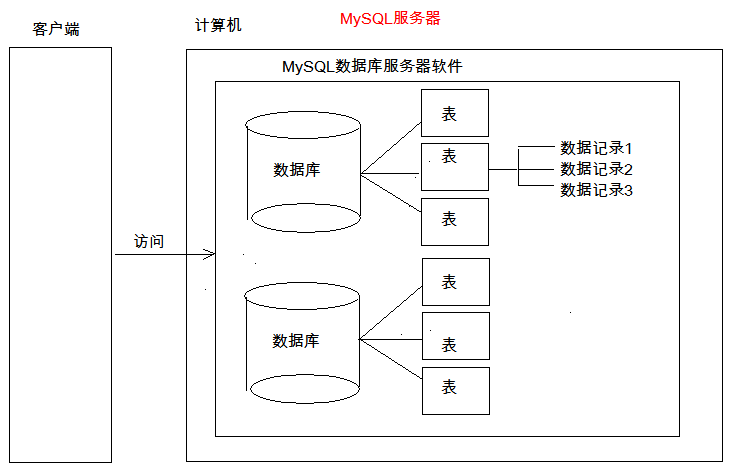

## 第二节 MySQL 基础

### 一、前期准备

[详见](https://www.cnblogs.com/miaomiaowu/p/13181595.html#autoid-h2-3-0-0)

#### MySQL配置及使用

安装 MySQL 实际上安装的是 MySQL 服务，安装 MySQL 服务后，其会在 Windows 的服务列表里注册一个 MySQL 服务。

什么是服务？一些没有界面的应用程序。

1. MySQL 服务启动

      1. 手动 win10 :右键任务管理器->服务->MySQL (点击启动、关闭)。

      2. cmd--> services.msc  打开服务的窗口->MySQL (点击启动、关闭)。

      3. 使用【管理员权限】打开 cmd。
         - `net start mysql`: 启动 mysql 的服务
         - `net stop mysql`:关闭 mysql 服务

2. MySQL 登录（[] 内的内容根据自己的设置替换）

      1. `mysql -u[root] -p[密码]` 或 `mysql -u[root] -p` 回车后再输入密码。默认连接本地MySQL用户。

      2. `mysql -h[ip] -u[root] -p[连接目标的密码]`，如连接本机 `mysql -h[127.0.0.1] -u[root] -p[密码]`

      3. `mysql --host=[ip] --user=[root] --password=[连接目标的密码]`

3. MySQL 退出

      1. exit

      2. quit


4. MySQL 目录结构

      1. MySQL 安装目录
         - 配置文件 my.ini

      2. MySQL 数据目录（默认在C盘）：datadir="C:/ProgramData/MySQL/MySQL Server 5.5/Data/"
     
     
   * 数据库：文件夹
     
   * 表：文件
     
   * 数据：数据

### 二、SQL

#### 2.1 什么是SQL？

Structured Query Language：结构化查询语言

定义了操作所有<font color=#ff8918>**关系型数据库**</font>的规则。每一种数据库操作的方式存在不一样的地方，称为“方言”。
#### 2.2 SQL 通用语法

1) SQL 语句可以**单行或多行**书写，以<font color=#ff8918>**分号结尾**</font>。

2) 可使用**空格和缩进**来增强语句的可读性。

3) MySQL 数据库的 SQL 语句<font color=#ff8918>**不区分大小写**</font>（windows系统下），关键字**建议**使用大写。

4) 3 种注释
      单行注释: `--【空格】注释内容`（--后一定要有空格） 或 `# 注释内容` (mysql 特有，#号之后可以没有空格) 
      多行注释: `/* 注释 */`		

#### 2.3 SQL分类

1) DDL (Data Definition Language) 数据定义语言
    用来定义数据库对象：**数据库，表，列**等。关键字：create, drop, alter 等

2) DML (Data Manipulation Language) 数据操作语言
    用来对数据库中**表**的数据进行增删改。关键字：insert, delete, update 等

3) DQL (Data Query Language) 数据查询语言
    用来查询数据库中**表**的记录(数据)。关键字：select, where 等

4) DCL (Data Control Language) 数据控制语言(了解)
    用来定义数据库的访问权限和安全级别，及创建用户。关键字：GRANT， REVOKE 等


### 三、DDL：操作数据库、表

#### 3.1 操作数据库：CRUD

##### 3.1.1 C(Create)：创建

* 创建数据库：`create database 数据库名称;`

* 创建数据库，判断不存在，再创建：`create database if not exists 数据库名称;`

* 创建数据库，并指定字符集：`create database 数据库名称 character set 字符集名;`
	
* 练习： 创建 db4 数据库，判断是否存在，并制定字符集为 gbk `create database if not exists db4 character set gbk;`

##### 3.1.2 R(Retrieve)：查询

* 查询**所有**数据库的名称：`show databases;`

* 查询某个数据库的**字符集**（查询某个数据库的创建语句）：`show create database 数据库名称;`

~~~sql
mysql> show create database mysql;
+----------+----------------------------------------------------------------+
| Database | Create Database                                                |
+----------+----------------------------------------------------------------+
| mysql    | CREATE DATABASE `mysql` /*!40100 DEFAULT CHARACTER SET utf8 */ |
+----------+----------------------------------------------------------------+
1 row in set (0.00 sec)
~~~


##### 3.1.3 U(Update)：修改

* 修改数据库的字符集 `alter database 数据库名称 character set 字符集名称;`

##### 3.1.4 D(Delete)：删除

* 删除数据库 `drop database 数据库名称;`

* 判断数据库存在，存在再删除 `drop database if exists 数据库名称;`

##### 3.1.5 使用数据库

* 查询当前**正在使用**的数据库名称 `select database();`

* 使用数据库 `use 数据库名称;`


#### 3.2 操作表

##### 3.2.1 C(Create)：创建

* 语法
~~~sql
create table 表名(
      列名1 数据类型1,
      列名2 数据类型2,
      ....
      列名n 数据类型n
);
~~~
注意：最后一列，不需要加逗号（,）

~~~
数据库类型：
1. int：整数类型 age int
2. double: 小数类型 score double(5,2) //小数一共有5位，小数点后保留两位
3. date: 日期，只包含年月日，yyyy-MM-dd
4. datetime: 日期，包含年月日时分秒	 yyyy-MM-dd HH:mm:ss
5. timestamp: 时间戳类型	包含年月日时分秒	 yyyy-MM-dd HH:mm:ss	
      * 如果将来不给这个字段赋值，或赋值为null，则默认使用当前的系统时间，来自动赋值。	
6. varchar：字符串
      * name varchar(20): 姓名最大20个字符
      * zhangsan 8个字符  张三 2个字符
~~~

* **创建表**
~~~
create table student(
      id int,
      name varchar(32),
      age int,
      score double(4,1),
      birthday date,
      insert_time timestamp
);
~~~

* **复制表**：`create table 表名 like 被复制的表名;` 	


##### 3.2.2 R(Retrieve)：查询

* 查询某个数据库中**所有**的表名称 `show tables;`

* 查询**表结构** `desc 表名;`

##### 3.2.3 U(Update)：修改

* 修改表名 `alter table 表名 rename to 新的表名;`

* 修改表的字符集 `alter table 表名 character set 字符集名称;`

* 添加一列 `alter table 表名 add 列名 数据类型;`

* 修改列名称 类型
`alter table 表名 change 列名 新列别 新数据类型;`
`alter table 表名 modify 列名 新数据类型;`

* 删除列 `alter table 表名 drop 列名;`

##### 3.2.3 D(Delete)：删除

* `drop table 表名;`

* `drop table if exists 表名 ;`

客户端图形化工具：SQLYog


### 四、DML：增删改表中数据

#### 4.1 添加数据

* 语法：`insert into 表名(列名1,列名2,...列名n) values(值1,值2,...值n);`

* 注意：

   1. 列名和值要一一对应。

   2. 如果表名后，不定义列名，则默认给所有列添加值 `insert into 表名 values(值1,值2,...值n);`。

   3. <font color=#ff8918>**除了数字类型，其他类型需要使用引号(单双都可以)引起来**</font>。

#### 4.2 删除数据

* 语法：`delete from 表名 [where 条件]`

* 注意：

   1. 如果不加条件，则删除表中所有记录。

   2. <font color=#ff8918>**如果要删除所有记录**</font>
      * `delete from 表名; -- **不推荐**使用。` <font color=#ff8918>**有多少条记录就会执行多少次删除操作。**</font>
      * `TRUNCATE TABLE 表名; -- **推荐**使用。` 效率更高<font color=#ff8918>**先删除表，然后再创建一张一样的表。**</font>

#### 4.3 修改数据

* 语法：`update 表名 set 列名1 = 值1, 列名2 = 值2,... [where 条件];`
	
* 注意：如果不加任何条件，则会将表中所有记录全部修改。


### 五、DQL：查询表中的记录

* `select * from 表名;`
	
* 语法
  
~~~sql
  ​    select
  ​          字段列表
  ​    from
  ​          表名列表
  ​    where
  ​          条件列表
  ​    group by
  ​          分组字段
  ​    having
  ​          分组之后的条件
  ​    order by
  ​          排序
  ​    limit
  ​          分页限定
~~~

#### 5.1 基础查询

1. 多个字段的查询 `select 字段名1，字段名2... from 表名；`  （此处字段指列名）

      * 注意：如果查询所有字段，则可以使用 `*` 来替代字段列表。

2. 去除重复：`distinct`，作用于字段（列明）

      * 当有多个字段时，如 `select distinct name, age from stu`，只有当 name 与 age 两者同时一样时，才会去重复。

3. 计算列

      * 一般可以使用四则运算计算一些列的值。（一般只会进行数值型的计算）`select name,math,english,math+english from stu;`

      * ifnull (表达式1,表达式2)：null 参与的运算，计算结果都为 null
         * 表达式1：哪个字段需要判断是否为 null
         * 表达式2：如果该字段为 null 后的替换值。
              `select name, math, english, math+ifnull(english,0) from stu;`

4. 起别名：
      * as：as 也可以省略。如 `select name, math, english, math+ifnull(english,0) as 总分 from stu;`


#### 5.2 条件查询

1. where 子句后跟条件

2. 运算符
      * \> 、< 、<= 、>= 、= 、<>

      * BETWEEN...AND  

      * IN( 集合) 

      * LIKE：模糊查询（占位符）
         * `_`：单个任意字符
         * `%`：多个任意字符

      * IS NULL  

      * and  或 &&

      * or  或 || 

      * not  或 !

使用示例

```sql
-- 查询年龄大于20岁
SELECT * FROM student WHERE age > 20;
				
SELECT * FROM student WHERE age >= 20;
				
-- 查询年龄等于20岁(判断等于只写一个=就可以了)
SELECT * FROM student WHERE age = 20;
				
-- 查询年龄不等于20岁
SELECT * FROM student WHERE age != 20;
SELECT * FROM student WHERE age <> 20;
				
-- 查询年龄大于等于20 小于等于30
				
SELECT * FROM student WHERE age >= 20 &&  age <=30;
SELECT * FROM student WHERE age >= 20 AND  age <=30;
SELECT * FROM student WHERE age BETWEEN 20 AND 30;
				
-- 查询年龄22岁，18岁，25岁的信息
SELECT * FROM student WHERE age = 22 OR age = 18 OR age = 25
SELECT * FROM student WHERE age IN (22,18,25);
				
-- 查询英语成绩为null
SELECT * FROM student WHERE english = NULL; -- 不对的。null值不能使用 = （!=） 判断
				
SELECT * FROM student WHERE english IS NULL;
				
-- 查询英语成绩不为null
SELECT * FROM student WHERE english  IS NOT NULL;
```

模糊查询示例

```sql
-- 查询姓马的有哪些？ like
SELECT * FROM student WHERE NAME LIKE '马%';

-- 查询姓名第二个字是化的人				
SELECT * FROM student WHERE NAME LIKE "_化%";
				
-- 查询姓名是 3 个字的人
SELECT * FROM student WHERE NAME LIKE '___';

-- 查询姓名中包含德的人
SELECT * FROM student WHERE NAME LIKE '%德%';
```

#### 5.3 排序查询

* 语法：order by 子句
`order by 排序字段 1 排序方式 1 ，  排序字段 2 排序方式 2...`

* 排序方式：
      * ASC：升序，默认的。
      * DESC：降序。

* 注意：<font color=#ff8918>**如果有多个排序条件，则当前边的条件值一样时，才会判断第二条件。**</font>


#### 5.4 聚合函数

将<font color=#ff8918>**一列数据**</font>作为一个整体，进行<font color=#ff8918>**纵向**</font>的计算。计算结果是单行单列的值。
1. count：计算个数
      * 一般选择非空的列：主键。
      * `count(*)` 其中 `*` 代表所有列，只要改行数据有一个列的值不为 null，就可以算作一条数据。但是并不推荐使用！
      
2. max：计算最大值
3. min：计算最小值
4. sum：计算和
5. avg：计算平均值


注意：<font color=#ff8918>**聚合函数的计算，排除 null 值**</font>。如使用 count 统计个数时，含有 null 值会被忽略，返回的个数不包含 null 值的行。

解决方案：
1. 选择不包含非空的列进行计算，即一般选择非空的列(主键等)
2. IFNULL 函数  `select count(ifnull(english,0)) from stu;`

#### 5.5 分组查询

1. 语法：group by 分组字段；
      `select sex,AVG(math) from stu group by sex;`
      
2. 注意：
      * 分组之后查询的字段：分组字段(即 group by 后面选择的字段，如上例的 sex)、聚合函数（如 count、avg、min 等）
      * where 和 having 的区别？
          - where 在分组之前进行限定，如果不满足条件，则不参与分组。having 在分组之后进行限定，如果不满足结果，则不会被查询出来
          - where 后不可以跟聚合函数，having 可以进行聚合函数的判断。

~~~sql     
-- 按照性别分组。分别查询男、女同学的平均分
SELECT sex, AVG(math) FROM student GROUP BY sex;

-- 按照性别分组。分别查询男、女同学的平均分、人数
SELECT sex, AVG(math), COUNT(id) FROM student GROUP BY sex;

--  按照性别分组。分别查询男、女同学的平均分、人数 要求：分数低于70分的人，不参与分组
SELECT sex, AVG(math), COUNT(id) FROM student WHERE math > 70 GROUP BY sex;

--  按照性别分组。分别查询男、女同学的平均分、人数 要求：分数低于70分的人，不参与分组。分组之后，人数要大于2个人。
SELECT sex, AVG(math), COUNT(id) FROM student WHERE math > 70 GROUP BY sex HAVING COUNT(id) > 2; 
-- where 后不可以跟聚合函数，having 可以进行聚合函数的判断。

--使用别名
SELECT sex, AVG(math), COUNT(id) 人数 FROM student WHERE math > 70 GROUP BY sex HAVING 人数 > 2;
~~~


#### 5.6 分页查询

1 语法：`limit 开始的索引, 每页查询的条数;`
2 公式：开始的索引 = （当前的页码 - 1） * 每页显示的条数

~~~sql
-- 每页显示3条记录
SELECT * FROM student LIMIT 0,3; -- 第1页
SELECT * FROM student LIMIT 3,3; -- 第2页
SELECT * FROM student LIMIT 6,3; -- 第3页
~~~

3 limit 是一个 MySQL "方言"，即 limit 只能在 MySQL 中使用。
