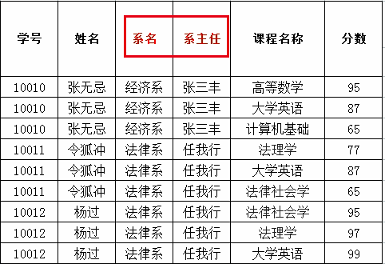

## 第四节 MySQL 多表 & 事务

###  4.1 多表之间的关系

1. 一对一(了解)：
      * 如：人和身份证，一个人只有一个身份证，一个身份证只能对应一个人。
      * 实现方式：一对一关系实现，可以在任意一方添加<font color=#ff8918>**唯一**</font>外键指向另一方的主键。
      * 将来程序开发时，很少存在。如果是一对一关系，可以直接合并成一张表。

2. 一对多(多对一)：
      * 如：部门和员工，一个部门有多个员工，一个员工只能对应一个部门。
      * **实现方式：在多的一方建立外键，指向一的一方的主键**。

3. 多对多：
      * 如：学生和课程，一个学生可以选择很多门课程，一个课程也可以被很多学生选择。
      * **实现方式：多对多关系实现需要借助第三张中间表**。中间表**至少包含两个字段**，这两个字段作为第三张表的外键，分别指向两张表的主键。

4. 多对多关系案例

**需求**：旅游网，一个用户收藏多个线路，一个线路被多个用户收藏。案例代码如下：


```sql
-- 创建旅游线路分类表 tab_category
-- cid 旅游线路分类主键，自动增长
-- cname 旅游线路分类名称非空，唯一，字符串 100
CREATE TABLE tab_category (
      cid INT PRIMARY KEY AUTO_INCREMENT,
      cname VARCHAR(100) NOT NULL UNIQUE
);

-- 创建旅游线路表 tab_route
    /*
          rid 旅游线路主键，自动增长
          rname 旅游线路名称非空，唯一，字符串 100
          price 价格
          rdate 上架时间，日期类型
          cid 外键，所属分类
    */
CREATE TABLE tab_route(
      rid INT PRIMARY KEY AUTO_INCREMENT,
      rname VARCHAR(100) NOT NULL UNIQUE,
      price DOUBLE,
      rdate DATE,
      cid INT,
      FOREIGN KEY (cid) REFERENCES tab_category(cid)
);

-- 创建用户表 tab_user
    /*
          uid 用户主键，自增长
          username 用户名长度 100，唯一，非空
          password 密码长度 30，非空
          name 真实姓名长度 100
          birthday 生日
          sex 性别，定长字符串 1
          telephone 手机号，字符串 11
          email 邮箱，字符串长度 100
    */
CREATE TABLE tab_user (
      uid INT PRIMARY KEY AUTO_INCREMENT,
      username VARCHAR(100) UNIQUE NOT NULL,
      PASSWORD VARCHAR(30) NOT NULL,
      NAME VARCHAR(100),
      birthday DATE,
      sex CHAR(1) DEFAULT '男',
      telephone VARCHAR(11),
      email VARCHAR(100)
);

-- 创建收藏表 tab_favorite
    /*
          rid 旅游线路 id，外键
          date 收藏时间
          uid 用户 id，外键
          rid 和 uid 不能重复，设置复合主键，同一个用户不能收藏同一个线路两次
    */
CREATE TABLE tab_favorite (
      rid INT, -- 线路id
      DATE DATETIME,
      uid INT, -- 用户id
      -- 创建复合主键
      PRIMARY KEY(rid,uid), -- 联合主键
      FOREIGN KEY (rid) REFERENCES tab_route(rid),
      FOREIGN KEY(uid) REFERENCES tab_user(uid)
);
```

### 4.2 数据库设计的范式

* **概念**：设计数据库时，需要遵循的一些规范。**要遵循后边的范式要求，必须先遵循前边的所有范式要求**。

* 设计关系数据库时，遵从不同的规范要求，设计出合理的关系型数据库，这些不同的规范要求被称为不同的范式，**各种范式呈递次规范**，越高的范式数据库冗余越小。
  
* 目前关系数据库有六种范式：第一范式（1NF）、第二范式（2NF）、第三范式（3NF）、巴斯-科德范式（BCNF）、第四范式(4NF）和第五范式（5NF，又称完美范式）。
  
* 一般遵守前三种范式，数据库的设计就没有什么问题了。

* **分类**

1. 第一范式（1NF）：每一列都是不可分割的原子数据项，不能是集合、数组等非原子数据项。即表中的**某个列有多个值时**，**必须拆分**为不同的列。<font color=#ff8918>**简而言之，第一范式每一列不可再拆分，称为原子性。**</font>


      不符合第一范式，将列“系”拆分。



      上表存在问题：

            存在非常多的数据冗余（重复）：姓名、系、系主任。  
          
            数据添加存在问题：如添加不合法的系、系主任并不会报错。
            
            删除数据时存在问题：如张无忌同学毕业了，删除数据时，会将系的数据一起删掉。该系只有一个同学时，表中再无此系数据。

2. 第二范式（2NF）：在1NF的基础上，非码属性必须完全依赖于码（在1NF基础上消除非主属性对主码的<font color=#ff8918>**部分**</font>函数依赖）。简而言之，消除部分依赖。

      消除姓名、系、系名称对（学号，课程）的部分依赖。做一个表的拆分。
      


3. 第三范式（3NF）：在2NF基础上，任何非主属性不依赖于其它非主属性（在2NF基础上消除传递依赖）

      


- **几个概念**：

1. 函数依赖：A-->B，如果通过A属性(属性组)的值，可以确定唯一B属性的值。则称B依赖于A
例如：学号-->姓名。  （学号，课程名称） --> 分数

2. 完全函数依赖：A-->B，如果A是一个属性组，则B属性值得确定需要依赖于A属性组中**所有**的属性值。
例如：（学号，课程名称） --> 分数

3. 部分函数依赖：A-->B，如果A是一个属性组，则B属性值得确定只需要依赖于A属性组中**某一些**值即可。
例如：（学号，课程名称） --> 姓名

4. 传递函数依赖：A-->B, B-->C. 如果通过 A 属性(属性组)的值，可以确定**唯一** B 属性的值，在通过 B 属性（属性组）的值可以确定**唯一** C 属性的值，则称 C 传递函数依赖于 A。
例如：学号-->系名，系名-->系主任

5. 码：如果在一张表中，一个属性或属性组，被其他**所有**属性所**完全**依赖，则称这个属性(属性组)为该表的码。
例如：该表中码为：（学号，课程名称）

6. 主属性：码属性组中的所有属性

7. 非主属性：除 码属性组的属性


### 4.3 数据库的备份和还原

* 备份： `mysqldump -u用户名 -p密码 数据库名称 > 保存的路径`

* 还原：

      1. 登录数据库 `mysql -uroot -p密码`
        
      2. 创建数据库 `create database db1;`
        
      3. 使用数据库 `use db1;`
        
      4. 执行文件。`source 文件路径` 如`source d://a.sql`

### 4.4 多表查询

【创建表】

```sql
-- 创建部门表
CREATE TABLE dept(
      id INT PRIMARY KEY AUTO_INCREMENT,
      NAME VARCHAR(20)
);
INSERT INTO dept (NAME) VALUES ('开发部'),('市场部'),('财务部');
-- 创建员工表
CREATE TABLE emp (
      id INT PRIMARY KEY AUTO_INCREMENT,
      NAME VARCHAR(10),
      gender CHAR(1), -- 性别
      salary DOUBLE, -- 工资
      join_date DATE, -- 入职日期
      dept_id INT,
      FOREIGN KEY (dept_id) REFERENCES dept(id) -- 外键，关联部门表(部门表的主键)
);
INSERT INTO emp(NAME,gender,salary,join_date,dept_id) VALUES('孙悟空','男',7200,'2013-02-24',1);
INSERT INTO emp(NAME,gender,salary,join_date,dept_id) VALUES('猪八戒','男',3600,'2010-12-02',2);
INSERT INTO emp(NAME,gender,salary,join_date,dept_id) VALUES('唐僧','男',9000,'2008-08-08',2);
INSERT INTO emp(NAME,gender,salary,join_date,dept_id) VALUES('白骨精','女',5000,'2015-10-07',3);
INSERT INTO emp(NAME,gender,salary,join_date,dept_id) VALUES('蜘蛛精','女',4500,'2011-03-14',1);
```


**笛卡尔积**：有两个集合A、B，取这两个集合的所有组成情况。

* 如上述两个例子中，`select * from dept, emp;` 会返回 3*5=15 种情况，很多是错误的组合。<font color=#ff8918>**要完成多表查询，需要消除无用的数据。**</font>


#### 4.4.1 内连接查询

**隐式内连接**：使用 where 条件消除无用数据

~~~sql
-- 查询所有员工信息和对应的部门信息
SELECT * FROM emp,dept WHERE emp.`dept_id` = dept.`id`;

-- 查询员工表的名称，性别，部门表的名称
SELECT emp.name,emp.gender,dept.name FROM emp,dept WHERE emp.`dept_id` = dept.`id`;

-- 使用别名
SELECT
      t1.name, -- 员工表的姓名
      t1.gender,-- 员工表的性别
      t2.name -- 部门表的名称
FROM
      emp t1, 
      dept t2
WHERE
      t1.`dept_id` = t2.`id`;
~~~


**显式内连接**：`select 字段列表 from 表名1 [inner] join 表名2 on 条件`

~~~
SELECT * FROM emp INNER JOIN dept ON emp.`dept_id` = dept.`id`;
SELECT * FROM emp JOIN dept ON emp.`dept_id` = dept.`id`;
~~~

> 隐式与显式内连接查询结果一样，只是写法不同。

> 内连接查询考虑：从哪些表中查询数据、条件是什么、查询哪些字段。

#### 4.4.2 外链接查询

**左外连接**：查询的是左表**所有数据**以及其**交集**部分。

`select 字段列表 from 表1 left [outer] join 表2 on 条件；`

~~~sql
-- 查询所有员工信息，如果员工有部门，则查询部门名称，没有部门，则不显示部门名称
SELECT 	t1.*,t2.`name` FROM emp t1 LEFT JOIN dept t2 ON t1.`dept_id` = t2.`id`;
~~~

**右外连接**：查询的是右表**所有数据**以及其**交集**部分。

`select 字段列表 from 表1 right [outer] join 表2 on 条件；`

~~~sql
SELECT 	* FROM dept t2 RIGHT JOIN emp t1 ON t1.`dept_id` = t2.`id`;
~~~


#### 4.4.3 子查询

* 概念：查询中嵌套查询，称嵌套查询为子查询。

      -- 查询工资最高的员工信息
        
      -- 1 查询最高的工资是多少 9000
      SELECT MAX(salary) FROM emp;
        
      -- 2 查询员工信息，并且工资等于9000的
      SELECT * FROM emp WHERE emp.`salary` = 9000;
        
      -- 一条sql就完成这个操作。子查询
      SELECT * FROM emp WHERE emp.`salary` = (SELECT MAX(salary) FROM emp);


* 子查询不同情况

      1. 子查询的结果是单行单列的：子查询可以作为条件，使用运算符去判断。 【运算符： > >= < <= =】
        
      -- 查询员工工资小于平均工资的人
      SELECT * FROM emp WHERE emp.salary < (SELECT AVG(salary) FROM emp);
  

      2. 子查询的结果是多行单列的：子查询可以作为条件，使用【运算符in】来判断
      
      -- 查询'财务部'和'市场部'所有的员工信息
      SELECT id FROM dept WHERE NAME = '财务部' OR NAME = '市场部'; -- id 返回 2 与 3
      SELECT * FROM emp WHERE dept_id = 3 OR dept_id = 2;
      -- 子查询
      SELECT * FROM emp WHERE dept_id IN (SELECT id FROM dept WHERE NAME = '财务部' OR NAME = '市场部');
  

      3. 子查询的结果是多行多列的：子查询可以作为一张虚拟表参与查询
      
      -- 查询员工入职日期是2011-11-11日之后的员工信息和部门信息
      -- 子查询
      SELECT * FROM dept t1 ,(SELECT * FROM emp WHERE emp.`join_date` > '2011-11-11') t2
      WHERE t1.id = t2.dept_id;
      
      -- 普通内连接也可以实现
      SELECT * FROM emp t1,dept t2 WHERE t1.`dept_id` = t2.`id` AND t1.`join_date` >  '2011-11-11';
  

#### 4.4.4 多表查询练习

```sql
-- 部门表
CREATE TABLE dept (
      id INT PRIMARY KEY PRIMARY KEY, -- 部门id
      dname VARCHAR(50), -- 部门名称
      loc VARCHAR(50) -- 部门所在地
);
-- 添加4个部门
INSERT INTO dept(id,dname,loc) VALUES
(10,'教研部','北京'),
(20,'学工部','上海'),
(30,'销售部','广州'),
(40,'财务部','深圳');
-- 
-- 职务表，职务名称，职务描述
CREATE TABLE job (
      id INT PRIMARY KEY,
      jname VARCHAR(20),
      description VARCHAR(50)
);
-- 添加4个职务
INSERT INTO job (id, jname, description) VALUES
(1, '董事长', '管理整个公司，接单'),
(2, '经理', '管理部门员工'),
(3, '销售员', '向客人推销产品'),
(4, '文员', '使用办公软件');
-- 
-- 员工表
CREATE TABLE emp (
      id INT PRIMARY KEY, -- 员工id
      ename VARCHAR(50), -- 员工姓名
      job_id INT, -- 职务id
      mgr INT , -- 上级领导
      joindate DATE, -- 入职日期
      salary DECIMAL(7,2), -- 工资
      bonus DECIMAL(7,2), -- 奖金
      dept_id INT, -- 所在部门编号
      CONSTRAINT emp_jobid_ref_job_id_fk FOREIGN KEY (job_id) REFERENCES job (id),
      CONSTRAINT emp_deptid_ref_dept_id_fk FOREIGN KEY (dept_id) REFERENCES dept (id)
);
-- 添加员工
INSERT INTO emp(id,ename,job_id,mgr,joindate,salary,bonus,dept_id) VALUES
(1001,'孙悟空',4,1004,'2000-12-17','8000.00',NULL,20),
(1002,'卢俊义',3,1006,'2001-02-20','16000.00','3000.00',30),
(1003,'林冲',3,1006,'2001-02-22','12500.00','5000.00',30),
(1004,'唐僧',2,1009,'2001-04-02','29750.00',NULL,20),
(1005,'李逵',4,1006,'2001-09-28','12500.00','14000.00',30),
(1006,'宋江',2,1009,'2001-05-01','28500.00',NULL,30),
(1007,'刘备',2,1009,'2001-09-01','24500.00',NULL,10),
(1008,'猪八戒',4,1004,'2007-04-19','30000.00',NULL,20),
(1009,'罗贯中',1,NULL,'2001-11-17','50000.00',NULL,10),
(1010,'吴用',3,1006,'2001-09-08','15000.00','0.00',30),
(1011,'沙僧',4,1004,'2007-05-23','11000.00',NULL,20),
(1012,'李逵',4,1006,'2001-12-03','9500.00',NULL,30),
(1013,'小白龙',4,1004,'2001-12-03','30000.00',NULL,20),
(1014,'关羽',4,1007,'2002-01-23','13000.00',NULL,10);
-- 
-- 工资等级表
CREATE TABLE salarygrade (
      grade INT PRIMARY KEY,   -- 级别
      losalary INT,  -- 最低工资
      hisalary INT -- 最高工资
);
-- 添加5个工资等级
INSERT INTO salarygrade(grade,losalary,hisalary) VALUES
(1,7000,12000),
(2,12010,14000),
(3,14010,20000),
(4,20010,30000),
(5,30010,99990);
```


几个需求

1. 查询所有员工信息。查询员工编号，员工姓名，工资，职务名称，职务描述

~~~sql
/*
  分析：
      1）员工编号，员工姓名，工资，需要查询emp表  职务名称，职务描述 需要查询job表
      2）查询条件 emp.job_id = job.id
*/
SELECT
      t1.`id`, -- 员工编号
      t1.`ename`, -- 员工姓名
      t1.`salary`,-- 工资
      t2.`jname`, -- 职务名称
      t2.`description` -- 职务描述
FROM
      emp t1, job t2
WHERE
      t1.`job_id` = t2.`id`;
~~~

2. 查询员工编号，员工姓名，工资，职务名称，职务描述，部门名称，部门位置

~~~sql
/*
  分析：
      1. 员工编号，员工姓名，工资 emp  职务名称，职务描述 job  部门名称，部门位置 dept
      2. 条件： emp.job_id = job.id and emp.dept_id = dept.id
*/
SELECT
      t1.`id`, -- 员工编号
      t1.`ename`, -- 员工姓名
      t1.`salary`,-- 工资
      t2.`jname`, -- 职务名称
      t2.`description`, -- 职务描述
      t3.`dname`, -- 部门名称
      t3.`loc` -- 部门位置
FROM
      emp t1, job t2,dept t3
WHERE
      t1.`job_id` = t2.`id` AND t1.`dept_id` = t3.`id`;
~~~

3. 查询员工姓名，工资，工资等级

~~~sql
/*
  分析：
      1.员工姓名，工资 emp  工资等级 salarygrade
      2.条件 emp.salary >= salarygrade.losalary and emp.salary <= salarygrade.hisalary
            emp.salary BETWEEN salarygrade.losalary and salarygrade.hisalary
*/

SELECT
      t1.ename ,
      t1.`salary`,
      t2.grade
FROM 
      emp t1, salarygrade t2
WHERE 
      t1.`salary` BETWEEN t2.`losalary` AND t2.`hisalary`;
~~~


4. 查询员工姓名，工资，职务名称，职务描述，部门名称，部门位置，工资等级

~~~sql
/*
  分析：
      1. 员工姓名，工资 emp ， 职务名称，职务描述 job 部门名称，部门位置，dept  工资等级 salarygrade
      2. 条件： emp.job_id = job.id and emp.dept_id = dept.id and emp.salary BETWEEN salarygrade.losalary and salarygrade.hisalary
*/

SELECT
      t1.`ename`,
      t1.`salary`,
      t2.`jname`,
      t2.`description`,
      t3.`dname`,
      t3.`loc`,
      t4.`grade`
FROM
      emp t1,job t2,dept t3,salarygrade t4
WHERE
      t1.`job_id` = t2.`id`
AND 
      t1.`dept_id` = t3.`id`
AND 
      t1.`salary` BETWEEN t4.`losalary` AND t4.`hisalary`;
~~~

5. 查询出部门编号、部门名称、部门位置、部门人数🍓

~~~sql
/*
  分析：
      1.部门编号、部门名称、部门位置 dept 表。 部门人数 emp表
      2.使用【分组查询】。按照emp.dept_id完成分组，查询count(id)
      3.使用子查询将第2步的查询结果和dept表进行关联查询
*/

SELECT
      t1.`id`,t1.`dname`,t1.`loc` , t2.total
FROM
      dept t1,
      (SELECT
            dept_id,COUNT(id) total
      FROM
            emp
      GROUP BY dept_id) t2
WHERE 
      t1.`id` = t2.dept_id;
~~~


6. 查询所有员工的姓名及其直接上级的姓名，没有领导的员工也需要查询

~~~sql
/*
  分析：
      1.姓名 emp，直接上级的姓名 emp
            * emp表的 id 和 mgr 是自关联
      2.条件 emp.id = emp.mgr
      3.查询左表的所有数据，和 交集数据
            * 使用左外连接查询
*/

-- 自关联映射（错误：当管理者为null时，并不能显示员工姓名，题目要求没有领导的员工也需要查询）
select
      t1.ename,
      t1.mgr,
      t2.`id`,
      t2.ename
from 
      emp t1, emp t2
where 
      t1.mgr = t2.`id`;

-- 正确方法：外连接
SELECT
      t1.ename,
      t1.mgr,
      t2.`id`,
      t2.`ename`
FROM 
      emp t1
LEFT JOIN 
      emp t2
ON 
      t1.`mgr` = t2.`id`;
~~~

### 4.5 事务

#### 4.5.1 基本介绍

1. 概念：如果一个包含<font color=#ff8918>**多个步骤**</font>的业务操作，**被事务管理**，那么<font color=#ff8918>**这些操作要么同时成功，要么同时失败。**</font>


      如果第二步出现异常，则张三的账户减少500，但是李四并不会收到500元。使用事务管理，当出现异常时，回滚到起始状态（张三的钱没有减少，李四的钱没有增加）。若没有异常，提交事务，完成转账操作。

2. 操作：
      * 开启事务： start transaction;
      * 回滚：rollback;
      * 提交：commit;

3. 例子：

~~~sql
CREATE TABLE account (
      id INT PRIMARY KEY AUTO_INCREMENT,
      NAME VARCHAR(10),
      balance DOUBLE
);
-- 添加数据
INSERT INTO account (NAME, balance) VALUES ('zhangsan', 1000), ('lisi', 1000);

SELECT * FROM account;
-- UPDATE account SET balance = 1000;


-- 张三给李四转账 500 元

-- 0. 开启事务
START TRANSACTION;

-- 1. 张三账户 -500
UPDATE account SET balance = balance - 500 WHERE NAME = 'zhangsan';

-- 2. 李四账户 +500
-- 出错了...
UPDATE account SET balance = balance + 500 WHERE NAME = 'lisi';

-- 发现执行没有问题，提交事务
COMMIT;

-- 发现出问题了，回滚事务，回到 START TRANSACTION; 之前的状态！
ROLLBACK;
~~~

> 若开启事务，没有提交，关闭窗口后，修改不会被记录。要commit后才会持久化记录。

4. MySQL数据库中事务默认自动提交

* 事务提交的两种方式：自动提交与手动提交

* 自动提交
      - mysql就是自动提交的
      - 一条DML(增删改)语句会自动提交一次事务。即，会被持久化记录。

* 手动提交
      - Oracle 数据库默认是手动提交事务
      - 需要先开启事务，再提交
      - 查看事务的默认提交方式：`SELECT @@autocommit; -- 1 代表自动提交  0 代表手动提交`
      - 修改事务的默认提交方式：`set @@autocommit = 0;`


#### 4.5.2 事务的四大特征（常见面试题）

1. 原子性：是不可分割的最小操作单位，要么同时成功，要么同时失败。
2. 持久性：当事务提交或回滚后，数据库会持久化的保存数据。
3. 隔离性：多个事务之间，相互独立。
4. 一致性：事务操作前后，数据总量不变。如转账问题，无论怎么转账，最终的钱的总额是一样的。

#### 4.5.3 事务的隔离级别（了解）

**概念**：多个事务之间隔离的，相互独立的。但是如果多个事务操作同一批数据，则会引发一些问题，设置不同的隔离级别就可以解决这些问题。

**存在问题**：

1. <font color=#ff8918>**脏读**</font>：一个事务，读取到另一个事务中没有提交的数据。

2. <font color=#ff8918>**不可重复读(虚读)**</font>：在同一个事务中，两次读取到的数据不一样。（当前事务中，第一次读取时，另一事务还没有提交，第二次提取的时候，另一事务被提交）

3. <font color=#ff8918>**幻读**</font>：一个事务操作(DML)数据表中所有记录，另一个事务添加了一条数据，则第一个事务查询不到自己的修改。

**MySQL 支持四种隔离级别**：

1. read uncommitted：读未提交，事务未提交的数据也可被读到。
      * 产生的问题：脏读、不可重复读、幻读

2. read committed：读已提交 （Oracle）即，只有提交的数据才能被读到。
      * 产生的问题：不可重复读、幻读

3. repeatable read：可重复读 （MySQL 默认）
      * 产生的问题：幻读

4. serializable：串行化。即锁表操作，如果一个事务在操作一张数据表，另外一个事务是不可以再操作这张表的，只有当锁打开之后才可以操作。
      * 可以解决所有的问题

> 注意：隔离级别从小到大安全性越来越高，但是效率越来越低。

数据库查询隔离级别：`select @@tx_isolation;`

数据库设置隔离级别：`set global transaction isolation level  级别字符串;`

演示：
~~~sql
set global transaction isolation level read uncommitted;
start transaction;
-- 转账操作
update account set balance = balance - 500 where id = 1;
update account set balance = balance + 500 where id = 2;
~~~


### 4.6 DCL

#### 4.6.1 SQL分类

1. DDL：操作数据库和表
2. DML：增删改表中数据
3. DQL：查询表中数据
4. DCL：管理用户，授权

#### 4.6.2 DBA：数据库管理员

#### 4.6.3 DCL：管理用户，授权

1. 添加用户：`CREATE USER '用户名'@'主机名' IDENTIFIED BY '密码';`

2. 删除用户：`DROP USER '用户名'@'主机名';`

3. 修改用户密码
~~~sql
-- 使用 PASSWORD 函数对密码进行加密
-- 方法一
UPDATE USER SET PASSWORD = PASSWORD('新密码') WHERE USER = '用户名';

-- 方法二
SET PASSWORD FOR '用户名'@'主机名' = PASSWORD('新密码');
~~~

~~~
mysql中忘记了root用户的密码？
      1. 需要管理员运行 cmd -- > 【net stop mysql】 （停止mysql服务）
      2. 使用无验证方式启动 mysql 服务： 【mysqld --skip-grant-tables】
      3. 打开新的 cmd 窗口，直接输入 【mysql】 命令，敲回车，就可以登录成功。
      4. 【use mysql;】
      5. 【update user set password = password('你的新密码') where user = 'root';】
      6. 关闭两个窗口。
      7. 打开任务管理器，手动结束 mysqld.exe 的进程。
      8. 启动 mysql 服务， 需要管理员运行 cmd -- > 【net start mysql】
      9. 使用新密码登录。
~~~

4. 查询用户
~~~sql
-- 1. 切换到 mysql 数据库(MySQL自带默认表)
USE myql;
-- 2. 查询 user 表
SELECT * FROM USER;
~~~

* 查询结果 Host 中的通配符 % 表示可以在任意主机使用用户登录数据库。

5. 权限管理
~~~sql
-- 1. 查询权限
SHOW GRANTS FOR '用户名'@'主机名';
SHOW GRANTS FOR 'lisi'@'%';
~~~

> USAGE 具有登录权限
> SELECT UPDATE INSERT DELETE CREATE DROP RELOAD SHUTDOWN FILE... ...

~~~sql
-- 2. 授予权限
grant 权限列表 on 数据库名.表名 to '用户名'@'主机名';
-- 给张三用户授予所有权限，在任意数据库任意表上
GRANT ALL ON *.* TO 'zhangsan'@'localhost';
~~~

~~~sql
-- 3. 撤销权限：
revoke 权限列表 on 数据库名.表名 from '用户名'@'主机名';
REVOKE UPDATE ON db3.`account` FROM 'lisi'@'%';
~~~


