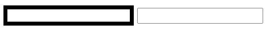

## 第六节 HTML & CSS

### 6.1  web概念概述

#### 6.1.1  JavaWeb

使用 Java 语言开发基于互联网的项目

#### 6.1.2 软件架构

**1. C/S: Client/Server** 客户端/服务器端
* 在用户本地有一个客户端程序，在远程有一个服务器端程序。如：QQ，迅雷。
* 优点：用户体验好
* 缺点：开发、安装，部署，维护 麻烦

**2. B/S: Browser/Server** 浏览器/服务器端
* 只需要一个浏览器，用户通过不同的网址(URL)，客户访问不同的服务器端程序
* 优点：开发、安装，部署，维护 简单
* 缺点：如果应用过大，带宽受限，用户的体验可能会受到影响；对硬件要求过高

#### 6.1.3 B/S架构详解

**1. 静态资源**

1）使用静态网页开发技术发布的资源。

2）特点：
* 所有用户访问，得到的结果是一样的。如：文本，图片，音频，视频，<font color=#ff8918>**HTML，CSS，JavaScript**</font>。
* 如果用户请求的是静态资源，那么服务器会<font color=#ff8918>**直接将静态资源发送**</font>给浏览器。浏览器中内置了静态资源的解析引擎，可以展示静态资源。

**2. 动态资源**

1）使用动态网页及时发布的资源。

2）特点：
* 所有用户访问，得到的结果可能不一样。如：<font color=#ff8918>**jsp/servlet**</font>，php，asp...
* 如果用户请求的是动态资源，那么服务器会<font color=#ff8918>**执行动态资源，转换为静态资源，再发送**</font>给浏览器。
* 要学习动态资源，必须先学习静态资源！

#### 6.1.4 静态资源

* HTML：用于搭建基础网页，展示页面的内容
* CSS：用于美化页面，布局页面
* JavaScript：控制页面的元素，让页面有一些动态的效果

### 6.2 HTML

**1. 概念**：Hyper Text Markup Language 超文本标记语言，是最基础的网页开发语言。

* 超文本：超文本是用超链接的方法，将各种不同空间的文字信息组织在一起的网状文本。
* 标记语言：由**标签**构成的语言。<标签名称> 如 html，xml。
* **标记语言不是编程语言**，没有 if 等逻辑，写上就会执行。

**2. 快速入门**

* 语法：html文档后缀名 `.html 或者 .htm`

* 标签分为：围堵标签与自闭和标签
      1）**围堵**标签：有开始标签和结束标签。如 `<html> </html>`
      2）**自闭和**标签：开始标签和结束标签在一起。如 `<br/>`

* 标签可以嵌套：需要正确嵌套，不能你中有我，我中有你
      错误：`<a><b></a></b>`
      正确：`<a><b></b></a>`

* 在开始标签中可以定义属性。<font color=#ff8918>**属性是由键值对构成，值需要用引号(单双都可)引起来。**</font> 如 `<font color='red'>Hello World</font>` 中的 color。

* html 的标签**不区分大小写**，但是<font color=#ff8918>**建议使用小写**</font>。

#### 6.2.1 文件标签：构成 html 最基本的标签

* `<html>`: html 文档的**根标签**。
* `<head>`：头标签。用于指定 html 文档的一些属性，引入外部的资源。
* `<title>`：标题标签。
* `<body>`：体标签，定义文档主体。
* `<!DOCTYPE html>`：html5 中定义该文档是 html 文档。


#### 6.2.2 文本标签：和文本有关的标签

* 注释：`<!-- 注释内容 -->`
* `<h1> to <h6>`：标题标签，h1~h6: 字体大小逐渐递减
* `<p>`：段落标签
* `<br>`或`<br/>`：换行标签
* `<hr>`：展示一条水平线
      属性（html5 不支持、不建议使用，建议用CSS控制样式）：【color：颜色】【width：宽度】【size：高度】【align：对其方式（值：center、left、right）】
* `<b>`：字体加粗
* `<i>`：字体斜体
* `<font>`: 字体标签（过时），属性【color：颜色】【size：大小】【face：字体】
* `<center>`: 文本居中（过时）

<hr color=#558918>

color属性：
1. 英文单词：`red,green,blue`
2. rgb(值1，值2，值3)：`值的范围：0~255`，如 `rgb(0,0,255)`
3. `#值1值2值3`：`值的范围：00~FF之间`，如：`#FF00FF`

width属性：
1. 数值：`width='20'`，数值的单位，默认是 px(像素)。
2. 数值%：`width='50%'`，占比相对于父元素的比例。

<hr color=#558918>

案例：公司简介


~~~html
<!DOCTYPE html>
<html lang="ch">
<head>
    <meta charset="UTF-8">
    <title>案例</title>
</head>
<body>
    <h1>
        公司简介
    </h1>
<hr color="#ffd700">
<p>
<font color="#FF0000">"中关村黑马程序员训练营"</font>是由<b><i>传智播客</i></b>联合中关村软件园、CSDN， 并委托传智播客进行教学实施的软件开发高端培训机构，致力于服务各大软件企业，解决当前软件开发技术飞速发展， 而企业招不到优秀人才的困扰。
</p>
<p>
目前，“中关村黑马程序员训练营”已成长为行业“学员质量好、课程内容深、企业满意”的移动开发高端训练基地， 并被评为中关村软件园重点扶持人才企业。
</p>
<p>
黑马程序员的学员多为大学毕业后，有理想、有梦想，想从事IT行业，而没有环境和机遇改变自己命运的年轻人。 黑马程序员的学员筛选制度，远比现在90%以上的企业招聘流程更为严格。任何一名学员想成功入学“黑马程序员”， 必须经历长达2个月的面试流程，这些流程中不仅包括严格的技术测试、自学能力测试，还包括性格测试、压力测试、 品德测试等等测试。毫不夸张地说，黑马程序员训练营所有学员都是精挑细选出来的。百里挑一的残酷筛选制度确 保学员质量，并降低企业的用人风险。
中关村黑马程序员训练营不仅着重培养学员的基础理论知识，更注重培养项目实施管理能力，并密切关注技术革新， 不断引入先进的技术，研发更新技术课程，确保学员进入企业后不仅能独立从事开发工作，更能给企业带来新的技术体系和理念。
</p>
<p>
一直以来，黑马程序员以技术视角关注IT产业发展，以深度分享推进产业技术成长，致力于弘扬技术创新，倡导分享、 开放和协作，努力打造高质量的IT人才服务平台。
</p>
<hr color="#ffd700">
    <font color="gray" size="2">
        <center>
            江苏传智播客教育科技股份有限公司<br>
            版权所有Copyright 2006-2018&copy;, All Rights Reserved 苏ICP备16007882
        </center>
    </font>
</body>
</html>
~~~


#### 6.2.3 图片标签

* img：展示图片 ``
* 属性：src：指定图片的位置；height/width：指定图像尺寸；alt：当图像加载不出来时，显示的文本。


#### 6.2.4 列表标签

**有序列表**：`<ol> <li>`
* type: 按什么编号，字母 A 或 a、数字 1、罗马数字 I 或 i。
* start: HTML5 不支持，不赞成使用。请使用样式取代它。规定列表中的起始点，如是从 A 开始编号还是从 C 开始编号。

**无序列表**：`<ul> <li>`
* type: HTML5 不支持。HTML 4.01 已废弃。 规定列表的项目符号的类型（圆点、方块）。`取值：disc、square、circle`。

~~~html
<!--有序列表 ol-->
    早上起床干的事情
    <ol type="A" start="1">
        <li>睁眼</li>
        <li> 看手机</li> 
        <li> 穿衣服</li>
        <li> 洗漱</li>
    </ol>
~~~


#### 6.2.5 链接标签

* `<a>` ：定义一个超链接
* 属性：
      href：指定访问资源的 URL(统一资源定位符)
      target：指定打开资源的方式。1）`_self`:默认值，在当前页面打开 2）`_blank`：在空白页面打开

~~~html
<!-- 指定网络资源 -->
<a href="http://www.itcast.cn" target="_self">点我</a>
<!-- 指定本地项目资源 -->
<a href="./5_列表标签.html">列表标签</a><br>
<!-- 为图片设置超链接 -->
<a href="http://www.itcast.cn"></a>
~~~

#### 6.2.6 div 和 span

* div：每一个 div 占满一整行。**块级标签**。本身没有任何效果。
* span：文本信息在一行展示，**不会换行**，称为**行内标签**或**内联标签**。本身没有任何效果，只是包裹一段文字。用于与 CSS 样式结合使用。

#### 6.2.7 语义化标签：html5 中为了提高程序的可读性，提供了一些标签。
1. `<header>`：页眉，没有任何样式效果，结合 CSS 样式一起使用。
2. `<footer>`：页脚，没有任何样式效果，结合 CSS 样式一起使用。


#### 6.2.8 表格标签

<font color=#ff8918>**table：定义表格**</font>
* width：宽度
* border：边框
* cellpadding：定义内容和单元格的距离
* cellspacing：定义单元格之间的距离。如果指定为 0，则单元格的线会合为一条。默认是两条线，单元格与表格各有一条线。
* bgcolor：背景色
* align：对齐方式

<font color=#ff8918>**tr：定义行**</font>
* bgcolor：背景色
* align：对齐方式

<font color=#ff8918>**td：定义单元格**</font>
* colspan：合并列
* rowspan：合并行

<font color=#ff8918>**th：定义表头单元格**</font>
* `<caption>`：表格标题，在table内定义。
* `<thead>`：表示表格的头部分，没有任何样式效果，结合 CSS 样式一起使用。
* `<tbody>`：表示表格的体部分，没有任何样式效果，结合 CSS 样式一起使用。
* `<tfoot>`：表示表格的脚部分，没有任何样式效果，结合 CSS 样式一起使用。

#### 6.2.9 表单标签

**表单**：用于**采集用户输入**的数据的。用于和服务器进行交互。

**form**：用于定义表单的。可以定义一个范围，范围代表采集用户数据的范围，即被 form 包围的数据可被提交给服务器，未包围的数据不被提交。

**属性**：
* action：指定提交数据的 URL
* method:指定提交方式（一共 7 种，2 种比较常用）

**指定提交方式 method 分类**：一共 7 种，2 种比较常用

【get】
1. 请求参数**会**在地址栏中显示。会封装到**请求行**中 (HTTP 协议后讲解)。
2. 请求参数大小是**有限制的**。
3. 不太安全。

【post】
2. 请求参数**不会**再地址栏中显示。会封装在**请求体**中 (HTTP 协议后讲解)
2. 请求参数的大小**没有限制**。
3. 较为安全。

<font color=#ff8918>**表单项中的数据要想被提交，必须指定其 name 属性**</font>

~~~html
<form action="#" method="post">
    用户名：<input type="text" name="username"><br>   <!-- 若没有name属性，则表单不会被提交 -->
    密码：<input name="password"><br>
    <input type="submit" value="登录" >  <!-- 提交按钮 -->
</form>
~~~


**表单项标签**

<font color=#ff8918>**input**</font>：定义一个输入控件。可以通过 type 属性值，改变元素展示的样式。

type 属性：

* text：文本输入框，默认值

* placeholder：初始时显示输入框的提示信息，当输入框的内容发生变化（有输入时），会自动清空提示信息。

  ```html
  密码：<input type="password" name="password" placeholder="请输入密码"><br>
  ```

* password：密码输入框，输入的信息会密文显示。

* radio：单选框

      1）要想让多个单选框**实现单选**的效果，则**多个单选框的name属性值必须一样**。
        
      2）一般会给每一个单选框提供value属性，指定其被选中后提交的值。
        
      ~~~html
      性别：<input type="radio" name="gender" value="male" >  男
      <input type="radio" name="gender" value="female" checked>  女
      ~~~
        
      3）checked属性，可以指定默认选中值。

* checkbox：复选框

      1）一组复选框，name属性值相同。
        
      2）一般会给每一个单选框提供value属性，指定其被选中后提交的值。
        
      3）checked属性，可以指定默认值。

* file：文件选择框

  ```html
  图片：<input type="file" name="file"><br>
  ```
  


* hidden：隐藏域，用于提交一些信息。

  ```html
  隐藏域：<input type="hidden" name="id" value="aaa"> <br>
  <input type="submit" value="登录" >      <!-- 点击登录，信息会被提交 -->
  ```


* 按钮：
   * submit：提交按钮，可以提交表单。写在 form 内部。  
   * button：普通按钮，与 JavaScript 结合使用。 
   * image：图片提交按钮（src 属性指定图片的路径），可以提交表单。
   
   ```html
   <input type="submit" value="登录" >
   <input type="button" value="一个按钮" ><br>
   <input type="image" src="img/regbtn.jpg">
   ```


**label标签**：指定输入项的文字描述信息。

* 注意：label 的 for 属性一般会和 input 的 id 属性值对应。如果对应了，则点击 label 区域，会让 input 输入框获取焦点。
~~~html
<!-- label标签将用户名文本与后面的输入框相连 -->
<label for="username"> 用户名 </label>：<input type="text" name="username" placeholder="请输入用户名" id="username"><br>
~~~

**html5 新增 type 属性** 

* color：拾色器，选择的颜色，会与表单一起提交。

   ```html
   <input type="color" name="color"><br>
   ```


* 时间与日期
   * date  定义 date 控件（包括年、月、日，不包括时间）。 
   * datetime  定义 date 和 time 控件（包括年、月、日、时、分、秒、几分之一秒，基于 UTC 时区）。 
   * datetime-local  定义 date 和 time 控件（包括年、月、日、时、分、秒、几分之一秒，不带时区）。 
     
   ~~~html
   生日：<input type="date" name="birthday"> <br>
   生日：<input type="datetime-local" name="birthday"> <br>
   ~~~


* email 定义用于 e-mail 地址的字段。有基础验证功能，如没有@符号会提示错误。 

* number 定义用于输入数字的字段。 

<font color=#ff8918>**select**</font>: 下拉列表

* 子元素：option，指定列表项

~~~html
省份：<select name="province">
            <option value="">--请选择--</option>
            <option value="1">北京</option>
            <option value="2">上海</option>
            <option value="3" selected>陕西</option>
     </select><br>
~~~

<font color=#ff8918>**textarea**</font>：文本域
* cols：指定列数，每一行有多少个字符。
* rows：默认多少行。

### 6.3 案例-旅游网站首页 

1. 确定使用 table 来完成布局
	
2. 如果某一行只有一个单元格，则使用`<tr><td></td></tr>`

3. 如果某一行有多个单元格，则使用

```html
<tr>
      <td>
            <table></table>
      </td>
</tr>
```
[代码](https://www.cnblogs.com/miaomiaowu/p/13504374.html)


### 6.4 CSS 页面美化和布局控制

#### 6.4.1 基本介绍

1. **概念**： Cascading Style Sheets 层叠样式表

2. **层叠**：多个样式可以作用在同一个 html 的元素上，同时生效。
	
3. **好处**

&emsp;&emsp;1）功能强大

&emsp;&emsp;2）将内容展示和样式控制分离
&emsp;&emsp;&emsp;&emsp;* 降低耦合度。解耦
&emsp;&emsp;&emsp;&emsp;* 让分工协作更容易
&emsp;&emsp;&emsp;&emsp;* 提高开发效率


### CSS的使用：CSS与html结合方式

**1）内联样式** (不推荐使用，内容展示与样式仍然耦合在一起)

* 在标签内使用style属性指定css代码

* 如：`<div style="color:red;">hello css</div>`

**2）内部样式**

* 在h**ead标签内**，定义style标签，style标签的标签体内容就是css代码

```
<style>
div{
      color:blue;
}
</style>

<div>hello css</div>
```

**3）外部样式**

1. 定义**css资源**文件。

2. 在head标签内，定义**link标签**，引入外部的资源文件


```
<!-- a.css文件 -->					
div{
      color:green;
}

<!-- head标签内 方法一（常用）-->
<link rel="stylesheet" href="css/a.css">

<!-- head标签内 方法二（不常用，了解）-->
<style>
      @import "css/a.css";
</style>


<div>hello css</div>
<div>hello css</div>
```

注意：

* 1、2、3 种方式 css作用范围越来越大。

* 1方式不常用，后期常用2、3。
### css语法

**格式**

```
选择器 {
      属性名1:属性值1;
      属性名2:属性值2;
      ...
}
```

* 选择器：筛选具有相似特征的元素

* 注意：每一对属性需要使用`;`隔开，最后一对属性可以不加`;`。


**选择器**：筛选具有相似特征的元素

**1）基础选择器**

1. **id选择器**：选择具体的id属性值的元素。建议在一个html页面中id值唯一。

* 语法：`#id属性值{}`

2. **元素选择器**：选择具有相同标签名称的元素。

* 语法： `标签名称{}`  如`div{color:green;}`
* 注意：id选择器优先级高于元素选择器。

3. **类选择器**：选择具有相同的class属性值的元素。

* 语法：`.class属性值{}`
* 注意：类选择器选择器优先级高于元素选择器

```html
<!DOCTYPE html>
<html lang="en">
<head>
    <meta charset="UTF-8">
    <title>基础选择器</title>

    <style>
        .cls1{
            color: blue;
        }

        div{
            color:green;
        }

        #div1{
               color: red;
           }

    </style>
</head>
<body>
    <div id="div1">传智播客</div>
    <div class="cls1">黑马程序员</div>

    <p class="cls1">传智学院</p>
</body>
</html>
```

**2）扩展选择器**

1. 选择所有元素：`*{}`
	
2. 并集选择器：`选择器1,选择器2{}`
	
3. 子选择器：筛选选择器1元素下的选择器2元素。`选择器1 选择器2{}`

```html
div p{
      color:red;
}

<div>
      <p>传智播客</p>
</div>
<p>黑马程序员</p>
```

		

4. 父选择器：筛选选择器2的**父元素**选择器1。`选择器1 > 选择器2{}`

```
div > p {
      border: 1px solid;
}

<div>
      <p>传智播客</p>
</div>
<p>黑马程序员</p>

<div>aaa</div>    <!-- 没有被选中，因为该div没有p标签 -->
```


	

5. 属性选择器：选择元素名称，属性名=属性值的元素。`元素名称[属性名="属性值"]{}`

```
input[type='text']{
      border: 5px solid;
}

<input type="text" >
<input type="password" >
```




6. 伪类选择器：选择一些元素具有的状态。`元素:状态{}`

`<a> `状态：
* `link`：初始化的状态
* `visited`：被访问过的状态
* `active`：正在访问状态
* `hover`：鼠标悬浮状态

```
a:link{
	color: pink;
}

a:hover{
	color: green;
}

a:active{
	color: yellow;
}

a:visited{
	color: red;
}

<a href="#">黑马程序员</a>
```


### 属性

1. 字体、文本
* font-size：字体大小
* color：文本颜色
* text-align：对其方式
* line-height：行高 

2. 背景
* background：复合属性 

3. 边框
* border：设置边框，复合属性

4. 尺寸
* width：宽度
* height：高度

5. 盒子模型：控制布局
* margin：外边距（与父元素）

* padding：内边距（与子元素），<font color=#ff8918>**默认情况下内边距会影响整个盒子的大小。**</font>   
&emsp;&emsp;`box-sizing: border-box;` 设置盒子的属性，让width和height就是最终盒子的大小。
	
* float：浮动
&emsp;&emsp;left
&emsp;&emsp;right

### 案例 2：注册页面

[代码](https://www.cnblogs.com/miaomiaowu/p/13504374.html)