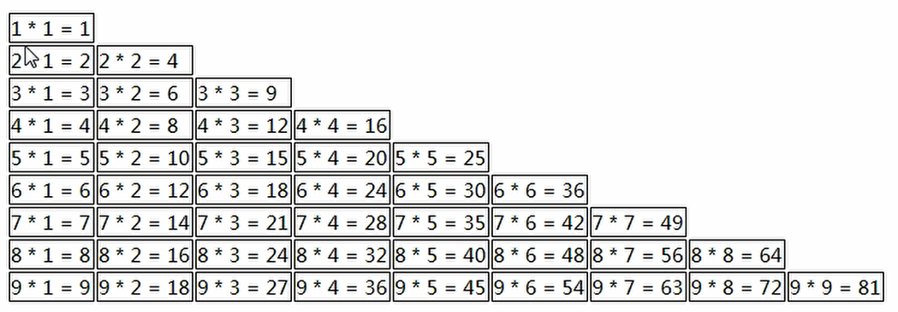

## 第七节 JavaScript 基础

### 7.1 JavaScript 介绍 

**概念**：一门客户端**脚本语言**

* 运行在**客户端浏览器**中的，每一个浏览器都有 JavaScript 的**解析引擎**。

* 脚本语言：**不需要编译**，直接就可以被浏览器解析执行了。
	

**功能**：可以来增强用户和 html 页面的交互过程，可以来控制 html 元素，**让页面有一些动态的效果**，增强用户的体验。
	
**JavaScript发展史**

1. 1992 年，Nombase 公司开发出第一门客户端脚本语言，专门用于表单的校验。命名为：C--，后来更名为：ScriptEase。
	
2. 1995 年，Netscape(网景)公司，开发了一门客户端脚本语言：LiveScript。后来，请来 SUN 公司的专家，修改 LiveScript，命名为 JavaScript。
	
3. 1996 年，微软抄袭 JavaScript 开发出 JScript 语言。
	
4. 1997 年，ECMA (欧洲计算机制造商协会)，制定出客户端脚本语言的标准：ECMAScript，就是统一了所有客户端脚本语言的编码方式。

`JavaScript = ECMAScript + JavaScript自己特有的东西(BOM+DOM)`
	

### 7.2 ECMAScript：客户端脚本语言的标准


#### 7.2.1 与 html 结合方式

1. 内部 JS：定义 `<script>`，标签体内容就是 js 代码。

2. 外部 JS：定义 `<script>`，通过 src 属性引入外部的 js 文件。

**注意**：

1. `<script>` 可以定义在 html 页面的任何地方。但是**定义的位置会影响执行顺序**。

2. `<script>` 可以**定义多个**。

```html
<!DOCTYPE html>
<html lang="en">
<head>
    <meta charset="UTF-8">
    <title >Title</title>
    <!--
       内部JS:可以放置在任意位置，执行顺序与放置位置有关。 
       外部JS
    -->
    <script>
        alert("Hello World");
    </script>

    <script src="js/a.js"></script>
</head>
<body>

<input type="text">

</body>
</html> 
```

#### 7.2.2 基本语法

🔶 **注释**

1. 单行注释：`//注释内容`

2. 多行注释：`/*注释内容*/`

🔶 **数据类型**

&emsp;1、原始数据类型(基本数据类型)：

&emsp;&emsp;1）number：数字。 `整数/小数/NaN(not a number 一个不是数字的数字类型)`。

&emsp;&emsp;2）string：字符串。字符串 `"abc" "a" 'abc'`。**没有字符概念**。

&emsp;&emsp;3）boolean: true 和 false。

&emsp;&emsp;4）null：一个对象为空的占位符。

&emsp;&emsp;5）undefined：未定义。如果一个变量没有给初始化值，则会被默认赋值为 undefined。
					
&emsp;2、引用数据类型：对象
				
🔶 **变量**

* 变量：一小块存储数据的内存空间。

* Java 语言是**强类型**语言，而 JavaScript 是**弱类型**语言。

  * 强类型：在开辟变量存储空间时，定义了空间将来存储的数据的数据类型。只能存储**固定类型**的数据。

  * 弱类型：在开辟变量存储空间时，不定义空间将来的存储数据类型，可以存放**任意类型**的数据。

* 语法：`var 变量名 = 初始化值;`
	
* typeof 运算符：获取变量的类型。null 运算后得到的是 object。

* 输出到页面上：`document.write();`

🔶 **运算符**

&emsp;**1. 一元运算符**：只有一个运算数的运算符

&emsp;`++，--，+(正号) ，-（负号）` 

* ++ --: 自增(自减)
  * ++(--) 在前，先自增(自减)，再运算
  * ++(--) 在后，先运算，再自增(自减)
* +(-)：正负号

* 注意：<font color=#ff8918>**在 JS 中，如果运算数不是运算符所要求的类型，那么 js 引擎会自动的将运算数进行类型转换。**</font>   

* 其他类型转 number：
  * string 转 number：按照字面值转换。**如果字面值不是数字，则转为 NaN（不是数字的数字）**。
  * boolean 转 number：true 转为1，false 转为0。

&emsp;**2. 算数运算符**

&emsp;`+ - * / % 等`
	
&emsp;**3. 赋值运算符**

&emsp;`= += -+ 等`
	
&emsp;**4. 比较运算符**

&emsp;`> < >= <= == ===(全等于)`

* 比较方式

&emsp;1）**类型相同**：直接比较

   * 字符串：按照字典顺序比较。按位逐一比较，直到得出大小为止。`b 比 a 大`。

&emsp;2）**类型不同**：先进行类型转换，再比较

   * `===`：<font color=#ff8918>**全等于。在比较之前，先判断类型，如果类型不一样，则直接返回 false。**</font>   


&emsp;**5. 逻辑运算符**

&emsp;`&&(短路) ||(短路) !`

* 其他类型转 boolean：

&emsp;&emsp;1）number：0或 NaN 为假，其他为真。

&emsp;&emsp;2）string：除了空字符串("")，其他都是 true。

&emsp;&emsp;3）null & undefined：都是 false。

&emsp;&emsp;4）对象：所有对象都为 true。
				
&emsp;**6. 三元运算符**

&emsp;`? : 表达式`

* 语法：`表达式? 值1:值2;`
* 判断表达式的值，如果是 true 则取值 1，如果是 false 则取值 2；

      var a = 3;
      var b = 4;
      			
      var c = a > b ? 1:0;
	

🔶 **流程控制语句**

1. if...else...
2. switch
   * 在 java 中，switch 语句可以接受的数据类型： `byte int shor char, 枚举(1.5) ,String(1.7)`。
   * 在 JS 中，switch 语句可以接受**任意**的原始数据类型。
3. while
4. do...while
5. for

🔶 **JS 特殊语法**

1. 语句以 `;` 结尾，如果一行只有一条语句则 `;` 可以省略 (不建议)。

2. 变量的定义使用 var 关键字，也可以不使用

   * 用： 定义的变量是**局部变量**

   * 不用：定义的变量是**全局变量**(不建议)
	

🔶 练习：99 乘法表

显示效果



```html
<!DOCTYPE html>
<html lang="en">
<head>
	<meta charset="UTF-8">
	<title>99乘法表</title>
	
	<style>
		td{
			<!-- 1与px之间没有空格，1px与solid之间没有逗号-->
			border: 1px solid; 
		}
	</style>
	
	<script>
		document.write("<table align='center'>");
		//1.完成基本的for循环嵌套，展示乘法表
		for(var i=1; i<=9; i++){
			document.write("<tr>");
			for(var j=1; j<=i; j++){
				document.write("<td>");
				document.write(i + "*" + j + "=" + (i*j) + "&nbsp;&nbsp;&nbsp;");
				document.write("</td>");
			}
			//document.write("<br>");
			document.write("</tr>");
		}
		//2.完成表格嵌套
		document.write("</table>");
		
	</script>
</head>
```

#### 7.2.3 基本对象

**1. Function：函数(方法)对象**

1）创建

      1. var fun = new Function(形式参数列表,方法体);  //忘掉吧
    
      2. 
      function 方法名称(形式参数列表){
            方法体
      }
    
      function fun2(a , b){
            alert(a + b);
      }
      fun2(3,4);
    
      3. 
      var 方法名 = function(形式参数列表){
            方法体
      }
    
      var fun3 = function(a,b){
            alert(a+b);
      }

2）属性：
   * length: 代表形参的个数

3）特点：
   * 方法定义时，形参的类型不用写，返回值类型也不写。
   * 方法**是一个对象**，如果定义名称相同的方法，**会覆盖**，不会报错。
   * <font color=#ff8918>**在JS中，方法的调用只与方法的名称有关，和参数列表无关。**</font>参数传不传，传多少，都可以调用函数，且不会报错。 
   * 在方法声明中有一个隐藏的内置对象（数组），arguments，封装所有的实际参数。

```
// 求任意个数的和
function add (){
   var sum = 0;
	for (var i = 0; i < arguments.length; i++) {
		sum += arguments[i];
	}
	return sum;
}

var sum = add(1,2,3,4);
alert(sum);
```

4）调用：`方法名称(实际参数列表);`
			
**2. Array: 数组对象**

1）创建

```
1. var arr = new Array(元素列表);
2. var arr = new Array(默认长度);
3. var arr = [元素列表];
4. var arr = new Array(); // 空数组
```

2）方法
   * join(参数)：将数组中的元素按照指定的分隔符拼接为字符串。使用`arr.join("--");`
   * push()：向数组的末尾添加一个或更多元素，并返回新的长度。

3）属性
   * length: 数组的长度

4）特点：
   * JS中，数组元素的**类型可变**的。
   * JS中，数组**长度可变**的。

**3. Boolean：布尔类型的包装类**

**4. Date：日期对象**

1）创建：`var date = new Date();`
	
2）方法：
   * toLocaleString()：返回当前 date 对象对应的时间本地字符串格式。
   * getTime()：获取**毫秒**值。返回当前如期对象描述的时间到1970年1月1日零点的毫秒值差。

**5. Math：数学对象**
1）使用：`Math.方法名();`

   * 特点：Math对象不用创建，直接使用。  
	

2）方法：
   * random()：返回 0 ~ 1 之间的随机数。**含0不含1**。
   * ceil(x)：对数进行上舍入。
   * floor(x)：对数进行下舍入。
   * round(x)：把数四舍五入为最接近的整数。

3）属性：PI

```
/**
 * 取 1~100之间的随机整数
 *      1. Math.random()产生随机数：范围 [0,1)小数
 *      2. 乘以 100 --> [0,99.9999] 小数
 *      3. 舍弃小数部分 ：floor --> [0,99] 整数
 *      4. +1 -->[0,99] 整数 [1,100]
 */

var number =  Math.floor((Math.random() * 100)) + 1;
document.write(number);
```


**6. Number**

**7. String**

**8. RegExp：正则表达式对象**

1）正则表达式：定义字符串的组成规则。

1. 单个字符：`[]`。如：`[a]` `[ab]` `[a-zA-Z0-9_]`

* 特殊符号代表特殊含义的单个字符:
   * `\d`:单个数字字符 [0-9]
   * `\w`:单个单词字符[a-zA-Z0-9_]

2. 量词符号：
`?`：表示出现0次或1次
`*`：表示出现0次或多次
`+`：出现1次或多次
`{m,n}`：表示 m<= 数量 <= n
   * m 如果缺省：`{,n}` 最多n次
   * n 如果缺省：`{m,}` 最少m次

3. 开始结束符号
   * `^`: 开始
   * `$`: 结束

2）正则对象

1. 创建

```
1. var reg = new RegExp("正则表达式");
2. var reg = /正则表达式/;
```

2. 方法	
   * test(参数): 验证指定的字符串是否符合正则定义的规范。

```
var reg = new RegExp("^\\w{6,12}$");   // 在字符串中定义，使用转义字符。如 \ 需要写成 \\ 

var reg2= /^\w{6,12}$/;

var username = "zhangsan";
 var flag = reg.test(username);  // true
```

**9. Global**

1）特点：全局对象，这个Global中封装的方法**不需要对象**就可以直接调用。`方法名();`

2）方法：
* encodeURI(): url编码
* decodeURI(): url解码
	
* encodeURIComponent(): url编码，编码的字符更多
* decodeURIComponent(): url解码
	
```
var str = "http://www.baidu.com?wd=传智播客";
var encode = encodeURI(str);
document.write(encode +"<br>");
var s = decodeURI(encode);
document.write(s +"<br>");


var str1 = "http://www.baidu.com?wd=传智播客";
var encode1 = encodeURIComponent(str1);
document.write(encode1 +"<br>");
var s1 = decodeURIComponent(encode);
document.write(s1 +"<br>");

// 输出
http://www.baidu.com?wd=%E4%BC%A0%E6%99%BA%E6%92%AD%E5%AE%A2  （对？、/等未编码）
http://www.baidu.com?wd=传智播客
http%3A%2F%2Fwww.baidu.com%3Fwd%3D%E4%BC%A0%E6%99%BA%E6%92%AD%E5%AE%A2  （对？、/等均编码）
http://www.baidu.com?wd=传智播客
```


* parseInt(): 将字符串转为数字
   * 逐一判断每一个字符是否是数字，直到不是数字为止，将前边数字部分转为 number。

* isNaN(): 判断一个值是否是 NaN
   * NaN 六亲不认，连自己都不认。NaN 参与的 == 比较全部问 false。

* eval(): 讲 JavaScript 字符串，并把它作为脚本代码来执行。

```
var jscode = "alert(123)";
eval(jscode);
```

3）URL编码

浏览器传输时，使用一些协议，如http协议，这些协议是不支持中文传输的。将中文转码的过程称为URL编码。
传智播客 = %E4%BC%A0%E6%99%BA%E6%92%AD%E5%AE%A2  （一个百分号加两个16进制表示一个字节（8 bits））
	