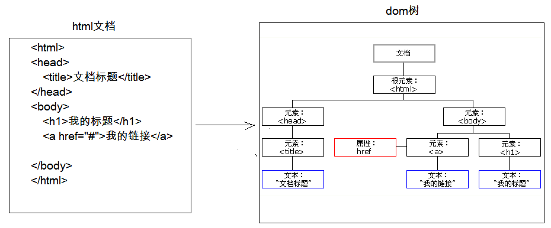
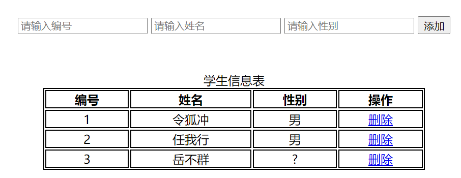
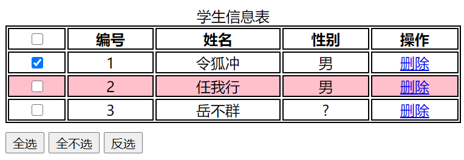
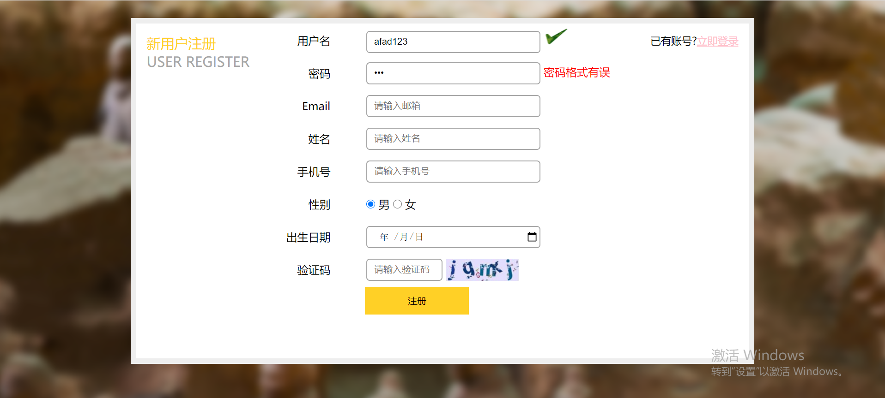

## 第八节 JavaScript 高级

### 8.1 DOM简单学习：为了满足案例要求

**功能**：控制 html 文档的内容

**获取页面标签(元素)对象**：Element

* document.getElementById("id值")：通过元素的 id 获取元素对象

**操作 Element 对象**：

1. 修改属性值：
    1) 明确获取的对象是哪一个？
    2) 查看API文档，找其中有哪些属性可以设置
2. 修改标签体内容：（属性 innerHTML）
    1) 获取元素对象
    2) 使用innerHTML属性修改标签体内容

#### 8.1.1 案例

```html
<!DOCTYPE html>
<html lang="en">
<head>
    <meta charset="UTF-8">
    <title>Title</title>
</head>
<body>
    
    
    <h1 id="title">阿里巴巴</h1>

<script>
    //通过id获取元素对象
    var light = document.getElementById("light");
    alert("我要换图片了。。。");
    light.src = "img/on.gif";

    //1.获取h1标签对象
    var title = document.getElementById("title");
    alert("我要换内容了。。。");
    //2.修改内容
    title.innerHTML = "哈哈哈哈";
</script>
</body>
</html>
```

### 8.2 事件简单学习

**功能**： 某些组件被执行了某些操作后，触发某些代码的执行。
	
**如何绑定事件**

1. 直接在 html 标签上，指定事件的属性(操作)，属性值就是 js 代码
   * 事件：onclick --- 单击事件	
2. 通过 js 获取元素对象，指定事件属性，设置一个函数

```html
<!DOCTYPE html>
<html lang="en">
<head>
	<meta charset="UTF-8">
	<title>事件绑定</title>
</head>
<body>
	
	

    <script>
        function fun(){
        	alert('我被点了');
        	alert('我又被点了');
        }
        function fun2(){
        	alert('咋老点我？');
        }

        //1.获取light2对象
        var light2 = document.getElementById("light2");
        //2.绑定事件
        light2.onclick = fun2;
    </script>
</body>
</html>
```

#### 8.2.1 案例 1 ：电灯开关 

```html
<!DOCTYPE html>
<html lang="en">
<head>
    <meta charset="UTF-8">
    <title>电灯开关</title>
</head>
<body>


<script>
    /*
        分析：
            1.获取图片对象
            2.绑定单击事件
            3.每次点击切换图片
                * 规则：
                    * 如果灯是开的 on,切换图片为 off
                    * 如果灯是关的 off,切换图片为 on
                * 使用标记flag来完成
     */

    //1.获取图片对象
    var light = document.getElementById("light");

    var flag = false;//代表灯是灭的。 off图片

    //2.绑定单击事件
    light.onclick = function(){
        if(flag){//判断如果灯是开的，则灭掉
            light.src = "img/off.gif";
            flag = false;
        }else{
            //如果灯是灭的，则打开
            light.src = "img/on.gif";
            flag = true;
        }
    }
</script>
</body>
</html>
```

### 8.3 BOM 

#### 8.3.1 介绍

**1) 概念**：Browser Object Model 浏览器对象模型，将浏览器的各个组成部分封装成对象。
	
**2) 组成**：

* Window：窗口对象
* Navigator：浏览器对象
* Screen：显示器屏幕对象
* History：历史记录对象
* Location：地址栏对象
	

**3) Window**：窗口对象

1. 创建

2. 方法 

   🍒 与弹出框有关的方法：  

   * `alert()` 显示带有一段消息和一个确认按钮的警告框。
   * `confirm()` 显示带有一段消息以及确认按钮和取消按钮的对话框。如果用户点击确定按钮，则方法返回 true，如果用户点击取消按钮，则方法返回 false。
   * `prompt()` 显示可提示用户输入的对话框。返回值：获取用户输入的值。

   🍒 与打开关闭有关的方法：

   * `close()`	关闭浏览器窗口，谁调用关谁。调用：`要关闭的窗口对象.close()`。
   * `open(para)` 打开一个新的浏览器窗口，返回新的 Window 对象。para 可以为空，打开一个空页面。也可以是一个 http 网址，打开该指定页面。

   🍒 与定时器有关的方式 
   
   * `setTimeout(para1, para2)` 在指定的毫秒数后调用函数或计算表达式。para1 为 js 代码或者方法对象，para2 为毫秒值。返回唯一标识，用于取消定时器。
   * `clearTimeout()` 取消由 setTimeout() 方法设置的 timeout。
   * `setInterval()` 按照指定的周期（以毫秒计）来调用函数或计算表达式。
   * `clearInterval()` 取消由 setInterval() 设置的 timeout。

3. 属性：

   * 获取其他 BOM 对象：
      * history 使用：var h1 = windows.history 或 var h2 = history
      * location
      * Navigator
      * Screen

   * 获取 DOM 对象
      * document
4. 特点

   * 🍓 Window 对象不需要创建可以直接使用 window 使用。`window.方法名();`
   * 🍓 window 引用可以省略。`方法名();`

**4) Location**：地址栏对象

1. 创建(获取)：
    * window.location
    * location

2. 方法：

   * reload()：重新加载当前文档。刷新

3. 属性

   * href：设置或返回完整的 URL。

**5) History**：历史记录对象

1. 创建(获取)：
    * window.history
    * history
	
2. 方法：
    * back()：加载 history 列表中的前一个 URL。
    * forward()：加载 history 列表中的下一个 URL。
    * go(参数)：加载 history 列表中的某个具体页面。参数是正数，前进几个历史记录。参数是负数，后退几个历史记录。

3. 属性：

	* length：返回当前窗口历史列表中的 URL 数量。

#### 8.3.2 案例 2 ：轮播图 

```html
<!DOCTYPE html>
<html lang="en">
<head>
    <meta charset="UTF-8">
    <title>轮播图</title>
</head>
<body>

    

    <script>
        /*
            分析：
                1.在页面上使用img标签展示图片
                2.定义一个方法，修改图片对象的src属性
                3.定义一个定时器，每隔3秒调用方法一次。
         */

        //修改图片src属性
        var number = 1;
        function fun(){
            number ++ ;
            //判断number是否大于3
            if(number > 3){
                number = 1;
            }
            //获取img对象
            var img = document.getElementById("img");
            img.src = "img/banner_"+number+".jpg";
        }

        //2.定义定时器
        setInterval(fun,3000);
    </script>
</body>
</html>
```


#### 8.3.3 案例 3 ：自动跳转页面

```html
<!DOCTYPE html>
<html lang="en">
<head>
    <meta charset="UTF-8">
    <title>自动跳转</title>
    <style>
        p{
            text-align: center;
        }
        span{
            color:red;
        }
    </style>

</head>
<body>
    <p>
        <span id="time">5</span>秒之后，自动跳转到首页...
    </p>

    <script>
        /*
            分析：
               1.显示页面效果  <p>
               2.倒计时读秒效果实现
                   2.1 定义一个方法，获取span标签，修改span标签体内容，时间--
                   2.2 定义一个定时器，1秒执行一次该方法
               3.在方法中判断时间如果<= 0 ，则跳转到首页
         */
       // 2.倒计时读秒效果实现

        var second = 5;
        var time = document.getElementById("time");

        //定义一个方法，获取span标签，修改span标签体内容，时间--
        function showTime(){
            second -- ;
            //判断时间如果<= 0 ，则跳转到首页
            if(second <= 0){
                //跳转到首页
                location.href = "https://www.baidu.com";
            }
            time.innerHTML = second +"";
        }

        //设置定时器，1秒执行一次该方法
        setInterval(showTime,1000);

    </script>
</body>
</html>
```


### 8.4 DOM

#### 8.4.1 介绍



**概念**： Document Object Model 文档对象模型 ，将标记语言文档的各个组成部分，封装为对象。可以使用这些对象，对标记语言文档进行 CRUD 的动态操作。
	
**W3C DOM 标准被分为 3 个不同的部分**：

 * 核心 DOM - 针对【任何结构化文档】的标准模型

   * Document：文档对象（重点）
   * Element：元素对象（重点）
   * Attribute：属性对象
   * Text：文本对象
   * Comment：注释对象
   * Node：节点对象，其他 5 个的【父对象】（重点）

 * XML DOM - 针对 XML 文档的标准模型

 * HTML DOM - 针对 HTML 文档的标准模型

**核心 DOM 模型**

**1) Document**：文档对象

1. 创建(获取)：在 html dom 模型中可以使用 window 对象来获取
   * window.document
   * document

2. 方法：
   * 获取 Element 对象：
      * `getElementById()`：根据 id 属性值获取元素对象。id 属性值一般唯一。
      * `getElementsByTagName()`：根据元素名称获取元素对象们。返回值是一个数组。
      * `getElementsByClassName()`：根据 Class 属性值获取元素对象们。返回值是一个数组。
      * `getElementsByName()`：根据 name 属性值获取元素对象们。返回值是一个数组。

   * 创建其他 DOM 对象：
      * `createAttribute(name)`
      * `createComment()`
      * `createElement()`
      * `createTextNode()`
	

**2) Element**：元素对象

1. 获取/创建：通过 document 来获取和创建

2. 方法：

   * removeAttribute()：删除属性
   * setAttribute()：设置属性
	

**3) Node**：节点对象，其他 5 个的父对象

* 特点：所有 dom 对象都可以被认为是一个节点

* 方法：
   * CRUD dom 树：
      * appendChild()：向节点的子节点列表的结尾添加新的子节点。
      * removeChild(para)	：删除（并返回）当前节点的指定子节点。
      * replaceChild(para1, para2)：用新节点替换一个子节点。

* 属性：parentNode，返回节点的父节点。

**HTML DOM**

1. 标签体的设置和获取：innerHTML

2. 使用 html 元素对象的属性(遇到案例，查看 API 文档)

3. 控制元素样式

   * 使用元素的 style 属性来设置
   
   ```html
   //修改样式方式1
   div1.style.border = "1px solid red";
   div1.style.width = "200px";
   //font-size--> fontSize
   div1.style.fontSize = "20px";
   ```

   * 提前定义好类选择器的样式，通过元素的 className 属性来设置其 class 属性值。
   
   ```html
   .d1{
       border: 1px solid red;
       width: 100px;
       height: 100px;
   }
   div2.className = "d1";
   ```

#### 8.4.2 Node 对象演示 

```html
<!DOCTYPE html>
<html lang="en">
<head>
    <meta charset="UTF-8">
    <title>Node 对象演示</title>
    <style>

        div{

            border: 1px solid red;

        }
        #div1{
            width: 200px;
            height: 200px;
        }

        #div2{
            width: 100px;
            height: 100px;
        }


        #div3{
            width: 100px;
            height: 100px;
        }

    </style>

</head>
<body>
    <div id="div1">
        <div id="div2">div2</div>
        div1
    </div>
    <a href="javascript:void(0);" id="del">删除子节点</a>
    <a href="javascript:void(0);" id="add">添加子节点</a>
    <!--<input type="button" id="del" value="删除子节点">-->
<script>
    //1.获取超链接
    var element_a = document.getElementById("del");
    //2.绑定单击事件
    element_a.onclick = function(){
        var div1 = document.getElementById("div1");
        var div2 = document.getElementById("div2");
        div1.removeChild(div2);
    }

    //1.获取超链接
    var element_add = document.getElementById("add");
    //2.绑定单击事件
    element_add.onclick = function(){
        var div1 = document.getElementById("div1");
       //给div1添加子节点
        //创建div节点
        var div3 = document.createElement("div");
        div3.setAttribute("id","div3");

        div1.appendChild(div3);
    }

    /*
        超链接功能：
            1.可以被点击：样式
            2.点击后跳转到href指定的url
        需求：保留1功能，去掉2功能
        实现：href="javascript:void(0);"
     */

    var div2 = document.getElementById("div2");
    var div1 = div2.parentNode;
    alert(div1);

</script>
</body>
</html>
```

#### 8.4.3 案例 4 ：动态表格 




```html
<!DOCTYPE html>
<html lang="en">
<head>
    <meta charset="UTF-8">
    <title>动态表格</title>

    <style>
        table{
            border: 1px solid;
            margin: auto;
            width: 500px;
        }

        td,th{
            text-align: center;
            border: 1px solid;
        }
        div{
            text-align: center;
            margin: 50px;
        }
    </style>

</head>
<body>

<div>
    <input type="text" id="id" placeholder="请输入编号">
    <input type="text" id="name"  placeholder="请输入姓名">
    <input type="text" id="gender"  placeholder="请输入性别">
    <input type="button" value="添加" id="btn_add">

</div>

<table>
    <caption>学生信息表</caption>
    <tr>
        <th>编号</th>
        <th>姓名</th>
        <th>性别</th>
        <th>操作</th>
    </tr>

    <tr>
        <td>1</td>
        <td>令狐冲</td>
        <td>男</td>
        <td><a href="javascript:void(0);" onclick="delTr(this);">删除</a></td>
    </tr>

    <tr>
        <td>2</td>
        <td>任我行</td>
        <td>男</td>
        <td><a href="javascript:void(0);" onclick="delTr(this);">删除</a></td>
    </tr>

    <tr>
        <td>3</td>
        <td>岳不群</td>
        <td>?</td>
        <td><a href="javascript:void(0);" onclick="delTr(this);" >删除</a></td>
    </tr>

</table>

<script>
    /*
        分析：
            1.添加：
                1. 给添加按钮绑定单击事件
                2. 获取文本框的内容
                3. 创建td，设置td的文本为文本框的内容。
                4. 创建tr
                5. 将td添加到tr中
                6. 获取table，将tr添加到table中
            2.删除：
                1.确定点击的是哪一个超链接
                    <a href="javascript:void(0);" onclick="delTr(this);" >删除</a>
                2.怎么删除？
                    removeChild():通过父节点删除子节点

     */

    //1.获取按钮
   /* document.getElementById("btn_add").onclick = function(){
        //2.获取文本框的内容
        var id = document.getElementById("id").value;
        var name = document.getElementById("name").value;
        var gender = document.getElementById("gender").value;

        //3.创建td，赋值td的标签体
        //id 的 td
        var td_id = document.createElement("td");
        var text_id = document.createTextNode(id);
        td_id.appendChild(text_id);
        //name 的 td
        var td_name = document.createElement("td");
        var text_name = document.createTextNode(name);
        td_name.appendChild(text_name);
        //gender 的 td
        var td_gender = document.createElement("td");
        var text_gender = document.createTextNode(gender);
        td_gender.appendChild(text_gender);
        //a标签的td
        var td_a = document.createElement("td");
        var ele_a = document.createElement("a");
        ele_a.setAttribute("href","javascript:void(0);");
        ele_a.setAttribute("onclick","delTr(this);");
        var text_a = document.createTextNode("删除");
        ele_a.appendChild(text_a);
        td_a.appendChild(ele_a);

        //4.创建tr
        var tr = document.createElement("tr");
        //5.添加td到tr中
        tr.appendChild(td_id);
        tr.appendChild(td_name);
        tr.appendChild(td_gender);
        tr.appendChild(td_a);
        //6.获取table
        var table = document.getElementsByTagName("table")[0];
        table.appendChild(tr);
    }*/

   //使用innerHTML添加
    document.getElementById("btn_add").onclick = function() {
        //2.获取文本框的内容
        var id = document.getElementById("id").value;
        var name = document.getElementById("name").value;
        var gender = document.getElementById("gender").value;

        //获取table
        var table = document.getElementsByTagName("table")[0];

        //追加一行
        table.innerHTML += "<tr>\n" +
            "        <td>"+id+"</td>\n" +
            "        <td>"+name+"</td>\n" +
            "        <td>"+gender+"</td>\n" +
            "        <td><a href=\"javascript:void(0);\" onclick=\"delTr(this);\" >删除</a></td>\n" +
            "    </tr>";
    }

    //删除方法
    function delTr(obj){
        var table = obj.parentNode.parentNode.parentNode;
        var tr = obj.parentNode.parentNode;
        table.removeChild(tr);
    }
</script>

</body>
</html>
```

#### 8.4.4 HTML DOM 控制样式 

```html
<!DOCTYPE html>
<html lang="en">
<head>
    <meta charset="UTF-8">
    <title>控制样式</title>
    <style>
        .d1{
            border: 1px solid red;
            width: 100px;
            height: 100px;
        }

        .d2{
            border: 1px solid blue;
            width: 200px;
            height: 200px;
        }
    </style>
</head>
<body>

    <div id="div1">
        div1
    </div>

    <div id="div2">
        div2
    </div>

<script>
    var div1 = document.getElementById("div1");
    div1.onclick = function(){
        //修改样式方式1
        div1.style.border = "1px solid red";
        div1.style.width = "200px";
        //font-size--> fontSize
        div1.style.fontSize = "20px";
    }

    var div2 = document.getElementById("div2");
    div2.onclick = function(){
        div2.className = "d1";
    }
</script>

</body>
</html>
```

> 超链接功能 `<a>`：
>
>         1. 可以被点击：样式
>         2. 点击后跳转到 href 指定的 url
>    
>      需求：保留 1 功能，去掉 2 功能
>      实现：href="javascript:void(0);"

### 8.5 事件监听机制 

#### 8.5.1 介绍

**概念**：某些组件被执行了某些操作后，触发某些代码的执行。	

**事件**：某些操作。如： 单击，双击，键盘按下了，鼠标移动了

**事件源**：组件。如： 按钮 文本输入框...

**监听器**：代码。

**注册监听**：将事件，事件源，监听器结合在一起。当事件源上发生了某个事件，则触发执行某个监听器代码。


【常见的事件】

**1) 点击事件**

1. onclick：单击事件
2. ondblclick：双击事件

**2) 焦点事件**

1. onblur：失去焦点，一般用于表单验证，如失去交点时，判断输入的用户名是否有效。
2. onfocus：元素获得焦点。
	

**3) 加载事件**

1. onload：一张页面或一幅图像完成加载。
   * `window.onload = function(){页面加载完后，再执行代码}`
	

**4) 鼠标事件**

1. onmousedown	鼠标按钮被按下。
   * 定义方法时，定义一个形参，接受 event 对象。
   * event 对象的 button 属性可以获取鼠标按钮键被点击了。左键是 0，中建是 1，右键是 2。

2. onmouseup	鼠标按键被松开。

3. onmousemove	鼠标被移动。

4. onmouseover	鼠标移到某元素之上。

5. onmouseout	鼠标从某元素移开。
	

**5) 键盘事件**

1. onkeydown：某个键盘按键被按下。	
2. onkeyup：某个键盘按键被松开。
3. onkeypress：某个键盘按键被按下并松开。		

**6) 选择和改变**

1. onchange：域的内容被改变。
2. onselect：文本被选中。

**7) 表单事件**

1. onsubmit：确认按钮被点击。可以阻止表单的提交，方法返回 false 则表单被阻止提交。共有两种方法：

```html
<-- 方法一 -->
<form action="#" id="form" onclick="return checkForm();">  <--必须要加return，不能直接写函数名 -->
	<input name="username" id="username">
    <select id="city">
        <option>--请选择--</option>
        <option>北京</option>
        <option>上海</option>
        <option>西安</option>
    </select>
	<input type="submit" value="提交">
</form>

function checkForm(){
	return true;
}

<-- 方法二 -->
document.getElementById("form").onsubmit = function(){
    //校验用户名格式是否正确
    var flag = false;
    return flag;
}
```

2. onreset：重置按钮被点击。	


#### 8.5.2 案例 5 表格全选 




```html
<!DOCTYPE html>
<html lang="en">
<head>
    <meta charset="UTF-8">
    <title>表格全选</title>
    <style>
        table{
            border: 1px solid;
            width: 500px;
            margin-left: 30%;
        }

        td,th{
            text-align: center;
            border: 1px solid;
        }
        div{
            margin-top: 10px;
            margin-left: 30%;
        }

        .out{
            background-color: white;
        }
        .over{
            background-color: pink;
        }
    </style>

  <script>
      /*
        分析：
            1.全选：
                * 获取所有的checkbox
                * 遍历cb，设置每一个cb的状态为选中  checked

       */


      //1.在页面加载完后绑定事件
      window.onload = function(){
          //2.给全选按钮绑定单击事件
          document.getElementById("selectAll").onclick = function(){
                //全选
                //1.获取所有的checkbox
                var cbs = document.getElementsByName("cb");
                //2.遍历
                  for (var i = 0; i < cbs.length; i++) {
                      //3.设置每一个cb的状态为选中  checked
                      cbs[i].checked = true;
                  }
          }

          document.getElementById("unSelectAll").onclick = function(){
              //全不选
              //1.获取所有的checkbox
              var cbs = document.getElementsByName("cb");
              //2.遍历
              for (var i = 0; i < cbs.length; i++) {
                  //3.设置每一个cb的状态为未选中  checked
                  cbs[i].checked = false;
              }
          }

          document.getElementById("selectRev").onclick = function(){
              //反选
              //1.获取所有的checkbox
              var cbs = document.getElementsByName("cb");
              //2.遍历
              for (var i = 0; i < cbs.length; i++) {
                  //3.设置每一个cb的状态为相反
                  cbs[i].checked = !cbs[i].checked;
              }
          }

          document.getElementById("firstCb").onclick = function(){
              //第一个cb点击
              //1.获取所有的checkbox
              var cbs = document.getElementsByName("cb");
              //获取第一个cb

              //2.遍历
              for (var i = 0; i < cbs.length; i++) {
                  //3.设置每一个cb的状态和第一个cb的状态一样
                  cbs[i].checked =  this.checked;
              }
          }

          //给所有tr绑定鼠标移到元素之上和移出元素事件
          var trs = document.getElementsByTagName("tr");
          //2.遍历
          for (var i = 0; i < trs.length; i++) {
              //移到元素之上
              trs[i].onmouseover = function(){
                    this.className = "over";
              }

              //移出元素
              trs[i].onmouseout = function(){
                     this.className = "out";
              }

          }

      }

  </script>

</head>
<body>

<table>
    <caption>学生信息表</caption>
    <tr>
        <th><input type="checkbox" name="cb" id="firstCb"></th>
        <th>编号</th>
        <th>姓名</th>
        <th>性别</th>
        <th>操作</th>
    </tr>

    <tr>
        <td><input type="checkbox"  name="cb" ></td>
        <td>1</td>
        <td>令狐冲</td>
        <td>男</td>
        <td><a href="javascript:void(0);">删除</a></td>
    </tr>

    <tr>
        <td><input type="checkbox"  name="cb" ></td>
        <td>2</td>
        <td>任我行</td>
        <td>男</td>
        <td><a href="javascript:void(0);">删除</a></td>
    </tr>

    <tr>
        <td><input type="checkbox"  name="cb" ></td>
        <td>3</td>
        <td>岳不群</td>
        <td>?</td>
        <td><a href="javascript:void(0);">删除</a></td>
    </tr>

</table>
<div>
    <input type="button" id="selectAll" value="全选">
    <input type="button" id="unSelectAll" value="全不选">
    <input type="button" id="selectRev" value="反选">
</div>
</body>
</html>
```

#### 8.5.3 案例 6 表单验证 




```html
<!DOCTYPE html>
<html lang="en">
<head>
    <meta charset="UTF-8">
    <title>注册页面</title>
<style>
    *{
        margin: 0px;
        padding: 0px;
        box-sizing: border-box;
    }
    body{
        background: url("img/register_bg.png") no-repeat center;
        padding-top: 25px;
    }

    .rg_layout{
        width: 900px;
        height: 500px;
        border: 8px solid #EEEEEE;
        background-color: white;
        /*让div水平居中*/
        margin: auto;
    }

    .rg_left{
        /*border: 1px solid red;*/
        float: left;
        margin: 15px;
    }
    .rg_left > p:first-child{
        color:#FFD026;
        font-size: 20px;
    }

    .rg_left > p:last-child{
        color:#A6A6A6;
        font-size: 20px;

    }

    .rg_center{
        float: left;
       /* border: 1px solid red;*/

    }

    .rg_right{
        /*border: 1px solid red;*/
        float: right;
        margin: 15px;
    }

    .rg_right > p:first-child{
        font-size: 15px;

    }
    .rg_right p a {
        color:pink;
    }

    .td_left{
        width: 100px;
        text-align: right;
        height: 45px;
    }
    .td_right{
        padding-left: 50px ;
    }

    #username,#password,#email,#name,#tel,#birthday,#checkcode{
        width: 251px;
        height: 32px;
        border: 1px solid #A6A6A6 ;
        /*设置边框圆角*/
        border-radius: 5px;
        padding-left: 10px;
    }
    #checkcode{
        width: 110px;
    }

    #img_check{
        height: 32px;
        vertical-align: middle;
    }

    #btn_sub{
        width: 150px;
        height: 40px;
        background-color: #FFD026;
        border: 1px solid #FFD026 ;
    }
    .error{
        color:red;
    }
    #td_sub{
        padding-left: 150px;
    }

</style>
<script>

    /*
        分析：
            1.给表单绑定onsubmit事件。监听器中判断每一个方法校验的结果。
                如果都为true，则监听器方法返回true
                如果有一个为false，则监听器方法返回false

            2.定义一些方法分别校验各个表单项。
            3.给各个表单项绑定onblur事件。
     */

    window.onload = function(){
        //1.给表单绑定onsubmit事件
        document.getElementById("form").onsubmit = function(){
            //调用用户校验方法   chekUsername();
            //调用密码校验方法   chekPassword();
            //return checkUsername() && checkPassword();

            return checkUsername() && checkPassword();
        }

        //给用户名和密码框分别绑定离焦事件
        document.getElementById("username").onblur = checkUsername;
        document.getElementById("password").onblur = checkPassword;
    }

    //校验用户名
    function checkUsername(){
        //1.获取用户名的值
        var username = document.getElementById("username").value;
        //2.定义正则表达式
        var reg_username = /^\w{6,12}$/;
        //3.判断值是否符合正则的规则
        var flag = reg_username.test(username);
        //4.提示信息
        var s_username = document.getElementById("s_username");

        if(flag){
            //提示绿色对勾
            s_username.innerHTML = "";
        }else{
            //提示红色用户名有误
            s_username.innerHTML = "用户名格式有误";
        }
        return flag;
    }

    //校验密码
    function checkPassword(){
        //1.获取用户名的值
        var password = document.getElementById("password").value;
        //2.定义正则表达式
        var reg_password = /^\w{6,12}$/;
        //3.判断值是否符合正则的规则
        var flag = reg_password.test(password);
        //4.提示信息
        var s_password = document.getElementById("s_password");

        if(flag){
            //提示绿色对勾
            s_password.innerHTML = "";
        }else{
            //提示红色用户名有误
            s_password.innerHTML = "密码格式有误";
        }
        return flag;
    }

</script>
</head>
<body>

<div class="rg_layout">
    <div class="rg_left">
        <p>新用户注册</p>
        <p>USER REGISTER</p>

    </div>

    <div class="rg_center">
        <div class="rg_form">
            <!--定义表单 form-->
            <form action="#" id="form" method="get">
                <table>
                    <tr>
                        <td class="td_left"><label for="username">用户名</label></td>
                        <td class="td_right">
                            <input type="text" name="username" id="username" placeholder="请输入用户名">
                            <span id="s_username" class="error"></span>
                        </td>
                    </tr>

                    <tr>
                        <td class="td_left"><label for="password">密码</label></td>
                        <td class="td_right">
                            <input type="password" name="password" id="password" placeholder="请输入密码">
                            <span id="s_password" class="error"></span>
                        </td>
                    </tr>

                    <tr>
                        <td class="td_left"><label for="email">Email</label></td>
                        <td class="td_right"><input type="email" name="email" id="email" placeholder="请输入邮箱"></td>
                    </tr>

                    <tr>
                        <td class="td_left"><label for="name">姓名</label></td>
                        <td class="td_right"><input type="text" name="name" id="name" placeholder="请输入姓名"></td>
                    </tr>

                    <tr>
                        <td class="td_left"><label for="tel">手机号</label></td>
                        <td class="td_right"><input type="text" name="tel" id="tel" placeholder="请输入手机号"></td>
                    </tr>

                    <tr>
                        <td class="td_left"><label>性别</label></td>
                        <td class="td_right">
                            <input type="radio" name="gender" value="male" checked> 男
                            <input type="radio" name="gender" value="female"> 女
                        </td>
                    </tr>

                    <tr>
                        <td class="td_left"><label for="birthday">出生日期</label></td>
                        <td class="td_right"><input type="date" name="birthday" id="birthday" placeholder="请输入出生日期"></td>
                    </tr>

                    <tr>
                        <td class="td_left"><label for="checkcode" >验证码</label></td>
                        <td class="td_right"><input type="text" name="checkcode" id="checkcode" placeholder="请输入验证码">
                            
                        </td>
                    </tr>

                    <tr>
                        <td colspan="2" id="td_sub"><input type="submit" id="btn_sub" value="注册"></td>
                    </tr>
                </table>

            </form>

        </div>

    </div>

    <div class="rg_right">
        <p>已有账号?<a href="#">立即登录</a></p>
    </div>

</div>

</body>
</html>
```

