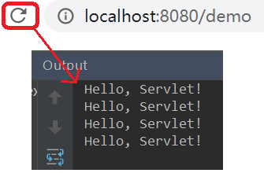

## 第十二节 Servlet

### 12.1 Servlet 概述

概念：运行在 web 服务器端的小程序 (server applet)。
   * Servlet 就是一个接口，定义了 Java 类被浏览器访问到(tomcat 识别)的规则。
   * 将来自定义一个类，实现 Servlet 接口，复写方法。

### 12.2 Servlet 快速入门

1 创建 JavaEE 项目

2 定义一个类，实现 Servlet 接口，并实现接口中所有的抽象方法。
   * 在 src 文件夹下创建包 `cn.itcast.web.servlet`，创建 `ServletDemo1` 类。
   * 实现 Servlet 接口，并实现接口中的方法。 

```java
package cn.itcast.web.servlet;

import javax.servlet.*;
import java.io.IOException;

/**
 * 快速入门
 */
public class ServletDemo1 implements Servlet{
    @Override
    public void init(ServletConfig servletConfig) throws ServletException {

    }

    @Override
    public ServletConfig getServletConfig() {
        return null;
    }
    //提供服务的方法
    @Override
    public void service(ServletRequest servletRequest, ServletResponse servletResponse) throws ServletException, IOException {
        System.out.println("Hello, Servlet!");
    }

    @Override
    public String getServletInfo() {
        return null;
    }

    @Override
    public void destroy() {

    }
}
```

3 配置 Servlet，修改 web->WEB-INF 下的 web.xml 文件

```xml
<?xml version="1.0" encoding="UTF-8"?>
<web-app xmlns="http://xmlns.jcp.org/xml/ns/javaee"
         xmlns:xsi="http://www.w3.org/2001/XMLSchema-instance"
         xsi:schemaLocation="http://xmlns.jcp.org/xml/ns/javaee http://xmlns.jcp.org/xml/ns/javaee/web-app_3_1.xsd"
         version="3.1">
    <!--配置 Servlet-->
    <servlet>
        <servlet-name>demo1</servlet-name>
        <servlet-class>cn.itcast.web.servlet.ServletDemo1</servlet-class>
    </servlet>

    <servlet-mapping>
        <servlet-name>demo1</servlet-name>
        <!--将来访问的资源路径-->
        <url-pattern>/demo</url-pattern>
    </servlet-mapping>
</web-app>
```

4 访问：在浏览器中每访问一次 url `http://localhost:8080/demo`，命令窗口会输出 `Hello, Servlet!`。




### 12.3 Servlet 执行原理

1. 当服务器接受到客户端浏览器的请求后，会解析请求 URL 路径，获取访问的 Servlet 的资源路径。
2. 查找 web.xml 文件，是否有对应的 `<url-pattern>` 标签体内容。
3. 如果有，则在找到对应的 `<servlet-class>` 全类名。
4. tomcat 会将该类（第 3 步找到的全类名）字节码文件加载进内存，并且创建其对象。
5. 调用其方法。（该类必须实现 Servlet 接口）
  
### 12.4 Servlet 生命周期方法

1 Servlet 被创建：执行 init 方法，只执行一次。

2 提供服务：执行 service 方法，执行多次。每次访问 Servlet 时，Service 方法都会被调用一次。

3 Servlet 被销毁：执行 destroy 方法，只执行一次。destroy 方法在 Servlet 被销毁之前执行，一般用于释放资源。    
* 服务器关闭时，Servlet 被销毁。
* 只有服务器正常关闭时，才会执行destroy方法。

**Servlet什么时候被创建？**
* 默认情况下，第一次被访问时，Servlet 被创建。
* 在 `<servlet>` 标签下配置执行 Servlet 的创建时机。
	1. 第一次被访问时，创建。设置 `<load-on-startup>` 的值为负数。
	2. 在服务器启动时，创建。设置 `<load-on-startup>` 的值为 0 或正整数。


**Servlet的 init 方法，只执行一次，说明一个 Servlet 在内存中只存在一个对象，Servlet 是单例的。**
* 多个用户同时访问时，可能存在线程安全问题。
* 解决：尽量不要在 Servlet 中定义成员变量。即使定义了成员变量，也不要对修改值。
	
```java
package cn.itcast.web.servlet;

import javax.servlet.*;
import java.io.IOException;

/**
 * Servlet的方法
 */
public class ServletDemo2 implements Servlet {
    private int age = 3;

    /**
     * 初始化方法
     * 在Servlet被创建时，执行。只会执行一次
     * @param servletConfig
     * @throws ServletException
     */
    @Override
    public void init(ServletConfig servletConfig) throws ServletException {
        System.out.println("init.....");
    }

    /**
     * 获取ServletConfig对象
     * ServletConfig：Servlet的配置对象
     * @return
     */
    @Override
    public ServletConfig getServletConfig() {
        return null;
    }

    /**
     * 提供服务方法
     * 每一次Servlet被访问时，执行。执行多次
     * @param servletRequest
     * @param servletResponse
     * @throws ServletException
     * @throws IOException
     */
    @Override
    public void service(ServletRequest servletRequest, ServletResponse servletResponse) throws ServletException, IOException {
        System.out.println("service.....");
        int number = 3;
    }

    /**
     * 获取Servlet的一些信息，版本，作者等等。。
     * @return
     */
    @Override
    public String getServletInfo() {
        return null;
    }

    /**
     * 销毁方法
     * 在服务器正常关闭时，执行，执行一次。
     */
    @Override
    public void destroy() {
        System.out.println("destroy.....");
    }
}
```		

```xml
<?xml version="1.0" encoding="UTF-8"?>
<web-app xmlns="http://xmlns.jcp.org/xml/ns/javaee"
         xmlns:xsi="http://www.w3.org/2001/XMLSchema-instance"
         xsi:schemaLocation="http://xmlns.jcp.org/xml/ns/javaee http://xmlns.jcp.org/xml/ns/javaee/web-app_3_1.xsd"
         version="3.1">

    <!--配置Servlet -->
    <servlet>
        <servlet-name>demo1</servlet-name>
        <servlet-class>cn.itcast.web.servlet.ServletDemo1</servlet-class>
    </servlet>

    <servlet-mapping>
        <servlet-name>demo1</servlet-name>
        <url-pattern>/demo</url-pattern>
    </servlet-mapping>

    <!--配置Servlet -->
    <servlet>
        <servlet-name>demo2</servlet-name>
        <servlet-class>cn.itcast.web.servlet.ServletDemo2</servlet-class>
        <!--指定Servlet的创建时机
            1.第一次被访问时，创建
                * <load-on-startup>的值为负数
            2.在服务器启动时，创建
                * <load-on-startup>的值为0或正整数
        -->
        <load-on-startup>-5</load-on-startup>
    </servlet>

    <servlet-mapping>
        <servlet-name>demo2</servlet-name>
        <url-pattern>/demo2</url-pattern>
    </servlet-mapping>
</web-app>
```			
              
                  
### 12.5 Servlet 3.0 注解配置 

优势：支持注解配置，可以不需要 web.xml。
	
步骤：
1. 创建 JavaEE 项目，选择 Servlet 的版本 3.0 以上，可以不创建 web.xml
2. 定义一个类，实现 Servlet 接口
3. 复写方法
4. 在类上使用 `@WebServlet` 注解，进行配置


### 12.6 IDEA 与 tomcat 相关配置

### 12.7

### 12.8     


                           
                                                      
                                                                                                             