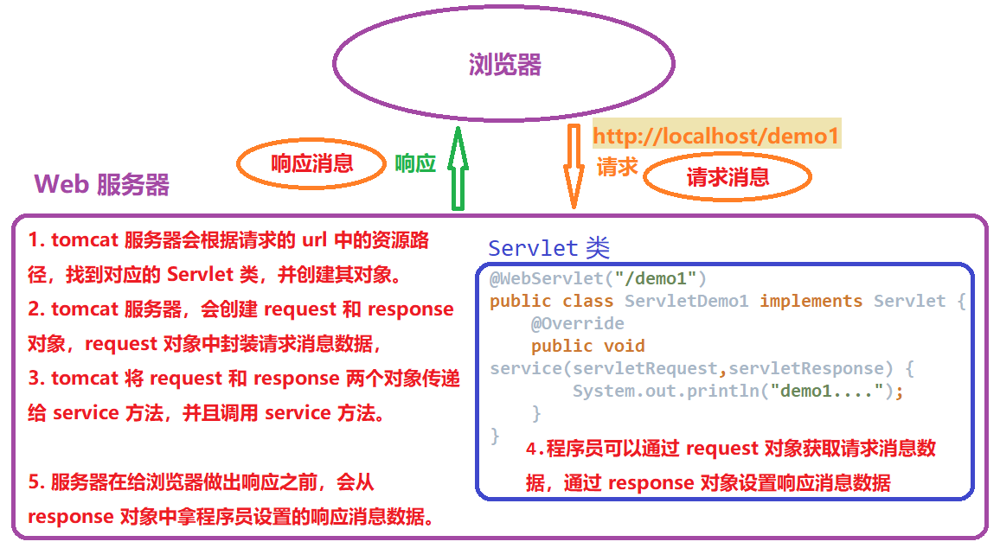
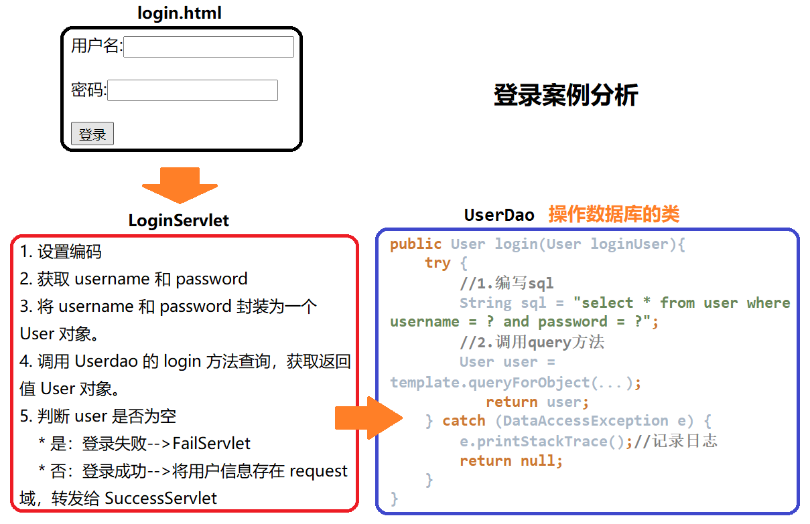

## 第十三节 HTTP & Request

### 13.1 HTTP

#### 13.1.1 概念 

概念：Hyper Text Transfer Protocol 超文本传输协议，定义了客户端与服务器端通信时发送数据的格式。

特点：
1. 基于 TCP/IP 的高级协议
2. 默认端口号: 80
3. 基于请求/响应模型的:一次请求对应一次响应
4. 无状态的：每次请求之间相互独立，不能交互数据
	
历史版本：
* 1.0：每一次请求响应都会建立新的连接，即一个网页如果有多个图像资源（以及其他资源）时，会建立不同的连接。
* 1.1：复用连接，一次连接结束后不会马上释放，在一段时间内有数据发送时，仍使用该连接传输数据。对缓存支持的比较好。
* 还有其他区别，此处不在列出

#### 13.1.2 HTTP 请求消息

HTTP 请求消息由一下四个部分组成：

**1）请求行**

```markdown
请求方式 请求url 请求协议/版本
GET /login.html	HTTP/1.1
```

* HTTP 协议有 7 中请求方式，常用的有 2 种
   * GET：
	1. 请求参数在请求行中，在 url 后。
	2. 请求的 url 长度有限制的
	3. 不太安全
   * POST：
	1. 请求参数在请求体中
	2. 请求的 url 长度没有限制的
	3. 相对安全

**2）请求头**：客户端浏览器告诉服务器一些信息

```
//键值对形式
请求头名称: 请求头值
```

* 常见的请求头：
	1. User-Agent：浏览器告诉服务器访问时使用的浏览器版本信息，可以在服务器端获取该头的信息，解决浏览器的兼容性问题。
	2. Referer：告诉服务器，当前请求从哪里来？
		* 作用：1）防盗链 2）统计工作

**3）请求空行**：空行，用于分割 POST 请求的请求头和请求体。

**4）请求体(正文)**：用于封装 POST 请求消息的请求参数，GET 请求的请求体为空。


【一个请求消息】

```
POST /login.html	HTTP/1.1
Host: localhost
User-Agent: Mozilla/5.0 (Windows NT 6.1; Win64; x64; rv:60.0) Gecko/20100101 Firefox/60.0
Accept: text/html,application/xhtml+xml,application/xml;q=0.9,*/*;q=0.8
Accept-Language: zh-CN,zh;q=0.8,zh-TW;q=0.7,zh-HK;q=0.5,en-US;q=0.3,en;q=0.2
Accept-Encoding: gzip, deflate
Referer: http://localhost/login.html
Connection: keep-alive
Upgrade-Insecure-Requests: 1

username=zhangsan	
```

### 13.2 Request

#### 13.2.1 Request 原理

**request 对象和 response 对象的原理**
1. request 和response对象是由服务器创建的，程序员来使用它们。
2. request 对象是来获取请求消息，response 对象是来设置响应消息。




#### 13.2.2 Request 继承体系

```
ServletRequest		-- 接口
    |	继承
HttpServletRequest	-- 接口
    |	实现
org.apache.catalina.connector.RequestFacade  -- 类(tomcat)
```

#### 13.2.3 Request 获取请求消息数据 

**1）获取请求行数据**

* GET /day14/demo1?name=zhangsan HTTP/1.1

方法：

1. 获取请求方式 ：GET
	* String getMethod()  
	
2. (*)获取虚拟目录：/day14
	* String getContextPath()
	
3. 获取 Servlet 路径: /demo1
	* String getServletPath()
	
4. 获取 get 方式请求参数：name=zhangsan
	* String getQueryString()
	
5. (*)获取请求 URI：/day14/demo1
	* String getRequestURI():	/day14/demo1
	* StringBuffer getRequestURL(): http://localhost/day14/demo1
	* URL:统一资源定位符 ： http://localhost/day14/demo1	中华人民共和国
	* URI：统一资源标识符 : /day14/demo1					共和国

6. 获取协议及版本：HTTP/1.1
	* String getProtocol()

7. 获取客户机的 IP 地址：
	* String getRemoteAddr()

```java
@WebServlet("/requestDemo1")
public class RequestDemo1 extends HttpServlet {
    protected void doPost(HttpServletRequest request, HttpServletResponse response) throws ServletException, IOException {
    }

    protected void doGet(HttpServletRequest request, HttpServletResponse response) throws ServletException, IOException {
        //1. 获取请求方式 ：GET
        String method = request.getMethod();
        //2.(*)获取虚拟目录：/day14
        String contextPath = request.getContextPath();
        //3. 获取Servlet路径: /demo1
        String servletPath = request.getServletPath();
        //4. 获取get方式请求参数：name=zhangsan
        String queryString = request.getQueryString();
        //5.(*)获取请求URI：/day14/demo1
        String requestURI = request.getRequestURI();
        StringBuffer requestURL = request.getRequestURL();
        //6. 获取协议及版本：HTTP/1.1
        String protocol = request.getProtocol();
        //7. 获取客户机的IP地址：
        String remoteAddr = request.getRemoteAddr();
    }
}
```

**2）获取请求头数据**

方法

* (*) `String getHeader(String name)`：通过请求头的名称获取请求头的值。
* `Enumeration<String> getHeaderNames()`：获取所有的请求头名称。

```java
@WebServlet("/requestDemo2")
public class RequestDemo2 extends HttpServlet {
    protected void doPost(HttpServletRequest request, HttpServletResponse response) throws ServletException, IOException {

    }

    protected void doGet(HttpServletRequest request, HttpServletResponse response) throws ServletException, IOException {
        //演示获取请求头数据
        
        //1.获取所有请求头名称
        Enumeration<String> headerNames = request.getHeaderNames();
        //2.遍历
        while(headerNames.hasMoreElements()){
            String name = headerNames.nextElement();
            //根据名称获取请求头的值
            String value = request.getHeader(name);
            System.out.println(name+"---"+value);
        }

    }
}
```

**3）获取请求体数据**

请求体：只有 POST 请求方式才有请求体，在请求体中封装了 POST 请求的请求参数。

步骤：

1）获取流对象
	* `BufferedReader getReader()`：获取字符输入流，只能操作字符数据。
	* `ServletInputStream getInputStream()`：获取字节输入流，可以操作所有类型数据。经常用于文件上传。
						
2）再从流对象中拿数据

```html
<!DOCTYPE html>
<html lang="en">
<head>
    <meta charset="UTF-8">
    <title>注册页面</title>
</head>
<body>

    <form action="/day14/requestDemo5" method="post">
        <input type="text" placeholder="请输入用户名" name="username"><br>
        <input type="text" placeholder="请输入密码" name="password"><br>
        <input type="submit" value="注册">
    </form>

</body>
</html>
```

```java
package cn.itcast.web.request;

@WebServlet("/requestDemo5")
public class RequestDemo5 extends HttpServlet {
    protected void doPost(HttpServletRequest request, HttpServletResponse response) throws ServletException, IOException {
        //获取请求消息体--请求参数

        //1.获取字符流
        BufferedReader br = request.getReader();
        //2.读取数据
        String line = null;
        while((line = br.readLine()) != null){
            System.out.println(line);
        }
    }

    protected void doGet(HttpServletRequest request, HttpServletResponse response) throws ServletException, IOException {
    }
}
```

#### 13.2.4 Request 获取请求参数通用方式 

获取请求参数通用方式，不论 get 还是 post 请求方式都可以使用下列方法来获取请求参数：

1. `String getParameter(String name)`:根据参数名称获取参数值    username=zs&password=123

2. `String[] getParameterValues(String name)`:根据参数名称获取参数值的数组  hobby=xx&hobby=game

3. `Enumeration<String> getParameterNames()`:获取所有请求的参数名称

4. `Map<String,String[]> getParameterMap()`:获取所有参数的 map 集合

中文乱码问题：
* get 方式：tomcat 8 已经将 get 方式乱码问题解决。
* post 方式：会乱码。解决：在获取参数前，设置 request 的编码 `request.setCharacterEncoding("utf-8");`。


【一个示例】
```html
<!DOCTYPE html>
<html lang="en">
<head>
    <meta charset="UTF-8">
    <title>注册页面</title>
</head>
<body>

    <form action="/day14/requestDemo7" method="post">
        <input type="text" placeholder="请输入用户名" name="username"><br>
        <input type="text" placeholder="请输入密码" name="password"><br>

        <input type="checkbox" name="hobby" value="game">游戏
        <input type="checkbox" name="hobby" value="study">学习
        <br>

        <input type="submit" value="注册">
    </form>

</body>
</html>
```

```java
@WebServlet("/requestDemo6")
public class RequestDemo6 extends HttpServlet {
    protected void doPost(HttpServletRequest request, HttpServletResponse response) throws ServletException, IOException {
        //1.设置流的编码
        request.setCharacterEncoding("utf-8");

        //2. post 获取请求参数

        //根据参数名称获取参数值
        String username = request.getParameter("username");
        System.out.println(username);

       //根据参数名称获取参数值的数组
        String[] hobbies = request.getParameterValues("hobby");
        for (String hobby : hobbies) {
            System.out.println(hobby);
        }

        //获取所有请求的参数名称
        Enumeration<String> parameterNames = request.getParameterNames();
        while(parameterNames.hasMoreElements()){
            String name = parameterNames.nextElement();
            String value = request.getParameter(name);
            System.out.println(name + ": " + value);
            System.out.println("----------------");
        }

        // 获取所有参数的map集合
        Map<String, String[]> parameterMap = request.getParameterMap();
        //遍历
        Set<String> keyset = parameterMap.keySet();
        for (String name : keyset) {
            //获取键获取值
            String[] values = parameterMap.get(name);
            System.out.println(name);
            for (String value : values) {
                System.out.println(value);
            }
            System.out.println("-----------------");
        }
    }

    protected void doGet(HttpServletRequest request, HttpServletResponse response) throws ServletException, IOException {
        //get 获取请求参数
        this.doPost(request,response);
    }
}
```


#### 13.2.5 请求转发

请求转发：一种在服务器内部的资源跳转方式

1）步骤：

1. 通过 request 对象获取请求转发器对象：`RequestDispatcher getRequestDispatcher(String path)`

2. 使用 RequestDispatcher 对象来进行转发：`forward(ServletRequest request, ServletResponse response)` 
	
2）特点（面试题）：

1. 浏览器地址栏路径不发生变化（尽管由一个 Servlet 调转到另一个 Servlet）。

2. 只能转发到当前服务器内部资源中。

3. 转发是一次请求（尽管访问了不同的 Servlet）  

```java
@WebServlet("/requestDemo8")
public class RequestDemo8 extends HttpServlet {
    protected void doPost(HttpServletRequest request, HttpServletResponse response) throws ServletException, IOException {
        System.out.println("demo8888被访问了。。。");
        
        //转发到 demo9 资源
        request.getRequestDispatcher("/requestDemo9").forward(request,response);
        //不能转发 非当前服务器内部资源
        //request.getRequestDispatcher("http://www.itcast.cn").forward(request,response);
    }

    protected void doGet(HttpServletRequest request, HttpServletResponse response) throws ServletException, IOException {
        this.doPost(request,response);
    }
}
```

```java
@WebServlet("/requestDemo9")
public class RequestDemo9 extends HttpServlet {
    protected void doPost(HttpServletRequest request, HttpServletResponse response) throws ServletException, IOException {
        System.out.println("demo9999被访问了。。。");
    }

    protected void doGet(HttpServletRequest request, HttpServletResponse response) throws ServletException, IOException {
        this.doPost(request,response);
    }
}
```
  
#### 13.2.6 Request 共享数据(域对象)

**域对象**：一个有作用范围的对象，可以在范围内共享数据。

**request 域**：代表一次请求的范围，一般用于请求转发的多个资源中共享数据。

**方法**：

1. void setAttribute(String name, Object obj)：存储数据

2. Object getAttitude(String name)：通过键获取值

3. void removeAttribute(String name)：通过键移除键值对

#### 13.2.7 获取 ServletContext 对象 

* `ServletContext getServletContext()`


### 13.3 用户登录案例


#### 13.3.1 用户登录案例需求

1. 编写 login.html 登录页面，含有 username & password 两个输入框。
	
2. 使用 Druid 数据库连接池技术，操作 mysql，day14 数据库中 user 表。

3. 使用 JdbcTemplate 技术封装 JDBC。

4. 登录成功跳转到 SuccessServlet 展示：登录成功！用户名，欢迎您！

5. 登录失败跳转到 FailServlet 展示：登录失败，用户名或密码错误。

需求分析：




#### 13.3.2 案例代码

1）准备工作
   * 在 web 目录下创建 login.html 登录页面。
   * 在 web 下创建 WEB-INF 文件夹，在 WEB-INF 内创建 lib 文件夹，并导入相关的 jar 包。
   * 在 src 文件夹下创建 druid.properties 文件。


#### 13.3.3 BeanUtils 工具类


 