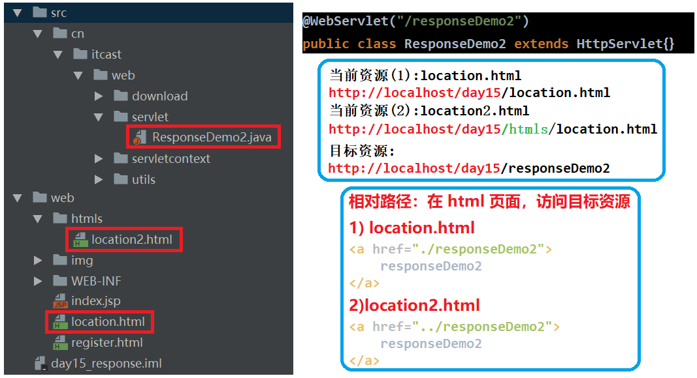

## 第十四节 Response

### 14.1 HTTP 协议 - 响应消息

响应消息：服务器端发送给客户端的数据，数据格式如下：

**1）响应行**

1. 组成：协议/版本 响应状态码 状态码描述
2. 响应状态码：服务器告诉客户端浏览器本次请求和响应的一个状态，状态码都是 3 位数字，共有 5 类：
* 1xx：服务器就收客户端消息，但没有接受完成，等待一段时间后，发送 1xx 多状态码。
* 2xx：成功。代表：200。
* 3xx：重定向。代表：302(重定向)，304(访问缓存)。
* 4xx：客户端错误。
   * 404（请求路径没有对应的资源）。
   * 405：请求方式没有对应的doXxx方法。
* 5xx：服务器端错误。代表：500(服务器内部出现异常)。
					

**2） 响应头**：由键值对 `头名称：值` 组成

* Content-Type：服务器告诉客户端本次响应体数据格式以及编码格式
* Content-disposition：服务器告诉客户端以什么格式打开响应体数据
   * `in-line`：默认值，在当前页面内打开
   * `attachment;filename=xxx`：以附件形式打开响应体。文件下载

**3）响应空行**

**4）响应体**：传输的数据

**响应字符串格式**

```
HTTP/1.1 200 OK
Content-Type: text/html;charset=UTF-8
Content-Length: 101
Date: Wed, 06 Jun 2018 07:08:42 GMT

<html>
    <head>
    	<title>$Title$</title>
    </head>
    <body>
    	hello , response
    </body>
</html>
```

### 14.2 Response 对象

功能：设置响应消息
1. 设置响应行
    * 格式：HTTP/1.1 200 ok
    * 设置状态码：`setStatus(int sc)` 
2. 设置响应头：`setHeader(String name, String value)` 

3. 设置响应体：
    * 3.1 获取输出流
        * 字符输出流：`PrintWriter getWriter()`
        * 字节输出流：`ServletOutputStream getOutputStream()`
    * 3.2 使用输出流，将数据输出到客户端浏览器


### 14.3 案例

#### 14.3.1 案例1 重定向

重定向：资源跳转的方式

代码实现：

```java
/**
 * 重定向，项目发布在 /day15 下
 */
@WebServlet("/responseDemo1")
public class ResponseDemo1 extends HttpServlet {
    protected void doPost(HttpServletRequest request, HttpServletResponse response) throws ServletException, IOException {
        //访问 [/responseDemo1]，会自动跳转到 [/responseDemo2] 资源
        
        //方法一:设置状态码与响应头
        //1. 设置状态码为302
        response.setStatus(302);
        //2.设置响应头location
        response.setHeader("location","/day15/responseDemo2");

        //方法二：简单的重定向方法
        response.sendRedirect("/day15/responseDemo2");
    }

    protected void doGet(HttpServletRequest request, HttpServletResponse response) throws ServletException, IOException {
        this.doPost(request,response);
    }
}
```
|特点|重定向 redirect|转发 forward|
|:--:|:--:|:--:|
|地址栏|发生变化|地址栏路径不变|
|访问|可以访问其他站点(服务器)的资源|只能访问当前服务器下的资源|
|请求|两次请求。不能使用 request 对象来共享数据。|一次请求，可以使用 request 对象来共享数据。|

路径分为相对路径与绝对路径

1）相对路径：通过相对路径不可以确定唯一资源（不推荐使用）
*  不以 `/` 开头，以 `.` 开头路径。如：`./index.html`
* 规则：找到当前资源和目标资源之间的相对位置关系
   * ` ./`：当前目录
   * `../`：后退一级目录



2）绝对路径：通过绝对路径可以确定唯一资源，以 `/` 开头的路径。

* 如：http://localhost/day15/responseDemo2		/day15/responseDemo2

* 规则：判断定义的路径是给谁用的？判断请求将来从哪儿发出
   * 给客户端浏览器使用：需要加虚拟目录 (项目的访问路径)
     * 建议虚拟目录动态获取：`request.getContextPath()`
     * **重定向**是客户端使用。客户端从服务器 A 获取到服务器 B 的路径，然后**客户端**再次向服务器 B 请求。
     * 超链接 `<a>`、表单 `<form>` 等。
   * 给服务器使用：不需要加虚拟目录。如转发路径。

```java
//动态获取虚拟目录
String contextPath = request.getContextPath();
//简单的重定向方法
response.sendRedirect(contextPath+"/responseDemo2");
```


#### 14.3.2 案例2 输出字符数据

步骤：

1. 获取字符输出流

2. 输出数据


乱码问题：
1. `PrintWriter pw = response.getWriter();`  获取的流的默认编码是 ISO-8859-1
2. 解决：设置该流的默认编码，告诉浏览器响应体使用的编码

```java
protected void doPost(HttpServletRequest request, HttpServletResponse response) throws ServletException, IOException {

    //获取流对象之前，设置流的默认编码：将默认的 ISO-8859-1 编码设置为 utf-8 编码。
   // response.setCharacterEncoding("utf-8");

    //告诉浏览器，服务器发送的消息体数据的编码。建议浏览器使用该编码解码
    //不区分大小写 content-type，且 setHeader 方法包含 setCharacterEncoding 功能！
    //response.setHeader("content-type","text/html;charset=utf-8");

    //简单的形式，设置编码
    response.setContentType("text/html;charset=utf-8");

    //1.获取字符输出流
    PrintWriter pw = response.getWriter();
    //2.输出数据
    pw.write("你好啊啊啊 response");
}
```

#### 14.3.3 案例3 输出字节数据

```java
protected void doPost(HttpServletRequest request, HttpServletResponse response) throws ServletException, IOException {
    response.setContentType("text/html;charset=utf-8");

    //1.获取字节输出流
    ServletOutputStream sos = response.getOutputStream();
    //2.输出数据
    sos.write("你好".getBytes("utf-8"));
}
```

#### 14.3.4 案例4 验证码

1. 本质：图片
2. 目的：防止恶意表单注册

```java
package cn.itcast.web.servlet;

import ...

@WebServlet("/checkCodeServlet")
public class CheckCodeServlet extends HttpServlet {
    protected void doPost(HttpServletRequest request, HttpServletResponse response) throws ServletException, IOException {

        int width = 100;
        int height = 50;

        //1.创建一对象，在内存中图片(验证码图片对象)
        BufferedImage image = new BufferedImage(width,height,BufferedImage.TYPE_INT_RGB);
        
        //2.美化图片
        //2.1 填充背景色
        Graphics g = image.getGraphics();//画笔对象
        g.setColor(Color.PINK);//设置画笔颜色
        g.fillRect(0,0,width,height);

        //2.2画边框
        g.setColor(Color.BLUE);
        g.drawRect(0,0,width - 1,height - 1);

        String str = "ABCDEFGHIJKLMNOPQRSTUVWXYZabcdefghigklmnopqrstuvwxyz0123456789";
        //生成随机角标
        Random ran = new Random();

        for (int i = 1; i <= 4; i++) {
            int index = ran.nextInt(str.length());
            //获取字符
            char ch = str.charAt(index);//随机字符
            //2.3写验证码
            g.drawString(ch+"",width/5*i,height/2);
        }
        
        //2.4画干扰线
        g.setColor(Color.GREEN);

        //随机生成坐标点
        for (int i = 0; i < 10; i++) {
            int x1 = ran.nextInt(width);
            int x2 = ran.nextInt(width);

            int y1 = ran.nextInt(height);
            int y2 = ran.nextInt(height);
            g.drawLine(x1,y1,x2,y2);
        }
        
        //3.将图片输出到页面展示
        ImageIO.write(image,"jpg",response.getOutputStream());
    }

    protected void doGet(HttpServletRequest request, HttpServletResponse response) throws ServletException, IOException {
        this.doPost(request,response);
    }
}
```

```html
<!DOCTYPE html>
<html lang="en">
<head>
    <meta charset="UTF-8">
    <title>Title</title>

    <script>
        /*
            分析：
                点击超链接或者图片，需要换一张
                1.给超链接和图片绑定单击事件
                2.重新设置图片的src属性值
         */
    window.onload = function(){
        //1.获取图片对象
        var img = document.getElementById("checkCode");
        //2.绑定单击事件
        img.onclick = function(){
            //加时间戳，因为如果图像的src不便，则一直访问浏览器缓存，验证码不会修改
            var date = new Date().getTime();

            //? 后面是参数，程序中没有使用参数，但是可以传输参数
            img.src = "/day15/checkCodeServlet?"+date;
        }
    }
    </script>
</head>
<body>
    
    <a id="change" href="">看不清换一张？</a>
</body>
</html>
```

### 14.4 ServletContext

**1）概念**：代表整个 web 应用，可以和程序的容器(服务器)来通信。

**2）获取**

1. 通过 request 对象获取：`request.getServletContext();`
2. 通过 HttpServlet 获取：`this.getServletContext();`

```java
protected void doPost(HttpServletRequest request, HttpServletResponse response) throws ServletException, IOException {
    //1. 通过request对象获取
    ServletContext context1 = request.getServletContext();
    //2. 通过HttpServlet获取
    ServletContext context2 = this.getServletContext();

    System.out.println(context1);
    System.out.println(context2);
    System.out.println(context1 == context2);//true
}
```

**3）功能**

1️⃣ 在获取 MIME 类型：

* MIME类型：在互联网通信过程中定义的一种文件数据类型
* 格式： 大类型/小类型   `text/html`，`image/jpeg`。
* 获取：`String getMimeType(String file)`  

```java
@WebServlet("/servletContextDemo2")
public class ServletContextDemo2 extends HttpServlet {
    protected void doPost(HttpServletRequest request, HttpServletResponse response) throws ServletException, IOException {
        /* ServletContext功能：获取 MIME 类型 */
        
        //2. 通过 HttpServlet 获取
        ServletContext context = this.getServletContext();

        //3. 定义文件名称
        String filename = "a.jpg"; 
        
        //4.获取MIME类型
        String mimeType = context.getMimeType(filename);
        System.out.println(mimeType); // image/jpeg
    }

    protected void doGet(HttpServletRequest request, HttpServletResponse response) throws ServletException, IOException {
        this.doPost(request,response);
    }
}
```

2️⃣ 在域对象：共享数据

1. `setAttribute(String name,Object value)`
2. `getAttribute(String name)`
3. `removeAttribute(String name)`

* `ServletContext` 对象范围：所有用户所有请求的数据

```java
@WebServlet("/servletContextDemo3")
public class ServletContextDemo3 extends HttpServlet {
    protected void doPost(HttpServletRequest request, HttpServletResponse response) throws ServletException, IOException {
        /* 2. 域对象：共享数据 */
        
        //2. 通过HttpServlet获取
        ServletContext context = this.getServletContext();

        //设置数据
        context.setAttribute("msg","haha");
    }

    protected void doGet(HttpServletRequest request, HttpServletResponse response) throws ServletException, IOException {
        this.doPost(request,response);
    }
}
```

```java
@WebServlet("/servletContextDemo4")
public class ServletContextDemo4 extends HttpServlet {
    protected void doPost(HttpServletRequest request, HttpServletResponse response) throws ServletException, IOException {
        /*  2. 域对象：共享数据 */
        
        //2. 通过HttpServlet获取
        ServletContext context = this.getServletContext();

        //获取数据
        Object msg = context.getAttribute("msg");
        System.out.println(msg);
    }

    protected void doGet(HttpServletRequest request, HttpServletResponse response) throws ServletException, IOException {
        this.doPost(request,response);
    }
}
```

3️⃣ 在获取文件的真实(服务器)路径


### 14.5 案例 文件下载