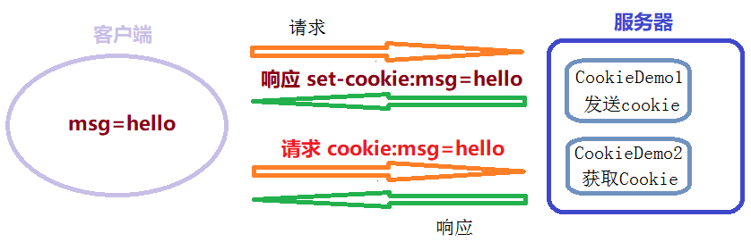

## 第十五节 Coolie

### 15.1 会话技术

1. 会话：一次会话中包含多次请求和响应。
   * 一次会话：浏览器第一次给服务器资源发送请求，会话建立，直到有一方断开为止。
2. 功能：在一次会话的范围内的多次请求间，共享数据
3. 方式：
	1. 客户端会话技术：Cookie
	2. 服务器端会话技术：Session

### 15.2 Coolie

概念：客户端会话技术，将数据保存到客户端

#### 15.2.1 Coolie 快速入门

步骤：

1. 创建 Cookie 对象，绑定数据： `new Cookie(String name, String value)` 

2. 发送 Cookie 对象：`response.addCookie(Cookie cookie)` 

3. 获取 Cookie，拿到数据：`Cookie[]  request.getCookies()`

```java
/**
 * Cookie快速入门
 */

@WebServlet("/cookieDemo1")
public class CookieDemo1 extends HttpServlet {
    @Override
    protected void doPost(HttpServletRequest request, HttpServletResponse response) throws ServletException, IOException {
        //1.创建Cookie对象
        Cookie c = new Cookie("msg","hello");
        //2.发送Cookie
        response.addCookie(c);
    }

    @Override
    protected void doGet(HttpServletRequest request, HttpServletResponse response) throws ServletException, IOException {
        this.doPost(request, response);
    }
}
```

```java
@WebServlet("/cookieDemo2")
public class CookieDemo2 extends HttpServlet {
    @Override
    protected void doPost(HttpServletRequest request, HttpServletResponse response) throws ServletException, IOException {
       //3. 获取Cookie
        Cookie[] cs = request.getCookies();
        //获取数据，遍历Cookies
        if(cs != null){
            for (Cookie c : cs) {
                String name = c.getName();
                String value = c.getValue();
                System.out.println(name+":"+value);
            }
        }
    }
    @Override
    protected void doGet(HttpServletRequest request, HttpServletResponse response) throws ServletException, IOException {
        this.doPost(request, response);
    }
}
```

当使用同一个浏览器分别访问 `/cookieDemo1` 与 `/cookieDemo2` 时，会输出 msg:hello。


#### 15.2.2 Coolie 原理

基于响应头 Set-Cookie 和请求头 Cookie 实现



#### 15.2.3 Cookie 细节

**1）一次可不可以发送多个 cookie?**

可以，可以创建多个 Cookie 对象，使用 response 调用多次 addCookie 方法发送 cookie 即可。

```java
//1.创建Cookie对象
Cookie c1 = new Cookie("msg","hello");
Cookie c2 = new Cookie("name","zhangsan");
//2.发送Cookie
response.addCookie(c1);
response.addCookie(c2);
```

**2）cookie 在浏览器中保存多长时间？**

1. 默认情况下，当浏览器关闭后，Cookie 数据被销毁。（即 Cookie 数据保存在浏览器内存中）

2. 持久化存储：`setMaxAge(int seconds)`
   * 正数：将 Cookie 数据写到硬盘的文件中。持久化存储。并指定 cookie 存活时间，时间到后，cookie 文件自动失效。
   * 负数：默认值，浏览器关闭后，Cookie 数据被销毁。
   * 零：删除 cookie 信息。
   
```java
//1.创建Cookie对象
Cookie c1 = new Cookie("msg","setMaxAge");
//2.设置cookie的存活时间
//将cookie持久化到硬盘，30秒后会自动删除cookie文件
c1.setMaxAge(30); 
//c1.setMaxAge(0); //删除Cookie
//3.发送Cookie
response.addCookie(c1);
```

**3）cookie 能不能存中文？**

* 在 tomcat 8 之前 cookie 中不能直接存储中文数据。需要将中文数据转码，一般采用 URL 编码(%+十六进制数，如 %E3)。

* 在 tomcat 8 之后，cookie 支持中文数据。特殊字符还是不支持，建议使用 URL 编码存储，URL 解码解析。

**4）cookie 共享问题？**

1. 假设在一个 tomcat 服务器中，部署了多个 web 项目，那么在这些 web 项目中 cookie 能不能共享？
   * 默认情况下 cookie 不能共享
   * `setPath(String path)`:设置 cookie 的获取范围。默认情况下，设置当前的虚拟目录。
   * 如果要共享，则可以将path设置为"/"

2. 不同的 tomcat 服务器间 cookie 共享问题？

   * `setDomain(String path)`: 如果设置一级域名相同，那么多个服务器之间 cookie 可以共享。
   * `setDomain(".baidu.com")`，那么 tieba.baidu.com 和 news.baidu.com 中 cookie 可以共享。

**5）Cookie 的特点和作用**

1. cookie 存储数据在客户端浏览器

2. 浏览器对于单个 cookie 的大小有限制(4kb) 以及对同一个域名下的总 cookie 数量也有限制(20个)。
	
作用：

1. cookie 一般用于存出少量的不太敏感的数据。

2. 在不登录的情况下，完成服务器对客户端的身份识别。（登录，偏好存储在服务器数据库中）


#### 15.2.4 Cookie 案例

【需求】

1. 访问一个 Servlet，如果是第一次访问，则提示：您好，欢迎您首次访问。

2. 如果不是第一次访问，则提示：欢迎回来，您上次访问时间为:显示时间字符串。

【分析】

可以采用 Cookie 来完成，在服务器中的 Servlet 判断是否有一个名为 lastTime 的 cookie。

* 有：不是第一次访问
	1. 响应数据：欢迎回来，您上次访问时间为:[从 cookie 中获取上一次访问时间]
	2. 写回 Cookie：lastTime=[当前时间]

* 没有：是第一次访问
	1. 响应数据：您好，欢迎您首次访问
	2. 写回 Cookie：lastTime=[当前时间，如：2018年6月10日11:50:01]


【代码】

```java
package cn.itcast.cookie;

import javax.servlet.ServletException;
import javax.servlet.annotation.WebServlet;
import javax.servlet.http.Cookie;
import javax.servlet.http.HttpServlet;
import javax.servlet.http.HttpServletRequest;
import javax.servlet.http.HttpServletResponse;
import java.io.IOException;
import java.net.URLDecoder;
import java.net.URLEncoder;
import java.text.SimpleDateFormat;
import java.util.Date;

@WebServlet("/cookieTest")
public class CookieTest extends HttpServlet {
    @Override
    protected void doPost(HttpServletRequest request, HttpServletResponse response) throws ServletException, IOException {
        //设置响应的消息体的数据格式以及编码
        response.setContentType("text/html;charset=utf-8");

        //1.获取所有Cookie
        Cookie[] cookies = request.getCookies();
        boolean flag = false;//没有cookie为lastTime
        //2.遍历cookie数组
        if(cookies != null && cookies.length > 0){
            for (Cookie cookie : cookies) {
                //3.获取cookie的名称
                String name = cookie.getName();
                //4.判断名称是否是：lastTime
                if("lastTime".equals(name)){
                    //有该Cookie，不是第一次访问

                    flag = true;//有lastTime的cookie
                    //设置Cookie的value
                    //获取当前时间的字符串，重新设置Cookie的值，重新发送cookie
                    Date date  = new Date();
                    SimpleDateFormat sdf = new SimpleDateFormat("yyyy年MM月dd日 HH:mm:ss");
                    String str_date = sdf.format(date);
                    System.out.println("编码前："+str_date);
                    //URL编码
                    str_date = URLEncoder.encode(str_date,"utf-8");
                    System.out.println("编码后："+str_date);
                    cookie.setValue(str_date);
                    //设置cookie的存活时间
                    cookie.setMaxAge(60 * 60 * 24 * 30);//一个月
                    response.addCookie(cookie);
                    
                    //响应数据
                    //获取Cookie的value，时间
                    String value = cookie.getValue();
                    System.out.println("解码前："+value);
                    //URL解码：
                    value = URLDecoder.decode(value,"utf-8");
                    System.out.println("解码后："+value);
                    response.getWriter().write("<h1>欢迎回来，您上次访问时间为:"+value+"</h1>");
                    break;
                }
            }
        }

        if(cookies == null || cookies.length == 0 || flag == false){
            //没有，第一次访问

            //设置Cookie的value
            //获取当前时间的字符串，重新设置Cookie的值，重新发送cookie
            Date date  = new Date();
            SimpleDateFormat sdf = new SimpleDateFormat("yyyy年MM月dd日 HH:mm:ss");
            String str_date = sdf.format(date);
            System.out.println("编码前："+str_date);
            //URL编码
            str_date = URLEncoder.encode(str_date,"utf-8");
            System.out.println("编码后："+str_date);

            Cookie cookie = new Cookie("lastTime",str_date);
            //设置cookie的存活时间
            cookie.setMaxAge(60 * 60 * 24 * 30); //一个月
            response.addCookie(cookie);

            response.getWriter().write("<h1>您好，欢迎您首次访问</h1>");
        }
    }
    @Override
    protected void doGet(HttpServletRequest request, HttpServletResponse response) throws ServletException, IOException {
        this.doPost(request, response);
    }
}
```

### 15.3 JSP 


#### 15.3.1 


