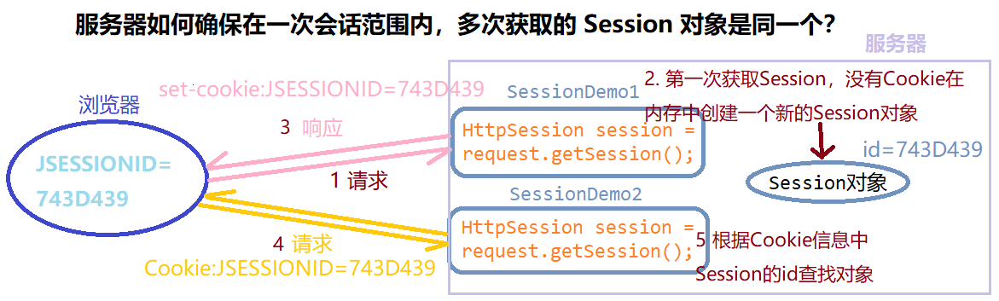

## 第十六节 Session


1）概念：服务器端会话技术，在一次会话的多次请求间共享数据，将数据保存在服务器端的对象中。HttpSession。

2）快速入门

1. 获取 HttpSession 对象：`HttpSession session = request.getSession();`

2. 使用 HttpSession 对象：
  * `Object getAttribute(String name)`
  * `void setAttribute(String name, Object value)`
  * `void removeAttribute(String name)`  
	
3）原理：Session 的实现是依赖于 Cookie 的。



### 16.1 Session 细节

**1）当客户端关闭后，服务器不关闭，两次获取 session 是否为同一个？**
​
* 默认情况下。不是同一个。
​
* 如果需要相同，则可以创建 Cookie，键为 JSESSIONID，设置最大存活时间，让 cookie 持久化保存。

```java
HttpSession session = request.getSession();
Cookie c = new Cookie("JSESSIONID",session.getId());
c.setMaxAge(60*60);
response.addCookie(c);
```

**2）客户端不关闭，服务器关闭后，两次获取的 session 是同一个吗？**

不是同一个，但是要确保数据不丢失。tomcat 自动完成以下工作：

* session 的钝化：在服务器正常关闭之前，将 session 对象系列化到硬盘上。

* session的活化：在服务器启动后，将 session 文件转化为内存中的 session 对象并删除对应的 session 文件。

**3）session 什么时候被销毁？**

1. 服务器关闭

2. session 对象调用方法 `void invalidate()`。

3. session 默认失效时间 30 分钟。在 tomcat 的 web.xml 配置文件中可以修改此时间：

```html
<session-config>
        <session-timeout>30</session-timeout>
</session-config>
```

**4）session 的特点**

1. session 用于存储一次会话的多次请求的数据，存在服务器端

2. session 可以存储任意类型，任意大小的数据。Cookie 只能存字符串。


5）session 与 Cookie 的区别

1. session 存储数据在服务器端，Cookie 在客户端。

2. session 没有数据大小限制，Cookie有。

3. session 数据安全，Cookie 相对于不安全。


### 16.2 案例 验证码

案例需求

1. 访问带有验证码的登录页面 login.jsp。

2. 用户输入用户名，密码以及验证码。
   * 如果用户名和密码输入有误，跳转登录页面，提示:用户名或密码错误
   * 如果验证码输入有误，跳转登录页面，提示：验证码错误
   * 如果全部输入正确，则跳转到主页 success.jsp，显示：[用户名],欢迎您!


