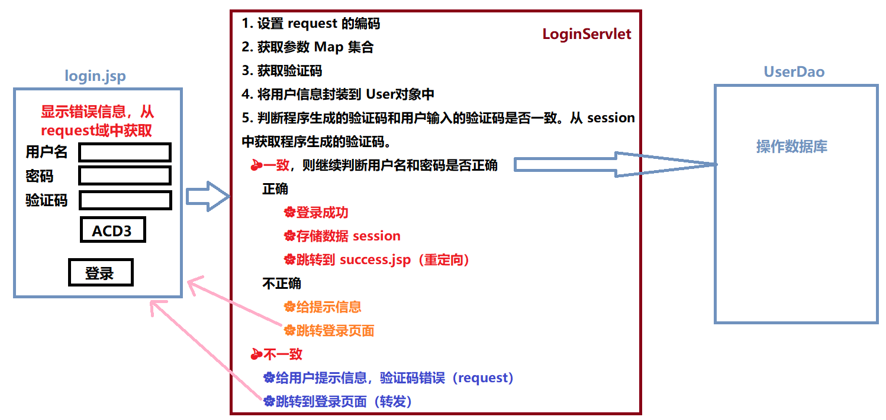

## 第十六节 Session


1）概念：服务器端会话技术，在一次会话的多次请求间共享数据，将数据保存在服务器端的对象中。HttpSession。

2）快速入门

1. 获取 HttpSession 对象：`HttpSession session = request.getSession();`

2. 使用 HttpSession 对象：
  * `Object getAttribute(String name)`
  * `void setAttribute(String name, Object value)`
  * `void removeAttribute(String name)`  
	
3）原理：Session 的实现是依赖于 Cookie 的。


### 16.1 Session 细节

**1）当客户端关闭后，服务器不关闭，两次获取 session 是否为同一个？**
​
* 默认情况下。不是同一个。
​
* 如果需要相同，则可以创建 Cookie，键为 JSESSIONID，设置最大存活时间，让 cookie 持久化保存。

```java
HttpSession session = request.getSession();
Cookie c = new Cookie("JSESSIONID",session.getId());
c.setMaxAge(60*60);
response.addCookie(c);
```

**2）客户端不关闭，服务器关闭后，两次获取的 session 是同一个吗？**

不是同一个，但是要确保数据不丢失。tomcat 自动完成以下工作：

* session 的钝化：在服务器正常关闭之前，将 session 对象系列化到硬盘上。

* session的活化：在服务器启动后，将 session 文件转化为内存中的 session 对象并删除对应的 session 文件。

**3）session 什么时候被销毁？**

1. 服务器关闭

2. session 对象调用方法 `void invalidate()`。

3. session 默认失效时间 30 分钟。在 tomcat 的 web.xml 配置文件中可以修改此时间：

```html
<session-config>
        <session-timeout>30</session-timeout>
</session-config>
```

**4）session 的特点**

1. session 用于存储一次会话的多次请求的数据，存在服务器端

2. session 可以存储任意类型，任意大小的数据。Cookie 只能存字符串。


5）session 与 Cookie 的区别

1. session 存储数据在服务器端，Cookie 在客户端。

2. session 没有数据大小限制，Cookie有。

3. session 数据安全，Cookie 相对于不安全。


### 16.2 案例 验证码

案例需求

1. 访问带有验证码的登录页面 login.jsp。

2. 用户输入用户名，密码以及验证码。
   * 如果用户名和密码输入有误，跳转登录页面，提示:用户名或密码错误
   * 如果验证码输入有误，跳转登录页面，提示：验证码错误
   * 如果全部输入正确，则跳转到主页 success.jsp，显示：[用户名],欢迎您!

分析



代码

```html
<%@ page contentType="text/html;charset=UTF-8" language="java" %>
<html>
<head>
    <title>login</title>
    
    <script>
        window.onload = function(){
            document.getElementById("img").onclick = function(){
                this.src="/day16/checkCodeServlet?time="+new Date().getTime();
            }
        }
        
    </script>
    <style>
        div{
            color: red;
        }
    </style>
</head>
<body>

    <form action="/day16/loginServlet" method="post">
        <table>
            <tr>
                <td>用户名</td>
                <td><input type="text" name="username"></td>
            </tr>
            <tr>
                <td>密码</td>
                <td><input type="password" name="password"></td>
            </tr>
            <tr>
                <td>验证码</td>
                <td><input type="text" name="checkCode"></td>
            </tr>
            <tr>
                <td colspan="2"></td>
            </tr>
            <tr>
                <td colspan="2"><input type="submit" value="登录"></td>
            </tr>
        </table>
    </form>
    
    <div><%=request.getAttribute("cc_error") == null ? "" : request.getAttribute("cc_error")%></div>
    <div><%=request.getAttribute("login_error") == null ? "" : request.getAttribute("login_error") %></div>

</body>
</html>
```

```java
package cn.itcast.servlet;

import javax.imageio.ImageIO;
import javax.servlet.ServletException;
import javax.servlet.annotation.WebServlet;
import javax.servlet.http.HttpServlet;
import javax.servlet.http.HttpServletRequest;
import javax.servlet.http.HttpServletResponse;
import java.awt.*;
import java.awt.image.BufferedImage;
import java.io.IOException;
import java.util.Random;

@WebServlet("/checkCodeServlet")
public class CheckCodeServlet extends HttpServlet {
    protected void doPost(HttpServletRequest request, HttpServletResponse response) throws ServletException, IOException {
        int width = 100;
        int height = 50;

        //1.创建一对象，在内存中图片(验证码图片对象)
        BufferedImage image = new BufferedImage(width,height,BufferedImage.TYPE_INT_RGB);
        
        //2.美化图片
        //2.1 填充背景色
        Graphics g = image.getGraphics();//画笔对象
        g.setColor(Color.PINK);//设置画笔颜色
        g.fillRect(0,0,width,height);

        //2.2画边框
        g.setColor(Color.BLUE);
        g.drawRect(0,0,width - 1,height - 1);

        String str = "ABCDEFGHIJKLMNOPQRSTUVWXYZabcdefghigklmnopqrstuvwxyz0123456789";
        //生成随机角标
        Random ran = new Random();
        StringBuilder sb = new StringBuilder();
        for (int i = 1; i <= 4; i++) {
            int index = ran.nextInt(str.length());
            //获取字符
            char ch = str.charAt(index);//随机字符
            sb.append(ch);

            //2.3写验证码
            g.drawString(ch+"",width/5*i,height/2);
        }
        String checkCode_session = sb.toString();
        //将验证码存入session
        request.getSession().setAttribute("checkCode_session",checkCode_session);

        //2.4画干扰线
        g.setColor(Color.GREEN);

        //随机生成坐标点
        for (int i = 0; i < 10; i++) {
            int x1 = ran.nextInt(width);
            int x2 = ran.nextInt(width);

            int y1 = ran.nextInt(height);
            int y2 = ran.nextInt(height);
            g.drawLine(x1,y1,x2,y2);
        }
        
        //3.将图片输出到页面展示
        ImageIO.write(image,"jpg",response.getOutputStream());
    }

    protected void doGet(HttpServletRequest request, HttpServletResponse response) throws ServletException, IOException {
        this.doPost(request,response);
    }
}
```

```java
package cn.itcast.servlet;

import javax.servlet.ServletException;
import javax.servlet.annotation.WebServlet;
import javax.servlet.http.HttpServlet;
import javax.servlet.http.HttpServletRequest;
import javax.servlet.http.HttpServletResponse;
import javax.servlet.http.HttpSession;
import java.io.IOException;

@WebServlet("/loginServlet")
public class LoginServlet extends HttpServlet {
    protected void doPost(HttpServletRequest request, HttpServletResponse response) throws ServletException, IOException {
        //1.设置request编码
        request.setCharacterEncoding("utf-8");
        //2.获取参数
        String username = request.getParameter("username");
        String password = request.getParameter("password");
        String checkCode = request.getParameter("checkCode");
        //3.先获取生成的验证码
        HttpSession session = request.getSession();
        String checkCode_session = (String) session.getAttribute("checkCode_session");
        //删除session中存储的验证码（保证验证码是一次性，不会被多次重复用）
        //如无此步骤，登陆后，点击浏览器后退键，验证码不会更新。
        session.removeAttribute("checkCode_session");
        //3.先判断验证码是否正确
        if(checkCode_session!= null && checkCode_session.equalsIgnoreCase(checkCode)){
            //忽略大小写比较
            //验证码正确
            //判断用户名和密码是否一致（正常是要到数据库中查询）
            if("zhangsan".equals(username) && "123".equals(password)){//需要调用UserDao查询数据库
                //登录成功
                //存储信息，用户信息
                session.setAttribute("user",username);
                //重定向到success.jsp
                response.sendRedirect(request.getContextPath()+"/success.jsp");
            }else{
                //登录失败
                //存储提示信息到request
                request.setAttribute("login_error","用户名或密码错误");
                //转发到登录页面
                request.getRequestDispatcher("/login.jsp").forward(request,response);
            }
        }else{
            //验证码不一致
            //存储提示信息到request
            request.setAttribute("cc_error","验证码错误");
            //转发到登录页面
            request.getRequestDispatcher("/login.jsp").forward(request,response);
        }
    }

    protected void doGet(HttpServletRequest request, HttpServletResponse response) throws ServletException, IOException {
        this.doPost(request, response);
    }
}
```

```html
<%@ page contentType="text/html;charset=UTF-8" language="java" %>
<html>
<head>
    <title>Success</title>
</head>
<body>

    <h1><%=request.getSession().getAttribute("user")%>,欢迎您</h1>

</body>
</html>
```


