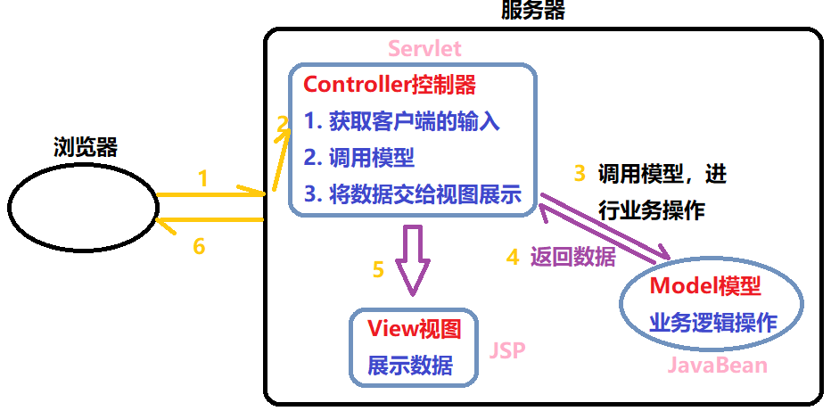

## 第十七节 EL & JSTL

### 17.1 JSP

#### 17.1.1 JSP 指令

作用：用于配置 JSP 页面，导入资源文件

格式：`<%@ 指令名称 属性名1=属性值1 属性名2=属性值2 ... %>`

分类：

1）page：配置 JSP 页面的

```html
<%@ page import="java.util.List" %>
<%@ page contentType="text/html;charset=gbk" errorPage="500.jsp"   pageEncoding="GBK" language="java" buffer="16kb" %>
```

* contentType：等同于 `response.setContentType()`
   * 设置响应体的 mime 类型以及字符集。
   * 设置当前 jsp 页面的编码（只能是高级的 IDE 才能生效；如果使用低级工具，则需要设置 pageEncoding 属性指定当前页面的字符集）。

* import：导包。

* errorPage：当前页面发生异常后，会自动跳转到指定的错误页面。

* isErrorPage：标识当前也是是否是错误页面。
   * true：是，可以使用内置对象 exception
   * false：否。默认值。不可以使用内置对象 exception

```html
<%
    String message = exception.getMessage();
    out.print(message);
%>
```

* buffer：缓冲区，默认 8kb。

2）include：包含页面，导入页面的资源文件

* `<%@include file="top.jsp"%>`


3）taglib：导入资源

* `<%@ taglib prefix="c" uri="http://java.sun.com/jsp/jstl/core" %>`

* prefix：前缀，自定义名字

* 使用 `<c:cathch ... >`


#### 17.1.2 注释

1. html 注释：会发送到浏览器端
   * `<!-- -->`：只能注释 html 代码片段
   
2. jsp 注释：推荐使用，不会发送到浏览器端
   * `<%-- --%>`：可以注释所有

```jsp
<!--
    可以注释标签，但不能注释由 <% %>包围的代码
    <h1>hello</h1>
-->
     
<%--
    该注释既可以注释代码也可以注释标签
    <%
        System.out.println("hi~~~~");
    %>
    
    <input>
--%>
```

#### 17.1.3 内置对象

在 jsp 页面中不需要创建，直接使用的对象，一共有 9 个，前 4 个是域对象，用于共享数据：

|变量名|真实类型|作用|
|:--:|:--:|----|
|pageContext|PageContext|当前页面共享数据，还可以获取其他八个内置对象|
|request|HttpServletRequest|一次请求访问的多个资源(转发)|
|session|HttpSession|一次会话的多个请求间|
|application|ServletContext|所有用户间共享数据(范围最大)，唯一，服务器开启其被创建，服务器关闭，其被销毁|
|response|HttpServletResponse|响应对象|
|page|Object|当前页面(Servlet)的对象  this|
|out|JspWriter|输出对象，数据输出到页面上|
|config|ServletConfig|Servlet 的配置对象|
|exception|Throwable|异常对象|

```html
<%
pageContext.setAttribute("msg","hello");
%>

<%=pageContext.getAttribute("msg")%>
```

记住内置对象的名字，题目：请写出 JSP 的 9 个内置对象？

### 17.2 MVC 开发模式

**1）jsp 演变历史**

1. 早期只有 servlet，只能使用 response 输出标签数据，非常麻烦

2. 后来有 jsp，简化了 Servlet 的开发，如果过度使用 jsp，在 jsp 中既写大量的 java 代码，又写 html 标签，造成难于维护，难于分工协作。 

3. 再后来，java 的 web 开发，借鉴 mvc 开发模式，使得程序的设计更加合理性。
	
**2）MVC**

1. M：Model，模型。【JavaBean】。完成具体的业务操作，如：查询数据库，封装对象。

2. V：View，视图。【JSP】。展示数据。

3. C：Controller，控制器。【Servlet】。
	* 获取用户的输入
	* 调用模型
	* 将数据交给视图进行展示




**3）优缺点**

优点：耦合性低，方便维护，可以利于分工协作；重用性高。
	
缺点：使得项目架构变得复杂，对开发人员要求高


### 17.3 EL 表达式

#### 17.3.1 介绍

1. 概念：Expression Language 表达式语言

2. 作用：替换和简化 jsp 页面中 java 代码的编写。

3. 语法：`${表达式}`

4. jsp 默认支持 el 表达式的。如果要忽略 el 表达式
   * 设置 jsp 中 page 指令中：`isELIgnored="true"` 忽略当前 jsp 页面中所有的 el 表达式。
   * `\${表达式}` ：忽略当前这个 el 表达式。


#### 17.3.2 运算与获取值    

**运算符**

1. 算数运算符： `+ - * /(div) %(mod)`

2. 比较运算符： `> < >= <= == !=`

3. 逻辑运算符： `&&(and) ||(or) !(not)`

4. 空运算符： `empty`，用于判断字符串、集合、数组对象是否为 null 或者长度是否为 0。
   * `${empty list}`:判断字符串、集合、数组对象是否为 null 或者长度为 0。
   * `${not empty str}`:表示判断字符串、集合、数组对象是否不为 null 并且长度 >0。

```html
<h3>算数运算符</h3>
${3 + 4}<br>
${3 div 4}<br>
<h3>比较运算符</h3>
${3 == 4}<br>
<h3>逻辑运算符</h3>
${3 > 4  && 3 < 4}<br>
<h4>empty运算符</h4>

<%
String str = "";
request.setAttribute("str",str);
List list = new ArrayList();
request.setAttribute("list",list);
%>

${not empty str}
${not empty list}
```


**获取值**

el 表达式只能从域对象中获取值

1) `${域名称.键名}`：从指定域中获取指定键的值。

域名称：

1. pageScope        --> pageContext
2. requestScope     --> request
3. sessionScope     --> session
4. applicationScope --> application（ServletContext）

举例：在 request 域中存储了 `name=张三`
获取：`${requestScope.name}`

2) `${键名}`：表示依次从最小的域中查找是否有该键对应的值，直到找到为止。查找域顺序：pageScope->requestScope->sessionScope->applicationScope。     


3) 获取对象、List 集合、Map 集合的值

1. 对象：`${域名称.键名.属性名}`，本质上会去调用对象的 getter 方法。
	
2. List 集合：`${域名称.键名[索引]}`
	
3. Map 集合：
   * `${域名称.键名.key名称}`
   * `${域名称.键名["key名称"]}`


### 17.4 JSTL 标签


### 17.5 三层架构


