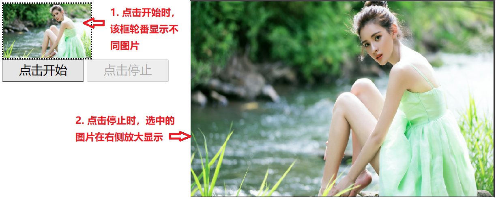

## 第二十节 JQuery 高级


### 20.1 动画

**三种方式显示和隐藏元素：**

1) 默认显示和隐藏方式

1. `show([speed,[easing],[fn])`
   * speed：动画的速度。三个预定义的值("slow","normal", "fast")或表示动画时长的毫秒数值(如：1000)
   * easing：用来指定切换效果，默认是"swing"，可用参数"linear"
      * swing：动画执行时效果是先慢，中间快，最后又慢
      * linear：动画执行时速度是匀速的
   * fn：在动画完成时执行的**函数**，每个元素执行一次。
	
2. `hide([speed,[easing],[fn])`

3. `toggle([speed],[easing],[fn])`

**2) 滑动显示和隐藏方式**（由上到下收起放下）

1. `slideDown([speed],[easing],[fn])`

2. `slideUp([speed,[easing],[fn])`

3. `slideToggle([speed],[easing],[fn])`

**3) 淡入淡出显示和隐藏方式**

1. `fadeIn([speed],[easing],[fn])`

2. `fadeOut([speed],[easing],[fn])`

3. `fadeToggle([speed,[easing],[fn])`


### 20.2 遍历

**1) js 的遍历方式** (jq 也可以使用此方式遍历)

* for(初始化值; 循环结束条件; 步长)

```html
<script type="text/javascript">
    $(function () {
        //1.获取所有的 ul 下的 li
        var citys = $("#city li");
        //2.遍历li
        for (var i = 0; i < citys.length; i++) {
            if("上海" == citys[i].innerHTML){
                //break; 结束循环
                //continue; //结束本次循环，继续下次循环
            }
            //获取内容
            alert(i+":"+citys[i].innerHTML);
        }   
    });   
</script>    
```


**2) jq 的遍历方式**（三种）

1 `jq对象.each(callback)`

 * 语法：`jquery对象.each(function(index,element){});`
    * index：就是元素在集合中的索引
    * element：就是集合中的每一个元素对象
    * this：集合中的每一个元素对象
	
 * 回调函数返回值：
    * true：如果当前 function 返回为 false，则结束循环(break)。	
    * false：如果当前 function 返回为 true，则结束本次循环，继续下次循环(continue)。


```html
<script type="text/javascript">
    $(function () {
        //1.获取所有的 ul 下的 li
        var citys = $("#city li");
        //2. jq对象.each(callback)
        //2.1 获取li对象第一种方式 this，不能获取到索引，空参！
        citys.each(function () {
            alert(this.innerHTML);
            alert($(this).html());
        });  
        //2.2 获取li对象第二种方式，在回调函数中定义参数：index（索引）、element（元素对象）
        //参数名可以起任意值
        citys.each(function (index, element) {
            alert(index+":"+element.innerHTML);
            alert(index+":"+$(element).html());
        }); 
    });   
</script> 
```

2 `$.each(object, [callback])` 

```html
<script type="text/javascript">
    $(function () {
        //1. 获取所有的 ul 下的 li
        var citys = $("#city li");
        //2. $.each(object, [callback])
  		$.each(citys,function () {
			alert($(this).html());
            //其他使用方法参考 `jq对象.each(callback)` 方式
        });
    });   
</script>  
```

3 `for..of`: jquery 3.0 版本之后提供的方式：`for(元素对象 of 容器对象)`

```html
<script type="text/javascript">
    $(function () {
        //1. 获取所有的 ul 下的 li
        var citys = $("#city li");
        //2. for ... of:jquery 3.0 版本之后提供的方式
        for(li of citys){
    		alert($(li).html());
		}
    });   
</script>  
```

### 20.3 事件绑定

1) jquery 标准的绑定方式：`jq对象.事件方法(回调函数);`
* 如果调用事件方法，不传递回调函数，则会触发浏览器默认行为。
* `表单对象.submit();` //让表单提交

```html
<!DOCTYPE html>
<html>
<head>
    <meta charset="UTF-8">
    <title></title>
    <script src="../js/jquery-3.3.1.min.js" type="text/javascript" charset="utf-8"></script>
    <script type="text/javascript">
        $(function () {
           //1.获取name对象，绑定click事件
           $("#name").click(function () {
               alert("我被点击了...")
           });

           //给 name 绑定两个事件：鼠标移动到元素之上事件、绑定鼠标移出事件。
            $("#name").mouseover(function () {
               alert("鼠标来了...")
            });
            $("#name").mouseout(function () {
                alert("鼠标走了...")
            });

            //简化操作，链式编程
            $("#name").mouseover(function () {
                alert("鼠标来了...")
            }).mouseout(function () {
                alert("鼠标走了...")
            });
            
            alert("我要获得焦点了...")
            //让文本输入框获得焦点，不传参，使用浏览器默认方法获得焦点
            $("#name").focus();
            //表单对象.submit();//让表单提交
        });
    </script>
</head>
<body>
<input id="name" type="text" value="绑定点击事件">
</body>
</html>
```

2) on 绑定事件/off 解除绑定

* `jq对象.on("事件名称",回调函数)`
* `jq对象.off("事件名称")`
* 如果 off 方法**不传递任何参数**，则将组件上的所有事件**全部解绑**

```html
<!DOCTYPE html>
<html>
<head>
    <meta charset="UTF-8">
    <title></title>
    <script src="../js/jquery-3.3.1.min.js" type="text/javascript" charset="utf-8"></script>
    <script type="text/javascript">
        $(function () {
           //1.使用on给按钮绑定单击事件  click
           $("#btn").on("click",function () {
               alert("我被点击了。。。")
           }) ;
           //2. 使用off解除btn按钮的单击事件
            $("#btn2").click(function () {
                //解除btn按钮的单击事件
                //$("#btn").off("click");
                $("#btn").off();//将组件上的所有事件全部解绑
            });
        });
    </script>
</head>
<body>
<input id="btn" type="button" value="使用on绑定点击事件">
<input id="btn2" type="button" value="使用off解绑点击事件">
</body>
</html>
```

3) 事件切换：toggle

* `jq对象.toggle(fn1,fn2...)`，当单击 jq 对象对应的组件后，会执行 fn1。第二次点击会执行 fn2.....
* 注意：1.9版本 `.toggle() `方法删除，jQuery Migrate（迁移）插件可以恢复此功能。

```html
<!-- jQuery Migrate 插件 -->
<script src="../js/jquery-migrate-1.0.0.js" type="text/javascript" charset="utf-8">
</script>
```

```html
<!DOCTYPE html>
<html>
<head>
    <meta charset="UTF-8">
    <title></title>
    <script src="../js/jquery-3.3.1.min.js" type="text/javascript" charset="utf-8"></script>
    <script src="../js/jquery-migrate-1.0.0.js" type="text/javascript" charset="utf-8"></script>
    <script type="text/javascript">
        $(function () {
           //获取按钮，调用toggle方法
           $("#btn").toggle(function () {
               //改变div背景色backgroundColor 颜色为 green
               $("#myDiv").css("backgroundColor","green");
           },function () {
               //改变div背景色backgroundColor 颜色为 pink
               $("#myDiv").css("backgroundColor","pink");
           });
        });
    </script>
</head>
<body>
    <input id="btn" type="button" value="事件切换">
    <div id="myDiv" style="width:300px;height:300px;background:pink">
        点击按钮变成绿色，再次点击红色
    </div>
</body>
</html>
```


### 20.4 案例

#### 20.4.1 广告显示和隐藏

**需求**：

1. 当页面加载完，3 秒后。自动显示广告

2. 广告显示 5 秒后，自动消失。

**分析**：

1. 使用定时器来完成。setTimeout(执行一次定时器)

2. 分析发现 JQuery 的显示和隐藏动画效果其实就是控制 display

3. 使用 show/hide 方法来完成广告的显示

```html
<!DOCTYPE html>
<html>
<head>
    <meta charset="UTF-8">
    <title>广告的自动显示与隐藏</title>
    <style>
        #content{width:100%;height:500px;background:#999}
    </style>

    <!--引入jquery-->
    <script type="text/javascript" src="../js/jquery-3.3.1.min.js"></script>
    <script>
        //入口函数，在页面加载完成之后，定义定时器，调用这两个方法
        $(function () {
           //定义定时器，调用adShow方法 3秒后执行一次
           setTimeout(adShow,3000);
           //定义定时器，调用adHide方法，8秒后执行一次
            setTimeout(adHide,8000);
        });
        //显示广告
        function adShow() {
            //获取广告div，调用显示方法
            $("#ad").show("slow");
        }
        //隐藏广告
        function adHide() {
            //获取广告div，调用隐藏方法
            $("#ad").hide("slow");
        }
    </script>
</head>
<body>
<!-- 整体的DIV -->
<div>
    <!-- 广告DIV -->
    <!-- 由于 display=none，初始化后图片不显示 -->
    <div id="ad" style="display: none;">
        
    </div>

    <!-- 下方正文部分 -->
    <div id="content">
        正文部分
    </div>
</div>
</body>
</html>
```


#### 20.4.2 抽奖




分析：

1 给开始按钮绑定单击事件

* 1.1 定义循环定时器
* 1.2 切换小相框的 src 属性
  * 定义数组，存放图片资源路径
  * 生成随机数。数组索引

2 给结束按钮绑定单击事件
* 2.1 停止定时器
* 2.2 给大相框设置 src 属性

```html
<!DOCTYPE html>
<html>
<head>
    <meta charset="UTF-8">
    <title>jquery案例之抽奖</title>
    <script type="text/javascript" src="../js/jquery-3.3.1.min.js"></script>

    <script language='javascript' type='text/javascript'>
        var imgs = ["../img/man00.jpg",
                    "../img/man01.jpg",
                    "../img/man02.jpg",
                    "../img/man03.jpg",
                    "../img/man04.jpg",
                    "../img/man05.jpg",
                    "../img/man06.jpg",
                    ];
        var startId;//开始定时器的id
        var index;//随机角标
        $(function () {
            //处理按钮是否可以使用的效果
            $("#startID").prop("disabled",false);
            $("#stopID").prop("disabled",true);
            
           //1. 给开始按钮绑定单击事件
            $("#startID").click(function () {
                // 1.1 定义循环定时器 20毫秒执行一次
                startId = setInterval(function () {
                    //处理按钮是否可以使用的效果
                    $("#startID").prop("disabled",true);
                    $("#stopID").prop("disabled",false);

                    //1.2生成随机角标 0-6
                    index = Math.floor(Math.random() * 7);//0.000--0.999 --> * 7 --> 0.0-----6.9999
                    //1.3设置小相框的src属性
                    $("#img1ID").prop("src",imgs[index]);

                },20);
            });
            
            //2. 给结束按钮绑定单击事件
            $("#stopID").click(function () {
                //处理按钮是否可以使用的效果
                $("#startID").prop("disabled",false);
                $("#stopID").prop("disabled",true);

               // 1.1 停止定时器
                clearInterval(startId);
               // 1.2 给大相框设置src属性
                $("#img2ID").prop("src",imgs[index]).hide();
                //显示1秒之后
                $("#img2ID").show(1000);
            });
        });
    </script>

</head>
<body>

<!-- 小像框 -->
<div style="border-style:dotted;width:160px;height:100px">
    
</div>

<!-- 大像框 -->
<div
        style="border-style:double;width:800px;height:500px;position:absolute;left:500px;top:10px">
    
</div>

<!-- 开始按钮 -->
<input
        id="startID"
        type="button"
        value="点击开始"
        style="width:150px;height:150px;font-size:22px">

<!-- 停止按钮 -->
<input
        id="stopID"
        type="button"
        value="点击停止"
        style="width:150px;height:150px;font-size:22px">
</body>
</html>
```


### 20.5 插件机制

插件：增强 JQuery 的功能

实现方式：

1. `$.fn.extend(object)`，增强通过 Jquery 获取的对象的功能 `$("#id")`。
2. `$.extend(object)`，增强 JQeury 对象自身的功能 `$ 或 jQuery。`


1）使用 jquery 插件，给 jq 对象添加 2 个方法：check() 选中所有复选框、uncheck() 取消选中所有复选框。

```html
<!DOCTYPE html>
<html>
<head>
    <meta charset="UTF-8">
    <title>01-jQuery对象进行方法扩展</title>
    <script src="../js/jquery-3.3.1.min.js" type="text/javascript" charset="utf-8"></script>
    <script type="text/javascript">
        //1.定义jqeury的对象插件，可以被所有jq对象使用
        $.fn.extend({
            //定义了一个check()方法。所有的jq对象都可以调用该方法
            check:function () { //check方法名称
               //让复选框选中
                //this:调用该方法的jq对象
                this.prop("checked",true);
            },
            uncheck:function () {
                //让复选框不选中
                this.prop("checked",false);
            }
        });
        $(function () {
           // 获取按钮
            //$("#btn-check").check();
            //复选框对象.check();
            $("#btn-check").click(function () {
                //获取复选框对象
                $("input[type='checkbox']").check();
            });
            $("#btn-uncheck").click(function () {
                //获取复选框对象
                $("input[type='checkbox']").uncheck();
            });
        });
    </script>
</head>
<body>
<input id="btn-check" type="button" value="点击选中复选框" onclick="checkFn()">
<input id="btn-uncheck" type="button" value="点击取消复选框选中" onclick="uncheckFn()">
<br/>
<input type="checkbox" value="football">足球
<input type="checkbox" value="basketball">篮球
<input type="checkbox" value="volleyball">排球

</body>
</html>
```

2）对全局方法扩展 2 个方法，扩展 min 方法：求 2 个值的最小值；扩展 max 方法：求 2 个值最大值。

```html
<!DOCTYPE html>
<html>
<head>
    <meta charset="UTF-8">
    <title>01-jQuery对象进行方法扩展</title>
    <script src="../js/jquery-3.3.1.min.js" type="text/javascript" charset="utf-8"></script>
    <script type="text/javascript">
        $.extend({
            max:function (a,b) {
                //返回两数中的较大值
                return a >= b ? a:b;
            },
            min:function (a,b) {
                //返回两数中的较小值
                return a <= b ? a:b;
            }
        });

        //调用全局方法
        var max = $.max(4,3);
        //alert(max);
        var min = $.min(1,2);
        alert(min);
    </script>
</head>
<body>
</body>
</html>
```

