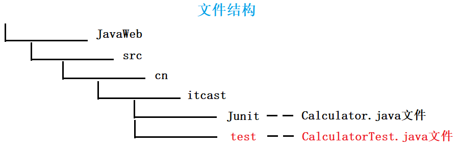
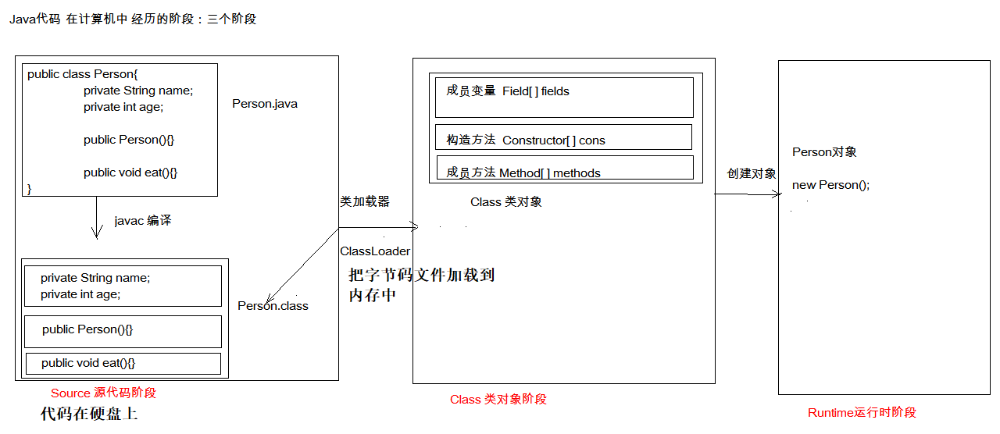

# 第一节 Junit 单元测试-反射-注解

## 一、Junit 单元测试

### 1.1 测试分类：

1. 黑盒测试：不需要写代码，给输入值，看程序是否能够输出期望的值。

2. 白盒测试：需要写代码的。关注程序具体的执行流程。
	
### 1.2 Junit 使用（白盒测试）

**使用步骤：**

1. 定义一个测试类(测试用例)

   - 测试类名：被测试的类名 Test，如 CalculatorTest

   - 包名：xxx.xxx.xx.test，如 cn.itcast.test
	
2. 定义测试方法：可以独立运行

   - 方法名：test 测试的方法名，如 testAdd()  

   - 返回值：void

   - 参数列表：空参
	
3. 为了让方法独立运行，在方法上面加 `@Test`

4. 导入 junit 依赖环境 `import org.junit.Test;`

5. `@Before`: 修饰的方法会在测试方法之前被自动执行；`@After`: 修饰的方法会在测试方法执行之后自动被执行。

6. 一般会使用断言操作来处理结果 `Assert.assertEquals(期望的结果,运算的结果);`

**计算器类：**

~~~java
package cn.itcast.junit;

/**
 * 计算器类
 */
public class Calculator {

    /**
     * 加法
     * @param a
     * @param b
     * @return
     */
    public int add (int a , int b){
        //int i = 3/0;

        return a - b;
    }

    /**
     * 减法
     * @param a
     * @param b
     * @return
     */
    public int sub (int a , int b){
        return a - b;
    }

}
~~~

**测试类：**

~~~java
package cn.itcast.test;

import cn.itcast.junit.Calculator;
import org.junit.After;
import org.junit.Assert;
import org.junit.Before;
import org.junit.Test;

public class CalculatorTest {
    /*
     * 初始化方法：
     *  用于资源申请，所有测试方法在执行之前都会先执行该方法
     */
    @Before
    public void init(){
        System.out.println("init...");
    }

    /*
     * 释放资源方法：
     *  在所有测试方法执行完后，都会自动执行该方法
     */
    @After
    public void close(){
        System.out.println("close...");
    }

    //测试add方法     
    @Test
    public void testAdd(){
       // System.out.println("我被执行了");
        //1.创建计算器对象
        System.out.println("testAdd...");
        Calculator c  = new Calculator();
        //2.调用add方法
        int result = c.add(1, 2);
        //System.out.println(result);  //单纯输出，没有办法判断输出结果是正确还是错误的。

        //3.断言  我断言这个结果是3
        Assert.assertEquals(3,result);

    }

    @Test
    public void testSub(){
        //1.创建计算器对象
        Calculator c  = new Calculator();
        int result = c.sub(1, 2);
        System.out.println("testSub....");
        Assert.assertEquals(-1,result);
    }
}

~~~

**评判结果：**

  - 软件输出窗口红色：失败
  - 软件输出窗口绿色：成功

## 二、反射：框架设计的灵魂

### 2.1 介绍

框架：半成品软件。可以在框架的基础上进行软件开发，[简化编码]。

反射：将类的**各个组成部分**封装为其他对象(如Field[] fields, Method[] methods等)，这就是**反射机制**。

反射好处：
1. 可以在程序运行过程中，操作这些对象。
2. 可以解耦，提高程序的可扩展性。

### 2.2 获取 Class 对象的三种方式

1. `Class.forName("全类名")`：将**字节码文件加载进内存**，返回 Class 对象。
   - 是静态方法。
   - 参数"全类名"：包名+类名。
   - 多用于配置文件，将类名定义在配置文件中。读取文件，加载类。

2. `类名.class`：通过类名的属性 class 获取
   - 多用于参数的传递

3. `对象.getClass()`：getClass() 方法在 Object 类中定义，所有对象都有该方法。
   - 多用于对象的获取字节码的方式

~~~java
import cn.itcast.domain.Person;
import cn.itcast.domain.Student;

public class ReflectDemo1 {

    public static void main(String[] args) throws Exception {

        //1.Class.forName("全类名")
        Class cls1 = Class.forName("cn.itcast.domain.Person");
        System.out.println(cls1);
        /*
          如果传入的全类名写错，会报错ClassNotFoundException
        */
			
        //2.类名.class
        Class cls2 = Person.class;
        System.out.println(cls2);
		
        //3.对象.getClass()
        Person p = new Person();
        Class cls3 = p.getClass();
        System.out.println(cls3);

        //== 比较三个对象(比较的是三个对象的内存地址)
        System.out.println(cls1 == cls2);//true
        System.out.println(cls1 == cls3);//true

        Class c = Student.class;
        //不同字节码文件，不相等
        System.out.println(c == cls1); //false
    }
}
~~~

**结论：同一个字节码文件(*.class)在一次程序运行过程中，只会被加载一次，不论通过哪一种方式获取的Class对象都是同一个。**

### 2.3 Class 对象功能（获取功能）

**1. 获取成员变量们**

~~~
获取成员变量 4 个方法:
* Field[] getFields() ：获取所有 public 修饰的成员变量
* Field getField(String name)   获取指定名称的 public 修饰的成员变量
	
* Field[] getDeclaredFields()  获取所有的成员变量，不考虑修饰符
* Field getDeclaredField(String name)  

Field：成员变量（操作）
1. 设置值      void set(Object obj, Object value)  
2. 获取值      get(Object obj) 	
3. 忽略访问权限修饰符的安全检查      Field对象.setAccessible(true):暴力反射
~~~

使用示例
~~~java
import cn.itcast.domain.Person;
import java.lang.reflect.Field;

public class ReflectDemo2 {

    public static void main(String[] args) throws Exception {

        //0. 获取Person的Class对象
        Class personClass = Person.class;
        
        //1. Field[] getFields()获取所有public修饰的成员变量
        Field[] fields = personClass.getFields();
        for (Field field : fields) {
            System.out.println(field);  
            //输出：public java.lang.String cn.itcast.domain.Person.a
            //Person中定义的公有成员变量是 public String a;
        }
		
        //2. Field getField(String name)
        Field a = personClass.getField("a");  //有可能会抛出异常
        //2-1 获取成员变量a 的值
        Person p = new Person();
        Object value = a.get(p);
        System.out.println(value);
        //2-2 设置a的值
        a.set(p,"张三");
        System.out.println(p);

        //3. Field[] getDeclaredFields()：获取所有的成员变量，不考虑修饰符
        Field[] declaredFields = personClass.getDeclaredFields();
        for (Field declaredField : declaredFields) {
            System.out.println(declaredField);
        }
		
        //4. Field getDeclaredField(String name)
        Field d = personClass.getDeclaredField("d");
        //忽略访问权限修饰符的安全检查
        //如果不忽略，访问private成员变量时，会报错IllegalAccessException。
        d.setAccessible(true);//暴力反射
        Object value2 = d.get(p);
        System.out.println(value2);
    }
}
~~~

**2. 获取构造方法们**

~~~
获取构造方法 4 个方法：
* Constructor<?>[] getConstructors()  获取所有public修饰的构造方法
* Constructor<T> getConstructor(类<?>... parameterTypes)  获取由参数指定的public修饰的构造方法
	
* Constructor<T> getDeclaredConstructor(类<?>... parameterTypes)  忽略修饰符
* Constructor<?>[] getDeclaredConstructors()  忽略修饰符

Constructor:构造方法
1. 创建对象：T newInstance(Object... initargs)  
2. 如果使用【空参数】构造方法创建对象，操作可以简化：Class对象的newInstance方法
~~~

使用示例

~~~java
import cn.itcast.domain.Person;
import java.lang.reflect.Constructor;
import java.lang.reflect.Field;

public class ReflectDemo3 {

    public static void main(String[] args) throws Exception {

        //0.获取Person的Class对象
        Class personClass = Person.class;

        //1. Constructor<T> getConstructor(类<?>... parameterTypes)
        Constructor constructor = personClass.getConstructor(String.class, int.class);   //传入的参数都是.class!
        System.out.println(constructor);
        //构造方法对象 用于 创建对象
        Object person = constructor.newInstance("张三", 23);
        System.out.println(person);

        System.out.println("----------");

        //2. 无参构造方法
        Constructor constructor1 = personClass.getConstructor();
        System.out.println(constructor1);
        //创建对象
        Object person1 = constructor1.newInstance();
        System.out.println(person1);

        //3. 无参构造方法的另一个实现
        Object o = personClass.newInstance();
        System.out.println(o);

        //constructor1.setAccessible(true);  //getDeclaredConstructor使用时设置 
    }
}
~~~

**3. 获取成员方法们**

~~~
* Method[] getMethods()      参数：方法名及方法参数
* Method getMethod(String name, 类<?>... parameterTypes)  
	
* Method[] getDeclaredMethods()  
* Method getDeclaredMethod(String name, 类<?>... parameterTypes)  

Method：方法对象
- 执行方法：Object invoke(Object obj, Object... args) 
- 获取方法名称：String getName(): 获取方法名
~~~

使用示例

~~~java
import cn.itcast.domain.Person;

import java.lang.reflect.Constructor;
import java.lang.reflect.Method;

public class ReflectDemo4 {

    public static void main(String[] args) throws Exception {

        //0. 获取Person的Class对象
        Class personClass = Person.class;

        //1. 获取指定名称的无参方法
        Method eat_method = personClass.getMethod("eat");
        Person p = new Person();
        //2. 执行方法
        eat_method.invoke(p);

        //有参方法
        Method eat_method2 = personClass.getMethod("eat", String.class);
        //执行方法
        eat_method2.invoke(p,"饭");

        System.out.println("-----------------");

        //获取所有public修饰的方法（除了本身类定义的方法，还有一些隐藏的继承于Object方法）
        Method[] methods = personClass.getMethods();
        for (Method method : methods) {
            System.out.println(method);
            String name = method.getName();
            System.out.println(name);
            //method.setAccessible(true);
        }
    }
}
~~~

​	
**4. 获取全类名**

~~~
* `String getName()`
	
//获取类名
Class personClass = Person.class;
String className = personClass.getName();
System.out.println(className);//cn.itcast.domain.Person
~~~

### 2.4 案例
需求：写一个"框架"，不能改变该类的任何代码的前提下，可以创建任意类的对象，并且执行其中任意方法。

实现：

1. 配置文件

2. 反射

步骤：
1. 将需要创建的对象的全类名和需要执行的方法定义在配置文件中

2. 在程序中加载读取配置文件

3. 使用反射技术来加载类文件进内存

4. 创建对象

5. 执行方法

~~~properties
//配置文件 pro.properties
className=cn.itcast.domain.Student
methodName=sleep
~~~

~~~java
package cn.itcast.reflect;

import cn.itcast.domain.Person;
import cn.itcast.domain.Student;

import java.io.IOException;
import java.io.InputStream;
import java.lang.reflect.Method;
import java.util.Properties;

/**
 * 框架类
 */
public class ReflectTest {
    public static void main(String[] args) throws Exception {
        //可以创建任意类的对象，可以执行任意方法

        //前提：不能改变该类的任何代码。可以创建任意类的对象，可以执行任意方法

        //1.加载配置文件
        //1.1创建Properties对象
        Properties pro = new Properties();
        //1.2加载配置文件，转换为一个集合
        //1.2.1获取class目录下的配置文件
        ClassLoader classLoader = ReflectTest.class.getClassLoader();
        InputStream is = classLoader.getResourceAsStream("pro.properties");
        pro.load(is);

        //2.获取配置文件中定义的数据
        String className = pro.getProperty("className");
        String methodName = pro.getProperty("methodName");

        //3.加载该类进内存
        Class cls = Class.forName(className);
        //4.创建对象
        Object obj = cls.newInstance();
        //5.获取方法对象
        Method method = cls.getMethod(methodName);
        //6.执行方法
        method.invoke(obj);
    }
}
~~~

通过修改配置文件，不改动任意程序，即可执行不同的方法。

使用反射调用对象需要很多行，实际调用可能很少语句即可达到，如
~~~java
Person p = new Person();
p.eat();

Student stu = new Student();
stu.sleep();
~~~

为什么还使用反射呢？

1. 将来写的系统代码非常庞大，改代码需要重新测试、重新编译、重新上线；

2. 仅改动配置文件，其只是一个物理文件，没有其他影响。而且改配置文件的方式让程序的可扩展性更强一些。

## 三、注解

### 3.1 介绍

* 注解：说明程序的，给【计算机】看的。
* 注释：用文字描述程序的，给程序员看的。
	

**定义**：注解（Annotation），也叫元数据。一种代码级别的说明。它是【JDK1.5 及以后版本】引入的一个特性，与类、接口、枚举是在同一个层次。它可以声明在包、类、字段、方法、局部变量、方法参数等的前面，用来对这些元素进行说明，注释。

- JDK1.5 之后的新特性
- 说明程序的
- 使用注解：@注解名称

**​作用分类**：
 ①编写文档：通过代码里标识的注解生成文档【生成文档 doc 文档】
 ②代码分析：通过代码里标识的注解对代码进行分析【使用反射】
 ③编译检查：通过代码里标识的注解让编译器能够实现基本的编译检查【Override】
注：① 与 ③ 是 JDK 定义好的，主要关注第 ② 部分。

### 3.2 JDK 中预定义的一些注解
* @Override：**检测**被该注解标注的方法是否是继承自父类(接口)的
* @Deprecated：该注解标注的内容，表示已过时
* @SuppressWarnings：压制警告，一般传递参数all  @SuppressWarnings("all")，可以放在函数或者类前，一般放在类前。

~~~java
import java.util.Date;

@SuppressWarnings("all")
public class AnnoDemo2 {

    @Override
    public String toString() {  //重写Object类的toString方法
        return super.toString();
    }

    @Deprecated//过期注解
    public void show1(){  //推荐使用show2，但是不能删掉该方法，否则不能兼容以前的版本。
        //有缺陷
    }

    public void show2(){
        //替代show1方法
    }

    public void demo(){
        show1();   //该方法过时，IDEA中会显示删除线，但是不影响使用
        Date date = new Date();   //很多方法过时，推荐使用Calendar类
    }
}
~~~

### 3.3 自定义注解

🔶**格式**：

~~~java
元注解
public @interface 注解名称{
      属性列表;
}
~~~

通过反编译，观察代码 `public @interface 注解名称{}`。

1. 定义 `MyAnno.java` 文件
~~~java
public @interface MyAnno {
}
~~~

2. 编译 `javac MyAnno.java`，生成  MyAnno.class  文件。

3. 反编译 `javap MyAnno.class`，命令行输出：
~~~java
Compiled from "MyAnno.java"
    public interface MyAnno extends java.lang.annotation.Annotation{
}
~~~

🔶**本质**：注解本质上就是一个接口，该接口默认继承 Annotation 接口

`public interface MyAnno extends java.lang.annotation.Annotation {}`
	
🔶**属性**：接口中的抽象方法

抽象方法定义要求：

🐹 1. 属性的返回值类型有下列取值

* 基本数据类型

* String

* 枚举

* 注解

* 以上类型的数组
	
~~~java
public @interface MyAnno {

    int value();
    String name();
    Person per();
    MyAnno2 anno2();
    String[] strs();
}

其中，Person 是枚举类型
public enum Person {
    P1,P2,P3;
}

其中，MyAnno2 为注解
public @interface MyAnno2 {
}
~~~

🐹 2. 定义了属性，在使用时需要**给属性赋值**

~~~java
1）定义
public @interface MyAnno {
    int value();
    Person per();
    MyAnno2 anno2();
    String[] strs();
}
2）使用（注意不同类型参数的赋值）
@MyAnno(value=12,per = Person.P3,anno2 = @MyAnno2,strs={"bbb","aaa"})
public class Worker {
}
~~~

🐹 2.1 如果定义属性时，使用 **default 关键字给属性默认初始化值**，则使用注解时，可以不进行属性的赋值。
  ~~~java
  public @interface MyAnno {
    String name() default "张三";
  }
  ~~~
🐹 2.2 如果只有一个属性需要赋值，并且**属性的名称是 value**，则 value 可以省略，直接定义值即可。
  ~~~java
  1）定义
  public @interface MyAnno {
    int value();
  }
  2）使用
  @MyAnno(value=12)  //可以省略写成 @MyAnno(12)
  public class Worker {
  }
  ~~~
🐹 2.3 数组赋值时，值使用 `{}` 包裹。如果数组中只有一个值，则 `{}` 可以省略。
		

🔶**元注解**：用于描述注解的注解

🐹 @Target：描述注解能够作用的位置。

- 其参数为 ElementType 枚举类型，即只有一个抽象方法 `ElementType[] value();`

- ElementType 可取值：
  * TYPE：该注解只能作用于类上
  * METHOD：只能作用于方法上
  * FIELD：只能作用于成员变量上

~~~java
@Target({ElementType.TYPE,ElementType.METHOD,ElementType.FIELD})  //value可省略
public @interface MyAnno3 {
}
~~~

🐹 @Retention：描述注解被保留的阶段，参数为 RetentionPolicy 枚举类型，抽象函数为 `RetentionPolicy value();`。

- `@Retention(RetentionPolicy.RUNTIME)`：(常用)当前被描述的注解，会保留到 class 字节码文件中，并被 JVM 读取到。
- `@Retention(RetentionPolicy.CLASS)`
- `@Retention(RetentionPolicy.SOURCE)`

🐹 @Documented：描述注解是否被抽取到 api 文档中。

🐹 @Inherited：描述注解是否被子类继承，即子类会继承父类的注解。

~~~java
@Target({ElementType.TYPE,ElementType.METHOD,ElementType.FIELD})
@Retention(RetentionPolicy.RUNTIME)
@Documented
@Inherited
public @interface MyAnno3 {
}
~~~

### 3.4 在程序使用(解析)注解：获取注解中定义的属性值

1. 获取注解定义的位置的对象  （Class, Method, Field）

2. 获取指定的注解 `getAnnotation(Class类型)`
~~~java
//其实就是在内存中生成了一个该注解接口的子类实现对象	
public class ProImpl implements Pro{
      public String className(){
            return "cn.itcast.annotation.Demo1";
      }
      public String methodName(){
            return "show";
      }
}
~~~

3. 调用注解中的抽象方法获取配置的属性值

1) Pro.java 文件

~~~java
package cn.itcast.annotation;

import java.lang.annotation.ElementType;
import java.lang.annotation.Retention;
import java.lang.annotation.RetentionPolicy;
import java.lang.annotation.Target;

/**
 * 描述需要执行的类名，和方法名
 */

@Target({ElementType.TYPE})
@Retention(RetentionPolicy.RUNTIME)
public @interface Pro {
    String className();//代表了一套规范
    String methodName();
}
~~~
2）Demo1.java 文件

~~~java
package cn.itcast.annotation;

public class Demo1 {
    public void show(){
        System.out.println("demo1...show...");
    }
}
~~~
3）ReflectTest.java 文件

~~~java
package cn.itcast.annotation;

import java.io.InputStream;
import java.lang.reflect.Method;
import java.util.Properties;

/**
 * 框架类
 */

@Pro(className = "cn.itcast.annotation.Demo1",methodName = "show")
public class ReflectTest {
    public static void main(String[] args) throws Exception {
        /*
            前提：不能改变该类的任何代码。可以创建任意类的对象，可以执行任意方法
         */

        //1.解析注解
        //1.1获取该类的字节码文件对象
        Class<ReflectTest> reflectTestClass = ReflectTest.class;
        //2.获取上边的注解对象
        //其实就是在内存中生成了一个该注解接口的子类实现对象
        /*
            public class ProImpl implements Pro{
                public String className(){
                    return "cn.itcast.annotation.Demo1";
                }
                public String methodName(){
                    return "show";
                }

            }
        */
        Pro an = reflectTestClass.getAnnotation(Pro.class);
        //3.调用注解对象中定义的抽象方法，获取返回值
        String className = an.className();
        String methodName = an.methodName();
        System.out.println(className);
        System.out.println(methodName);

        //3.加载该类进内存
        Class cls = Class.forName(className);
        //4.创建对象
        Object obj = cls.newInstance();
        //5.获取方法对象
        Method method = cls.getMethod(methodName);
        //6.执行方法
        method.invoke(obj);
    }
}
~~~

> 注解大部分时候，都是用来替换配置文件的。

### 3.5 案例：简单的测试框架

目标：当主方法执行后，会自动自行被检测的所有方法(加了 Check 注解的方法)，判断方法是否有异常，记录到文件中。

1）定义注解

~~~java
import java.lang.annotation.ElementType;
import java.lang.annotation.Retention;
import java.lang.annotation.RetentionPolicy;
import java.lang.annotation.Target;

@Retention(RetentionPolicy.RUNTIME)
@Target(ElementType.METHOD)
public @interface Check {
}
~~~

2）在类的方法上使用注解
~~~java
public class Calculator {

    //加法
    @Check
    public void add(){
        String str = null;
        str.toString();
        System.out.println("1 + 0 =" + (1 + 0));
    }
    //减法
    @Check
    public void sub(){
        System.out.println("1 - 0 =" + (1 - 0));
    }
    //乘法
    @Check
    public void mul(){
        System.out.println("1 * 0 =" + (1 * 0));
    }
    //除法
    @Check
    public void div(){
        System.out.println("1 / 0 =" + (1 / 0));
    }

    public void show(){
        System.out.println("永无bug...");
    }
}
~~~

3）实现功能：当主方法执行后，会自动自行被检测的所有方法(加了 Check 注解的方法)，判断方法是否有异常，记录到文件中

~~~java
import java.io.BufferedWriter;
import java.io.FileWriter;
import java.io.IOException;
import java.lang.reflect.InvocationTargetException;
import java.lang.reflect.Method;

/**
 * 简单的测试框架
 *
 * 当主方法执行后，会自动自行被检测的所有方法(加了Check注解的方法)，判断方法是否有异常，记录到文件中
 */
public class TestCheck {

    public static void main(String[] args) throws IOException {
        //1.创建计算器对象
        Calculator c = new Calculator();
        //2.获取字节码文件对象
        Class cls = c.getClass();
        //3.获取所有方法
        Method[] methods = cls.getMethods();

        int number = 0;//出现异常的次数
        BufferedWriter bw = new BufferedWriter(new FileWriter("bug.txt"));

        for (Method method : methods) {
            //4.判断方法上是否有Check注解
            if(method.isAnnotationPresent(Check.class)){
                //5.有，执行
                try {
                    method.invoke(c);
                } catch (Exception e) {
                    //6.捕获异常

                    //记录到文件中
                    number ++;

                    bw.write(method.getName()+ " 方法出异常了");
                    bw.newLine();
                    bw.write("异常的名称:" + e.getCause().getClass().getSimpleName());
                    bw.newLine();
                    bw.write("异常的原因:"+e.getCause().getMessage());
                    bw.newLine();
                    bw.write("--------------------------");
                    bw.newLine();

                }
            }
        }
        bw.write("本次测试一共出现 "+number+" 次异常");

        bw.flush();
        bw.close();
    }
}

~~~

总结：

1. 以后大多数时候，我们会使用注解，而不是自定义注解

2. 注解给谁用？
	1. 编译器
	2. 给解析程序用

3. 注解不是程序的一部分，可以理解为注解就是一个标签