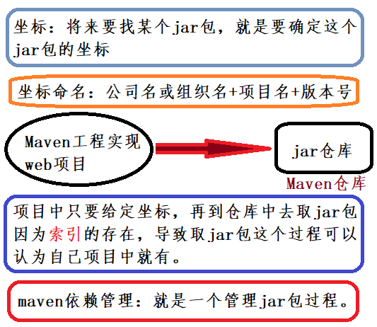

## Maven 概述

&emsp;&emsp;Maven 是一个项目管理工具，它包含了一个项目对象模型 (POM： Project Object Model)、一组标准集合、一个项目生命周期(Project Lifecycle)、一个依赖管理系统(Dependency Management System)，和用来运行定义在生命周期阶段中插件目标的逻辑。

【Maven 能解决的问题】

1. 管理 jar 包：下载 Jar 包，解决版本冲突。

2. 编译代码：将源代码编译成可运行的二进制字节码。

3. 单元测试，检验代码质量。

4. 打包，生成报表，部署项目，生成 Web 站点 。

【Maven 的优势举例】 

* **传统项目**：要能够将项目运行起来，就必须将该项目所依赖的一些 jar 包添加到工程中，否则项目就不能运行。 试想如果具有相同架构的项目有十个，那么就需要将这一份 jar 包复制到十个不同的工程中。工程占用内存很大。

* **Maven 项目**：拥有一个本地仓库，存储项目用到的 jar 包，其他项目只需引入坐标使用即可，所有项目共同使用同一份仓库，减少 jar 存储。实现代码服用，减少项目空间。  

### Maven 的两个精典作用 

#### Maven 的依赖管理 

&emsp;&emsp;Maven 的一个核心特性就是**依赖管理**。当涉及到多模块的项目（包含成百个模块或者子项目），管理依赖就变成一项困难的任务。 Maven 展示出了它对处理这种情形的高度控制。 

&emsp;&emsp;maven 工程中不直接将 jar 包导入到工程中，而是通过在 pom.xml 文件中添加所需 jar 包的坐标，在需要用到 jar 包的时候，只要查找 pom.xml 文件，再通过 pom.xml 文件中的坐标，到一个专门用于 ”存放 jar 包的仓库” (maven 仓库)中根据坐标从而找到这些 jar 包，把这些 jar 包拿去运行。 为了解决这个过程中速度慢的问题，maven 通过**建立索引**，大大提高加载 jar 包的速度，可以认为 jar 包基本跟放在本地的工程文件中再读取出来的速度是一样的。 

#### 项目的一键构建 

