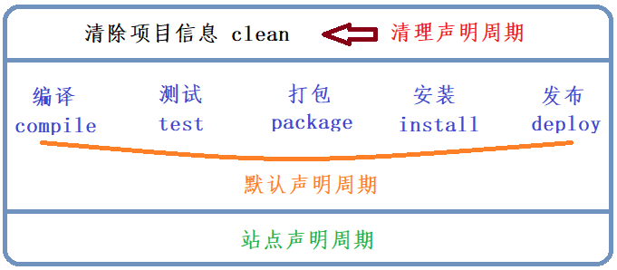
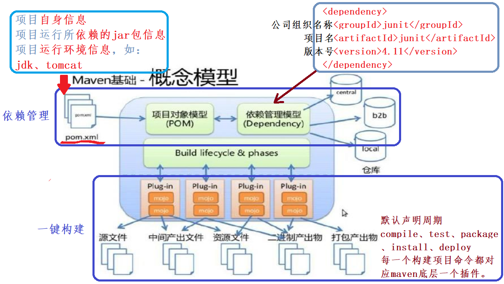

## 第一节 Maven 基础

### 1.1 Maven 常用命令

* `mvn compile` 是 maven 工程的编译命令，作用是将 src/main/java 下的文件编译为 class 文件输出到 target 目录下。

* `mvn test` 是 maven 工程的测试命令，会执行 src/test/java 下的单元测试类。同时也会将 src/main/java 下的文件编译为 class 文件输出到 target 目录下。

* `mvn clean` 是 maven 工程的清理命令，执行 clean 会删除 target 目录及内容。

* `mvn package` 是 maven 工程的打包命令，对于 java 工程执行 package 打成 jar 包，对于 web 工程打成 war包。

* `mvn install` 是 maven 工程的安装命令，执行 install 将 maven 打成 jar 包或 war 包发布到本地仓库。

> 从运行结果中，可以看出：当后面的命令执行时，前面的操作过程也都会自动执行。
> 如执行 test 命令时，compile 命令也会执行；执行 package 命令时，compile 与 test 命令都会执行。

#### 1.1.1 声明周期

Maven 对项目构建过程分为三套相互独立的生命周期，分别是：
* Clean Lifecycle 在进行真正的构建之前进行一些清理工作。
* Default Lifecycle 构建的核心部分，编译，测试，打包，部署等等。
* Site Lifecycle 生成项目报告，站点，发布站点。

#### 1.1.2 Maven 概念模型 

### 1.2 IDEA 开发 maven 项目

### 1.3 

### 1.4 

