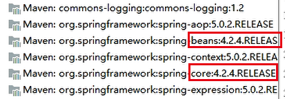

## 第二节 Maven 传统 web 工程做数据查询操作

### 2.1 Maven 知识点总结

maven 是一个项目管理工具。主要功能：依赖管理、一键构建。

* **依赖管理**：maven 对项目中 jar 包的管理过程。传统工程直接把 jar 包放置在项目中。maven 工程真正的 jar 包放置在仓库中，项目中只用放置 jar 包的坐标。

* **一键构建**：maven 自身集成了 tomcat 插件，可以对项目进行编译，测试，打包，安装，发布等操作。


仓库的种类：本地仓库，远程仓库【私服】，中央仓库。

仓库之间的关系：当启动一个 maven 工程时，maven 工程会通过 pom 文件中 jar 包的坐标去本地仓库找对应 jar 包。

* 默认情况下，如果本地仓库没有对应 jar 包，maven 工程会自动去中央仓库下载 jar 包到本地仓库。

* 在公司中，如果本地没有对应 jar 包，会先从私服下载 jar 包，

* 如果私服没有 jar 包，可以从中央仓库下载，也可以从本地上传。

**maven 常用命令**：clean，compile，test，package，install，deploy。

**maven 三套生命周期**：清理生命周期，默认生命周期，站点生命周期。


### 2.2 环境准备

#### 2.2.1 数据库

创建 maven 数据库，执行如下 sql 语句

```sql
SET FOREIGN_KEY_CHECKS=0;
-- ----------------------------
-- Table structure for `items`
-- ----------------------------
DROP TABLE IF EXISTS `items`;
CREATE TABLE `items` (
  `id` int(10) NOT NULL auto_increment,
  `name` varchar(20) default NULL,
  `price` float(10,0) default NULL,
  `pic` varchar(40) default NULL,
  `createtime` datetime default NULL,
  `detail` varchar(200) default NULL,
  PRIMARY KEY  (`id`)
) ENGINE=InnoDB AUTO_INCREMENT=9 DEFAULT CHARSET=utf8;

-- ----------------------------
-- Records of items
-- ----------------------------
INSERT INTO `items` VALUES ('1', '传智播客', '1000', null, '2018-03-13 09:29:30', '带我走上人生巅峰');
INSERT INTO `items` VALUES ('2', '黑马310', null, null, '2018-03-28 10:05:52', '插入测试');
INSERT INTO `items` VALUES ('3', '黑马307', '199', null, '2018-03-07 10:08:04', '插入测试');
INSERT INTO `items` VALUES ('7', '插入测试', null, null, null, null);
INSERT INTO `items` VALUES ('8', '插入测试', null, null, null, null);
```


#### 2.2.2 创建 maven web 工程

1）选择 apache 下的 maven-archetype-webapp 骨架，GroupId 为 com.gx，项目名称 ArtifactId 为 maven_1. 

2）为 web.xml 添加 【web 配置文件头部声明】

```xml
<!DOCTYPE web-app PUBLIC
 "-//Sun Microsystems, Inc.//DTD Web Application 2.3//EN"
 "http://java.sun.com/dtd/web-app_2_3.dtd" >

<web-app xmlns="http://java.sun.com/xml/ns/javaee"
         xmlns:xsi="http://www.w3.org/2001/XMLSchema-instance"
         xsi:schemaLocation="http://java.sun.com/xml/ns/javaee
          http://java.sun.com/xml/ns/javaee/web-app_3_0.xsd"
         version="3.0">

</web-app>
```

3）删掉 pom.xml 中多余的内容

```xml
<?xml version="1.0" encoding="UTF-8"?>

<project xmlns="http://maven.apache.org/POM/4.0.0" xmlns:xsi="http://www.w3.org/2001/XMLSchema-instance"
  xsi:schemaLocation="http://maven.apache.org/POM/4.0.0 http://maven.apache.org/xsd/maven-4.0.0.xsd">
  <modelVersion>4.0.0</modelVersion>

  <groupId>com.gx</groupId>
  <artifactId>maven_1</artifactId>
  <version>1.0-SNAPSHOT</version>
  <packaging>war</packaging>
  
</project>
```

#### 2.2.3 完善文件夹结构

1）在 src->main 下创建 java 文件夹、resources 文件夹，并设置对应的 **Root。

2）在 src 下创建 test 文件夹，右键设置为 Test Sources Root。                   

### 2.3 解决 maven 导入 jar 包时冲突

maven 工程要导入 jar 包的坐标，就必须要考虑解决 jar 包冲突。

maven 导入 jar 包中的一些概念：

* 直接依赖：项目中直接导入的 jar 包，就是该项目的直接依赖包。

* 传递依赖：项目中没有直接导入的 jar 包，即项目直接依赖依赖的 jar 包。


**解决 jar 包冲突的方式一**：

* 第一声明优先原则：哪个 jar 包的坐标在靠上的位置，这个 jar 包就是先声明的。先声明的 jar 包坐标下的依赖包，可以优先进入项目中。

```xml
<dependencies>
  <dependency>
    <groupId>org.springframework</groupId>
    <artifactId>spring-bean</artifactId>
    <version>4.2.4.RELEASE</version>
  </dependency>
  <dependency>
    <groupId>org.springframework</groupId>
    <artifactId>spring-context</artifactId>
    <version>5.0.2.RELEASE</version>
  </dependency>
</dependencies>
```



**解决 jar 包冲突的方式二**：

* 路径近者优先原则。直接依赖路径比传递依赖路径近，那么最终项目进入的 jar 包会是路径近的直接依赖包。

```xml
<dependencies>
  <dependency>
    <groupId>org.springframework</groupId>
    <artifactId>spring-bean</artifactId>
    <version>4.2.4.RELEASE</version>
  </dependency>
    <dependency>
    <groupId>org.springframework</groupId>
    <artifactId>spring-context</artifactId>
    <version>5.0.2.RELEASE</version>
  </dependency>
  <dependency>
    <groupId>org.springframework</groupId>
    <artifactId>spring-core</artifactId>
    <version>4.2.8.RELEASE</version>
  </dependency>
</dependencies>
```

* 进入项目的 spring-core 版本是 4.2.8.RELEASE，因为直接依赖会优先于传递依赖！


**解决 jar 包冲突的方式三【推荐使用】**：

* 直接排除法。当要排除某个 jar 包下依赖包，在配置 exclusions 标签的时候，内部可以不写版本号。因为此时依赖包使用的版本和默认和本 jar 包一样。

```xml
<dependencies>
  <dependency>
    <groupId>org.springframework</groupId>
    <artifactId>spring-context</artifactId>
    <version>5.0.2.RELEASE</version>
    <exclusions>
      <exclusion>
        <groupId>org.springframework</groupId>
        <artifactId>spring-core</artifactId>
      </exclusion>
    </exclusions>
  </dependency>
  <dependency>
    <groupId>org.springframework</groupId>
    <artifactId>spring-core</artifactId>
    <version>4.2.8.RELEASE</version>
  </dependency>
</dependencies>
```

### 2.4 pom 文件内标签的讲解

maven 工程是可以分父子依赖关系的。凡是依赖别的项目后，拿到的别的项目的依赖包，都属于传递依赖。

* 比如：当前 A 项目，被 B 项目依赖。那么 A 项目中所有 jar 包都会传递到 B 项目中，这些包对于 B 项目是传递依赖。B 项目开发者，如果再在 B 项目中导入一套 ssm 框架的 jar 包，对于 B 项目是直接依赖。那么直接依赖的 jar 包就会把 A 项目传递过去的 jar 包覆盖掉。

* 为了防止以上情况的出现。可以把 A 项目中主要 jar 包的坐标锁住，那么其他依赖该项目的项目中，即便是有同名 jar 包直接依赖，也无法覆盖。


```xml
<!-- 统一管理jar包版本 -->
<properties>
  <spring.version>5.0.2.RELEASE</spring.version>
  <slf4j.version>1.6.6</slf4j.version>
  <log4j.version>1.2.12</log4j.version>
  <shiro.version>1.2.3</shiro.version>
  <mysql.version>5.1.6</mysql.version>
  <mybatis.version>3.4.5</mybatis.version>
  <spring.security.version>5.0.1.RELEASE</spring.security.version>
</properties>

<!-- 锁定jar包版本 -->
<dependencyManagement>
  <dependencies>
    <dependency>
      <groupId>org.springframework</groupId>
      <artifactId>spring-context</artifactId>
      <version>${spring.version}</version>
    </dependency>
    <dependency>
      <groupId>org.springframework</groupId>
      <artifactId>spring-web</artifactId>
      <version>${spring.version}</version>
    </dependency>
    <dependency>
      <groupId>org.springframework</groupId>
      <artifactId>spring-webmvc</artifactId>
      <version>${spring.version}</version>
    </dependency>
    <dependency>
      <groupId>org.springframework</groupId>
      <artifactId>spring-tx</artifactId>
      <version>${spring.version}</version>
    </dependency>
    <dependency>
      <groupId>org.springframework</groupId>
      <artifactId>spring-test</artifactId>
      <version>${spring.version}</version>
    </dependency>
    <dependency>
      <groupId>org.mybatis</groupId>
      <artifactId>mybatis</artifactId>
      <version>${mybatis.version}</version>
    </dependency>
  </dependencies>
</dependencyManagement>

<!-- 项目依赖jar包 -->
<dependencies>
  <!-- spring -->
  <dependency>
    <groupId>org.aspectj</groupId>
    <artifactId>aspectjweaver</artifactId>
    <version>1.6.8</version>
  </dependency>
  <dependency>
    <groupId>org.springframework</groupId>
    <artifactId>spring-aop</artifactId>
    <version>${spring.version}</version>
  </dependency>
  <dependency>
    <groupId>org.springframework</groupId>
    <artifactId>spring-context</artifactId>
    <version>${spring.version}</version>
  </dependency>
  <dependency>
    <groupId>org.springframework</groupId>
    <artifactId>spring-context-support</artifactId>
    <version>${spring.version}</version>
  </dependency>
  <dependency>
    <groupId>org.springframework</groupId>
    <artifactId>spring-web</artifactId>
    <version>${spring.version}</version>
  </dependency>
  <dependency>
    <groupId>org.springframework</groupId>
    <artifactId>spring-orm</artifactId>
    <version>${spring.version}</version>
  </dependency>
  <dependency>
    <groupId>org.springframework</groupId>
    <artifactId>spring-beans</artifactId>
    <version>${spring.version}</version>
  </dependency>
  <dependency>
    <groupId>org.springframework</groupId>
    <artifactId>spring-core</artifactId>
    <version>${spring.version}</version>
  </dependency>
  <dependency>
    <groupId>org.springframework</groupId>
    <artifactId>spring-test</artifactId>
    <version>${spring.version}</version>
  </dependency>
  <dependency>
    <groupId>org.springframework</groupId>
    <artifactId>spring-webmvc</artifactId>
    <version>${spring.version}</version>
  </dependency>
  <dependency>
    <groupId>org.springframework</groupId>
    <artifactId>spring-tx</artifactId>
    <version>${spring.version}</version>
  </dependency>
  <dependency>
    <groupId>junit</groupId>
    <artifactId>junit</artifactId>
    <version>4.12</version>
    <scope>test</scope>
  </dependency>
  <dependency>
    <groupId>mysql</groupId>
    <artifactId>mysql-connector-java</artifactId>
    <version>${mysql.version}</version>
  </dependency>
  <dependency>
    <groupId>javax.servlet</groupId>
    <artifactId>javax.servlet-api</artifactId>
    <version>3.1.0</version>
    <scope>provided</scope>
  </dependency>
  <dependency>
    <groupId>javax.servlet.jsp</groupId>
    <artifactId>jsp-api</artifactId>
    <version>2.0</version>
    <scope>provided</scope>
  </dependency>
  <dependency>
    <groupId>jstl</groupId>
    <artifactId>jstl</artifactId>
    <version>1.2</version>
  </dependency>
  <!-- log start -->
  <dependency>
    <groupId>log4j</groupId>
    <artifactId>log4j</artifactId>
    <version>${log4j.version}</version>
  </dependency>
  <dependency>
    <groupId>org.slf4j</groupId>
    <artifactId>slf4j-api</artifactId>
    <version>${slf4j.version}</version>
  </dependency>
  <dependency>
    <groupId>org.slf4j</groupId>
    <artifactId>slf4j-log4j12</artifactId>
    <version>${slf4j.version}</version>
  </dependency>
  <!-- log end -->
  <dependency>
    <groupId>org.mybatis</groupId>
    <artifactId>mybatis</artifactId>
    <version>${mybatis.version}</version>
  </dependency>
  <dependency>
    <groupId>org.mybatis</groupId>
    <artifactId>mybatis-spring</artifactId>
    <version>1.3.0</version>
  </dependency>
  <dependency>
    <groupId>c3p0</groupId>
    <artifactId>c3p0</artifactId>
    <version>0.9.1.2</version>
    <type>jar</type>
    <scope>compile</scope>
  </dependency>
  <dependency>
    <groupId>com.github.pagehelper</groupId>
    <artifactId>pagehelper</artifactId>
    <version>5.1.2</version>
  </dependency>
  <dependency>
    <groupId>org.springframework.security</groupId>
    <artifactId>spring-security-web</artifactId>
    <version>${spring.security.version}</version>
  </dependency>
  <dependency>
    <groupId>org.springframework.security</groupId>
    <artifactId>spring-security-config</artifactId>
    <version>${spring.security.version}</version>
  </dependency>
  <dependency>
    <groupId>org.springframework.security</groupId>
    <artifactId>spring-security-core</artifactId>
    <version>${spring.security.version}</version>
  </dependency>
  <dependency>
    <groupId>org.springframework.security</groupId>
    <artifactId>spring-security-taglibs</artifactId>
    <version>${spring.security.version}</version>
  </dependency>
  <dependency>
    <groupId>com.alibaba</groupId>
    <artifactId>druid</artifactId>
    <version>1.0.9</version>
  </dependency>
  <dependency>
    <groupId>junit</groupId>
    <artifactId>junit</artifactId>
    <version>4.12</version>
  </dependency>
</dependencies>
<!-- 添加tomcat7插件 -->
<build>
  <plugins>
    <plugin>
      <groupId>org.apache.tomcat.maven</groupId>
      <artifactId>tomcat7-maven-plugin</artifactId>
      <version>2.2</version>
    </plugin>
  </plugins>
</build>
```

### 2.5 dao 层代码编写

1）在 main->java 下创建 com.gx.domain 包，创建 Items 实体类。

```java
package com.gx.domain;

import java.util.Date;

public class Items {
    private Integer id;
    private String name;
    private Double price;
    private String pic;
    private Date createtime;
    private String detail;
    // getter & setter 方法  
}
```

2）在 main->java 下创建 com.gx.dao 包，创建 ItemsDao 接口。

```java
package com.gx.dao;

import com.gx.domain.Items;

public interface ItemsDao {
    public Items findById(Integer id);
}
```

3）使用 Mybatis 框架，不用写实现类，让 Mybatis 直接生成接口的代理对象。在 resources 下创建与接口同一路径下的文件夹，放置 mapper 映射文件，即 `com/gx/dao`，文件名为 `ItemsDao.xml` 。

```xml
<?xml version="1.0" encoding="UTF-8" ?>
<!DOCTYPE mapper
        PUBLIC "-//mybatis.org//DTD Mapper 3.0//EN"
        "http://mybatis.org/dtd/mybatis-3-mapper.dtd">

<!-- namespace 为接口的全限定类名！ -->
<mapper namespace="com.gx.dao.ItemsDao">
    <!-- id 为对应的接口名 -->
    <!-- parameterType 参数类型-->
    <!-- resultType 返回值类型 之后必须要扫描包路径，否则 Items 识别不到！ -->
    <select id="findById" parameterType="int" resultType="Items">
        SELECT * FROM items WHERE id = #{id}
    </select>
</mapper>
```

4）在 resources 下创建 spring 配置文件 `applicationContext.xml`

```xml
<?xml version="1.0" encoding="UTF-8"?>
<beans xmlns="http://www.springframework.org/schema/beans"
       xmlns:xsi="http://www.w3.org/2001/XMLSchema-instance"
       xmlns:context="http://www.springframework.org/schema/context"
       xmlns:aop="http://www.springframework.org/schema/aop"
       xmlns:tx="http://www.springframework.org/schema/tx"
       xmlns:mvc="http://www.springframework.org/schema/mvc"
       xsi:schemaLocation="http://www.springframework.org/schema/beans
			    http://www.springframework.org/schema/beans/spring-beans.xsd
			    http://www.springframework.org/schema/context
			    http://www.springframework.org/schema/context/spring-context.xsd
			    http://www.springframework.org/schema/aop
			    http://www.springframework.org/schema/aop/spring-aop.xsd
			    http://www.springframework.org/schema/tx
			    http://www.springframework.org/schema/tx/spring-tx.xsd
			    http://www.springframework.org/schema/mvc
			    http://www.springframework.org/schema/mvc/spring-mvc.xsd">

    <!--dao层配置文件开始-->
    <!--配置连接池-->
    <bean id="dataSource" class="com.alibaba.druid.pool.DruidDataSource">
        <property name="driverClassName" value="com.mysql.jdbc.Driver" />
        <property name="url" value="jdbc:mysql:///maven"/>
        <property name="username" value="root"/>
        <property name="password" value="mysql"/>
    </bean>

    <!-- mybatis 真正操作对象 SqlSession-->
    <!--配置生产SqlSession对象的工厂-->
    <bean id="sqlSessionFactory" class="org.mybatis.spring.SqlSessionFactoryBean">
        <property name="dataSource" ref="dataSource"/>
        <!--扫描pojo包，给包下所有pojo对象起别名-->
        <property name="typeAliasesPackage" value="com.gx.domain"/>
    </bean>

    <!--扫描接口包路径，生成包下所有接口的代理对象，并且放入spring容器中-->
    <bean class="org.mybatis.spring.mapper.MapperScannerConfigurer">
        <property name="basePackage" value="com.gx.dao"/>
    </bean>
    <!--dao层配置文件结束-->
</beans>
```

5）测试，在 test->java 下创建 `com.gx.test.ItemsTest`

```java
package com.gx.test;

import com.gx.dao.ItemsDao;
import com.gx.domain.Items;
import org.junit.Test;
import org.springframework.context.ApplicationContext;
import org.springframework.context.support.ClassPathXmlApplicationContext;

public class ItemsTest {

    @Test
    public void findById(){
        //获取spring容器
        ApplicationContext ac = new ClassPathXmlApplicationContext("applicationContext.xml");
        //dao测试
        //从容器中拿到所需的dao的代理对象
        ItemsDao itemsDao = ac.getBean(ItemsDao.class);
        //调用方法
        Items items = itemsDao.findById(1);
        System.out.println(items.getName());
    }
}
```


### 2.6 service 层代码编写

1）在 main->java 下创建 com.gx.service 包，其下创建 ItemsService 接口。

```java
package com.gx.service;

import com.gx.domain.Items;

public interface ItemsService {
    public Items findById(Integer id);
}
```

2）在 main->java 下创建 com.gx.service.impl 包，其下创建 ItemsServiceImpl 类。

```java
package com.gx.service.impl;

import com.gx.dao.ItemsDao;
import com.gx.domain.Items;
import com.gx.service.ItemsService;
import org.springframework.beans.factory.annotation.Autowired;
import org.springframework.stereotype.Service;

/**
 * 原则：
 * 自己写的类尽量使用注解
 * 框架类尽量使用配置文件
 */

@Service
public class ItemsServiceImpl implements ItemsService {

    @Autowired
    private ItemsDao itemsDao;

    public Items findById(Integer id) {
        return itemsDao.findById(id);
    }
}
```

3）在 `applicationContext.xml` 中添加 service 层配置

```xml
<!--service层配置文件开始-->

<!--组件扫描配置-->
<context:component-scan base-package="com.gx.service"/>

<!--aop面向切面编程，切面就是切入点和通知的组合-->
<!--配置事务管理器-->
<bean id="transactionManager" class="org.springframework.jdbc.datasource.DataSourceTransactionManager">
    <property name="dataSource" ref="dataSource"/>
</bean>
<!--配置事务的通知-->
<tx:advice id="advice">
    <tx:attributes>
        <tx:method name="save*" propagation="REQUIRED"/>
        <tx:method name="update*" propagation="REQUIRED"/>
        <tx:method name="delete*" propagation="REQUIRED"/>
        <tx:method name="find*" read-only="true"/>
        <tx:method name="*" propagation="REQUIRED"/>
    </tx:attributes>
</tx:advice>

<!--配置切面-->
<aop:config>
    <aop:pointcut id="pointcut" expression="execution(* com.gx.service.impl.*.*(..))"/>
    <aop:advisor advice-ref="advice" pointcut-ref="pointcut"/>
</aop:config>
<!--service层配置文件结束-->
```

4）测试

```java
public class ItemsTest {

    @Test
    public void findById(){
        //获取spring容器
        ApplicationContext ac = new ClassPathXmlApplicationContext("applicationContext.xml");
        //service测试
        ItemsService itemsService = ac.getBean(ItemsService.class);
        //调用方法
        Items items = itemsService.findById(1);
        System.out.println(items.getName());
    }
}
```

### 2.7 web 层代码编写

1）在 main->java 下创建 com.gx.controller 包，其下创建 ItemsController 类。

```java
package com.gx.controller;

import com.gx.domain.Items;
import com.gx.service.ItemsService;
import org.springframework.beans.factory.annotation.Autowired;
import org.springframework.stereotype.Controller;
import org.springframework.ui.Model;
import org.springframework.web.bind.annotation.RequestMapping;

@Controller
@RequestMapping("/items")
public class ItemsController {

    @Autowired
    private ItemsService itemsService;

    @RequestMapping("/findDetail")
    /**
     * Model:方便向页面传值
     */
    public String findDetail(Model model){
        Items items = itemsService.findById(1);
        model.addAttribute("item", items);
        return "itemDetail";
    }

}
```

2）在 resources 下创建 springmvc.xml 配置文件

```xml
<?xml version="1.0" encoding="UTF-8"?>
<beans xmlns="http://www.springframework.org/schema/beans"
       xmlns:xsi="http://www.w3.org/2001/XMLSchema-instance"
       xmlns:context="http://www.springframework.org/schema/context"
       xmlns:aop="http://www.springframework.org/schema/aop"
       xmlns:tx="http://www.springframework.org/schema/tx"
       xmlns:mvc="http://www.springframework.org/schema/mvc"
       xsi:schemaLocation="http://www.springframework.org/schema/beans
			    http://www.springframework.org/schema/beans/spring-beans.xsd
			    http://www.springframework.org/schema/context
			    http://www.springframework.org/schema/context/spring-context.xsd
			    http://www.springframework.org/schema/aop
			    http://www.springframework.org/schema/aop/spring-aop.xsd
			    http://www.springframework.org/schema/tx
			    http://www.springframework.org/schema/tx/spring-tx.xsd
			    http://www.springframework.org/schema/mvc
			    http://www.springframework.org/schema/mvc/spring-mvc.xsd">

    <!--组件扫描-->
    <context:component-scan base-package="com.gx.controller"/>

    <!--处理器映射器，处理器适配器-->
    <mvc:annotation-driven/>

    <!--视图解析器-->
    <bean id="internalResourceViewResolver" class="org.springframework.web.servlet.view.InternalResourceViewResolver">
        <property name="prefix" value="/WEB-INF/pages/"/>
        <property name="suffix" value=".jsp"/>
    </bean>

    <!--释放静态资源-->
    <mvc:default-servlet-handler/>
    
</beans>
```

3）在 WEB-INF 下创建文件夹 pages，创建 itemDetail.jsp 文件

```jsp
<%@ page language="java" contentType="text/html; charset=UTF-8"
    pageEncoding="UTF-8"%>
<%@ taglib uri="http://java.sun.com/jsp/jstl/core" prefix="c" %>
<%@ taglib uri="http://java.sun.com/jsp/jstl/fmt"  prefix="fmt"%>    
 
<!DOCTYPE html PUBLIC "-//W3C//DTD HTML 4.01 Transitional//EN" "http://www.w3.org/TR/html4/loose.dtd">
<html>
<head>
<meta http-equiv="Content-Type" content="text/html; charset=UTF-8">
<title>Insert title here</title>
</head>
<body> 
	<form>
		<table width="100%" border=1>
			<tr>
				<td>商品名称</td>
				<td> ${item.name } </td>
			</tr>
			<tr>
				<td>商品价格</td>
				<td> ${item.price } </td>
			</tr>
			<tr>
				<td>生成日期</td>
				<td> <fmt:formatDate value="${item.createtime}" pattern="yyyy-MM-dd HH:mm:ss"/> </td>
			</tr>
			<tr>
				<td>商品简介</td>
				<td>${item.detail} </td>
			</tr>
		</table>
	</form>
</body>
</html>
```

