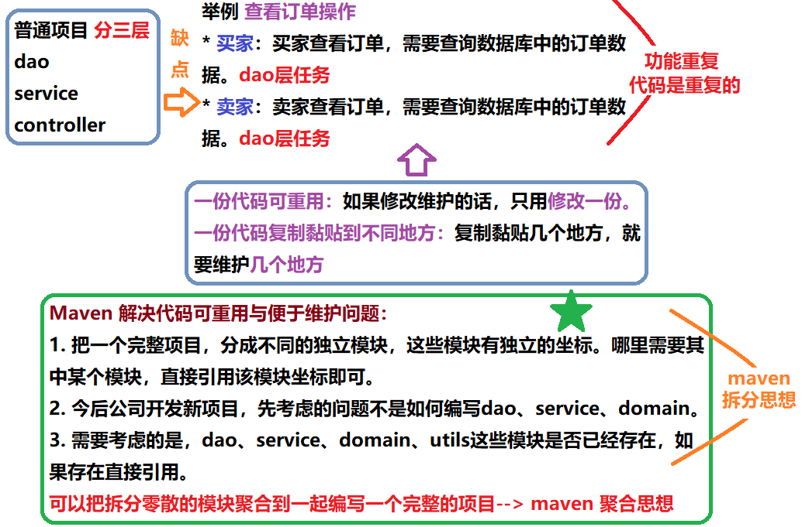
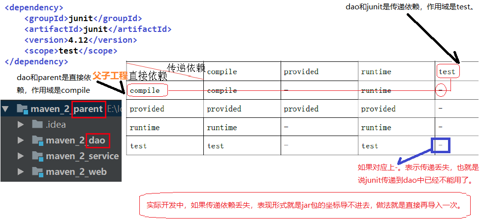

## 第三节 Maven 工程拆分与聚合


### 3.1 maven 工程拆分与聚合的思想





### 3.2 maven 父子工程的创建

1）创建父工程，选择 new Project 或者 new Module 都可以，父工程只要有 pom.xml 就可以。此处，创建 Maven 工程，无需选任何骨架，GroupId 为 com.gx，ArtifactId 为 `maven_2_parent`。删除 src 文件。

2）选中父工程，右键，New Module，选择 Maven 工程，创建 dao 模块，与页面没有交互，是 java 工程，不用选择骨架，ArtifactId 为 `maven_2_dao`。

3）同理，创建 `maven_2_service` 模块，不用选择任何骨架。

4）创建 `maven_2_web` 模块，选择 apache 下的 `maven-archetype-webapp` 骨架。删除该模块 pom.xml 多余的自动生成内容。

```java
<?xml version="1.0" encoding="UTF-8"?>

<project xmlns="http://maven.apache.org/POM/4.0.0" xmlns:xsi="http://www.w3.org/2001/XMLSchema-instance"
         xsi:schemaLocation="http://maven.apache.org/POM/4.0.0 http://maven.apache.org/xsd/maven-4.0.0.xsd">
    <parent>
        <artifactId>maven_2_parent</artifactId>
        <groupId>com.gx</groupId>
        <version>1.0-SNAPSHOT</version>
    </parent>
    <modelVersion>4.0.0</modelVersion>

    <artifactId>maven_2_web</artifactId>
    <packaging>war</packaging>
</project>
```  


### 3.3 工程和模块的关系以及继承和依赖的概念

工程和模块的区别：

* 工程不等于完整的项目，模块也不等于完整的项目，一个完整的项目看的是代码，代码完整，就可以说这是一个完整的项目。和此项目是工程和模块没有关系。

* 工程天生只能使用自己内部资源，天生是独立的。后天可以和其他工程或模块建立关联关系。

* 模块天生不是独立的，模块天生是属于父工程的，模块一旦创建，所有父工程的资源都可以使用。

* 父子工程之间，子模块天生集成父工程，可以使用父工程所有资源。

* 子模块之间天生是没有任何关系的。

* 父子工程之间不用建立关系，**继承关系**是先天的，不需要手动建立。

* 平级之间的引用叫**依赖**，依赖不是先天的，依赖是需要后天建立的。


### 3.4 传递依赖下来的包是否能用





### 3.5 在父子工程中填充代码


所有文件参见【第二节 Maven 传统 web 工程做数据查询】

1）在父工程的 pom.xml 中配置坐标。见第二节 pom.xml。


2）在 `maven_2_dao` 模块

* src->main->java 文件夹下创建 com.gx.domain 包，放入 Items 类。创建 com.gx.dao 包，放入 ItemsDao 接口。

* 在 resources 下创建 `com/gx/dao` 目录，将 ItemsDao.xml 拷贝过来。

* 将 applicationContext.xml 文件拷贝到 resources 文件夹下。只保留 dao 层配置，删除 service 层配置！

* 为了加以区分，将文件 applicationContext.xml 重命名为 applicationContext-dao.xml，移动到 resources 下的 spring 文件夹下（新建文件夹）。


3）service 模块

* 在模块 pom.xml 中配置对 dao 模块的依赖

    ```xml
    <dependencies>
        <dependency>
            <groupId>com.gx</groupId>
            <artifactId>maven_2_dao</artifactId>
            <version>1.0-SNAPSHOT</version>
        </dependency>
    </dependencies>
    ```

* 模块 java 文件夹下创建 `com.gx.service` 包并拷贝 ItemsService 接口，创建`com.gx.service.impl` 包并拷贝 ItemsServiceImpl 实现类。

* 在 resources 下创建 spring 文件夹，拷贝 applicationContext 文件，并重命名为 applicationContext-service.xml。删除 dao 相关配置，保留 service 相关配置！

4）web 模块

* 在模块 pom.xml 中配置对 service 模块的依赖

    ```xml
    <dependencies>
        <dependency>
            <groupId>com.gx</groupId>
            <artifactId>maven_2_service</artifactId>
            <version>1.0-SNAPSHOT</version>
        </dependency>
    </dependencies>
    ```

* 补全目录，在 src->main 下创建 java 与 resources 文件夹，并设置对应的 **Root。

* 在 java 下创建 com.gx.controller 包，并拷贝 ItemsController 类。

* 将配置文件 springmvc.xml 与 log4j.properties 拷贝到 resources 文件夹下。

* 在 WEB-INF 下创建 pages 文件夹，并拷贝 itemDetail.jsp 文件。

* 将 web.xml 内容拷贝过来。

* 在 resources 下创建文件 applicationContext.xml

```xml
<?xml version="1.0" encoding="UTF-8"?>
<beans xmlns="http://www.springframework.org/schema/beans"
       xmlns:xsi="http://www.w3.org/2001/XMLSchema-instance"
       xmlns:context="http://www.springframework.org/schema/context"
       xmlns:aop="http://www.springframework.org/schema/aop"
       xmlns:tx="http://www.springframework.org/schema/tx"
       xmlns:mvc="http://www.springframework.org/schema/mvc"
       xsi:schemaLocation="http://www.springframework.org/schema/beans
			    http://www.springframework.org/schema/beans/spring-beans.xsd
			    http://www.springframework.org/schema/context
			    http://www.springframework.org/schema/context/spring-context.xsd
			    http://www.springframework.org/schema/aop
			    http://www.springframework.org/schema/aop/spring-aop.xsd
			    http://www.springframework.org/schema/tx
			    http://www.springframework.org/schema/tx/spring-tx.xsd
			    http://www.springframework.org/schema/mvc
			    http://www.springframework.org/schema/mvc/spring-mvc.xsd">
        <import resource="classpath:spring/applicationContext-dao.xml" />
        <import resource="classpath:spring/applicationContext-service.xml" />
</beans>
```


### 3.6 maven 父子工程三种启动方式


### 3.7 

### 3.8 


### 3.9 

### 3.10 


