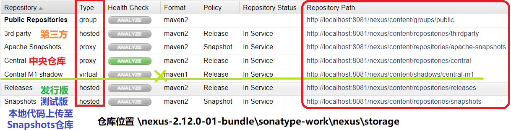

## 第四节 私服 & 第三方 jar 包安装


### 4.1 私服的安装和启动

1）下载 `nexus-2.12.0-01-bundle.zip` 并解压到没有中文的目录下。进入 nexus-2.12.0-01/bin 文件夹，以管理员启动命令行，进入该目录：

```
安装：
nexus.bat install
启动：
nexus.bat start
卸载：
nexus.bat uninstall
```

2）JDK 9 会报错：`The nexus service was launched, but failed to start.`。修改 nexus-2.12.0-01\bin\jsw\conf 下 wrapper.conf 的 【wrapper.java.command=自己的JDK8安装目录\bin\java】

3）查看 nexus-2.12.0-01/conf 下 nexus.properties 配置文件。默认端口 8081。访问网址 `http://localhost:8081/nexus`。默认登录用户名 admin，密码 admin123。





1. hosted，宿主仓库，部署自己的 jar 到这个类型的仓库，包括 releases 和 snapshot 两部分，Releases 公司内部发布版本仓库、 Snapshots 公司内部测试版本仓库。

2. proxy，代理仓库，用于代理远程的公共仓库，如 maven 中央仓库，用户连接私服，私服自动去中央仓库下载 jar 包或者插件。

3. group，仓库组，用来合并多个 hosted/proxy 仓库，通常配置自己的 maven 连接仓库组。

4. virtual(虚拟)：兼容 Maven1 版本的 jar 或者插件。


nexus 仓库默认在 sonatype-work 目录中


### 4.2 将项目发布到私服


**需求**：假设多团队分别开发 `maven_2_dao`、`maven_2_service`、 `maven_2_web`，某个团队开发完在 `maven_2_dao` 会将 `maven_2_dao` 发布到私服供 `maven_2_service` 团队使用，将 `maven_2_dao` 工程打成 jar 包发布到私服。


#### 4.2.1 配置

🍒 **第一步**：需要在客户端即部署 `maven_2_dao` 工程的电脑上配置 maven 环境，并修改 settings.xml 文件，配置连接私服的用户和密码。此用户名和密码用于私服校验，因为私服需要知道上传的账号和密码是否和私服中的账号和密码一致。

```xml
<server>
    <id>releases</id>
    <username>admin</username>
    <password>admin123</password>
</server>
<server>
    <id>snapshots</id>
    <username>admin</username>
    <password>admin123</password>
</server>
```

* releases 连接发布版本项目仓库

* snapshots 连接测试版本项目仓库


🍒 **第二步**：配置项目 pom.xml

配置私服仓库的地址，公司的 jar 包会上传到私服的宿主仓库，根据工程的版本号决定上传到哪个宿主仓库，如果版本为 release 则上传到私服的 release 仓库，如果版本为 snapshot 则上传到私服的 snapshot 仓库。

```xml
<distributionManagement>
    <repository>
        <id>releases</id>
        <url>http://localhost:8081/nexus/content/repositories/releases/</url>
    </repository>
    <snapshotRepository>
        <id>snapshots</id>
        <url>http://localhost:8081/nexus/content/repositories/snapshots/</url>
    </snapshotRepository>
</distributionManagement>
```

注意： pom.xml 里的 `<id>` 和 settings.xml 配置 `<id>` 对应！

第三步：测试

将项目 dao 工程打成 jar 包发布到私服：

1、 首先启动 nexus
2、 对 `maven_2_dao` 工程执行 deploy 命令

* 根据项目 pom.xml 中 version 定义决定发布到哪个仓库，如果 version 定义为snapshot，执行 deploy 后查看 nexus 的 snapshot 仓库，如果 version 定义为 release 则项目将发布到 nexus 的 release 仓库，本项目将发布到 snapshot 仓库。


#### 4.2.2 从私服下载 jar 包


没有配置 nexus 之前，如果本地仓库没有，去中央仓库下载，通常在企业中会在局域网内部署一台私服服务器，有了私服本地项目首先去本地仓库找 jar，如果没有找到则连接私服从私服下载 jar 包，如果私服没有 jar 包私服同时作为代理服务器从中央仓库下载 jar 包，这样做的好处是一方面由私服对公司项目的依赖 jar 包统一管理，一方面提高下载速度，项目连接私服下载 jar 包的速度要比项目连接中央仓库的速度快的多。


### 4.3 安装第三方 jar 包到本地仓库


### 4.4 安装第三方 jar 包到私服