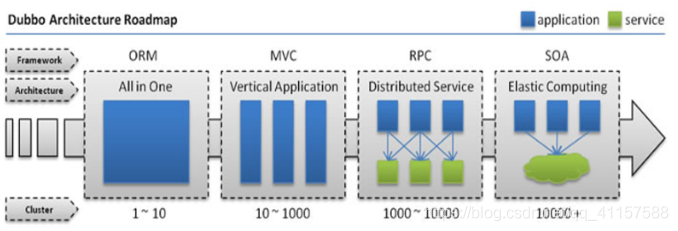
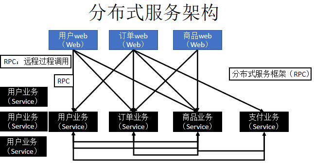

## 第一节 分布式系统

### 1.1 分布式系统概念

&emsp;&emsp;Dubbo 是用于分布式系统的框架所以要先了解什么是分布式。

&emsp;&emsp;**分布式系统是若干独立计算机的集合，这些计算机对于用户来说就像单个相关系统。**

&emsp;&emsp;老式系统(**单一应用架构**)是把一个系统，统一放到一个服务器当中。然后每一个服务器上放一个系统，如果要更新代码，每一个服务器上的系统都要重新去部署，十分的麻烦。

&emsp;&emsp;而**分布式系统**是将一个完整的系统拆分成多个不同的服务，然后再将每一个**服务**单独的放到一个服务器当中。

### 1.2 发展演变

#### 1.2.1 单一应用架构(ORM)

&emsp;&emsp;一个项目装到一个服务器当中，也可以运行多个服务器，每一个服务器当中都装一个项目。

&emsp;&emsp;当网站流量很小时，只需一个应用，将**所有功能都部署在一起**（一个项目装到一个服务器），以减少部署节点和成本。此时用于简化增删改查工作量的数据访问框架（ORM）是关键。

缺点：

1. 如果要添加某一个功能的话就要把一个项目重新打包，再分别部署到每一个服务器当中去。
2. 如果后期项目越来越大的话单台服务器跑一个项目压力会很大的。会不利于维护，开发和程序的性能。

#### 1.2.2 垂直应用架构(MVC)

&emsp;&emsp;将应用切割成几个**互不相干**的小应用，再将每个小应用独立放到一个服务器上，如果哪一个应用的访问数量多就多加几台服务器。

缺点：

1. 每一个应用从头到尾都是完整的，包含界面、业务逻辑、数据库等。市场上对界面的要求经常发生变化，每次页面修改导致整个应用需要重新部署。即没有办法做到页面与业务逻辑的实现分开。

2. 应用不能完全独立，如物流模块需要查看订单模块的相关信息，大量的应用之间需要交互。

#### 1.2.3 分布式应用架构(远程过程调用 RPC)

&emsp;&emsp;当垂直应用越来越多，应用之间交互不可避免，将**核心业务抽取**出来，作为独立的服务，逐渐形成稳定的服务中心，使前端应用能更快速的响应多变的市场需求。

核心难点：如何进行远程过程调用，以及如何拆分业务

#### 1.2.4 流动计算架构(SOA)

### 1.3 RPC 