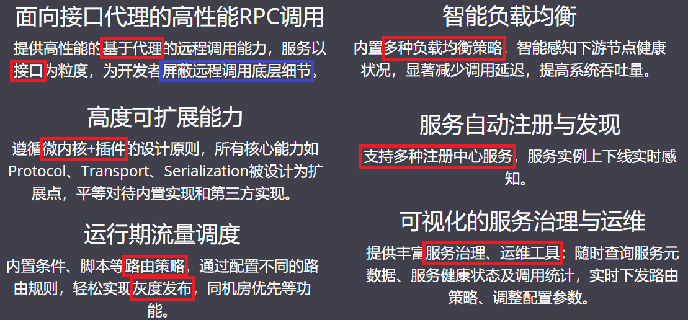

## 第二节 Dubbo 概念及特性

&emsp;&emsp;Dubbo 是一款高性能、轻量级的开源 Java RPC 框架，它提供了三大核心能力：**面向接口的远程方法调用，智能容错和负载均衡，服务自动注册和发现。**

&emsp;&emsp;分布式系统是将一个系统拆分为多个不同的服务。

### 2.1 Dubbo 特性

&emsp;&emsp;**灰度发布**（又名金丝雀发布）是指在黑与白之间，能够平滑过渡的一种发布方式。在其上可以进行A/B testing，即让一部分用户继续用产品特性A，一部分用户开始用产品特性B，如果用户对B没有什么反对意见，那么逐步扩大范围，把所有用户都迁移到B上面来。灰度发布可以保证整体系统的稳定，在初始灰度的时候就可以发现、调整问题，以保证其影响度。

### 2.2 Dubbo 设计架构